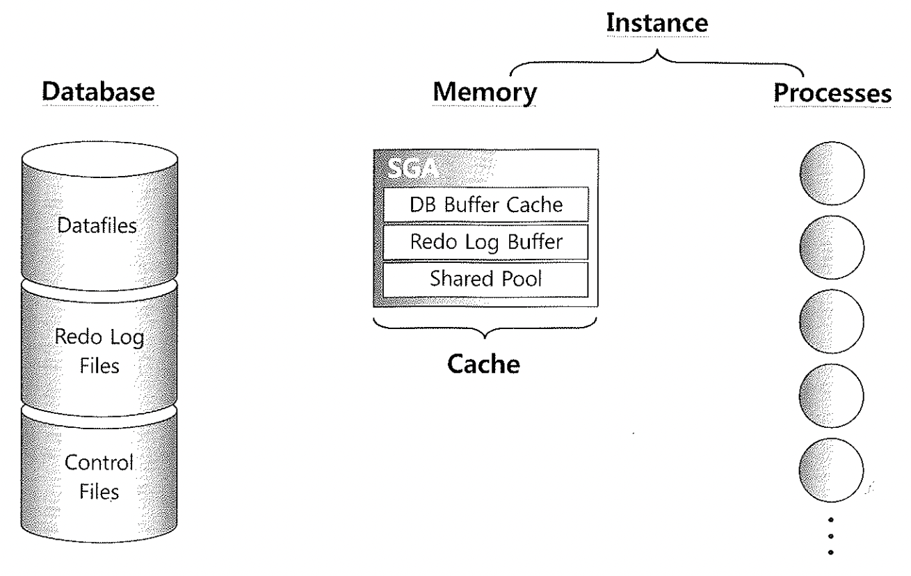
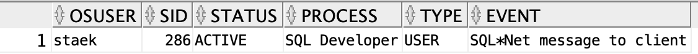
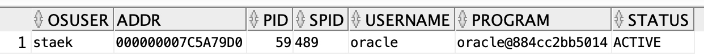
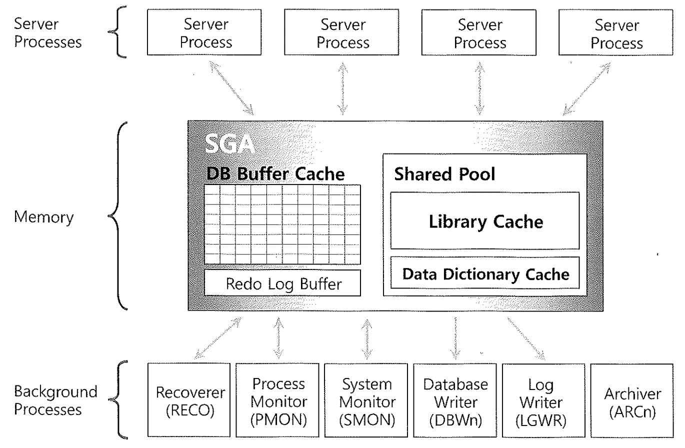

# 기본아키텍처

​	

## 1. Database

#### Oracle Database 

- Data files, Control files, Redo log files, Parameters Files을 합해서 오라클 데이터베이스 라고 하며 데이터베이스 이름(DB_NAME)으로 식별.

~~~sql
select name,db_unique_name from v$database; 

XE	XE
~~~

#### Data Files

- 데이터 파일은 실제 데이터가 저장되는 하드디스크상의 물리적 파일
- 데이터 파일은 생성시에 그 크기를 명시하고, 더 많은 저장 공간이 필요할 경우 크기 확장 가능 (한계가 있고, 확장 단위를 정할 수 있다.)

#### Control Files

- 데이터베이스의 제어 정보를 가지고 있는 파일로 오라클 서버의 데이터베이스 이름이 컨트롤 파일에 저장
- 오라클 DB를 마운트 하고 Open하여 DB를 사용하는데 사용됨
- 컨트롤 파일이 손상되면 오라클을 mount, open할 수 없으므로 적어도 두개 이상의 컨트롤 파일을 백업하는게 권장

#### Redo Log Files

- 데이터베이스에서 생긴 모든 변화를 기록 하는 파일.(옵션으로 로깅하지 않을 수 있다.)
- 수정된 내용을 데이타 파일에 반영하는데 실패하더라도, 변경사항은 리두로그 파일에서 얻을 수 있음
- SGA 내의 Redo Log buffer Cache에 저장된 데이터들은 Redo Log buffer 가 일정 수준 이상 채워지게 되면 LGWR에 의해서 Redo Log File로 저장

### Instance

- SGA 공유메모리 영역과 이를 엑세스하는 프로세스 집합.
- SGA Memory와 BackGround Process로 구성이 되어 있다.

~~~sql
select * from v$instance;

1	XE
~~~

## 2. Process

### 유저프로세스

- 사용자가 Application Program을 실행시켰을 때 사용되는 프로세스
- 사용자가 오라클 서버에 접속할 때마다 'USER PROCESS'가 생성
- 사용자가 실행시킨 SQL문을 서버 프로세스에 전달하고, 그 결과를 서버 프로세스로부터 받는 역할을 수행.

~~~sql
SELECT OSUSER,
       SID,
       STATUS,
       DECODE(INSTR(PROGRAM, '(', 1, 1),
              0,
              PROGRAM,
              SUBSTR(PROGRAM,
                     INSTR(PROGRAM, '(', 1, 1) + 1,
                     INSTR(PROGRAM, ')', 1, 1) -
                     INSTR(PROGRAM, '(', 1, 1) - 1)
              ) PROCESS,
       TYPE,
       EVENT
FROM   V$SESSION
WHERE  STATUS = 'ACTIVE'
AND    TYPE   = 'USER'
ORDER BY TYPE, PROCESS
;
~~~

### 프로세스 집합 > 서버 프로세스

- 클라이언트가 접속 시 오라클은 'SERVER PROCESS'를 생성하여 접속된 사용자 프로세스의 요구 사항을 처리한다.
- SERVER PROCESS는 USER PROCESS와의 통신과 요구사항을 수행하는 오라클과의 상호 작용을 담당
- SERVER PROCESS에는 하나의 PGA 메모리 영역이 할당된다.
- SQL파싱 > 최적화 > 커서오픈 > SQL 실행 & Block READ > 정렬 후 결과집합을 client에 네트워크를 통해 전달.

~~~sql
SELECT VS.OSUSER, VP.ADDR,
       VP.PID,
       VP.SPID,
       VP.USERNAME,
       VP.PROGRAM,STATUS
FROM   V$SESSION VS,
       V$PROCESS VP
WHERE  VS.PADDR  = VP.ADDR
AND    VS.STATUS = 'ACTIVE'  -- 활성화 되어 있는 세션만
AND    VS.TYPE   = 'USER'
AND    VS.OSUSER = 'staek' -- 내 세션
;
~~~

### 프로세스 집합 > 백앤드 프로세스

- 서버프로세스가 하지 못하는작업을 backend에서 진행.
- Datafile로부터 DB버퍼 캐시로 블록을 적재
- Dirty Block을 캐시에서 밀어내서 Free Block 확보
- Redo Log Buffer 비우는 작업 

- V$BGPROCESS 백앤드 프로세스 내용 확인

~~~sql
SELECT NAME,
       PADDR,
       DESCRIPTION
FROM   V$BGPROCESS
where paddr != '00'
;

VKTM	000000007C55D420	Virtual Keeper of TiMe process
GEN0	000000007C55EA28	generic0
GEN1	000000007C562C40	generic1
GEN2	000000007C565850	generic2
VOSD	000000007C566E58	VOS Daemon
DIAG	000000007C568460	diagnosibility process
OFSD	000000007C569A68	Oracle File Server BG
...
~~~

- 현재 내가 접속한 인스턴스의 backend process 확인가능.

~~~sql
SELECT S.OSUSER,
       S.SID,
       S.STATUS,
       S.TYPE,
       B.NAME PROCESS,
       S.EVENT
FROM   V$SESSION S , V$BGPROCESS B
WHERE  STATUS = 'ACTIVE' 
AND B.name = (DECODE(INSTR(S.PROGRAM, '(', 1, 1),
              0,
              S.PROGRAM,
              SUBSTR(S.PROGRAM,
                     INSTR(S.PROGRAM, '(', 1, 1) + 1,
                     INSTR(S.PROGRAM, ')', 1, 1) -
                     INSTR(S.PROGRAM, '(', 1, 1) - 1)
              ) )
AND B.PADDR = S.PADDR              
ORDER BY TYPE, PROCESS
;

oracle	31	ACTIVE	BACKGROUND	AQPC	AQPC idle
oracle	15	ACTIVE	BACKGROUND	BG00	rdbms ipc message
oracle	16	ACTIVE	BACKGROUND	BG00	rdbms ipc message
oracle	267	ACTIVE	BACKGROUND	BG00	rdbms ipc message
oracle	270	ACTIVE	BACKGROUND	BG01	rdbms ipc message
oracle	19	ACTIVE	BACKGROUND	BG01	rdbms ipc message
oracle	269	ACTIVE	BACKGROUND	BG01	rdbms ipc message
oracle	42	ACTIVE	BACKGROUND	CJQ0	rdbms ipc message
oracle	264	ACTIVE	BACKGROUND	CKPT	rdbms ipc message
oracle	52	ACTIVE	BACKGROUND	CL00	pmon timer
oracle	253	ACTIVE	BACKGROUND	CLMN	pmon timer
...
~~~

|      |                        |                                                              |
| ---- | ---------------------- | ------------------------------------------------------------ |
| 1    | Recover(RECO)          | RECO는 분산 데이터베이스에서 네트워크 또는 시스템 장애로 실패한 분산 트랜잭션 오류를 자동으로 해결  로컬 RECO 는 정해진 시간마다 리모트 데이터베이스에 연결을 시도해 보고, 자동으로 로컬내의 미결정된 트랜잭션을 commit or rollback |
| 2    | Process Monitor (PMON) | 비정상 종료된 데이터베이스 접속을 종료 이전에 실패한 사용자 프로세스의 Resource release (Lock되어 있는 프로세스가 소멸될 때 그 자원에 걸린 Lock를 해제) |
| 3    | System Monitor (SMON)  | 시스템을 감시하는 기능 오라클 인스턴스 Fail시 인스턴스를 복구한다(온라인 Redo 로그 파일을 사용) 필요없는  TEMPORARY SEGMENT를 제거 |
| 4    | Database Writer (DBWn) | DataBlock BufferCache와 딕셔너리 캐쉬의 내용을 관리하는 프로세스 DataBase BufferCache 내용을 데이터 파일에 저장하는 작업을 수행 DBWR숫자는 데이타베이스의 INIT.ORA 파일에 있는 DB_WRITERS 파라메타를 통해 지정 |
| 5    | Log Writer (LGWR)      | Redo Log Buffer 내용을 Online Redo Log File에 기록 일반적인 데이타베이스 작업 수행시 Redo Log Buffer를 직접 읽어 Online Redo Log File에 기록하는 프로세스 |
| 6    | Archiver (ARCn)        | 아카이브기능을 수행하는 프로세스                             |

## 3. SGA (SYSTEM GLOBAL AREA)

- SGA는 인스턴스에서 가장 중요한 메모리 캐시 영역을 담당하고 있으며 총 6개의 메모리 영역이 존재함.

~~~sql
SHOW SGA
;

Total System Global Area   1610612120 bytes      
Fixed Size                    9686424 bytes      
Variable Size               671088640 bytes      
Database Buffers            922746880 bytes      
Redo Buffers                  7090176 bytes  
~~~

| name                     | comment                                                      |
| ------------------------ | ------------------------------------------------------------ |
| Total System Global Area | SGA를 구성하는 영역 크기의 합계 (SGA_MAX_SIZE 파라미터와 관련되어있음) |
| Fixed Size               | 데이터베이스나 인스턴스의 상태를 저장하는 영역  (백그라운드 프로세스가 액세스) |
| Variable Size            | SHARED_POOL_SIZE, LARGE_POOL_SIZE, JAVA_POOL_SIZE 파라미터관련. |
| Database Buffers         | 데이터파일로부터 읽어 들인 데이터 블록 내용을 저장하는 영역  |
| Redo Buffers             | 데이터베이스의 모든 변경 내역을 저장하는 영역                |

#### 1. DB Buffer Cache

- Data Files로부터 읽은 Data Block의 복사본을 담고 있는 영역.
- DBWR(Database Writer Process)에 의해서 관리.
- 인스턴스에 동시 접속한 모든 'USER PROCESS'는 'DB Buffer Cache'에 대한 액세스를 공유
  - DISK에 Write하지 않은 수정된 데이터를 보유할 수도 있음
- LRU 알고리즘에 의하여 가장 오래 전에 사용된것은 DISK로 밀어내고 가장 최근의 블록을 유지 ( I/O 성능을 향상)
- Free Buffer는 'SERVER PROCESS'에 할당되어 사용되고, 사용 후 Dirty Buffer가 된 Buffer들은 DBWR에 의해 디스크에 씌여진 후
  다시 Free Buffer가 되어 'SERVER PROCESS'에 의해 재사용되는 작업을 반복함
- Buffer Cache는 Dirty List(LRU Write List(LRUW))와 Least Recently Used(LRU) List 두 개의 List로 구성
  - LRUW(LRU Write List) List
    - 수정되어 DIS에 반영되어야 할 블록들의 리스트
    - LRUW에 모인 Dirty Buffer는 DBWR에 의해 디스크로 쓰여지고나면 이 Buffer는 Free Mark 되어
      다시 사용될 수 있도록 LRU List의 끝부분에 위치함
  - LRU(Least Recently Used) List
    - 최근에 읽은 Datafile Block을 Buffer Cache에 보관하고, 새로운 Block이 파일에서 읽혀질 필요가 있을 경우
      가장 오래된 버퍼들로부터 메모리에서 없어지도록 관리하기 위한 알고리즘

#### 2. Shared Pool

- Shared Pool은 하나의 데이터베이스의 모든 SQL 문을 처리에 사용되며 아래 두가지로 구성됨.
  - Library Cache
    - 이 메모리 영역은 사용자가 같은 SQL을 재실행할 경우 Hard Parse를 생략하고 Soft Parse를 할 수 있도록 SQL 정보를 저장
    - SQL과 PL/SQL 영역을 저장하고 있음
  - Datadictionary Cache
    - 데이터베이스 테이블과 뷰에 대한 정보, 구조, 사용자등에 대한 정보가 저장하여 Soft Parse를 할 수 있도록 함

#### 3. Redo Log Buffer

- 데이터베이스에서 일어난 모든 변화를 저장하는 메모리영역.
- 이 영역에 저장된 값들은 LGWR에 의해 데이터베이스 복구에 사용되는 Online Redo Log File에 저장
- Redo 정보는 데이터가 COMMIT 되기 전에 먼저 보관이 되어야 어떤 상황에서도 복구가 가능하므로
  변경 내용을 먼저 Redo Log Buffer 에 저장하고 난 후에 DB Buffer Block에 Redo Log Buffer 내용을 적용

#### 4. Streams Pool

- 오라클 10g부터 지원하는 메모리 영역이며 다른 DB로 데이터를 전달할 때 사용하는 메모리 영역

#### 5. Large Pool

- SGA에서 대용량 메모리를 할당할 때 사용

#### 6. Java Pool

- Oracle JVM에 접속해 있는 모든 세션에서 사용하는 자바코드가 사용하는 메모리 영역

