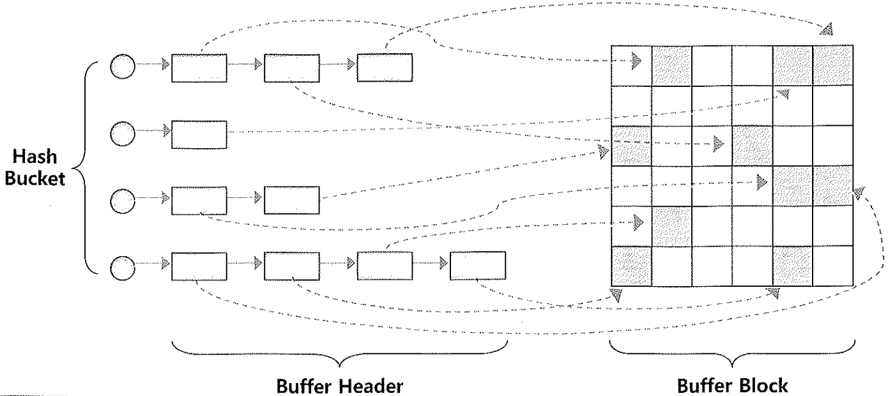

# DB버퍼캐시

- 사용자가 입력한 데이터를 데이터파일에 저장하고 다시 읽는 과정에서 거쳐가는 캐시영역은 SGA구성요소중 하나.

## 01. Block I/O

- 오라클에서 I/O는 블록 단위로 액세스를 하며 아래의 경우에 발생
  - 메모리 버퍼 캐시에서 버퍼 블록을 액세스 할때 블록 I/O
  - 데이터파일에 저장된 데이터 블럭을 DB 버퍼 캐시로 적재할때 블럭 I/O
  - 캐시에서 변경된 블록을 다시 데이터파일에 저장할 때 블럭 I/O

- Single vs Multi
  - Single Block Read : 인덱스를 경유한 테이블 액세스 시
  - Multi Block Read : TABLE FULL SCAN 할 때, DBWR가 데이터파일에 기록할 때

- 블록 단위 액세스란?
  - 하나의 레코드에서 하나의 컬럼만 읽고자 하더라도 레코드가 속한 블록 전체를 읽게 됨을 의미

## 02. Buffer Cache 구조

### DB Buffer Cache는무엇이고 실제 버퍼 블록을 어떻게 찾아 가는가?

- `DB Buffer Cache`는 `Hash Table` 로 관리가 되고, `Hash Bucket`에`Hash Chain`으로 연결된
  `Buffer Header`를 SCAN 방식으로 찾고, 해당 `Pointer`를 이용해 `Buffer Block`을 찾는다.

- Hash Table
  - Hash Bucket의 연결리스트는 정렬이 되지 않아 SCAN 방식으로 찾아야 한다.
  - 해시버킷을 찾는 속도가 빠르기에 각 버킷마다 일정하게 엔트리 개수를 유지할 수 있다면
    해싱 속도를 빠르게 유지할 수 있다.

- `DB Buffer Cache`가 `Buffer Block`을  찾는 과정
  - 맨 처음 데이터 블록 주소(DBA, Data Block Address)를 해시 함수에 넣고 해시값을 리턴 받는다.
  - 해시 값이 같은 블록들을 같은 버킷에 연결리스트(Linked List) 구조로 연결한다. 
    여기서 연결리스트를 `Hash Chain`이라고 한다.
  - 만약 해당 버킷에서 체인을 따라 스캔하다가 거기서 찾아지면 바로 읽고, 찾지 못하면 디스크에서 읽어
    해시 체인에 연결한 후 읽는다.

## 03. Cache Buffer Chain

- `Cache Buffer Chain`은 Latch에 의해 보호된다. `DB Buffer Cache`는 SGA에 존재하므로 여러 프로세스가
  동시에 액세스를 할 수 있기 때문에 이를 방지하고자 일종의 Lock 매커니즘인 래치를 사용한다.

- cache Buffer Chains Latch : 두개이상의 프로세스가 같은 해시체인으로 진입해서 새로운 버퍼블록을 연결,해체 작업을 동시에 하지 못하도록 방지.

- cache Buffer Chains Latch 하나가 여러 Hash Chain을 동시에 관리한다.
  - 해시체인개수 / 래치개수
  - 아래 예제 쿼리결과 참조

- 하나의 체인에 하나의 버퍼만 있는게 좋다. (추카 스캔피용 최소화)
  - 해시버킷 / 블록버퍼
  - 아래 예제 쿼리결과 참조

- SQL ex

~~~sql
sqlplus / as sysdba # sys 접속필요

-- Latch 개수
select count(*) as "Latch개수"
from v$latchname;

-- ret: 1154

-- 전체 버킷 개수
SELECT A.KSPPINM  NAME,
       B.KSPPSTVL VALUE,
       B.KSPPSTDF DEF_YN,
       A.KSPPDESC DESCRIPTION
FROM   X$KSPPI  A,
       X$KSPPSV B
WHERE  A.INDX = B.INDX
AND    LOWER(A.KSPPINM) IN ('_db_block_hash_buckets', '_db_block_hash_latches', '_db_block_buffers')
ORDER  BY 1
;
;

/* ret: _db_block_buffers	101816	TRUE	Number of database blocks cached in memory: hidden parameter
        _db_block_hash_buckets	262144	TRUE	Number of database block hash buckets
				_db_block_hash_latches	2048	TRUE	Number of database block hash latches 
*/

-- cache buffers chains 개수
SELECT COUNT(*)
FROM   v$latch_children
WHERE  NAME = 'cache buffers chains'
;

-- ret: 2048

-- 하나의 래치가 관리하는 버킷 수
select 262144/2048 from dual; 

-- ret: 128
~~~

| 구분                           | 파라미터               | 21c     |
| :----------------------------- | :--------------------- | :------ |
| 해시 버킷 개수                 | _db_block_hash_buckets | 262,144 |
| 해시체인 관리 래치 개수        | _db_block_hash_latches | 2,048   |
| 하나의 래치가 관리하는 버킷 수 |                        | 128     |
| 블록 버퍼 개수                 | _db_block_buffers      | 101,816 |
| 해시버킷당 블록버퍼 개수       |                        | 0.38개  |

#### 9i 이후부터는 읽기모드일 때 Cache Buffer Chain Latch를 Shared 모드로 획득할 수 있어 경합을 줄일 수 있음

- 읽기모드는 해시체인 스캔을 의미.

- 래치는 데이터 자체를 보호하는 게 아니라 SGA에 공유되어 있는 자료구조를 보호하는 것이며

  그 중   cache buffers chains 래치는 버퍼캐시에 연결된 체인구조를 보호한다. 즉, 해시체인을 스캔,추가,제거할 때 래치가 요구된다.

- **한편** SELECT를 할 때도 여전히 경합이 발생하는데 그 이유는 `Buffer Lock` 과 관련이 있음

- 읽기작업을 위해 Shared 모드로 래치를 획득한 경우, 실제 버퍼를 읽는 과정에서 `Buffer Lock`을
  Shared 모드로 획득해야 하는데 이 과정에서 헤더의 정보를 일부 변경함
- 그러므로 'Buffer Lock'을 획득하는 경우에는 래치를 Exclusive 모드로 변경해야 하고 'Buffer Lock'을
  해지하는 경우에도 래치를 Exclusive하게 획득해야 함(Buffer Pin)
- 이 과정에서 경합이 발생하고 'latch : cache buffers chains' 이벤트를 대기함

## 04. Cache Buffer LRU Chain

- 버퍼 헤더는 해시 체인 뿐 아니라 LRU 체인에 의해서도 연결됨
  - **cache buffers LRU chain Latch**: LRU List를 보호하기 위해 사용하는 Latch.
- DB 버퍼캐시는 모든 데이터를 캐싱할 수 없기 때문에 LRU알고리즘을 사용해서 관리.
- Free Buffer가 필요해질 때마다 오래된 데이터블록을 버퍼캐시에서 밀어낸다.

### LRU List 구성요소 2개

1. Dirty List

- Dirty Buffer를 관리한다 (== LRUW List)

2. LRU List

- 아직 Dirty List로 옮겨지지 않은 버퍼블록을 관리.

### 버퍼상태

1. **Free Buffer**

- 1) 인스턴스 기동 후 아직 데이터가 읽히지 않아 비어 있는 상태 **혹은**
  2) 데이터가 담겼지만 데이터파일과 서로 동기화되 있는 상태여서 언제든지 덮어 써도 무방한 버퍼 블록
- 오라클이 데이터 파일로부터 새로운 데이터 블록을 로딩하려면 먼저 Free Buffer를 확보해야 함
- Free 상태인 버퍼에 변경이 발생하면 그 순간 Dirty 버퍼로 상태가 변경.

2. **Dirty Buffer**

- 버퍼에 캐시된 이후 변경이 발생됐지만 아직 디스크에 기록되지 않아 데이터 파일 블록과 **동기화가 필요한 버퍼 블록**
- 이 버퍼 블록들이 다른 데이터 블록을 위해 재사용되려면 디스크에 먼저 기록되야 하며, 기록되는 순간 Free Buffer로 변경

3. **Pinned Buffer**

- 읽기 또는 쓰기 작업을 위해 현재 액세스되고 있는 버퍼 블록.

