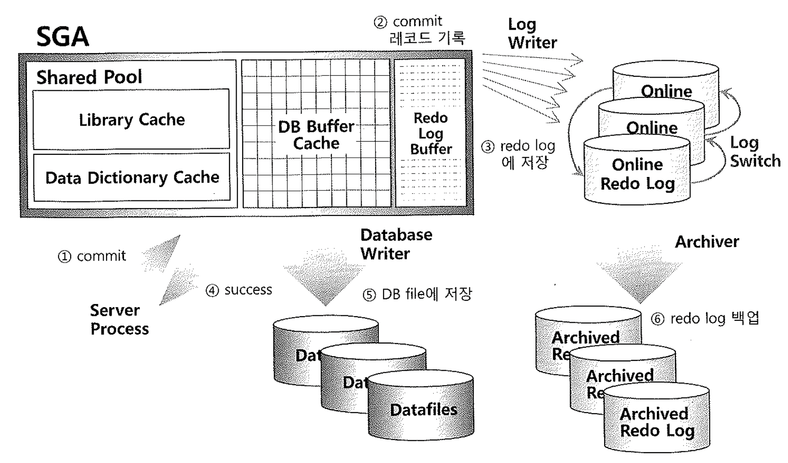

# 04. Redo

오라클은 데이터파일과 컨트롤 파일에 가해지는 모든 변경사항을 하나의 Redo로그 엔트리로서 Redo로그에 기록한다.
(데이터파일 변경은 캐시된 블록버퍼를 통해 이루어짐)

### 1. Redo Log 종류 2가지

- Online redo log
  - Redo 로그 버퍼에 버퍼링된 로그 엔트리를 기록하는 파일, 최소 두 개 구성, 라운드 로빈 로그 스위칭 발생

- Archive redo log
  - Online Redo 로그 파일이 재사용 되기 전 다른 위치로의 백업본

### 2. Redo 목적

1. **Database Recovery**

   - 물리적으로 Database 가 손상되었을 경우 복구하게 되며, 이 부분은 백업부분을 restore 한 뒤에 장애가 나기전 시점, 혹은 원하는 시점까지 recovery 하는 부분.

   - Media recovery 라고 하며 이 경우 주로 Archive log 를 이용한다.

   
2. **Cache Recovery**

   - 인스턴스 비정상 종료 시 휘발성의 버퍼 캐시 데이터 복구 위해  Online Redo 로그 사용
     - 인스턴스 재기동 시 Online Redo 로그의 마지막 Checkpoint 이후 트랜잭션의 Roll Forward 단계에서 버퍼캐시에만 수정하고 데이터파일에는 반영되지 않았던 변경사항들이 복구된다, 여기서는 트랜잭션 Commit 여부를 확인하지 않는다.
     - Undo 데이터를 이용해 Commit 안된 트랜잭션을 Rollback (Transaction Recovery)
     - 데이터 파일에는 Commit 된 변경 사항만 존재하며 DB는 완전 동기화 된다.
3. **Fast Commit**

   - 메모리의 버퍼 블록이 아직 디스크에 기록되지 않았지만 Redo 로그를 믿고 빠르게 커밋 완료

     - **변경 사항은 Redo 로그에는 바로 기록하고, 버퍼 블록의 메모리-디스크 동기화는 나중에 일괄 수행**

     - 버퍼 블록의 디스크에 기록은 Random 액세스(느림), Redo 로그 기록은 Append 액세스 (빠름)

### 3. Delayed 블록 클린아웃 (Clean out)

- 오라클 경우 별도의 Lock 메이저 없이 레코드 속성으로 Lock을 구현하였기 때문에 Lock을 해제하려면 블록을 일일이 찾아다녀야 됨으로 커밋 시점에는 Undo 세그먼트 헤더의 트랜잭션 테이블에만 커밋 정보를 기록하고, [블록 클린아웃](나중에)은 나중에 수행하도록 한다.

### 4. LGWR이 Redo 로그버퍼를 Redo 로그파일에 기록하는 시점

- 3초마다 DBWR 프로세스로부터 신호를 받을 때
  - DBWR은 Dirty버퍼를 데이터파일에 기록하기 전에 로그버퍼 내용을 Redo파일에 기록하도록 LGWR에 신호를 보낸다.
    - 이유는 Instance Crash발생 시 Redo로그 기록을 캐시에 복구하고 커밋되지 않은 트랜잭션을 롤백하는데,
      이때, Redo로그내역에 없는 변경내역이 데이터파일에 있으면 사용자가 최종커밋하지 않은 트랜잭션이 커밋되는 결과를 초래하기 때문.
      (Write Ahead Logging 이라고 한다.)

- 로그 버퍼의 1/3 이 차거나 기록된 REDO 레코드량이 1MB 가 넘을 때
- 사용자가 커밋 또는 롤백명령을 날릴 때

#### Write Ahead Logging

- Buffer Cache 에 있는 블록버퍼를 갱신하기전에 먼저 Redo buffer 에 기록.
- **LGWR**가 Redo log buffer에 기록되어 있는 해당 redo 엔트리를 모두 redo log file 에 기록 후에
- **DBWR**는 Buffer Cache 에 있는 Dirty 블록들을 디스크에 갱신할 수 있다.

### 5. 커밋 ~ 데이터파일 저장 순서

1. 사용자 Commit
2. 서버프로세스가 Commit 레코드 Redo 로그 버퍼 기록
3. LGWR가 트랜잭션 로그 엔트리와 함께 Redo 로그 파일 기록 (이후 복구 가능)
4. 사용자 프로세스에 Success Code 리턴
5. DBWR가 Dirty 블록을 데이터파일에 갱신

##### LogFileSync 대기 이벤트

- LGWR 프로세스가 Redo 로그 버퍼의 Redo 엔트리를 Redo 로그에 기록 완료 할 때까지 발생 하는 대기 이벤트

~~~
나중에 예제작성
~~~

###  6. ######## Redo 관련된 Parameter 및 옵션 나중에 추가 정리 ######## 

- nologging

- COMMIT_LOGGING
- COMMIT_WAIT
- COMMIT_POINT_STRENGTH
- COMMIT_WRITE (The COMMIT_WRITE parameter is deprecated.)

~~~sql
select group#, bytes, status from v$log; 

1	20971520	CURRENT
2	20971520	INACTIVE
~~~

