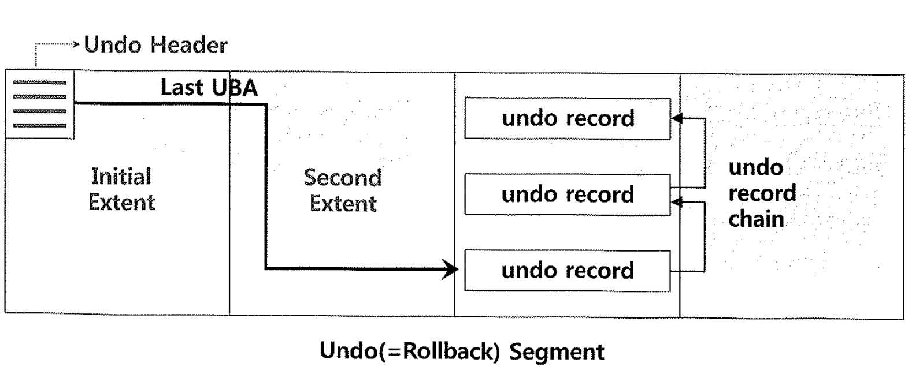
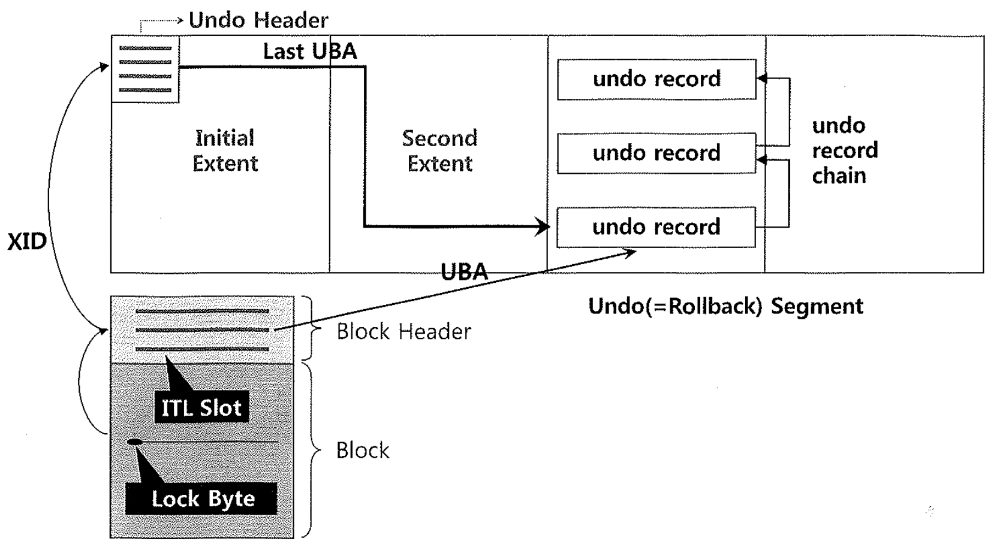

# 05. Undo

## 1. Undo 세그먼트 트랜잭션 테이블 슬롯

## 2. 블록 헤더 ITL 슬롯

### Block Dump Ex

[테이블생성 참조](../src)

~~~sql

### 데이터 변경
update emp set Ename='staek' where rownum =1;

### Update가 이루어진 row위치를 DBMS_ROWID 패키지를 이용해서 얻는다.
select rowid, dbms_rowid.rowid_relative_fno(rowid) as fno,
dbms_rowid.rowid_block_number(rowid) as blkno
from emp where rownum = 1;

-- ret)  AAAS37AABAAAWkBAAA	1	92417

### 다른 세션에 새로접속해서 아래 명령어 입력.
### datafile 1번파일, block number: 92417
alter system dump datafile 1 block 92417;
~~~

- block dump 확인

~~~sh
cd /opt/oracle/diag/rdbms/xe/XE/trace

cat XE_ora_3093.trc

*************************************
Total undo blocks scanned  = 1
Total undo records scanned = 1
Total undo blocks dumped   = 1
Total undo records dumped  = 1

##Total warnings issued = 1
*************************************
~~~

### ITL Dump Ex

~~~sql
update emp set Ename='staek3' where empno = '7521';
update emp set Ename='stae2k' where empno = '7521';

select * from v$session
where type ='USER' AND Status = 'ACTIVE';

### 아직 commit 혹은 rollback하지 않아서 v$transaction에 해당 정보가 존재한다.
select s.sid,UBAFIL, t.UBABLK, t.UBAREC
from v$transaction t, v$session s
where t.addr = s.taddr
and s.sid = '276';

-- ret) 276	15	2309	1

### 세그먼트파일 검색
### FILE_ID := s.sid,UBAFIL
### 2309 := t.UBABLK
SELECT SEGMENT_NAME 
FROM DBA_EXTENTS 
WHERE FILE_ID = 15
AND 2309 BETWEEN BLOCK_ID AND BLOCK_ID + BLOCKS - 1;

-- ret) _SYSSMU7_3579892736$

### USN + SLOT + SQN 검색
SELECT XIDUSN, XIDSLOT, XIDSQN FROM V$TRANSACTION;

-- ret) 7	28	801

### 다른 sql세션에 새로 접속해서 아래 명령어를 수행
### BLOCK := SEGMENT_NAME
### xid := USN SLOT SQN
ALTER SYSTEM DUMP UNDO BLOCK '_SYSSMU7_3579892736$' xid 7 28 801; -- /opt/oracle/diag/rdbms/xe/XE/trace
  

~~~

- 덤프를 열어봣을때 아래와 같은데,
  - 책의정보하고 다르고 xid가 내가 생성한 덤프의 xid와 다르다.

~~~sh
...

********************************************************************************
Undo Segment:  _SYSSMU5_3415026606$ (5)
 xid: 0x0005.01f.00000342
Low Blk   :   (0, 0)
High Blk  :   (4, 127)
Object Id :   ALL
Layer     :   ALL
Opcode    :   ALL
Level     :   2

********************************************************************************
UNDO BLK:  Extent: 4   Block: 79   dba (file#, block#): 15,0x000009cf
 xid: 0x0005.01f.00000342  seq: 0x114 cnt: 0x1b  irb: 0x1b  icl: 0x0   flg: 0x0000

...

*-----------------------------
...
uba: 0x03c009cf.0114.18 ctl max scn: 0x00000000003db457 prv tx scn: 0x00000000003db459
txn start scn: scn: 0x00000000003dba30 logon user: 0
 prev brb: 62917070 prev bcl: 0
KDO undo record:
KTB Redo
op: 0x04  ver: 0x01
compat bit: 4 (post-11) padding: 1
op: L  itl: xid:  0x000a.021.0000031c uba: 0x03c00055.00e8.2b
                      flg: C---    lkc:  0     scn:  0x00000000003d80ce
...

*************************************
Total undo blocks scanned  = 1
Total undo records scanned = 2
Total undo blocks dumped   = 1
Total undo records dumped  = 2

##Total warnings issued = 1
*************************************
~~~

- 그래서 이전예제인 BlockDump를 실행해봤는데, 내용이 아래와 같다 (책 정보와 같음)
  - **위에 예제는 내가 뭘 잘못했을까..**

~~~sh
 Itl           Xid                  Uba         Flag  Lck        Scn/Fsc
0x01   0x0002.01c.00000331  0x03c0055d.00e2.19  C---    0  scn  0x00000000003daa40
0x02   0x0005.01f.00000342  0x03c009cf.0114.1b  ----    1  fsc 0x0000.00000000
~~~

## 3. Lock Byte

### ref

[blog](https://dataonair.or.kr/db-tech-reference/d-lounge/technical-data/?mod=document&uid=237742)

