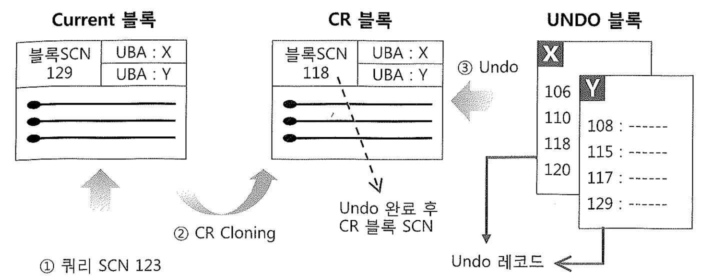

# 06. 문장수준 읽기 일관성

SQL문 수행 중 다른 트랜잭션에 의해 데이터가 DML된다면 일관성 없는 결과가 나와 문제가 발생할 수 있다.

이를 방지하고 읽기일관성을 보장하기 위해 DBMS마다 트랜잭션수준읽기 일관성, 문장수준 읽기 일관성을 제겅하는데,

해당 장에서 문장수준 읽기 일관성대 대해 소개한다.

## 1. 문장수준 읽기 일관성이란?

- 단일 SQL문이 수행되는 도중에 다른 트랜잭션에 의해 데이터의 추가, 변경, 삭제가 발생하더라도 일관성 있는 결과집합을 리터하는 것.
- 타DBMS는 모두 로우 Lock을 사용해 Dirty Read를 방지. 읽기 작업에 대해 Shared Lock을 사용함으로써, Exclusive Lock이 걸린 로우를 읽지 못하도록 한다.

- 다른DBMS 의 Row Lock 문제점 사례 소개 필요..

~~~sh
ORACLE     : UNDO     :  ORA-1550
다른 RDBMS  : Row Lock :  일관성, 동시성 문제
~~~

### TX 예제

- 테이블생성

~~~sql
drop table 계좌1;
drop table 계좌2;

create table 계좌1
nologging
as
select empno 계좌번호, 1000 잔액 from emp;

create table 계좌2
nologging
as
select empno 계좌번호, 1000 잔액, 0 합계 from emp;

alter table 계좌1 add constraint 계좌1_pk primary key(계좌번호);

alter table 계좌2 add constraint 계좌2_pk primary key(계좌번호);
~~~

- 오라클에서는 다른세션에서 변경한 uncommited row를 읽지 않고, CR을 읽는다.

~~~sql
-- session1
select 계좌1.잔액, 계좌2.잔액, 계좌2.합계
        , 계좌1.잔액+계좌2.잔액 합계2
from   계좌1, 계좌2
where  계좌1.계좌번호 = 7788
and    계좌2.계좌번호 = 계좌1.계좌번호 ;

-- session1
update 계좌1 set 잔액 = 잔액 + 100 where 계좌번호 = 7788;

update 계좌2 set 잔액 = 잔액 + 200 where 계좌번호 = 7788;

-- session2
/*
session2에서 계좌1의 잔액은 1000이다.
*/
update 계좌2 set 합계 = 계좌2.잔액 + (select 잔액 from 계좌1 where 계좌번호 = 계좌2.계좌번호)
where 계좌번호 = 7788;

-- session1
commit;

-- session2
commit;
             
             
-- session1             
select 계좌1.잔액 계좌1잔액, 계좌2.잔액 계좌2잔액, 계좌2.합계 계좌2합계                      
      , 계좌1.잔액+계좌2.잔액 실제합계       
from   계좌1, 계좌2                        
where  계좌1.계좌번호 = 7788               
and    계좌2.계좌번호 = 계좌1.계좌번호 ;   

-- ret)  1100	1200	2200	2300
~~~

## 2. Consistent 모드 블록 읽기

- 오라클은 쿼리가 시작된 시점을 기준으로 데이터를 읽는다. (**Consistent 모드 읽기**)
  쿼리가 시작되기 전에 이미 커밋된 데이터만 읽고, 변경이 발생한 블록을 읽을때는 현재의 Current 블록으로부터 CR 블록을 생성해서 쿼리가 시작된 시점으로 되돌린 후 그것을 읽는다. (다중 버전 읽기 일관성 모델 : Multi Version Read Consistency Model)
  Current 블록 : 디스크로부터 읽혀진 후 사용자의 갱신사항이 반영된 최종 상태의 원본 블록 (하나의 인스턴스에 단 하나만 존재)
  CR 블록 : Current 블록에 대한 복사본. (CR블록은 여러 버전이 존재가 가능함.)
  
- 오라클은 SCN(System Commit Number)이라고 하는 시간정보를 이용해 DB의 일관성 있는 상태를 식별. (글로벌 변수)
  SCN은 읽기 일관성과 동시성 제어를 위해 사용되고, 생성된 Redo 로그 정보의 순서를 식별하는 데에도 사용되며, 데이터 복구를 위해서도 사용된다.
  
  ~~~sql
  SELECT CURRENT_SCN, SCN_TO_TIMESTAMP(CURRENT_SCN)
  FROM V$DATABASE;
  
  -- ret) 4066505	24/02/16 05:50:20.000000000
  ~~~
  
  
  
- 블록 SCN (System Change Number) : 블록이 마지막으로 변경된 시점 정보를 식별하기 위해 모든 블록 헤더에 SCN정보를 관리.
  (5절의 블록ITL에 저장되는 트랜잭션별 커밋 SCN과는 별도로 관리)
  
  - RAC환경에서는 Share모드의 Current 블록이 여러 노드에 동시에 캐싱돼 있을 수 있다. 하지만 Exclusive 모드의 Current 블록은 오직 한 노드에만 존재할 수 있다.
    

## 3. Consistent 모드 블록 읽기의 세부원리

- 오라클에서 수행되는 모든 쿼리는 Global 변수인 SCN(System Commit Number)값을 먼저 확인하고 읽기 작업 시작(쿼리 SCN 혹은 스냅샷 SCN)
- 읽는 블록마다 블록 SCN과 비교해 읽을 수 있는 버전인지를 판단.
- 아래 3가지 케이스를 살펴보자.

#### A. 'Current 블록 SCN <= 쿼리SCN' 이고, commited 상태

- Consistent 모드에서 데이터를 읽을 때는 블록 SCN(System Change Number)이 쿼리 SCN(System Commit Number)보다 작거나 같은 블록만 읽을 수 있다.
- 이때의 블록은 Current 블록을 의미하며, Current 블록은 오직 한 개뿐이다. 데이터 갱신은 항상 Current 블록에서만 발생.
- A케이스에서는 쿼리가 시작된 이후에 해당 블록에 변경이 가해지지 않았다는 것을 의미한다.
  - **CR블록을 생성하지 않고 Current 블록을 그대로 읽는다.**

#### B. 'Current 블록 SCN > 쿼리SCN' 이고, commited 상태

- 쿼리가 시작된 이후 해당 블록에 변경이 가해지고 커밋되었다는 것을 의미.

  1) Current 블록의 SCN이 쿼리 SCN보다 크다.
  2) 복사본인 CR블록을 생성한다.(CR Cloning)
  3) 자신이 읽을 수 있는 과거 버전(쿼리 SCN보다 같거나작은 마지막 commited 시점)으로 되돌린다.
     (ITL 슬록에서 UBA(Undo Block Address)가 가리키는 Undo 블록 이용)

- Undo 레코드를 읽어 CR 블록을 한 단계 이전 상태로 되돌렸는데, 거기에 커밋되지 않은 변경사항이 포함돼 있거나 블록 SCN이 높다면 다시 ITL 슬롯에 있는 UBA가 가리키는 Undo 레코드를 찾아 블록을 이전 상태로 되돌리는 작업을 계속한다.

- 최종적으로 완성된 버전의 CR블록은, 블록 SCN이 쿼리 SCN보다 작으면서 **커밋되지 않은 내용은 전혀 포함하지 않은 상태가 된다**.

- UBA를 통해 계속적인 롤백이 가능한 것은 ITL에 대한 변경내역까지도 Undo 레코드에 기록되기 때문.

- 같은 레코드를 계속 변경할 때, 그 레코드를 조회하는 다른 세션에서의 CR블록 읽기 횟수도 계속 증가하는 것을 통해 확인 가능.

  ~~~sql
  -- session1
  -- 
  set autotrace on statistics
  update 계좌1 set 잔액 = 잔액 + 100 where 계좌번호 = 7788;
  
  
  -- session2
  -- session1에서 업데이트쿼리를 하면, session2의 select실행 시 consistent gets 횟수가 증가함을 알 수 있다.
  set autotrace on statistics
  select * from 계좌1 where 계좌번호= 7788;
  
  Statistics
  ----------------------------------------------------------
  	  0  recursive calls
  	  0  db block gets
  	 13  consistent gets
  	  0  physical reads
  	 76  redo size
  	505  bytes sent via SQL*Net to client
  	 41  bytes received via SQL*Net from client
  	  1  SQL*Net roundtrips to/from client
  	  0  sorts (memory)
  	  0  sorts (disk)
  	  1  rows processed
  ~~~

- 10g부터는 IMU(In-Memory Undo) 메커니즘 작동하므로 CR 롤백을 위해 Undo를 참조하지 않고 Shared Pool 내의 IMU Pool에 저장된 값을 이용(IMU CR rollback)

  - 이 경우, consistent gets횟수가 증가하지 않을 수 있다.
    ~~~sql
    -- 해결1)
    -- _in_memory_undo 파라메터를 false로 변경
    alter session set "_in_memory_undo" = false; 
    
    SELECT A.KSPPINM  NAME,
           B.KSPPSTVL VALUE,
           B.KSPPSTDF DEF_YN,
           A.KSPPDESC DESCRIPTION
    FROM   X$KSPPI  A,
           X$KSPPSV B
    WHERE  A.INDX = B.INDX
    AND    LOWER(A.KSPPINM) IN ('_in_memory_undo', '_imu_pools')
    ORDER  BY 1
    ;
    
    /*
    _imu_pools	3	TRUE	in memory undo pools
    _in_memory_undo	TRUE	TRUE	Make in memory undo for top level transactions
    */
    
    -- 변경권한이 없다면?
    -- 아래처럼 업데이트쿼리를 많이 수행해서  IMU Pool를 flush하게 만들면 그 이후부터 CR증가가 보인다.
    declare 
     l_cnt number;
    begin
     for l_cnt in 1..10000
     loop
       update 계좌1 set 잔액 = 잔액 + 100 where 계좌번호 = 7788;
    end loop;
    end;
    /
    ~~~

    

- CR 블록을 과거 상태로 되돌리는 과정에서 필요한 Undo 정보가 덮어 쓰여져 계속 롤백을 진행할 수 없을 때 'Snapshot too old(ora-1555)' 발생

- Delayed 블록 클린아웃' 과정에서 트랜잭션 테이블 슬롯이 이미 다른 트랜잭션에 의해 재사용되는 바람에 현재 읽고자 하는 클린아웃되지 않은 블록의 정확한 커밋 시점 정보를 확인할 수 없을 때도 Snapshot too old' 발생.(8, 9절에서 설명)

#### C. Current 블록이 Active상태, 즉 갱신이 진행 중인 것으로 표시되어 있는 케이스

- 읽으려는 레코드에 Lock Byte가 설정돼 있는데, ITL에 아직 커밋 정보가 기록되지 않았다면 현재 갱신이 진행중(Active)인 것으로 인식할 수 있다.
- 오라클은 커밋 시 항상 곧바로 블록을 클린아웃(트랜잭션에 의해 설정된 로우 Lock을 해제하고 블록 헤더에 커밋 정보를 기록)하지는 않는다.
  따라서 Active 상태의 블록일 때는 일단 트랜잭션 테이블로부터 커밋정보를 가져와 블록 클린아웃을 시도한다.
- 쿼리 SCN 이전에 이미 커밋된 블록 : A경우처럼 그 블록을 그대로 읽는다.
- 쿼리 SCN 이후에 커밋된 블록으로 확인되거나, 커밋되지 않아 아직 클린아웃할 수 없는 경우 :
  B경우처럼 CR Copy를 만들어 쿼리 SCN보다 낮은 마지막 Committed 상태로 되돌린 후 읽는다.

##### DBA당 CR 개수 제한

- 하나의 데이터 블록마다 6개까지만 CR Copy를 허용. '_db_block_max_cr_dba' 파라미터로 제어.
- CR Copy는 LRU 리스트 상에서 항상 LRU end쪽에 위치하기 때문에 Free 버퍼가 필요할 때 1순위로 밀려난다.

~~~sql
SELECT A.KSPPINM  NAME,
       B.KSPPSTVL VALUE,
       B.KSPPSTDF DEF_YN,
       A.KSPPDESC DESCRIPTION
FROM   X$KSPPI  A,
       X$KSPPSV B
WHERE  A.INDX = B.INDX
AND    LOWER(A.KSPPINM) LIKE '%_db_block_max_cr_dba%'
ORDER  BY 1
;
  
-- ret) _db_block_max_cr_dba	6	TRUE	Maximum Allowed Number of CR buffers per dba
~~~

