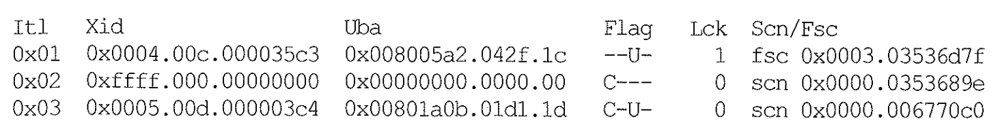

# 08.Block Cleanout

**블록 클린아웃(Block Cleanout)**

- 트랜잭션에 의해 설정된 로우 Lock을 해제하고 블록 헤더에 커밋 정보를 기록하는 오퍼레이션

- 로우 단위 Lock 은 레코드 속성(Lock Byte)으로 관리되며, 이는 Lock Byte는 로우 헤더에서 블록 헤더에 있는 ITL 엔트리를 가리키는 포인터

- 트랜잭션 커밋 시 블록 클린아웃까지 완료 해야 하나, 대량 갱신 작업의 경우 빠른 커밋을 위해 커밋 정보를 트랜잭션 테이블에만 기록하고 커밋 처리 하는 경우가 있음

블록을 커밋아웃하는 시점: 나중에 해당블록이 처음 액세스 되는 시점

#### (1) Delayed 블록 클린아웃

- 갱신한 블록 개수가 총 버퍼 캐시 블록 개수의 1/10 초과시 적용
- 커밋 이후 해당 블록을 액세스하는 첫 번째 쿼리에 의해 클린아웃 처리 됨
  1. ITL 슬롯에 커밋 정보 저장
  2. 레코드에 기록된 Lock Byte 해제
  3. Online Redo 에 Logging

- 블록을 읽는 과정에서 Active 상태(커밋 정보가 ITL에 없는 상태) 블록은 읽기 전에 먼저 블록 클린아웃을 시도 한다.
  - ITL 슬롯에 기록된 트랜잭션 ID를 이용해 Undo 세그먼트 헤더의 트랜잭션 테이블 슬롯을 찾아가 트랜잭션 상태 확인
  - 커밋된 트랜잭션이라면 ITL 슬롯 및 로우 Lock 상태 갱신 하여 블록 클린아웃 처리
  - 블록 클린아웃을 위한 갱신내용도 Redo 에 로깅 하고 블록 SCN 변경

#### (2) 커밋 클린아웃(= Fast 블록 클린아웃), (= Delayed 로깅 블록 클린아웃)

- 블록을 읽을 때 마다 (ex) select) 블록 클린아웃이 필요 하다면 성능에 부정적임 
  - 블록 클린아웃은 Current 블록에 작업 수행 (RAC/OPS 환경에서 Exclusive 모드 Current 블록 요청)
  - 예전 OPS환경에서 Dirty 블록을 디스크에 기록하고 인스턴스간 주고받는 **ping방식을 개선하여 클린아웃 방식을 도입함**

- 갱신한 블록 개수가 총 버퍼 캐시 블록 개수의 1/10 이하시 커밋 시점에 바로 블록 클린아웃 수행

  - 처음 '불완전한 형태의 클린아웃' 수행, 해당 블록을 갱신하는 다음 트랜잭션에 의해 완전한 클린아웃 처리

    - 커밋 시점에는 ITL 슬롯에 완전한 커밋 정보를 저장하고, 로우 헤더에 기록된 Lock Byte는 해제 안함 
      - Lock Byte는 해제 안하는 이유는 로깅을 안하기 위함.

    - 이후 CR모드 읽기 시 커밋 여부와 커밋 SCN 확인을 위해 트랜잭션 테이블 조회 불필요

  - Current 모드로 읽는 시점에(ITL 슬롯이 필요) 비로소 Lock Byte를 해제하고 완전한 클린아웃 수행, 그리고 Redo 로깅

#### (3) ITL과 블록 클린아웃

- ITL 정보 관찰을 위한 블록 Dump

  

- 1번 슬롯(0x01)은 Fast 클린아웃 상태
  - 로우 헤더에 Lock Byte가 미해제(Lck=1), 커밋 SCN 존재, Fast 클린아웃 상태 표시(fsc), Flag=U
  - Lock Byte 해제 로 2번 슬롯 상태로 만들어야 ITL 슬롯 재사용 가능함

- 2번 슬롯(0x02)은 Delayed 블록 클린아웃 상태
  - 언제든 ITL 슬롯 재사용 가능, Lock Byte 해제 상태 (Lck=0), 정확한 커밋 SCN 존재, Flag=C

- 3번 슬롯(0x03)은 완전한 클린아웃 상태
  - Lock Byte 해제 상태 (Lck=0), 언제든 ITL 슬롯 재사용 가능, 추정된 커밋 SCN 존재, Flag=CU

### ##################################################

### ITL, XID UBA flag, SCN/FSC 용어 정리 및  cleanout덤프 테스트는 2회독에서 할 예정

### ##################################################

