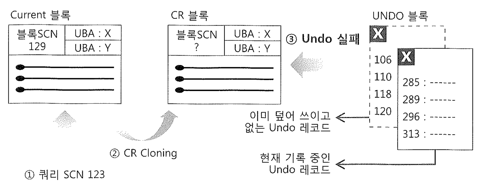
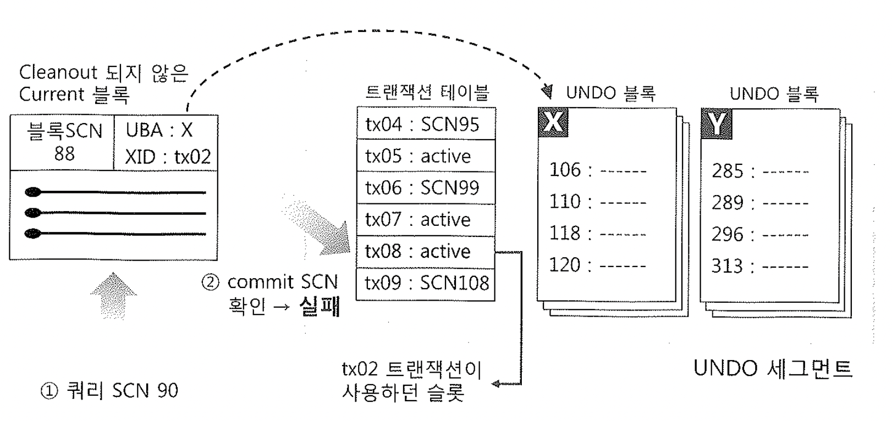

# 09. Snapshot too old

### Snapshot too old (ORA-01555) 발생원인은 크게 두 가지다.

1. 데이터를 읽어 내려가다가 쿼리SCN이후에 변경된 블록을 만나 과거 시점으로 롤백한 Read Consistent 이미지를 얻으려고 하는데,
   Undo블록이 다른 트랜잭션에 의해 이미 재사용돼 필요한 Undo 정보를 얻을 수 없는 경우. (Undo 세그먼트가 작아서 일수도 있다.)

2. 커밋된 트랜잭션 테이블 슬롯이 다른 트랜잭션에 의해 재사용 돼 커밋 정보를 확인할 수 없는 경우로서, Undo 세그먼트 개수가 적다는 신호일 수도 있다.

## 1) Undo 실패

~~~sql
SELECT /* ORDERED USE_NL( B ) */ A.고객ID
     , NVL(SUM(과금액), 0) 과금액
     , NVL(SUM(수납액), 0) 수납액
     , NVL(SUM(과금액), 0) - NVL( SUM( 수납액), 0) 미납액
  FROM 과금 A, 수납 B
 WHERE A.과금년월 = :과금년월
   AND A.과금유형 = :과금유형
   AND A.고객ID = B.고객ID(+)
   AND A.과금년월 = B.수납년월(+)
 GROUP BY A.고객ID
~~~

- 1) SCN 123 시점에서 이 쿼리가 시작되었다.

- 2) 쿼리가 진행되는 동안 은행으로부터 고객의 입금내역을 전송받아 일괄 처리하는 배치 프로그램이 수행되었는데, 프로그램은 각 건별로 커밋하도록 작성되었다.( 루프문안에 COMMIT; )

  - 이 프로그램이 돌기 시작한지 얼마 지나지 않아 다른 트랜잭션에 의해 홍길동 고객의 수납액이 10,000원에서 20,000 원으로 변경되고 나서 커밋되었다.
  - 이때, 블록 SCN은 129로 변경되었다.

- 3) 시간이 흘러 홍길동 고객의 수납액 변경내역( 수납액 10,000 -> 20,000 )을 담은 Undo블록이 다른 트랜잭션에 의해 재사용되었다.

- 4) 위 쿼리를 수행 중인 프로세스가 홍길동 고객의 수납액이 담긴 블록에 도달했을 때, 블록 SCN이 자신의 쿼리 SCN 123보다 큰 129임을 확인하고, 변경된 UNDO레코드를 찾으려고, ITL 엔트리에 기록된 UBA를 읽어 Undo 세그먼트 블록을 찾아간다.

- 5) 하지만 Undo블록은 이미 다른 트랜잭션에 의해 재사용된 상태이므로 ORA-01555에러를 발생시키며 진행을 멈춘다.

대량 데이터를 기준으로 nested loop 조인을 하면 쿼리시간이 오래걸리고 inner테이블 중복방문 가능성이 커진다.

## &&&&&&&&&&&&&&&&&&&&&&&&&&&&&&&&&&

## 2회독에 위 예제 문제점에 대해 개선한 쿼리 작성

- 튜닝기법 배운게 하나도 없기에 2회독 시점에서 이해햐자.
- 위에 예제 1~5번 시나리오도 2회독에서 실제 덤프와 함께 분석할 예정

## &&&&&&&&&&&&&&&&&&&&&&&&&&&&&&&&&&

~~~sql
FOR C IN (SELECT /*+ ORDERED USE_NL( B ) */ A.고객ID, A.입금액, B.수납액
            FROM 은행입금 A, 순납 B
     WHERE A.입금일자 = TRUNC( SYSDATE )
       AND B.수납년월(+) = TO_CHAR( SYSDATE, 'YYYYMMDD' )
       AND B.고객ID(+) = A.고객ID )
 LOOP 
   IF C.수납액 IS NULL THEN
     INSERT INTO 수납( 고객ID, 수납년월, 수납액 )
               VALUES( C.고객ID, TO_CHAR( SYSDATE, 'YYYYMM' ), C.입금액 );
  ELSE
      UPDATE 수납 SET 수납액 = 수납액 + C.입금액
      WHERE 고객ID = C.고객ID
      AND 수납년월 = TO_CHAR( SYSDATE, 'YYYYMMM' );
  END IF;
  COMMIT;
END LOOP;
~~~

1) SCN 100시점에서 커서 C를 오픈한다.
2) 11 ~ 13번 라인 UPDATE 문에 의해 홍길동 고객의 수납액이 변경되고 15번 라인에 의해 커민된다.
   - 이때, 변경된 레코드가 담긴500번 블록 SCN이 120으로 변경되었다.
   - 프로그램 내에서 커밋이 반복하기 때문에 위 INSERT 문과 UPDATE문은 모두 개별 트랜잭션으로 처리된다.
3) 트랜잭션이 반복되다가 홍길동 고객의 수납액 Befoe Image가 담긴 Undo 블록이 다른 트랜잭션에 의해 재사용되었다. 물론 이 트랜잭션도 위 프로그램 내에서 수행된 INSERT 문 또는 UPDATE문일 것이다.
4) 커서 C가 Fetch하다가 고객 홍길동의 수납정보와 같이 500번 블록에 저장된 김철수 수납정보에 도달한다.
   - 커서 C가 NL 방식으로 수행된다면 쿼리 수행도중 같은 블록을 여러 차례 재방문하는 일은 흔이 발생한다.
   - 500번 블록 SCN이 120임을 확인하고 자신의 쿼리 SCN 100시점으로 롤백하려구 Undo 블록을 찾아간다.
5) 하지만 Undo 블록은 이미 앞선 트랜잭션에 의해 재사용된 상태이므로 ORA-01555에러를 발생시키며 진행을 멈춘다.

## &&&&&&&&&&&&&&&&&&&&&&&&&&&&&&&&&&

## 2회독에 위 예제 문제점에 대해 개선한 쿼리 작성

- 튜닝기법 배운게 하나도 없기에 2회독 시점에서 이해햐자.
- 위에 예제 1~5번 시나리오도 2회독에서 실제 덤프와 함께 분석할 예정

## &&&&&&&&&&&&&&&&&&&&&&&&&&&&&&&&&&

위 같은 코딩 패턴을 'fetch across commit'이라고 한다. 명시적으로 커서를 열어 로우를 하나씩 Fetch하면서 값을 변경하고 루프 내에서 계속해서 커밋을 날리는 방식이다. ( ANSI 표준 : 커서는 커밋하는 시점에 무효화 해라) -> 오라클에서는 가능하지만 주의하며 사용해야 함.

## 2) 블록 클린아웃 실패

1. 대량 업데이트 후에 커밋된 트랜잭션은 변경했던 블록들은 모두 클린아웃하지 않은 상태에서 자신이 사용하던 트랜잭션 테이블 슬롯은 
   Free 상태로 변경하고 트랜잭션을 완료한다.
   - 이때부터 트랜잭션 테이블 슬롯은 다른 트랜잭션에 의해 재사용 될 수 있다.
2. 시간이 흘러 그 변경된 블록들을 읽어야 하는 시점에 하는 시점에 Delayed 블록 클린아웃을 위해 트랜잭션 테이블 슬롯을 찾아갔는데, 해당 슬롯이 다른 트랜잭션에 의해 이미 재사용되고 없다면 Undo 세그먼트 헤더 블록에 가해진 변경사항을 롤백하려고 시도한다. 
   다행이 찾고자 하는 트랜잭션에 대한 커밋 정보가 언두 블록( 레코드 ) 에 남아 있다면 **현재 읽고자하는 블록을 정확한 커밋 SCN을 가지고 블록 클린아웃을 수행한다.**
3. 하지만 Undo 레코드를 뒤졌는데 그마저도 덮어 쓰이고 없다면
4. 트랜잭션 슬롯이 필요해지면 커밋 SCN이 가장 낮은 트랜잭션 슬롯 부터 재사용하는데, 그 슬롯에 기록돼 있던 커밋 SCN을 UNDO 세그먼트 헤더에 **최저 커밋 SCN (low commit number)**으로서 기록해둔다.
5. 트랜잭션 슬롯이 재사용되고 나면 그 슬롯을 사용하던 이전 트랜잭션의 정확한 SCN을 확인하는 것이 불가능해 지지만 UNDO 세그먼트 헤더에 기록돼 있는 '최저 커밋 SCN'이전에 커밋 되었다는 사실만큼은 짐작할 수 있다.
6. 따라서 아직 클린아웃되지 않은 블록을 큰린하려고 ITL이 가르키는 트랜잭션 테이블 슬롯을 찾아갔을 때 커밋정보가 이미 지워지고 없으면, UNDO 세그먼트 헤더에 있는  '최저 커밋 SCN'을 블록 ITL 엔트리에 커밋 SCN으로서 기록( 추정된 커밋 SCN임을 표기하기 위해 ITL 슬로 커밋 FLAG에 C--- 대신 C-U-라고 기록) 함으로써 블록 클린아웃을 마무리하고, 블록 SCN도 변경한다.
7. 문제는 클린아웃 시점에 일관성 모드 일기가 가능한지 여부일 텐데, 쿼리가 진행되는 동안에 많은 트랜잭션이 한꺼번에 몰리지만 않는다면 '최저 커밋 SCN'이 갑자기  많이 증가하지는 않는 것이므로 '최저 커밋 SCN'에 의해 추정된 블록 SCN은 대개 쿼리 SCN보다 작다.
   따라서 쿼리가 시작된 이후에 해당 블록에 변경이 가해지지 않았음이 확인되므로 정상적인 일관성 모드 읽기도 가능하다.

​	

#### Delayed 블록 클린아웃 실패 결론

- Delayed 블록 클린아웃에 의해 Snapshot too old가 발생하는 원인은, '최저 커밋 SCN'이 쿼리 SCN보다 높아질 정도로 갑자기 트랜잭션이 몰리는데 있으며, 이때는 추정에 의한 블록 SCN이 쿼리 SCN보다 높아지게 된다.
- 실제로 이 에러를 발생시킨 블록은 오래전 시점( 1년 또는 10년 전 )에 커밋된 것일 수 있지만 이를 확인할 방법이 없으며, 그동안 한번도 읽히지 않다가 불행하게도 트랜잭션이 몰리는 시점에 읽히다 보니 문제를 유발하게 되는 것이다.

### Delayed 블록 클린아웃의 Snapahot too old 테스트코드

## &&&&&&&&&&&&&&&&&&&&&&&&&&&&&&&&&&

## 블록클린아웃 실패에대한 순서를 글만봐서는 이해하기가 난해함. 관련테스트를 해야하는데, 2회독 시점에 보겟따

## &&&&&&&&&&&&&&&&&&&&&&&&&&&&&&&&&&

## 3) Snapshot too old 회피 방법

**Snapshot too old는 재현이 어려워 원인 찾기가 힘들다.**

조치방법도 발생확률이 0%가 아니다.

Undo 매커니즘 도입이유는 Lock에 의한 동시성저하를 방지하기 위함인데, 이에대한 side effect정도로 이해해야 한다.

과거에는 Undo크기를 직접조절해서 Snapshot too old를 예방했는데, 9i부터는 AUM(Automatic Undo Management)가 해준다.

**이렇게 DB관리자 관점에서는 해결이 많이 되었으나, APP개발자 관점에서는 로직수정으로 Snapshot too old 발생 예방조치가 필요하다,**

**이를 위해 앞절에서의 오라클 읽기 일관성 모델과 Undo메커니즘을 이해해야 한다.**

아래는 프로그래밍 관점 솔루션들이다.

1. 불필요한 커밋을 자주 수행하지 않는다.
2. fetch across commit 형태의 프로그램 작성을 피해 다른 방식으로 구현한다. 다른 방식으로 구현하기 어렵다면 COMMIT 횟수를 줄인다.
3. 트랜잭션이 몰리는 시간때는 오래 걸리는 쿼리가 같이 수행되지 않도록 시간을 조정한다.
4. 큰 테이블을 일정 범위로 나누어 읽고 단계적으로 실행할 수 있도록 코딩한다.
5. 오랜 시간에 걸쳐 같은 블록을 여러번 방문하는 NL 형태의 조인문 또는 인덱스를 경유한 테이블 액세스를 수반하는 프로그램이 있는지 체크하고,

이를 회피 할 수 있는 방법( 조인 메소드 변경, FTS )을 찾는다.

6. 소트 부하를 감수하더라도 ORDER BY 등을 강제로 삽입해 소트연산이 발생하도록 한다.

많은 데이터를 오랜 시간에 걸쳐 Fetch 하는 동안 Undo 정보를 지속적으로 참조하기 때문에 발생하는 것이므로
서버 내에서 빠르게 데이터를 읽어 템프 세그먼트에 저장하는 데에만 성공하면 이후에는 같은 블록을 아무리 재방문하더라도 더는 에러가 발생할까 걱정하지 않아도 된다.

7. 만약 delayed 블록 클린아웃에 의해 Snapshot too old가 발생하는 것으로 의심되면

대용량 업데이트 후 곧 바로 해당 테이블에 대해 Full Scan 하도록 쿼리를 날리는 것도 하나의 해결방법이 될 수 있다. 

~~~sql
-- 테이블 풀스캔
select /*+ full(t) */
count(*)
from table_name t
~~~

만약 인덱스 블록에 문제가 발생한다고 판단된다면 인덱스 리프 블록을 모두 스캔하도록 한다. 

~~~sql
-- 인덱스 플스캔
select count(*)
from table_name
where index_column > 0
~~~

