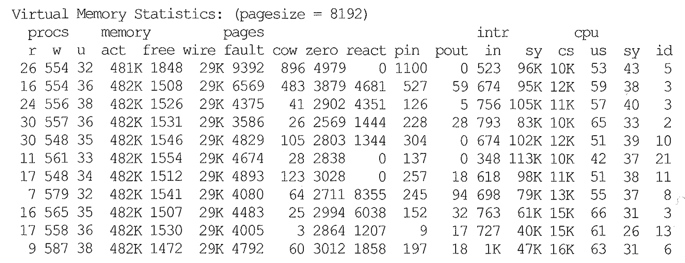

# 10. 대기이벤트

## 대기 이벤트란 ?

- 오라클은 역할 분담된 많은 프로세스(쓰레드)간 커뮤니케이션 과 상호작용이 이뤄지고, 다른 프로세스 처리를 기다리는 상황이 자주 발생 함.

- 프로세스는 일 할수 있는 조건이 충족 될 때까지 수면(Sleep) 상태에 빠짐 → 대기 이벤트(Wait Event)

  - 상태 정보를 파일 혹은 SGA 메모리에 저장

- 대기 이벤트는 원래 오라클 개발자들이 디버깅 용도로 개발한 것

  - 공유 자원에 대한 경합이나 기타 원인에 의한 대기가 발생할 때마다 로그를 생성 하도록 커널 코드에 추가 한것

  - 현재 OWI(Oracle Wait Interface) 이름으로 성능 관리 분야에 일대 변혁을 가져옴

    - 대기 이벤트 수 : 7.0 100 여 개, 9i 400 여개, 10g 890 여개, 11g 1,100 여개
      ~~~sql
      -- oracle 21c는 2252개로 조회됨
      select count(*) from V$SYSSTAT
      ;
      
      -- 2252
      ~~~

| Oracle                  | SQL Server           |
| :---------------------- | :------------------- |
| 대기 이벤트(Wait Event) | 대기 유형(Wait Type) |

- 시스템 커널 레벨 관점의 대기 이벤트 의미
  - 프로세스가 할 일을 모두 마쳤거나 다른 프로세스를 기다려야 하는 상황에서 CPU 를 낭비하지 않고 Sleep 상태로 변경됨.
    - 프로세스가 Wait Queue 로 옮겨짐 (OS 는 Wait Queue 내 프로세스에 CPU 할당 스케줄 제외)
    - 선행 프로세스가 일을 마치면 OS에게 알림 (Interrupted)
    - OS는 기다리던 Wait Queue 내 프로세스를 Runnable Queue 에 옮김 (스케줄링)

### vmstat

- r 컬럼 : 수행 중 혹은 runnable queue 에서 CPU 리소스를 기다리는 프로세스 개수
  - 값이 CPU 개수를 초과하고 CPU 사용률이 100%에 근접 할 경우 CPU 병목 발생 (Cpu할당 못받고 대기중인 프로세스가 많을 수 있다)
- w 컬럼 : wait queue 에 놓인 프로세스 수
  - Sleep 상태의 프로세스 개수, 이 값이 큰 것도 병목일 수 있음 (오라클 에서는 대기 이벤트가 많이 발생 하는 상태, 대기 이벤트 종류 분석 필요)