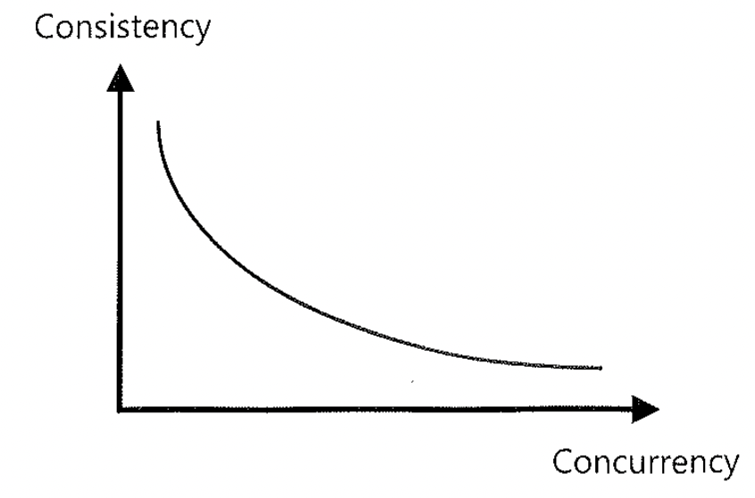

# 01-트랜잭션동시성제어

### 1) 동시성 제어란( Concurrency Control )?

- 동시에 실행되는 트랜잭션 수를 최대화하면서도 입력, 수정, 삭제, 검색 시 데이터의 무결성이 유지될 수 있도록 노력하는 것을 말한다.
- 여러 개 트랜잭션이 동시에 수행될 대, 데이터베이스 애플리케이션은 이들 트랜잭션이 서로 간섭을 일으키는 현상을 최소화하면서 데이터의 일관성과 무결성이 보장되도록 개발되어야 하는 것이다.

- 동시성( Concurrency ) : 다중 사용자가 같은 데이터를 동시에 액세스
- 일관성( Consistency ) : 자신이 발생시킨 변경 사항과 다른 트랜잭션의 변경 사항( 읽을 수 있는 버전만 허용 )을 포함하여 일관성 있는 상태의 데이터 제공

#### 동시성 제어가 어려운 이유

- 동시성과 일관성이 트레이드 오프( Trade-off ) 관계에 있다는데 있다.
- 동시성을 높이려고 Lock의 사용을 최소화하면 읽기 일관성을 유지하기 어렵고, 데이터의 일관성을 높이려고 Lock을 많이 사용하면 동시성이 떨어지게 된다.
- 따라서 동시성과 일관성이라는 두 마리 토기를 한거번에 잡으려면 매우 세심한 주의가 필요하다.

### 02) 트랜잭션이란?

- 여러 개의 수정작업이 하나의 작업처럼 전부 처리되거나 아예 전부 처리가 안 되도록( All or Nothing )하는 것인데, 이런한 일의 최소 단위

#### 트랜잭션의 특징( ACID )

- 데이터베이스 갱신과 관련하여 트랜잭션은 4가지 중요한 특징을 갖는다.

##### 원자성( Atomicity )

- 앞서 트랜잭션의 정의 부분에서 이미 설명한 바와 같고 더 이상 분해가 불가능한 업무의 최소단위를 말한다.

##### 일관성( Consistency )

- 트랜잭션이 그 실행을 성공적으로 완료하면 언제나 일관성 있는 데이터베이스 상태로 변환한다.
- 즉 트랜잭션 실행의 결과로 데이터베이스 상태가 모순되지 않는다.

##### 격리성( lsolation )

- 트랜잭션이 실행 중에 생성하는 연산의 중간 결고는 다른 트랜잭션이 접근 할 수 없다.

##### 영속성( Durability )

- 트랜잭션이 일단 그 실행을 성공적으로 완료하면 그 결과는 데이터베이스에 영속적으로 저장된다.
