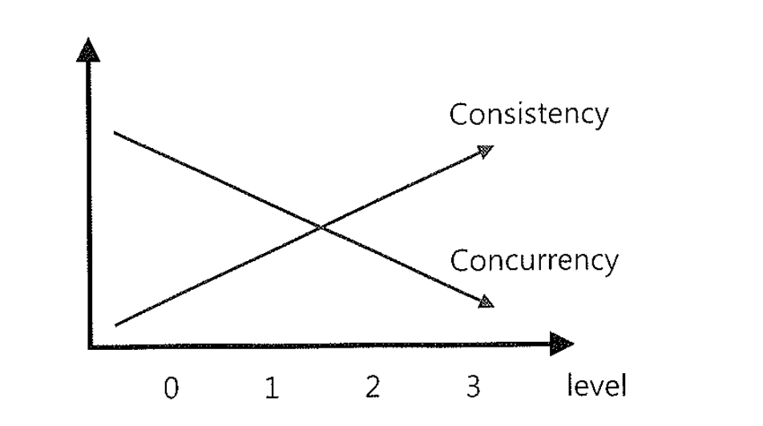

# 02. 트랜잭션 수준 읽기 일관성


## 1. 트랜잭션 수준 읽기 일관성 ?


### (1) 트랜잭션 수준 읽기 일관성이란?

- 문장수준 읽기 일관성( statement-Level Read Consistency ) : 쿼리가 시작된 시점을 기준으로 데이터를 일관성 있게 읽어들이는 것을 말한다.
- 트랜잭션 수준 읽기 일관성( Transaction-Level Read Consistency ) : 트랜잭션이 시작된 시점을 일관성 있게 데이터를 읽어 들이는 것을 말한다.
  트랜잭션이 진행되는 동안 다른 트랜잭션에의해 변경사항이 발생하더라도 이를 무시하고 계속해서 일관성 있는 데이터를 보고자 하는 업무요건이
  있을 수 있다. 물론 트랜잭션이 진행되는 동안 자신이 발생시킨 변경사항은 읽을 수 있어야 한다.
- **오라클은 완변한 문장수준의 읽기 일관성을 보장하지만, 트랜잭션에 대해서는 기본적으로 보장하지 않는다.** -> 고립화수준으로 보장한다.


### (2) 트랜잭션 고립화 수준( ANSI/ISO SQL standard( SQL192 ) )

##### 레벨 0 ( = Read Uncommitted )

- 트랜잭션에서 처리 중인, 아직 커밋되지 않은 데이터를 다른 트랜잭션이 읽는 것을 허용
- Dirty Read, Non-Repeatable Read, Phantom Read 현상 발생
- **Oracle은 이 레벨을 지원하지 않음**


##### 레벨 1 ( = Read Committed )

- Dirty Read 방지 : 트랜잭션이 커밋되어 확정된 데이터만 읽는 것을 허용
- 대부분의 DBMS가 기본모드로 채택하고 있는 일관성모드
- Non-Repeatable Read, Phantom Read 현상은 여전히 발생
- DB2, SQL Server, Sybase의 경우 일기 공유 Lock을 이용해서 구현, 하나의 레코드를 읽을 때 Lock을 설정ㅎ고 해당 레코드를 빠져 나가는 순간 Lock 해제
- **Oracle은 Lock을 사용하지 않고 쿼리시작 시점의 Undo 데이터를 제공하는 방식으로 구현**


##### 레벨 2 ( = Repeatable Read )

- 선행 트랜잭션이 읽은 데이터는 트랜잭션이 종료될 때가지 후행 트랜잭션이 갱신하거나 상제한는 것은 불허함으로써 같은 데이터를 두 번 쿼리했을 때 일관성 있는 결과를 리턴

- Phantom Read 현상은 여전히 발생

- DB2, SQL Server의 경우 트랜잭션 고립화 수준은 Repeatable Read로 변경하면 읽은 데이터에 걸린 공유 Lock을 커밋할 때까지 유지하는 방식으로 구현

- **Oracle은 이 레벨을 명시적으로 지원하지 않지만 for update 절을 이용해 구현가능.**

  ~~~sql
  1. FOR UPDATE NOWAIT(= WAIT 0)
     - lock를 획득하지 못하면 바로 exception 됨
  
  -- session1
  update emp
  set sal = 5000
  where empno = 7369;
  
  -- session2
  select * from emp
  where empno = 7369
  for update nowait;
  /*
  select * from emp
                *
  ERROR at line 1:
  ORA-00054: resource busy and acquire with NOWAIT specified or timeout expired
  */
  
  
  2. FOR UPDATE WAIT integer (0 ~ 4294967295, second)
     - 아니고 정해진 시간까지만 기다렸다가 에러를 발생합니다
  
  -- session1
  update emp
  set sal = 5000
  where empno = 7369;
  
  -- session2
  select * from emp
  where empno = 7369
  for update wait 3;
  
  /*
  ERROR at line 1:
  ORA-30006: resource busy; acquire with WAIT timeout expired or DTP service is
  unavailable
  */
  ~~~

  SQL Server 등에서도 for update절을 사용할 수 있지만 커서를 명시적으로 선언할때만 사용 가능함.


##### 레벨 3 ( = Serializable Read )

- 신형 트랜잭션이 읽은 데이터를 후행 트랜잭션이 갱신하거나 삭제하지 못할 뿐만 아니라 중간에 새로운 레코드를 산입하는 것도 막아줌
- 완벽하게 읽기 일관성 모드를 제공


###### DBMS에서 제공하는 트랜잭션 고립화 수준 조정기능을 이용해 트랜잭션 레벨 읽기 일관성을 확보하는 명령어

```
SET TRANSACTION ISOLACTION LEVEL SERIALIZABLE;
```


#### ISOLATION_LEVEL 테스트

#### SERIALIZABLE 로 변환 시 오류

- 사유: sys, sysdba 등 시스템계정은 internal 계정이라고 하는데, SERIALIZABLE로 변경불가능. 일반계정을 생성해야 한다고함.

~~~sql
SQL> ALTER SESSION SET ISOLATION_LEVEL=SERIALIZABLE;
ERROR:
ORA-08178: illegal SERIALIZABLE clause specified for user INTERNAL
~~~


#### scott/tiger 생성

~~~sql
CREATE USER scott IDENTIFIED BY tiger
GRANT CREATE SESSION TO scott         // 데이터베이스에 접근할 수 있는 권한
GRANT CREATE DATABASE LINK TO 유저명
GRANT CREATE MATERIALIZED VIEW TO 유저명
GRANT CREATE PROCEDURE TO 유저명
GRANT CREATE PUBLIC SYNONYM TO 유저명
GRANT CREATE ROLE TO 유저명
GRANT CREATE SEQUENCE TO 유저명
GRANT CREATE SYNONYM TO 유저명
GRANT CREATE TABLE TO 유저명             // 테이블을 생성할 수 있는 권한
GRANT DROP ANY TABLE TO 유저명         // 테이블을 제거할 수 있는 권한
GRANT CREATE TRIGGER TO 유저명
GRANT CREATE TYPE TO 유저명
GRANT CREATE VIEW TO 유저명
GRANT CONNECT, DBA, RESOURCE TO scott;

DROP USER scott CASCADE;
~~~

```sql
alter user system identified by "암호";
```

- TRANSACTION ISOLATION 세팅 후
- 1번,2번쿼리 순차실행하면 현재 isoration level을 볼 수 있다.

~~~sql
-- 세션이 살아있는동안만 적용됨.
SET TRANSACTION ISOLATION LEVEL SERIALIZABLE;
SET TRANSACTION ISOLATION LEVEL READ COMMITTED;


-- 1)
declare 
   trans_id Varchar2(100);
begin
   trans_id := dbms_transaction.local_transaction_id( TRUE );
end;
/


-- 2)
SELECT s.sid, s.serial#,
CASE BITAND(t.flag, POWER(2, 28))
WHEN 0 THEN 'READ COMMITTED'
ELSE 'SERIALIZABLE'
END AS isolation_level
FROM v$transaction t
JOIN v$session s ON t.addr = s.taddr;


--       SID    SERIAL# ISOLATION_LEVEL
-- -------- ---------- --------------
--	42	41621 SERIALIZABLE

rollback;
~~~


## 2. 낮은 단계의 트랜잭션 고립화 수준을 사용할 때 발생하는 아래 세 가지 현상

### 1) Dirty Read( = Uncommitted Dependency )

- 아직 커밋되지 않은 수정 중인 데이터를 다른 트랜잭션에서 읽을 수 있도록 허용할 때 발생한다. ( 해당 트랜잭션이 롤백하는 경우. )
- 오라클은 다중 버전 읽기 일관성 모델을 채택함으로써 Lock을 사용하지 않고도 Dirty Read를 피해 일관성 있는 데이터 읽기가 가능하고,
  따라서 레베 0수준으로 트랜잭션 고립화 수준으로 낮추는 방법은 아예 제공하지 않고 있다.


### 2) Non-Repeatable Read(= Inconsistent Analysis )

- 한 트랜잭션 내에서 같은 쿼리를 두번 수행할 때, 그 사이에 다른 트랜잭션이 값을 수정 또는 삭제함으로써 두 쿼리가 상이하게 나타나는 비 일관성이 발생하는 것을 말한다.

### 예제1)

| <TX1>                                                        |      | <TX2>                                                        |
| :----------------------------------------------------------- | :--- | :----------------------------------------------------------- |
| 1) SELECT 당월주문금액 INTO :AMT FROM 고객 WHERE 고객번호 = 123; | t1   |                                                              |
|                                                              | t2   | 1) UPDATE 고객 SET 당월주문금액 = 60000, 등급 = 'A' WHERE 고객번호 = 123; |
|                                                              | t3   | COMMIT;                                                      |
| 2) IF :AMT >= 50000 THEN                                     | t4   |                                                              |
| UPDATE 고객 SET 등급 = 'A' WHERE 고객번호=123;               |      |                                                              |
| ELSE                                                         |      |                                                              |
| UPDATE 고객 SET 등급 = 'B' WHERE 고객번호=123;               |      |                                                              |
| END IF;                                                      |      |                                                              |
| 3) COMMIT;                                                   | t5   |                                                              |

- tx2의해 Lost Update가 발생함 ( **오라클은 tx1의 1번 문장에 for update 절을 추가해주면 해결됨** )

#### 테스트

- 비일관성 테스트

~~~sql
-- session1
DROP TABLE 고객;

CREATE TABLE 고객
        (고객번호 NUMBER CONSTRAINT PK_고객 PRIMARY KEY, 당월주문금액 number, 등급 varchar(2)) ;

insert into 고객 values (123, 40000, 'C');

VARIABLE AMT number;
declare
begin
 SELECT 당월주문금액 INTO :AMT FROM 고객 WHERE 고객번호 = 123;
 dbms_lock.sleep(10);
 IF :AMT >= 50000 THEN
 	UPDATE 고객 SET 등급 = 'A' WHERE 고객번호=123;
 ELSE
	 UPDATE 고객 SET 등급 = 'B' WHERE 고객번호=123;
 END IF;
 COMMIT;
end;
/

-- session2
UPDATE 고객 SET 당월주문금액 = 60000, 등급 = 'A' WHERE 고객번호 = 123;
COMMIT;


-- session1
select * from 고객

  고객번호 당월주문금액 등급
---------- ------------ --
       123	  60000 B
~~~

- for update 도입

~~~sql
-- session1
DROP TABlE 고객;

CREATE TABLE 고객
        (고객번호 NUMBER CONSTRAINT PK_고객 PRIMARY KEY, 당월주문금액 number, 등급 varchar(2)) ;

insert into 고객 values (123, 40000, 'C');

VARIABLE AMT number;
declare
begin
 SELECT 당월주문금액 INTO :AMT FROM 고객 WHERE 고객번호 = 123 for update nowait;
 dbms_lock.sleep(10);
 IF :AMT >= 50000 THEN
 	UPDATE 고객 SET 등급 = 'A' WHERE 고객번호=123;
 ELSE
	 UPDATE 고객 SET 등급 = 'B' WHERE 고객번호=123;
 END IF;
 COMMIT;
end;
/

-- session2
UPDATE 고객 SET 당월주문금액 = 60000, 등급 = 'A' WHERE 고객번호 = 123;
COMMIT;

-- 0 rows updated.


-- session1
select * from 고객

  고객번호 당월주문금액 등급
---------- ------------ --
       123	  40000 B
~~~


### 예제2)

| <TX1>                                                        |      | <TX2>                                               |
| :----------------------------------------------------------- | :--- | :-------------------------------------------------- |
| 1) SELECT 잔고 INTO :BALANCE FROM 계좌 WHERE 고객번호 = 123; | t1   |                                                     |
|                                                              | t2   | 1) UPDATE 계좌 SET 잔고 = 잔고 - 50000, 등급 = 'A'; |
|                                                              | t3   | COMMIT;                                             |
| 2)UPDATE 계좌 SET 잔고=잔고-10000 WHERE 계좌번호=123 AND 잔고 >= 10000; | t4   |                                                     |
| 3) IF SQL%ROWCOUNT = 0 THEN ALTER( '잔고가 부족합니다.' ); END IF; | t5   |                                                     |
| 4) COMMIT;                                                   | t6   |                                                     |

- TX1 트랜잭션이 1번 쿼리에서 읽은 값을 이용해 2번에서 값을 갱신하는 데 사용하지 않았으므로 데이터가 잘못 갱신되는 문제는 발생하지 않았지만, 예금 인출을 시도한 고객은 영문도 모르고 순간 당황하게 된다.


### 3) Phantom Read

- 한 트랜잭션 안에서 일정범위의 레코드를 두번 이상 읽을 때, 첫 번재 쿼리에서 없던 유령 레코드가 두번째 쿼리에서 나타나는 현상을 말한다.

| <TX1>                                                        |      | <TX2>                                                        |
| :----------------------------------------------------------- | :--- | :----------------------------------------------------------- |
| 1) INSERT INTO 직역별고객 SELECT 지역, COUNT(*) FROM 고객 GROUP BY 지역; | t1   |                                                              |
|                                                              | t2   | 1) INSERT INTO 고객(고객번호, 이름, 지역, 연령대, ...) VALUES( :A, :B, :C, :D,... ); |
|                                                              | t3   | COMMIT;                                                      |
| 2) INSERT INTO 연령대별고객 SELECT 연령대, COUNT(*) FROM 고객 GROUP BY 연령대; | t4   |                                                              |
| 3) COMMIT;                                                   | t5   |                                                              |

- TX1트랜잭션이 지역별고객고 연령대별고객을 연속해서 집계하는 도중에 새로운 고객이 TX2 트랜잭션에 의해 등록되었다.
- 그 결과, 지역별고객과 연령대별고객 두 집계 데이블을 통해 총고객수를 조회하면 서로 결과값이 다른 불일치 상태에 놓이게 된다.
- 이런 Phantom Read 현상을 방지하려면 TX1이 1번 문장을 수행하기 전에 아래 문장을 통해 트랜잭션 고립화 수준을 레벨 3으로 올려주어야 한다.


```sql
SET TRANSACTION ISOLATION LEVEL SERIALIZABLE;
```

- 고립화 수준을 레벨 3으로 높이면 SQL SERVER에서는 LOCK을 통해 t2시점에 새로운 고객이 추가되는 것을 막아 버린다.
- 따라서 고립화 수준을 높이면 일관성은 확보되지만 동시성이 현격히 저하되는 결과를 초래한다.
- 반면 오라클은 Lock을 전혀 사용하지 않은 상태에서 1번과 2번 쿼리 모두 SCN 확인 과정을 통해 t1 시점에 존재했던 고객만을 대상으로 집계를 수행하므로 동시성을 저하시키지 않으면서 일관성을 유지한다.


| <TX1>                                       |      | <TX2>                                                        |
| :------------------------------------------ | :--- | :----------------------------------------------------------- |
| 1) INSERT INTO 로그백업 SELECT * FROM 로그; | t1   |                                                              |
|                                             | t2   | 1) INSERT INTO 로그( 일시, ID, ...) VALUES( SYSDATE, 'A0001', ...); |
|                                             | t3   | COMMIT;                                                      |
| 2) DELETE FROM 로그;                        | t4   |                                                              |
| 3) COMMIT;                                  | t5   |                                                              |

- 오라클은 TX1 트랜잭션이 t4시점에 delete 문장을 수행하더라도 t1 시점에 존재했던 레코드만 찾아서 지우기 때문에 Lock을 사용하지 않고도 TX2트랜잭션에 의해 새로 추가된 로그 데이터를 안전하게 보호한다.

#### 테스트

- 설명하고 다르다;; 뭘 잘못했을까........

~~~sql
-- session1
sqlplus scott/tiger
SET TRANSACTION ISOLATION LEVEL SERIALIZABLE;

-- session2
sqlplus scott/tiger
SET TRANSACTION ISOLATION LEVEL SERIALIZABLE;


-- session1
DROP TABLE 로그백업;
DROP TABLE 로그;

CREATE TABLE 로그백업
        (k NUMBER CONSTRAINT PK_로그백업 PRIMARY KEY, no number) ;
        
CREATE TABLE 로그
        (k NUMBER CONSTRAINT PK_로그 PRIMARY KEY, no number) ;
        

DECLARE
BEGIN
	 FOR i IN 1..10
	 LOOP
	 INSERT INTO 로그
	 VALUES (i,i);
	END LOOP;
END;
/
commit;


-- session1
INSERT INTO 로그백업 SELECT * FROM 로그;

-- session2
INSERT INTO 로그 VALUES (11,11);
commit;
-- session1
DELETE FROM 로그;
/*
DELETE FROM 로그
            *
ERROR at line 1:
ORA-08177: can't serialize access for this transaction
*/
COMMIT;
~~~


## 결론



- 트랜잭션 고립화 수준을 높이면 일관성( Consistency )은 향상되지만 더 넓은 범위의 Lock을 더 오랫동안 유지하는 방식을 사용하므로 동시성( Concurrency )은 저하된다.
- 오라클은 트랜잭션 고립화 수준을 높이더라도 Lock을 사용하지 않으므로 동시성이 저하되지 않는다.


