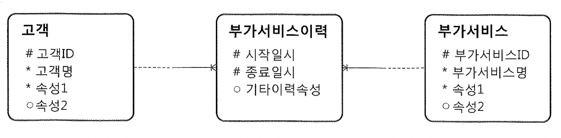

# 04. 동시성 구현 사례


1~3 절을 토대로 사례두가지 소개.


## 1) 일련번호 채번 동시성 높이기

- 일련번호 채번, 선분이력 등의 동시성 구현 사례를 살펴보고 완벽하게 이해한다


### 일련번호 채번 동시성 높이기

- DBMS가 제공하는 Sequence 기능을 사용하는 것이 가장 좋으나, 이를 사용할 수 없는 경우 별도 구현해야 함


##### (1) 데이터가 삽입되는 시점에 실시간으로 현재의 MAX 값을 취해 1만큼 증가시킨 값을 이용하는 방식

- 두 개의 트랜젝션이 동시에 같은 값을 읽었을 경우 insert 하려는 순간 PK 제약 위배됨
- Exception 처리를 통해 동시성 제어


##### (2) MAX 값을 관리하는 별도의 채번 테이블에서 값을 가져오는 방식

- 채번 테이블 생성 및 채번 함수 정의

```sql
drop table seq_tab;

create table seq_tab (
  gubun varchar2(1),
  seq   number,
  constraint pk_seq_tab primary key(gubun, seq)
)
organization index;

insert into seq_tab values ('A', 0);
commit;

create or replace function seq_nextval(l_gubun varchar2) return number
as
  --pragma autonomous_transaction; -- 메인 트랜젝션에 영향을 주지 않고 서브 트랜젝션만 따로 커밋
  l_new_seq seq_tab.seq%type;
begin
  update seq_tab
     set seq = seq + 1
   where gubun = l_gubun;

  select seq into l_new_seq
    from seq_tab
   where gubun = l_gubun;

  commit;
  return l_new_seq;
end;
/
```

- pragma autonomous_transaction 주석을 해제해야 동작함.
  - sub dml은 트랜잭션을 독립적으로 동작하게 한다.

~~~sh
ORA-14551: 질의 안에 DML 작업을 수행할 수 없습니다 
ORA-06512: "SYS.SEQ_NEXTVAL",  6행
14551. 00000 -  "cannot perform a DML operation inside a query "
*Cause:    DML operation like insert, update, delete or select-for-update
           cannot be performed inside a query or under a PDML slave.
*Action:   Ensure that the offending DML operation is not performed or
           use an autonomous transaction to perform the DML operation within
           the query or PDML slave.
~~~


- 앞서 정의한 테이블 및 함수를 사용한 트랜젝션 예시

```sql
create table tab1 (
  col1 varchar2(1),
  col2 varchar2(1),
  constraint pk_tab1 primary key(col1)
);


create table tab2 (
  seq number,
  col1 varchar2(1),
  col2 varchar2(1),
  constraint pk_tab2 primary key(seq)
);

insert into tab1 values ('a','a');
commit;


begin
  update tab1 set col2 = 'b' where col1 = 'a';
  
  insert into tab2
  values (seq_nextval('A'), 'a', 'b');

  dbms_lock.sleep(2);
  --loop
    -- do anything ...
  --end loop;

  commit;
  --rollback;

exception
  when others then
  rollback;
end;
/
```

- pragma autonomous_transaction 옵션을 사용하지 않은 경우는?
  - 메인 트랜젝션의 insert 구문 이후에 롤백이 되는 경우 앞의 update문까지 이미 커밋된 상태로 되어 데이터 일관성이 깨짐
    - 이라고 책에 되어있는데, 애초에 Function pl/sql 실행이 안됨.(ORA-14551)

- seq_nextval 함수에서 커밋을 안한다면? 
  - 메인 트랜젝션이 종료될 때까지 채번 테이블에 Lock이 걸린 상태가 되어 성능저하 초래


## 2) 선분이력 정합성 유지


### 선분이력 정합성 유지

- 선분이력을 추가하고 갱신할 때 발생할 수 있는 동시성 이슈를 해결한 사례

- 선분이력모델은 여러 장점이 있지만 잘못하면 데이터 정합성이 쉽게 깨질 수 있는 단점 존재
- 정확히 핸들링하는 방법을 알아야 한다




- 기본 최종 선분이력을 끊고 새로운 이력 레코드를 추가하는 전형적인 처리 루틴

```sql
declare
  cur_dt varchar2(14);
begin
  select 고객ID
    from 부가서비스이력
   where 고객ID = 1
     and 종료일시 = to_date('99991231235959', 'yyyymmddhh24miss')
     for update nowait ;

  cur_dt := to_char(sysdate, 'yyyymmddhh24miss') ; -- ①

  update 부가서비스이력 -- ②
     set 종료일시 = to_date(:cur_dt, 'yyyymmddhh24miss') - 1/24/60/60
   where 고객ID = 1
     and 부가서비스ID = 'A'
     and 종료일시 = to_date('99991231235959', 'yyyymmddhh24miss') ;

  insert into 부가서비스이력(고객ID, 부가서비스ID, 시작일시, 종료일시) -- ③
  values (1, 'A', to_date(:cur_dt, 'yyyymmddhh24miss'),
         to_date('99991231235959', 'yyyymmddhh24miss')) ;

  commit; -- ④
end;
```

- 신규등록 건이면 ②번 update문에서 실패하고 ③번에서 한 건이 insert 됨

- select for update문이 없다면?
  - 첫 번째 트랜젝션이 ①을 수행하고 ②로 진입하기 직전에 두 번째 트랜젝션이 동일 이력에 대해 ①~④를 먼저 진행해 버린다면 선분이력이 깨짐
  - 트랜잭션이 순차적으로 진행할 수 있도록 직렬화 장치 필요 : select for update문을 이용해 해당 레코드에 Lock을 설정
    ~~~sql
    -- 부가서비스이력에 lock을 설정
    declare
      cur_dt varchar2(14);
    begin
      select 고객ID
        from 부가서비스이력
       where 고객ID = 1
         and 종료일시 = to_date('99991231235959', 'yyyymmddhh24miss')
         for update nowait ;
    
      cur_dt := to_char(sysdate, 'yyyymmddhh24miss');
    
      update 부가서비스이력
         set 종료일시 = to_date(:cur_dt, 'yyyymmddhh24miss') - 1/24/60/60
       where 고객ID = 1
         and 부가서비스ID = 'A'
         and 종료일시 = to_date('99991231235959', 'yyyymmddhh24miss') ;
    
      insert into 부가서비스이력(고객ID, 부가서비스ID, 시작일시, 종료일시)
      values (1, 'A', to_date(:cur_dt, 'yyyymmddhh24miss'),
             to_date('99991231235959', 'yyyymmddhh24miss')) ;
    
      commit;
    end;
    ~~~
  
    
  
- 부가서비스이력 테이블에만 select for update로 Lock을 거는 경우?
  - 기존에 부가서비스이력이 전혀 없던 고객인 경우 Lock이 걸리지 않음
  
  - 동시에 두 개 트랜젝션이 ③번 insert문으로 진입하여 시작일시는 다르면서 종료일시는 같은 두 개의 이력 레코드 생성
  
  - 상위엔티티인 고객 테이블에 select for update로 Lock을 걸어 완벽하게 동시성 제어
  
  - 다른 상위엔티티인 부가서비스 테이블에 Lock을 걸 수도 있지만, 여러 사용자가 동시에 접근할 가능성이 크기 때문에 동시성이 나빠질 수 있으므로 고객 테이블에 Lock 설정
    ~~~sql
    -- 고객 조회에 Lock설정
    declare
      cur_dt varchar2(14);
    begin
      select 고객ID
        from 고객
       where 고객ID = 1
         for update nowait ;
    
      cur_dt := to_char(sysdate, 'yyyymmddhh24miss') ;
    
      update 부가서비스이력
         set 종료일시 = to_date(:cur_dt, 'yyyymmddhh24miss') - 1/24/60/60
       where 고객ID = 1
         and 부가서비스ID = 'A'
         and 종료일시 = to_date('99991231235959', 'yyyymmddhh24miss') ;
    
      insert into 부가서비스이력(고객ID, 부가서비스ID, 시작일시, 종료일시)
      values (1, 'A', to_date(:cur_dt, 'yyyymmddhh24miss'),
             to_date('99991231235959', 'yyyymmddhh24miss')) ;
    
      commit;
    end;
    ~~~
  
    
