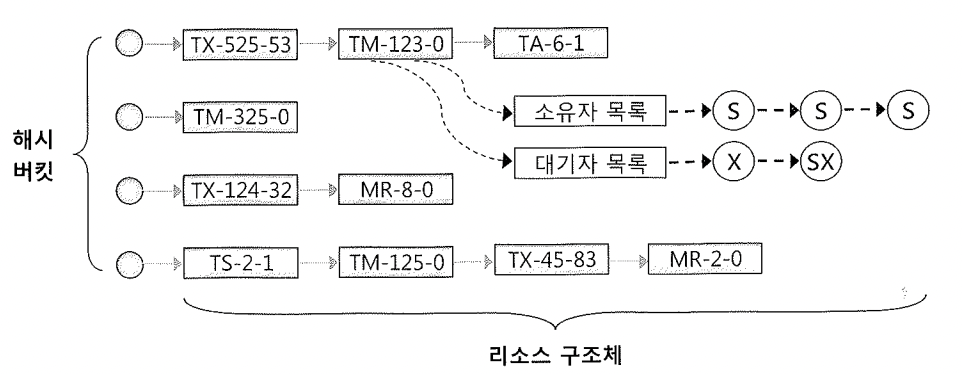
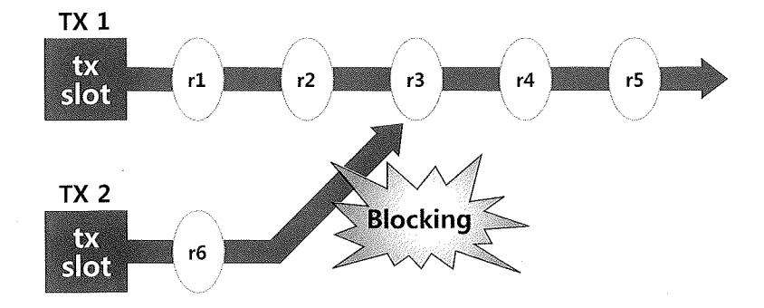
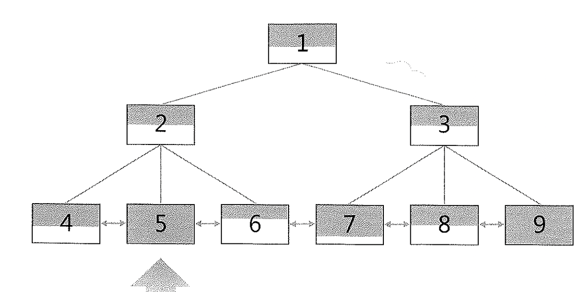
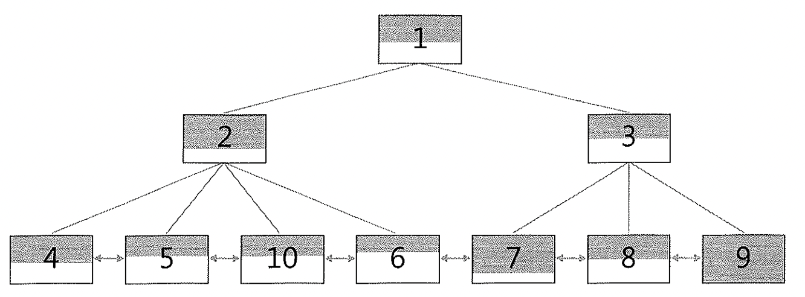
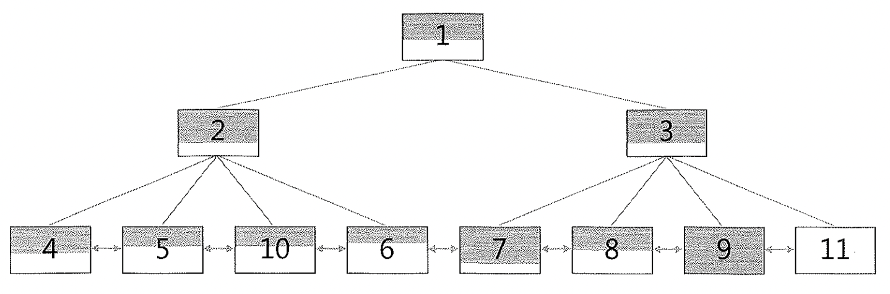

# 05. 오라클 Lock


## &&&&&&&&&&&&&&&&&&&&&&&&&&&&&&

테스트 한거

- TX row Lock

테스트 할거

- 무결성 제약 위배 가능성
- 비트맵 인덱스 엔트리 갱신
- ITL 슬롯 부족
- 인덱스 분할

## &&&&&&&&&&&&&&&&&&&&&&&&&&&&&&


- 오라클 Lock의 종류 및 원리의 이해

- Enqueue Lock 구조와 트랜잭션 Lock(TX Lock) 개념의 이해


### 대표적인 오라클 Lock의 종류

- 래치(Latch) : SGA에 공유돼 있는 갖가지 자료구조를 보호할 목적으로 사용되는 가벼운 Lock (1장)
- 버퍼 Lock : 버퍼 블록에 대한 액세스를 직렬화 (1장)
- 라이브러리 캐시 Lock : 라이브러리 캐시 오브젝트에 대한 핸들을 보호 (4장)
- 라이브러리 캐시 Pin : 라이브러리 캐시 오브젝트의 실제 내용이 담긴 힙(Heap)을 보호 (4장)
- DML 테이블 Lock : Enqueue Lock으로 구현 (2장)
- DML 로우 Lock : 로우 단위 Lock과 트랜잭션 Lock을 조합해서 구현 (2장)


## 1) Enqueue Lock

- 테이블, 트랜잭션, 테이블스페이스, 시퀀스, Temp 세그먼트 등의 공유 리소스에 대한 액세스를 관리하는 Lock 메커니즘
- 래치와 달리 큐(Queue) 구조 사용 : 순서가 보장된다(대기자 큐에 가장 먼저 Lock 요청을 등록한 세션이 가장 먼저 Lock을 획득)
- Enqueue Lock으로 관리되는 공유 리소스에 대해 Lock을 획득하려면 먼저 Enqueue 리소스를 할당받아야 한다
  - 현재 할당된 Enqueue 리소스는 **v$resource** 뷰를 통해 확인


#### Enqueue 리소스

- 소유자(Owner), 대기자(Waiter) 목록을 관리할 수 있는 구조체
- 각 Enqueue 리소스에 고유한 식별자(Type-ID1-ID2) 부여
- Type : 'TX', 'TM' ...
- ID1, ID2에는 Lock 종류에 따라 다른 정보를 가짐


| Lock 종류 | Type | ID1                                             | ID2                         |
| :-------- | :--- | :---------------------------------------------- | :-------------------------- |
| TM Lock   | TM   | 오브젝트 ID                                     | 0                           |
| TX Lock   | TX   | Undo 세그먼트 번호 << 16 \| + 트랜잭션 슬롯번호 | 트랜잭션 슬롯 Sequence 번호 |
| US Lock   | US   | Undo 세그먼트 번호(USN)                         |                             |
| HW Lock   | HW   | Tablespace#                                     | DBA of Undo Segment Header  |

#### 리소스 테이블

- 일종의 Array
- Enqueue 리소스 구조체를 통합 관리
- 통합 관리하지 않고 버퍼 Lock이나 라이브러리 캐시 오브젝트처럼 개별 공유 리소스에서 소유자, 대기자 목록을 관리하는 경우도 있음
- 해싱 알고리즘을 사용하여 각 리소스를 찾음
- 해시 키(Hash Key)는 리소스 식별자
- 각 해시 버킷에 연결 리스트(Linked List)로 연결된 해시 체인을 가지며, 여기에 리소스 구조체가 연결됨




#### Enqueue 방식으로 관리되는 특정 리소스(테이블, 트랜잭션 등)에 대한 Lock 획득

- 먼저 리소스 테이블에서 해당 리소스 구조체를 찾음
- 찾지 못하면 새로운 리소스 구조체를 할당받아 해시 체인 연결 리스트에 연결
- 리소스 소유자 목록에 자신을 등록
- 호환되지 않는 모드로 먼저 Lock을 획득한 세션이 있는 경우는 Lock 요청을 대기자 목록에 등록하고 대기(또는 작업을 포기)
- 소유자가 Exclusive 모드일 때는 한 순간에 하나의 세션만 Lock을 소유
- Shared 모드일 때는 여러 세션이 동시에 Lock 획득 가능(동시에 소유자 목록에 등록)
- 소유자 목록에 어떤 모드건 Lock이 등록된 상태에서 Exclusive Lock을 획득하려면 대기자 목록에서 대기하고, 앞의 Lock이 모두 해제되면 소유자로 등록된다


#### Enqueue Lock 작동 메커니즘

- A 세션이 Shared 모드로 Lock 획득한다.
- B 세션이 Shared 모드로 Lock을 획득하려고 한다. 먼저 Lock을 소유한 A 세션과 호환되므로 정상적으로 Lock을 획득한다. 이제 소유자 목록에는 두 개 세션이 달려 있다.
- C 세션이 Exclusive 모드로 Lock을 획득하려고 한다. Shared 모드와 Exclusive 모드 간에 호환성이 없으므로 대기자 목록에 자신을 등록하고 대기한다.
- 소유자 목록에 Shared 모드로 달려 있던 A, B 두 세션이 모두 Lock을 해제하면 C 세션이 Exclusive 모드로 소유자 목록에 등록된다.
- A 세션이 Exclusive 모드로 다시 Lock을 획득하려고 하면, Exclusive 모드와 호환되지 않으므로 대기자 목록에 자신을 등록하고 대기한다.
- B 세션이 다시 Shared 모드로 Lock을 획득하려고 할 때도 Exclusive 모드와 호환되지 않으므로 대기자 목록에 자신을 등록하고 대기한다.
- Enqueue Lock은 순서가 보장되므로 C 세션이 Lock을 해제하면 A 세션이 가장 먼저 Exclusive 모드로 Lock을 획득한다.
- **의문) 3번과 4번 사이에 D 세션이 Shared 모드 Lock을 획득하려고 한다면 어떻게 될까?**


## 2) TX Lock (=트랜잭션 Lock)

#### 오라클은 레코드가 갱신중이라도 읽기 작업에 대해서는 블로킹 없이 작업을 진행할 수 있도록 구현됨

- 트랜잭션을 시작하려면 먼저 Undo 세그먼트 헤더에 위치한 트랜잭션 테이블로부터 슬롯을 하나 할당받아야 함
- 이 트랜잭션이 변경을 가한 블록에 대해 다른 트랜잭션이 Consistent 버전을 얻으려면
  - 트랜잭션 슬롯에 기록된 상태 정보를 확인
  - 필요하다면 CR 블록을 생성해서 읽음
- 변경 중인 레코드(또는 기타 리소스)를 동시에 변경하려는 트랜잭션은?
  - 트랜잭션 Lock(TX Lock)을 사용하여 액세스를 직렬화


#### TX Lock

- 트랜잭션이 첫 번째 변경을 시작할 때 얻고, 커밋 또는 롤백할 때 해제
- TX Lock도 Enqueue Lock으로 구현됨
- TX Lock을 위한 Enqueue 리소스 구조체의 식별자

| Type | ID1                                             | ID2                         |
| :--- | :---------------------------------------------- | :-------------------------- |
| TX   | Undo 세그먼트 번호 << 16 \| + 트랜잭션 슬롯번호 | 트랜잭션 슬롯 Sequence 번호 |

- 이 식별자를 갖는 리소스 구조체를 Enqueue 리소스 테이블 해시 체인에 연결하고, 소유자 목록에 트랜잭션을 등록하여 Lock을 획득


#### TX Lock 메커니즘




- TX1 트랜잭션은 Undo 세그먼트에서 트랜잭션 슬롯을 할당받고, Enqueue 리소스를 통해 TX Lock을 설정
  - 이 상태에서 r1부터 r5까지 5개 레코드를 변경하고, 아직 커밋은 하지 않음
- TX2 트랜잭션도 트랜잭션 테이블에서 하나의 슬롯을 할당받고, Enqueue 리소스를 통해 TX Lock을 설정
  - 이후 r6 레코드를 변경
- 이제 TX2가 r3 레코드를 액세스하려는 순간 호환되지 않는 모드로 Lock이 걸려 있음을 인지하고 TX1의 트랜잭션 슬롯 상태를 확인
- TX1이 아직 커밋되지 않은 Active 상태이므로
  - TX2는 TX1이 Lock을 설정한 Enqueue 리소스 구조체 대기자 목록에 자신을 등록하고 대기상태로 들어감
  - TX2는 대기하면서 3초마다 한번씩 TX1이 설정한 TX Lock의 상태를 확인(교착상태(Deadlock) 발생 여부를 확인하기 위함)
- TX1이 커밋 또는 롤백하면 TX1이 설정한 TX Lock의 대기자 목록에서 가장 우선순위가 높은 TX2 트랜잭션을 깨워 트랜잭션을 재개하도록 함
- TX2는 r3 레코드를 변경
- **TX Lock 경합 상황 모니터링** : v$lock 뷰를 통해 조회할 수 있다(발생 원인은 알 수 없음)

```sql
-- session1
update emp
set sal = 1000
where empno = 7369;

-- session2
update emp
set sal = 2000
where empno = 7369;

-- session1
select sid, type, id1, id2, lmode, request, block
    , to_char(trunc(id1/power(2,16))) USN
    , bitand(id1, to_number('ffff', 'xxxx')) + 0 SLOT
    , id2 SQN
from v$lock
where TYPE = 'TX' ;

 SID TY	     ID1	ID2	 LMODE	  REQUEST      BLOCK USN					    SLOTSQN
----- -- ---------- ---------- ---------- ---------- ---------- -------------- ---------- ----------
	30 TX	  131103  1108	  0		6	   0 2						      31       1108
	37 TX	  131103  1108	  6		0	   1 2						      31       1108
```

- 현재 37번 세션이 30번 세션의 진행을 블로킹하고 있음(block = 1)
- 30번 세션은 37번 세션이 Exclusive 모드(lmode = 6)로 요청한 채 대기하고 있음
- 현재 경합이 발생한 TX Lock 식별자는 <TX-131103-1108>
- id1과 id2 값을 이용해 TX Lock을 소유한 트랜잭션의 Undo 세그먼트와 트랜잭션 슬롯번호, 시퀀스 번호까지 식별 가능
- **TX Lock의 발생 원인 조회** : v$session_wait 뷰 또는 이벤트 트레이스(레벨 8)을 통해 확인


```sql
select sid, seq#, event, state, seconds_in_wait, p1, p2, p3
from v$session_wait
where event like 'enq: TX%' ;

SID	   SEQ#    EVENT							              STATE		 SECONDS_IN_WAIT	   P1	      P2	 P3
-- ---------- --- ------------------- --------------- ---------- ---------- ----------
30	   3116    enq: TX - row lock contention	  WAITING		4               1415053318	  458757       1016
```


###### 대기 이벤트명에 따른 TX Lock의 구분

| 대기 이벤트명                 | Lock 모드    | 원인                                                         |
| :---------------------------- | :----------- | :----------------------------------------------------------- |
| enq: TX - row lock contention | Exclusive(6) | DML 로우 Lock                                                |
|                               | Shared(4)    | 무결성 제약 위배 가능성                                      |
|                               | Shared(4)    | 비트맵 인덱스 엔트리 갱신                                    |
| enq: TX - allocate ITL entry  | Shared(4)    | ITL 부족                                                     |
| enq: TX - index contention    | Shared(4)    | 인덱스 분할                                                  |
| enq: TX - contention          | Shared(4)    | 읽기 전용 테이블스페이스, PREPARED TxN(2PC), Free Lists 등등 |

- 특히 이벤트명이 enq: TX - row lock contention일 때는 Lock 모드에 따라 그 발생원인을 판단해야 함
- Lock 모드는 이벤트 발생시 함께 기록되는 p1 파라미터를 통해 확인


```sql
# Lock 타입 - TM, TX, TS, SQ, HW, HV 등
  chr(bitand(:p1, -16777216)/16777215) || chr(bitand(:p1, 16711680/65536)

# Lock 모드
  decode(to_char(bitand(:p1, 65536)), 0, 'None'
                                    , 1, 'Null'
                                    , 2, 'RS'   -- Row-Shared
                                    , 3, 'RX'   -- Row-Exclusive
                                    , 4, 'S'    -- Shared
                                    , 5, 'SRX'  -- Shared-Row-Exclusive
                                    , 6, 'X'    -- Exclusive
        )
```

- p2, p3 파라미터를 통해 Undo 세그먼트, 트랜잭션 슬롯번호, 그리고 Wrap 시퀀스 번호를 식별해 낼 수 있음

```sql
# Undo 세그먼트 번호
  trunc(:p2/power(2,16))

# 트랜잭션 테이블 슬롯번호
  bitand(:p2, to_number('ffff', 'xxxx')) + 0

# 트랜잭션 슬롯 Wrap 시퀀스
  :p3
```


#### 6가지 대표적 TX Lock 발생원인

- DML 로우 Lock(가장 중요)
- 무결성 제약 위배 가능성
- 비트맵 인덱스 엔트리 갱신
- ITL 슬롯 부족
- 인덱스 분할
- 기타


## 3) TX Lock > 무결성 제약 위배 가능성 또는 비트맵 인덱스 엔트리 갱신

#### 로우 Lock 경합

- 일반적으로 update, delete 시에 발생
- 테이블에 Unique 인덱스가 정의되어 있는 경우 insert에 의한 로우 Lock 경합이 발생할 수 있음
- 두 개 이상 트랜잭션이 같은 값을 입력하려 할 때, 선행 트랜잭션이 아직 진행 중이라면 값의 중복 여부가 확정되지 않았으므로 후행 트랜잭션은 진행을 멈추고 대기


#### 1. dept 테이블의 deptno 컬럼에 PK 인덱스가 잡혀 있는 경우

1. 트랜잭션 TX1이 dept 테이블에 deptno = 40인 레코드를 입력한다.
2. 트랜잭션 TX2도 dept 테이블에 deptno = 40인 레코드를 입력하면, TX1이 커밋 또는 롤백할 때까지 Shared 모드로 enq: TX - row lock contention 대기 이벤트가 발생한다.
3. TX1이 커밋하면 TX2는 ORA-00001 에러를 만나게 된다. "ORA-00001: 무결성 제약 조건(PK_DEPT)에 위배됩니다"
4. TX1이 롤백하면 TX2는 정상적으로 입력이 완료된다.


#### 2. deptno 컬럼으로 dept.deptno를 참조하도록 emp 테이블에 FK제약이 설정된 경우

- dept와 emp 테이블이 1:M 관계

1.  트랜잭션 TX1이 dept 테이블에 deptno = 40인 레코드를 지운다.
2. 트랜잭션 TX2가 emp 테이블에 deptno = 40인 레코드를 입력하면, TX1이 커밋 또는 롤백할 때까지 Shared 모드로 enq: TX - row lock contention 대기 이벤트가 발생한다.
3. TX1이 커밋하면 TX2는 ORA-02291 에러를 만나게 된다. "ORA-02291: 무결성 제약조건(FK_EMP_DEPT)이 위배되었습니다- 부모 키가 없습니다"
4. TX1이 롤백하면 TX2는 정상적으로 입력이 완료된다.


#### 3. 비트맵 인덱스 엔트리에 대한 갱신을 수행할 때

- Shared 모드로 enq: TX - row lock contention 대기 이벤트가 발생할 수 있다
- 비트맵 인덱스의 구조상 하나의 엔트리가 여러 개 레코드와 매핑되고, 하나의 엔트리에 Lock을 설정하면 매핑되는 레코드 전체에 Lock이 설정됨
- 비트맵 인덱스 엔트리를 두 개 이상 트랜잭션이 동시에 갱신할 때 이 이벤트가 자주 발생
- TX1 트랜잭션이 1번 레코드를 갱신하는 동안 TX2 트랜잭션이 2번 레코드를 갱신하려고 할 때 Shared 모드로 enq: TX - row lock contention 대기 이벤트가 발생


## 4) TX Lock > ITL 슬롯 부족

#### ITL(Interested Transaction List) 슬롯

- 한 블록을 동시에 갱신할 수 있는 트랜잭션의 갯수 결정
- ITL 슬롯당 24 바이트 공간 차지
- INITRANS 파라미터로 기본 할당 ITL 슬롯 갯수 설정
  - 9i부터는 3보다 작게 설정하더라도 오라클이 기본적으로 3개의 ITL 슬롯을 할당
- 미리 할당된 ITL 슬롯이 모두 사용중일 때 새로운 트랜잭션이 ITL 슬롯을 요청하면 PCTFREE 설정에 의해 비워둔 공간을 활용
  - PCTFREE는 원ㄹ update를 위해 예약된 공간이다.
- 최대한 생성할 수 있는 ITL 슬롯의 갯수는 MAXTRANS 파라미터에 의해 결정


```
create table t(...) INITRANS 5 MAXTRANS 255 PCTFREE 30;
```

- 10g부터는 MAXTRANS를 위해 사용자가 지정한 값은 무시되며 항상 255개로 고정됨
- 블록에 레코드를 추가/갱신/삭제하려면 ITL 슬롯을 먼저 할당받고 그곳에 트랜잭션 ID를 기록
- 비어 있는 ITL 슬롯이 없다면 ITL 슬롯을 사용중인 트랜잭션 하나가 커밋 또는 롤백할 때까지 기다려야 한다
- Shared 모드 enq: TX - allocate ITL entry 대기 이벤트 발생
- 테이블에 insert 할 때는 ITL 슬롯이 부족한 경우 새 블록을 할당해 그곳에 insert 하면 되기 때문에 대기할 필요가 없다(9i부터 이와 같이 동작)
- 테이블 insert에서는 경합이 발생하지 않지만, index 값 삽입할 때는 여전히 ITL 경합이 발생
- update, delete일 때는 테이블, 인덱스를 불문하고 ITL 경합이 나타날 수 있음.
  - index는 값을 갱신하는게 아니라 정렬을 위해 delete, insert 하기 때문

- ITL 슬롯 부족에 의한 대기현상이 발생하는 경우
  - 동시에 블록을 갱신하려는 트랜잭션의 갯수가 MAXTRANS 값을 초과한 경우
  - PCTFREE를 0으로 지정했거나 PCTFREE 예약 공간을 모두 사용한 상태(update를 계속 함)여서, 새로운 트랜잭션을 위한 ITL 슬롯이 부족한 경우

- ITL 경합에 의한 대기 현상이 자주 발생하는 세그먼트(테이블, 인덱스, 파티션)에 대해서는 INITRANS를 늘려주어야 한다.
  - 세그먼트 목록은 v$segstat을 통해 확인할 수 있다(10g 이상)

```sql
select ts#, obj#, dataobj#, sum(value) itl_waits
  from v$segstat
 where statistic_name = 'ITL waits'
 group by ts#, obj#, dataobj#
having sum(value) > 0
 order by sum(value) desc
```

- INITRANS 값을 변경하더라도 기존에 할당된 블록의 ITL 슬롯의 갯수에는 변함이 없고, 새로 할당되는 블록에만 적용된다.
- 기존 블록에서 ITL 경합이 빈번하게 발생한다면 테이블 또는 인덱스 전체를 재생성해아 한다.

```sql
alter table t move INITRANS 5; -- 인덱스가 모두 unusable.
alter index t_idx rebuild INITRANS 5;
```


## 5) TX Lock > 인덱스 분할


#### 인덱스 분할이란?

- 테이블의 경우 레코드 간 정렬 상태를 유지하지 않으므로 입력할 공간이 부족할 때 새로운 블록을 할당받아 입력
- 인덱스의 경우 정렬된 상태를 유지해야 하므로 아무 블록에나 값을 입력할 수 없음
  - 값을 입력할 위치에 빈 공간이 없으면 인텍스 분할(Split)을 실시해 새 값을 입력할 공간을 확보하며, 이 과정에서 Lock 경합이 발생할 수 있음




- 5번과 9번 리프 블록이 꽉 차 있음
- 5번 블록에 새로운 값을 입력하려는 트랜잭션은 먼저 인덱스 분할을 실시해야 함




- 인덱스 분할이 완료된 모습
  - 5번과 6번 블록 사이에 10번 블록이 삽입되었고, 5번 블록에 있던 레코드 절반이 10번 블록으로 이동함
- 9번 블록에 새로운 값을 추가하려는 트랜잭션이 발생
  - 9번 블록도 꽉 찬 상태이므로 먼저 입력할 공간을 확보해야 함
  - 맨 우측에 값을 추가하는 것이므로 레코드를 이동할 필요 없이 새 블록만 추가하면 됨



- 인덱스 분할이 완료된 후 모습
  - 9번 블록 뒤쪽에 11번 블록이 추가됨

- 인덱스 분할이 진행되는 동안 그 블록에 새로운 값을 입력하려는 또 다른 트랜잭션이 생긴다면?

  - 두 번째 트랜잭션은 선행 트랜잭션이 인덱스 분할을 완료할 때까지 대기

  - Shared 모드에서 enq: TX - index contention 이벤트를 만나게 됨

  - **인덱스 분할을 진행한 선행 트랜잭션이 커밋하지 않은 채 계속 다른 갱신 작업을 진행한다면 대기하던 트랜잭션은 계속 대기해야 함**

    ~~~
    인덱스 분할 작업을 따로 autonomous 트랜잭션으로 구현하여 동시성 문제 해결
    
    - TX1 트랜잭션이 인덱스에 로우를 삽입하려는 순간 빈 공간을 찾지 못함. 인덱스 분할이 필요.
    - TX1 트랜잭션은 autonomous 트랜잭션 TX2를 생성해 인덱스 분할을 진행토록 함
    - 인덱스 분할이 진행중인 블록에 TX3 트랜잭션이 로우를 삽입하려 하고, enq: TX = index contention 이벤트를 만나서, TX2 트랜잭션이 커밋할 때까지 대기
    - 인덱스 분할이 완료되면 TX2 트랜잭션은 커밋하고, autonomous 트랜잭션이므로 TX1은 커밋되지 않은 상태로 계속 트랜잭션을 진행
    - TX3 트랜잭션도 작업을 재개
    ~~~

    

#### 인덱스 분할 최소화 방안 > PCTFREE 크기 증가.

- 테이블에서의 PCTFREE 공간은 나중에 발생할 update를 위해 남겨두는 공간
- 인덱스에서의 PCTFREE는 insert를 위해 남겨두는 공간
  - **PCTFREE 설정은 인덱스를 처음 생성하거나 재생성하는 시점에만 적용됨**
  - **공간을 남겨두더라도 언젠가 다시 채워질 것임**
    - 인덱스 분할을 최소화하기 위해 PCTFREE를 증가시키는 것은 효과가 없거나 일시적인 효과만 있음
    - 인덱스를 주기적으로 재생성해야 의미가 있음(그렇지 못하면 근본적 해결을 못한다)
  - 우측 맨 끝으로만 값이 입력되는 Right Growing 인덱스인 경우 PCTFREE를 0으로 설정하는 것이 인덱스 크기를 줄이는 데 도움이 됨(예: 순차적으로 증가하는 일련번호 컬럼에 인덱스를 생성한 경우)


## 6) TX Lock > 기타 트랜잭션 Lock

- Shared 모드 enq: TX - contention 대기 이벤트
  - 분산 트랜잭션에서 2-Phase 커밋을 위한 PREPARED TX Lock을 대기할 때 발생한다(오라클 매뉴얼)
  - 앞에서 열거한 중요한 TX Lock 이외의 트랜잭션 대기 상황을 모두 여기에 포함한 것 같음(추측)

- 읽기 전용 테이블스페이스로 전환시 TX Lock 경합이 발견됨
  - USERS 테이블스페이스에 DML을 수행하는 트랜잭션이 아직 남아있는 상태에서 아래 명령을 수행시 Shared 모드로 TX Lock 대기

```
alter tablespace USERS read only;
```


## 7) TX Lock > DML 로우 Lock


#### 1] 로우 Lock

- **DML Lock은 다중 사용자에 의해 동시에 액세스되는 사용자 데이터의 무결성을 보호**
- DML 수행 중에 호환되지 않는 다른 DML 또는 DDL 오퍼레이션의 수행을 방지시켜 준다
- 로우 Lock은 두 개의 트랜잭션이 동시에 같은 로우를 변경하는 것을 방지
- **오라클은 로우 Lock을 로우 단위(row-level) Lock과 TX Lock을 조합해서 구현**
  - 로우를 갱신하려면 Undo 세그먼트에서 트랜잭션 슬롯을 할당받고
  - Enqueue 리소스를 통해 TX Lock을 획득한다.
  - dml 문장을 통해 갱신하는 각 로우마다 Exclusive 모드로 로우 단위 Lock을 획득
    - 트랜잭션을 시작할 때 한 번만 획득


#### 2] 로우 단위 Lock

- **블록 헤더 ITL과 로우 헤더 Lock Byte 설정을 의미**
  - TX1 트랜잭션이 로우 정보를 갱신할 때는 블록 헤더 ITL 슬롯에 트랜잭션 ID를 기록
  - 로우 헤더에 이를 가리키는 Lock Byte를 설정
- **이를 통해 로우를 갱신중인 트랜잭션 상태를 확인하고 액세스 가능 여부를 결정**
  - 이 레코드를 액세스하려는 다른 트랜잭션은 로우 헤더에 설정한 Lock Byte를 통해 ITL 슬롯을 찾고
  - ITL 슬롯이 가리키는 Undo 세그먼트 헤더의 트랜잭션 슬롯에서 트랜잭션 상태 정보를 확인하여 해당 레코드에 대한 액세스 가능 여부를 결정
  - TX1 트랜잭션이 진행중일 때 이 레코드를 읽으려는 TX2 트랜잭션은 TX1 트랜잭션의 상태를 확인하고 CR 블록을 생성해서 읽기 작업을 완료
- 오라클은 이처럼 로우 단위 Lock과 다중 버전 읽기 일관성 메커니즘을 이용함으로써 읽기 작업(select for update 문이 아닌)에 대해 Lock에 의한 대기 현상이 발생하지 않도록 구현해 놓았다. (분산트랜잭션은 예외가 존재한다고 함)


#### 3] TX Lock

- **Enqueue 리소스를 통해 TX Lock을 설정하는 것을 의미**
- **Lock이 설정된 레코드를 갱신하고자 할 때 Enqueue 리소스에서 대기**
  - TX1이 갱신중인 레코드를 같이 갱신하려는 TX2 트랜잭션은 TX1 트랜잭션이 완료될 때까지 대기
  - 이를 위해 TX Lock이 필요하다.


##### DML 로우 Lock에 의한 TX Lock 때문에 블로킹된 세션을 보면 

##### Exclusive 모드의 enq: TX - row lock contention 대기 이벤트가 지속적으로 나타난다.


## 8) TM Lock > DML 테이블 Lock


##### 테이블 Lock

- 현재 트랜잭션이 갱신 중인 테이블에 대한 테이블 구조 변경 방지
  - 로우 Lock 획득시 해당 테이블에 대한 테이블 Lock도 동시에 획득
  - 갱신중인 테이블에 대한 호환되지 않는 DDL 오퍼레이션을 방지
- DML문 간에도 테이블 Lock을 이용해 동시성 제어하는 경우도 있다.


##### 명시적인 테이블 Lock(Lock Table 명령어)

- lock table emp in row share mode
- lock table emp in row exclusive mode
- lock table emp in share mode
- lock table emp in share row exclusive mode
- lock table emp in exclusive mode


##### Lock 모드간 호환성(Compatibility)

- 로우 Lock은 항상 Exclusive 모드(row 변경시에만 Lock을 사용함)이지만, 테이블 Lock에는 여러 가지 Lock 모드가 가용됨

|          | Null | RS   | RX   | S    | SRX  | X    |
| :------- | :--- | :--- | :--- | :--- | :--- | :--- |
| **Null** | O    | O    | O    | O    | O    | O    |
| **RS**   | O    | O    | O    | O    | O    |      |
| **RX**   | O    | O    | O    |      |      |      |
| **S**    | O    | O    |      | O    |      |      |
| **SRX**  | O    | O    |      |      |      |      |
| **X**    | O    |      |      |      |      |      |

- RS : Row Share(또는 SS : sub share)
  - select for update 문을 위해 로우 Lock을 설정하려면 먼저 획득해야 함
- RX : Row Exclusive(또는 SX : sub exclusive)
  - insert, update, delete, merge 문을 위해 로우 Lock을 설정하려면 먼저 획득해야 함
- S : Share
- SRX : share row exclusive(또는 SSX : share/sub exclusive)
- X : exclusive


- 선행 트랜잭션과 호환되지 않는 모드로 테이블 Lock을 설정하려는 후행 트랜잭션은 대기하거나 작업을 포기해야 한다
- RS, RX 간에는 어떤 조합으로도 호환이 되므로 select for update나 DML문 수행시 이들간에 테이블 Lock에 의한 경합은 절대 발생하지 않는다
  - 다만, 같은 로우를 갱신하려 할 때 로우 Lock에 의한 경합은 발생


##### TM Lock

- 오라클 테이블 Lock도 Enqueue로 구현 ( == TM Enqueue)
- 테이블 Lock을 TM Lock이라고 부르기도 한다.
- TM Enqueue 리소스 구조체의 식별자

| Type | ID1         | ID2  |
| :--- | :---------- | :--- |
| TM   | 오브젝트 ID | 0    |

- 선행 트랜잭션이 TM Lock을 해제하기를 기다리는 트랜잭션에서 발생하는 대기 이벤트
- enq: TM - contention 이벤트가 지속적으로 나타남


##### 테이블 Lock 의미

- 테이블 전체에 Lock이 걸려서 다른 트랜잭션이 더는 레코드를 추가하거나 갱신하지 못하도록 막는다고 생각하기 쉬움
- DML 수행시 항상 Table Lock이 함께 설정되므로 위 내용은 맞지 않다.
- Lock을 획득한 선행 트랜잭션이 해당 테이블에서 현재 어떤 작업을 수행중인지 알리는 일종의 푯말(Flag)으로 이해해야 한다.
- 여러 가지의 Lock 모드에 따라 후행 트랜잭션이 수행할 수 있는 작업의 범위가 결정됨
- 푯말에 기록된 Lock 모드와 후행 트랜잭션이 현재 하려는 작업 내용에 따라 진행 여부가 결정됨
  - 진행할 수 없다면 기다릴지, 작업을 포기할지 진로를 결정(내부적으로 하드코딩 돼 있거나 사용자가 지정한 옵션에 따라 결정)해야 함
  - 기다려야 한다면 TM Enqueue 리소스 대기자 목록에 Lock 요청을 등록하고 대기
  - 예) DDL문을 이용해 테이블 구조를 변경하려는 세션
    - 해당 테이블에 TM Lock이 설정돼 있는지 먼저 확인
    - TM Lock을 Row Exclusive(=SX) 모드로 설정한 트랜잭션이 하나라도 있다면 현재 테이블을 갱신중인 트랜잭션이 있다는 신호이므로 ORA-00054 메시지를 던지고 작업을 멈춤
    - DDL문이 먼저 수행중일 경우는 DML문을 수행하려는 세션이 TX Lock을 얻으려고 대기(enq: TM - contention 이벤트 발생)


**대상 리소스가 사용중일 때 진로 선택**

- Lock을 얻고자 하는 리소스가 사용중일 때, 프로세스는 3가지 방법 중 하나를 선택
- 보통은 진로가 결정돼 있지만 사용자가 선택하는 경우도 있음(select for update 문 사용)

1. Lock이 해제될 때까지 기다린다.(select * from t for update)
2. 일정 시간만 기다리다 포기한다.(select * from t for update wait 3)
   - 포기할 때 ORA-30006: resource busy; acquire with WAIT timeout expired 메시지를 던짐
3. 기다리지 않고 작업을 포기한다.(select * from t for update nowait)
   - 작업을 포기할 때 ORA-00054: resource busy and acquire with NOWAIT specified 메시지를 던짐

- DML문을 수행할 때 묵시적으로 테이블 Lock을 얻게 되고, 1번 기다리는 방법을 선택
- Lock Table 명령을 이용해 명시적으로 테이블 Lock을 얻을 때도 기본적으로 기다리는 방법을 선택하지만, NOWAIT 옵션을 사용해 곧바로 작업을 포기하도록 사용자가 지정할 수 있음

```
lock table emp in exclusive mode NOWAIT;
```

- DDL문을 수행할 때도 내부적으로 테이블 Lock을 얻음(이 경우는 NOWAIT 옵션이 자동으로 지정됨)


테이블Lock은DDL과 동시진행을 막으려고 사용할 뿐 아니라 
DML간에도 테이블 Lock을 이용해 동시성을 제어하는 경우에도 사용한다.

- 병렬 DML 또는 Direct Path Insert 방식으로 작업을 수행하는 경우가 그렇다.


### 예제)

- 1번 세션(SID=275)에서 T1 테이블에 Append 힌트로 Insert를 수행

##### sesson1

```sql
drop table t;
drop table t1;
create table t (a number) ;
create table t1 (a number) ;

begin
  for item in 1..100
  loop
    insert into t values(item);
    commit write nowait;
  end loop;
end;
/
insert /*+ append */ into t1 select * from t;

select l.session_id SID 
, (case when lock_type = 'Transaction' then 'TX'
        when lock_type = 'DML' then 'TM' end) TYPE
  , mode_held
  , mode_requested mode_reqd
  , (case when lock_type = 'Transaction' then
               to_char(trunc(lock_id1/power(2,16)))
          when lock_type='DML' then
               (select object_name from dba_objects
                where object_id = l.lock_id1)
     end) "USN/Table"
  , (case when lock_type = 'Transaction' then
               to_number(lock_id1) end) "SQN"
  , (case when blocking_others = 'Blocking' then ' <<<<<' end) Blocking
   from dba_lock l       
  where lock_type in ('Transaction', 'DML')
order by session_id, lock_type, lock_id1, lock_id2 ; 


       SID TY MODE_HELD  MODE_REQD  USN/Table         SQN BLOCKING
---------- -- ---------- ---------- ---------- ---------- ------
275	TM	Exclusive	None	T1		
275	TX	Exclusive	None	5	327705	
```

- DML문을 수행하니 TX Lock과 TM Lock을 동시에 획득함
  - 일반적인 DML문에서는 테이블 Lock(=TM Lock)을 Row Exclusive(=SX) 모드로 설정하지만, 여기서는 Append 모드로 Insert를 수행했기 때문에 Exclusive 모드임
- 2번 세션(SID=296)에서 T1 테이블의 레코드 하나를 갱신하는 update문을 수행하고 Lock을 모니터링

##### sesson2

```sql
update t1
set a = 100
where rownum=1;


       SID TY MODE_HELD  MODE_REQD  USN/Table         SQN BLOCKING
---------- -- ---------- ---------- ---------- ---------- ------
275	TM	Exclusive	None	T1		 <<<<<
275	TX	Exclusive	None	2	131080	
296	TM	None	Row-X (SX)	T1		
```

- 일반적인 DML문을 사용했으므로 Row Exclusive(=SX) 모드로 테이블 Lock을 요청했음
  - Row Exclusive 모드 Lock은 Exclusive 모드와 호환성이 없으므로 2번 세션은 블로킹됨
  
  - 로우 Lock이 아니라 테이블 Lock 때문에 블로킹된 점을 주목
  
  - **로우 Lock 호환성을 확인하기 전에 테이블 Lock 호환성을 먼저 확인한다는 사실을 알 수 있음**
  
    

##### v$session_wait 뷰를 통해 2번 세션(SID=296)의 이벤트 상황을 조회

```sql
select event, wait_time, seconds_in_wait, state
  from v$session_wait
  where sid = 296 ;
  
  
EVENT                             WAIT_TIME SECONDS_IN_WAIT STATE
------------------------------------------- --------------- -------------------
enq: TM - contention	0	93	WAITING
```

- - Exclusive 모드 테이블 Lock을 먼저 획득한 1번 세션(SID=275)을 커밋하고 다시 Lock을 모니터링

```sql
       SID TY MODE_HELD  MODE_REQD  USN/Table         SQN BLOCKING
---------- -- ---------- ---------- ---------- ---------- ---------
296	TM	Row-X (SX)	None	T1		
296	TX	Exclusive	None	8	524298	
```

- 1번 세션은 Lock을 모두 해제했으므로 쿼리 결과에서 사라짐
  - 2번 세션이 TX Lock과 TM Lock을 동시에 획득
- 2번 세션이 현재 Lock을 걸고 있는 레코드를 1번 세션에서 변경하고 Lock을 모니터링

```sql
update t1
set a = 100
where rownum=1;


       SID TY MODE_HELD  MODE_REQD  USN/Table         SQN BLOCKING
---------- -- ---------- ---------- ---------- ---------- --------------------
       275 TM Row-X (SX)			       None					T1
       275 TX None				       Exclusive				8					     524298
       296 TM Row-X (SX)			       None					T1
       296 TX Exclusive 			       None					8					     524298  <<<<<
```

- 이번에는 테이블 Lock에 의한 블로킹이 아니라 로우 Lock 때문에 블로킹이 발생했음
  - Exclusive 모드 로우 Lock 간에는 호환성이 없기 때문
  - Row-Exclusive 모드 테이블 Lock 간에는 호환성이 있으므로 Lock 경합이 발생하지 않음
- TX Lock은 트랜잭션마다 오직 한 개만 획득
- TM Lock은 트랜잭션에 의해 변경이 가해진 오브젝트 수만큼 획득함


##### Expert One-On-One Oracle(Thomas Kyte 저)에 나오는 예시

- TX Lock은 트랜잭션마다 오직 한 개씩 획득하는 반면, TM Lock은 트랜잭션에 의해 변경이 가해진 오브젝트 수만큼 획득한다.

```sql
create table test1 (x int);
create table test2 (x int);
insert into test1 values(1);
insert into test2 values(1);

select username, v$lock.sid, id1, id2
      , lmode, request, block, v$lock.type
   from v$lock, v$session
  where v$lock.sid = v$session.sid
    and v$session.username = 'SYS' ; 
    

USERNAME          SID        ID1        ID2      LMODE    REQUEST      BLOCK TY
---------- ---------- ---------- ---------- ---------- ---------- ---------- --
SYS	275	131105	1511	6	0	0	TX
SYS	275	78079	0	3	0	0	TM
SYS	275	78080	0	3	0	0	TM


select object_name, object_id from user_objects
where object_name in ('TEST1','TEST2')
OBJECT_NAME                     OBJECT_ID
------------------------------ ----------
TEST1	78079
TEST2	78080
```


## 9) Lock을 푸는 열쇠, 커밋


#### 1] 블로킹(Blocking)과 교착상태(Deadlock)

어떤 dml을 실행했을 때, 멈춰있다면 블로킹 상태일까 교착상태일까? 해결은?


##### 블로킹(Blocking)

- Lock 경합이 발생해 특정 세션의 작업을 진행하지 못하고 멈춰 선 경우
- 커밋 또는 롤백으로 해소


##### 교착상태(Deadlock)

- 두 세션이 각각 Lock을 설정한 리소스를 서로 액세스하려고 마주보고 진행하는 상황
- 둘 중 하나가 물러나지 않으면 영영 풀릴 수 없음
- 교착상태가 발생하면 이를 먼저 인지한 세션이 문장 수준 롤백을 진행한 후 에러 메시지를 던짐
  - **ORA-00006: deadlock detected while waiting for resource**
  - Lock 경합 때문에 대기 상태에 빠질 때 3초의 타임아웃을 설정하는 이유(교착상태 발생 인지)
- 교착상태는 해소됐지만 블로킹 상태에 놓이게 됨
  - 이 메시지를 받은 세션은 커밋 또는 롤백을 결정해야 함
  - 프로그램 내에서 이 에러에 대한 예외 처리(커밋 또는 롤백)을 하지 않으면 대기상태를 지속하게 되므로 주의


#### 2] 오라클은 데이터를 읽을 때 Lock을 사용하지 않음

- 다른 DBMS에 비해 상대적으로 Lock 경합이 적게 발생
- 읽는 세션의 진행을 막는 부담이 없어 필요한 만큼 트랜잭션을 충분히 길게 가져갈 수 있음

- **그러나, 불필요하게 트랜잭션을 길게 정의하지 않도록 주의**
  - 트랜잭션이 너무 길면 롤백이 필요한 경우 너무 많은 시간이 걸릴 수 있음
  - **Undo 세그먼트가 고갈되거나 Undo 세그먼트 경합을 유발할 수도 있음**
  - 같은 데이터를 갱신하는 트랜잭션이 동시에 수행되지 않도록 설계
  - DML Lock 때문에 동시성이 저하되지 않도록 적절한 시점에 커밋 처리

- **반대로, 불필요하게 커밋을 너무 자주 수행하면**
  - **Snapshot too old(ORA-01555) 에러를 유발할 가능성 높아짐**
  - LGWR가 로그 버퍼를 비우는 동안 발생하는 log file sync 대기 이벤트 때문에 성능 저하 우려
  - 잦은 커밋 때문에 성능이 느리다면 비동기식 커밋 기능 활용 검토(10gR2부터 제공)


#### 3] 커밋 명령 옵션

- WAIT(Default)
  - LGWR가 로그버퍼를 파일에 기록했다는 완료 메시지를 받을 때까지 대기
  - 그동안 log file sync 대기 이벤트 발생(동기식 커밋)

- NOWAIT
  - LGWR의 완료 메시지를 기다리지 않고 바로 다음 트랜잭션을 진행
  - log file sync 대기 이벤트가 발생하지 않음(비동기식 커밋)

- IMMEDIATE(Default)
  - 커밋 명령을 받을 때마다 LGWR가 로그 버퍼를 파일에 기록

- BATCH
  - 세션 내부에 트랜잭션 데이터를 일정량 버퍼링했다가 일괄 처리
- commit_write 파라미터를 이용해 시스템 또는 세션 레벨에서 기본 설정을 변경 가능
- 각 옵션별 수행속도 테스트
  - **실제 macos 에 21c Mem4G 도커환경에서 실시함**


```sql
drop table t;
create table t (a number) ;

begin
  for item in 1..10000
  loop
    insert into t values(item);
    commit write [immediate | batch] [wait | nowait];
  end loop;
end;
/

COMMIT WRITE IMMEDIATE WAIT ;   -- 21초
COMMIT WRITE IMMEDIATE NOWAIT ; -- 8초
COMMIT WRITE BATCH WAIT ;       -- 20초
COMMIT WRITE BATCH NOWAIT ;     -- 3.5초
```

- Nowait 옵션에 의한 성능개선 효과는 크게 두드러지지만 Batch 옵션의 영향력은 미미
- Batch 옵션은 IMU(In-Memory Undo) 기능과 관련(추정)
- 위 테스트를 수행하는 도중 v$sesstat 각 항목의 변화량(delta)를 측정하여 가장 큰 차이를 보인 항목 선별

| Statistics Name            | Immediate (wait, nowait) | Batch (wait, nowait) |
| :------------------------- | :----------------------- | :------------------- |
| Commit immediate requested | 100,000                  | 0                    |
| Commit immediate performed | 100,000                  | 0                    |
| Commit batch requested     | 0                        | 100,000              |
| Commit batch performed     | 0                        | 100,000              |
| Session pga memory         | 0                        | 262,144              |
| IMU Flushes                | 94,005                   | 435                  |
| IMU commits                | 0                        | 93,892               |
| IMU Redo allocation size   | 36,605,152               | 118,440              |
| IMU Undo allocation size   | 34, 549, 388             | 34,667,516           |

- Batch 옵션을 사용했을 때 PGA 메모리 할당량이 늘어남
  - PGA 영역에 트랜잭션 데이터를 일정량 버퍼링했다가 일괄 처리(추정)
- 일반적인 커밋(immediate wait)은 트랜잭션 데이터가 데이터베이스에 안전하게 저장됨을 보장
- 비동기식 커밋 옵션 사용시 트랜잭션 커밋 직후 인스턴스에 문제가 생기거나, Redo 로그가 위치한 파일 시스템에 문제가 생겨 쓰기 작업을 진행할 수 없게 되면 커밋이 정상적으로 완료되지 못할 우려가 있음
  - 트랜잭션에 의해 생성되는 데이터의 중요도에 따라 이 옵션의 사용여부를 판단하여 결정해야 함


