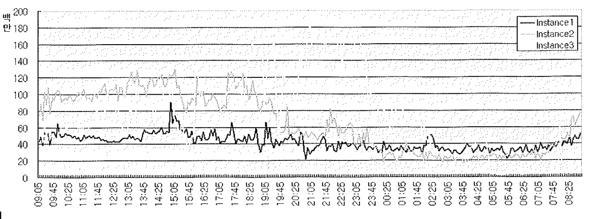

# 05. V$SYSSTAT

- v$statname --> 지표를 설명
- v$sysstat --> 인스턴스 시작이후 각종 통계 내역 누적
- v$service_stats --> 서비스 이름별 통계 관련 지표 누적
- v$sesstat --> 현재 연결중인 각 세션의 통계 누적
- v$mystat --> 본인 세션의 통계 누적

~~~sql
SELECT NAME, VALUE FROM V$SYSSTAT
WHERE STATISTIC# IN (7, 47, 50, 54, 134, 335, 336, 337, 341, 342);

user calls	227
physical read total multi block requests	18
physical read total bytes	45537792
cell physical IO interconnect bytes	47162368
commit cleanout failures: block lost	0
IMU commits	5
IMU Flushes	4
IMU contention	0
IMU bind flushes	0
IMU mbu flush	0
~~~

- 인스턴스 기동 후 현재까지 누적된 수행 통계치를 시스템 레벨로 확인하고자 할 때 사용하는 뷰
  - 통계 뷰 종류

| 구분        | 뷰        |
| ----------- | --------- |
| 시스템 레벨 | V$SYSSTAT |
| 개별 세션별 | V$SESSTAT |
| 본인 세션   | V$MYSTAT  |

## 1) 시스템 수행 통계 수집 및 분석

- v$sysstat에 나타나는 값들은 인스턴스 기동 후 또는 세션 수립 후 현재까지 누적된 값
- 값의 크고 작음만으로 의미있는 정보를 얻기는 힘듬
- 두 구간 사이의 변화량(증분, delta)을 구해 내부적으로 어떤 일이 있었는지 판단

#### delta example

~~~sql
-- session2
create table sess_stat
as
select 1 no, statistic#, value
from v$sesstat
where sid = '35';

-- session1
insert into sess_stat
select 2 no, statistic#, value
from v$sesstat
where sid = '35';

commit;

-- session1
select b.statistic# stat#, b.name, (b.value - a.value) delta_value
from (
    select n.statistic#, n.name, b.value
    from v$statname n, sess_stat b
    where b.statistic# = n.statistic#
    and b.value > 0
    and b.no = 2
) b, sess_stat a
where a.statistic# = b.statistic#
and (b.value - a.value) > 0
order by delta_value desc

~~~

#### 시간대별 Load Profiling

- v$sysstat 을 읽어 지정된 테이블에 insert 하는 프로시저를 작성하고
- dbms_scheduler 를 이용해 job을 등록하면 가능함. (부하 거의 없다.)

## 2) Ratio 기반 성능 분석

- 수행 통계 자료를 이용해 DB의 전반적인 건강상태를 체크 할 수 있는 의미 있는 Ratio 값을 구할 수 있음
- 이 값들은 문제가 발견되었을 때 그 원인을 분석하는 데에 취약함.

| Buffer NoWait %             | 버퍼블록을 읽으려 할 때, buffer busy waits대기 없이 곧바로 읽기에 성공한 비율 |
| --------------------------- | ------------------------------------------------------------ |
| Redo NoWait %               | Redo로그를 기록할 공간을 요청하지 않고 곧바로 Redo 엔트리를 기록한 비율 이비율이 낮으면 로그 스위칭이 느리거나 너무 자주 발생함을 의미 |
| Buffer Hit %                | 디스크 읽기를 수반하지 않고 버퍼캐시에서 블록찾기에 성공한 비율 |
| Latch Hit %                 | 래치 경합없이 첫번째 시도에서 곧바로 래치를 획득한 비율      |
| Library Hit %               | 라이브러리 캐시에 이미 적재된 SQL커서를 생행하거나 오브젝트정보를 읽으려할 때 커서 또는 오브젝트정보가 Heap영역에서 찾아진다면 Hit에 성공 비율 Get hit율과 Pin hit율로 나누어짐 Get hit율은 Parse 단계와 관련이 있으며 이 수치가 낮다면 하드파싱 또는 최초 로드가 발생한 경우임 |
| Soft Parse %                | 실행계획이 라이브러리 캐시에서 찾아져 하드파싱을 일으키지 않고 SQL을 수행한 비율 (전체 Parse Call 횟수 - 하드파싱 횟수 ) / (전체 Parse Call 횟수) * 100 **이 비율이 낮다면 바인드변수를 사용하도록 app개선해야함** |
| Execute to Parse %          | Parse Call없이 곧바로 SQL을 수행한 비율. 즉, 커서를 애플리케이션에서 캐싱한 채 반복 수행한 비율 n-Tier에서 이 값이 일반적으로 값이 낮게 나타남 |
| Parse CPU to Parse Elapsd % | 파싱 총 소요 시간 중 CPU time이 차지한 비율. 파싱에 소요된 시간 중 실제 일을 수행한 시간비율 이값이 낮**으면 대기시간이 많았다는 의미**로서 Shared Pool과 라이브러리 캐시 경합이 많았다는 것을 의미하며 대개 하드파싱 부하때문임 초당 하드파싱 횟수가 거의 나타나지 않는데 이 Ratio가 낮은 수치를 기록한다면 Parse Call 자체가 많아 발생한는 경합임 |
| % Non-Parse CPU             | SQL을 수행하면서 사용한 전체 CPU time중 파싱 이외의 작업이 차지한 비율. 이 비율이 낮으면 파싱에 소비되는 CPU Time이 많은거며, 파싱부하를 줄이도록 애플리케이션을 개선해야함 |
| In-memory Sort %            | 전체 소트 수행횟수에서 In-Memory방식으로 소트한 비율         |
| Memory Usage %              | Shared Pool내에서 현재 사용중인 메모리 비중                  |
| % SQL with executions>1     | 전체 SQL 개수에서 두번이상 수행된 SQL이 차지하는 비중. 이 비율이 낮으면 Literal 상수값을 이용하는 쿼리수행빈도가 높다는 것을 의미 |
| % Memory for SQL w/exec>1   | 전체 SQL이 차지하는 메모리 중 두번이상 수행된 SQL이 차지하는 메모리 비중. 이 비율이 낮으면 Literal 상수값을 사용하는 쿼리에 의해 Shared Pool이 낭비되고 있음을 의미 |

##### Buffer Nowait

~~~sql
select round(100 * (1-bfwt/gets), 2) "Buffer Nowait $"
from 
(select sum(count) bfwt from v$waitstat),
(select value gets from v$sysstat where name = 'session logical reads');
~~~

##### Redo NoWait

~~~sql
select round(100 * (1-rlsr/rent), 2) "Redo Nowait $"
from 
(select value rlsr from v$sysstat where name = 'redo log space requests'),
(select value rent from v$sysstat where name = 'redo entries');
~~~

##### Buffer Hit

~~~sql
select round(100* (1-(phyr-phyrd-nvl(phyrdl,0))/gets), 2) "Buffer Hit %"
from
(select value phyr from v$sysstat where name = 'physical reads'),
(select value phyrd from v$sysstat where name = 'physical reads direct'),
(select value phyrdl from v$sysstat where name = 'physical reads direct (lob)'),
(select value gets from v$sysstat where name = 'sessioin logical reads')

~~~

##### Latch Hit

~~~sql
select round(100 * (1-sum(misses)/sum(gets)),2) "Latch Hit %"
from v$latch

99.98%
~~~

##### Library Cache Pin Hit, Library Cache Get Hit

~~~sql
select round( 100 * sum(pinhits)/sum(pins),2) "Library Cache Pin Hit %"
from v$librarycache;

94.74

select round(100 * sum(gethits)/sum(gets),2) "Library Cache Get Hit %"
from v$librarycache

91.79
~~~

##### Soft Parse

~~~sql
select round(100*(1-hprs/prse),2) "Soft Parse %"
from
 (select value hprs from v$sysstat where name = 'parse count (hard)'),
 (select value prse from v$sysstat where name = 'parse count (total)')
 ;
 
 89.93
~~~

##### Execute to Parse

~~~sql
 select round((1-prse/exe)*100,2) "Execute to Parse %"
from 
 (select value prse from v$sysstat where name = 'parse count (total)'),
 (select value exe from v$sysstat where name = 'execute count');
 
 76.39
~~~

##### Parse CPU to Parse Elapsd

~~~sql
select decode(prsela, 0, to_number(null), round(prscpu/prsela*100,2)) "Parse CPU to Parse Elapsd %"
from 
 (select value prsela from v$sysstat where name = 'parse time elapsed'),
 (select value prscpu from v$sysstat where name = 'parse time cpu')
  
76.06
~~~

##### Non-Parse CPU

~~~sql
select decode (tcpu, 0, to_number(null), round(100*(1-(prscpu/tcpu)),2)) "% Non-Parse CPU"
from 
(select value tcpu from v$sysstat where name ='CPU used by this session'),
(select value prscpu from v$sysstat where name ='parse time cpu')

88.74
~~~

##### In-memory Sort

~~~sql
select decode ((srtm+srtd), 0, to_number(null), round(100*(1-(srtm/(srtm+srtd))),2)) "In-memory Sort %"
from 
(select value srtm from v$sysstat where name ='sorts (memory)'),
(select value srtd from v$sysstat where name ='sorts (disk)');

0
~~~

##### Memory Usage

~~~sql
select 100 * (1-sum(decode(name, 'free memory', bytes)) / sum(bytes)) "Memory Usage %"
from v$sgastat
where pool = 'shared pool'

89.25995736751916273584905660377358490566
~~~

Ratio 기반 성능진단 항목들은 DB 전반의 헬스체크 지표다.
다만, 해당 지표에 대해 문제원인 분석이 어렵다는 단점이 있다.

- 시스템 전반의 지표를 보여주므로 개별 세션이나 트랜잭션 레벨에서의 원인추정이 어렵다.

