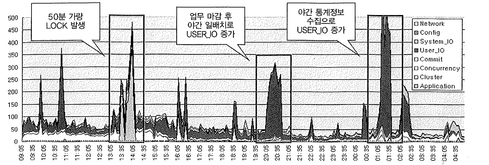

# 6. V$SYSTEM_EVENT

오라클은 서버 프로세스와 백그라운드 프로세스들이 일을 처리하는 과정에서 발생하는 대기 현상들을 측정하려고 갖가지 대기 이벤트를 정의하였다.

대기 이벤트가 발생할 때마다 횟수,대기시간을 내부에 저장한다.

#### 이벤트 뷰

| v$system_event  | 인스턴스 기동 후 현재까지 누적된 이벤트 발생 현황을 시스템 레벨로 확인하고자 할 때 사용 |
| --------------- | ------------------------------------------------------------ |
| v$session_event | 개별 세션별로 누적치 확인                                    |
| v$session_wait  | 세션별로 현재 진행 중이거나 바로 직전에 발생했던 이벤트 정보 |

- 위 3개 뷰는 대기 이벤트와 각 세션별로 이벤트 발생 상황을 로깅하는 기능 제공
- 앞서 10046 이벤트 트레이스 레벨 8 또는 12 모드의 이벤트 정보와 동일한 정보 출력 (.trc)
- 이벤트 트레이스를 걸지 않았더라도 v$session_wait을 조회하면 아래처럼 해당 세션에서 현재 어떤 이벤트가 발생하고 있는지 곧바로 확인 가능

~~~sql

-- session1
update emp
set sal =2000
where empno = 7900

-- session2
update emp
set sal =2000
where empno = 7900

-- session1
SELECT event
    , wait_time
    , seconds_in_wait
    , state
    , p1text || '->' || p1 || ',' || p2text || '->' || p2 || ',' || p3text || '->' || p3 param
from v$session_wait
where sid = 28
;

enq: TX - row lock contention	0	12	WAITING	name|mode->1415053318,usn<<16 | slot->131083,sequence->423

~~~

#### query WAIT_TIME 별 해석

| WAIT_TIME > 0   | 마지막 대기이벤트를 대기한 시간              |
| --------------- | -------------------------------------------- |
| WAIT_TIME = 0   | 이 이벤트를 현재 대기 중                     |
| WAIT_TIME = \-1 | 마지막 대기 이벤트를 대기한 시간이 10ms 미만 |
| WAIT_TIME = \-2 | 타이밍이 활성화되지 않음                     |

### Load Profiling

- 5절의 v$sysstat와 함께 v$system_event까지 저장하면 대기 이벤트 발생 현황도 분석 가능하다.
  (초 단위로 너무 자주 수집하지만 않는다면 시스템에 주는 부하도 미미)
- 아래는  v$system_event를 5분마다 하루동안 발생한 이벤트발생현황을 수집한 그래프이다.

