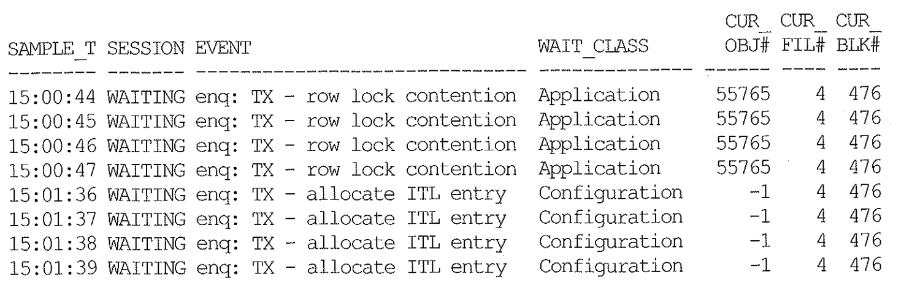
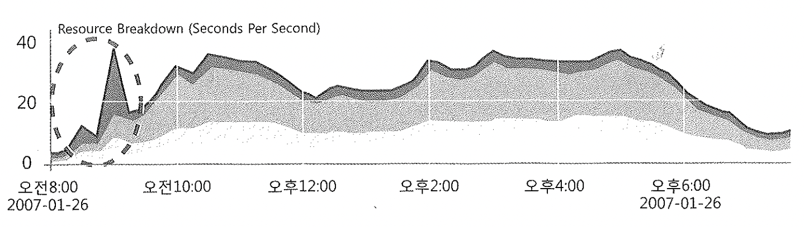

# 09. ASH (Active Session History)

## Ratio 기반 분석 방법론의 한계점

시스템문제 진단 후 원인을 찾고 해결할 때까지 시간이 많이 걸린다. (애기이벤트 기반 분석방법론도 마찬가지)
원인을 빨리 찾을 수 있지만, 어떤 프로그램, 세션에서 발생했는지도 찾아야 하기 때문.

오라클이 제공하는세선레벨 동적성능 뷰는  문제찾기가 어렵다.

SQL트레이스는 상세한 정보를 주지만 부하가 크고파일단위로 정보가 수집되므로 통계적 접근이 어려워 분석완료까지 시간이 오래걸린다.
게다가 수동으로 활성화해야 하므로 문제대응 시점을 놓칠 수 있다.

이를 개선하여 10g부터는 ASH기능이 등장하였다.
별도 서드파티 모니터링도구 없이 세션레벨 실시간 모니터링이가능하여 OWI 활용성을 극대화 해준다.

~~~sql
select *
from v$sgastat
where name = 'ASH buffers';

POOL	     NAME			     BYTES
------------ -------------------------- ----------
shared pool  ASH buffers		   2097152
~~~

## ASH 버퍼 조회

오라클은 Active 세션정보를 1초마다 샘플링해서 ASH 버퍼에 저장한다.

SGA Shared Pool에서 CPU당 2MB 버퍼를 할당받아 세선정보를 기록하며 1시간 혹은 2/3이 찰 때마다 디스크에 기록한다. (AWR에 기록)

`v@active_session_history`뷰를 이용해서 ASH버퍼에 저장된 세션 히스토리정보를 조회할 수 있다.

~~~sql
select
sample_id, sample_time -- [1]
, session_id, session_serial#, user_id, xid -- [2]
, sql_id, sql_child_number, sql_plan_hash_value -- [3]
, session_state -- [4]
, qc_instance_id, qc_session_id -- [5]
, blocking_session, blocking_session_serial#, blocking_session_status -- [6]
, event, event#, seq#, wait_class, wait_time, time_waited -- [7]
, p1text, p1, p2text, p2, p3text, p3 -- [8]
, current_obj#, current_file#, current_block# -- [9]
, program, module, action, client_id -- [10]
from v$active_session_history 
~~~

1. 샘플링이 일어난 시간과 샘플 ID
2. 세션정보, User명, 트랜잭션ID
3. 수행 중 SQL정봅
4. 현재 세션의 상태 정보, 'ON CPU' 또는 'WAITING'
5. 병렬 Slave 세션일 때, 쿼리 코디네이터(QC) 정보를 찾을 수 있게 함
6. 현재 세션의 진행을 막고 있는(블로킹) 세션 정보

   - 현재 Lock을 발생시킨 세션을 빨리 찾아 해소할 수 있게 도와준다.
7. 현재 발생 중인 대기 이벤트 정보
8. 현재 발생중인 대기 이벤트의 파라미터 정보
9. 해당 세션이 현재 참조하고 있는 오브젝트 정보. v$session 뷰에 있는
   row_wait_obj#, row_wait_file#, row_wait_block# 컬럼을 가져온 것임

   ~~~
   현재 발생중인 대기이벤트의 Wait Class가 Application, Concurrency, Cluster, User I/O일 때만 의미있다.
   예를들어 enq:TX - allocate ITL entry (ITL 슬롯부족) 대기이벤트는 Configuration에 속하므로 `v$active_session_history`뷰를 조회할 때 Lock에 걸렸다가 판단해서는 안된다. 이럴 경우는 오브젝트번호가 -1 로 출력되지만 보일수도 있어서 잘못 해석하지 말아라.
   
   아래 예시에서도 블록번호는 -1이지만, 파일번호와 블록번호가 그대로 남아있음을 알 수 있다.
   ~~~
10. 애플리케이션 정보

### 오브젝트번호 -1 예시

~~~sql
column current_obj#   format 99999 heading 'CUR_|OBJ#';
column current_file#  format 999   heading 'CUR_|FIL#';
column current_block# format 999   heading 'CUR_|BLK#';

select sid, serial# from v$session
where username = 'SYS';

select 
to_char(sample_time, 'hh24:mi:ss') sample_tm
, session_state
, event, wait_class, current_obj#, current_file#, current_block#
from v$active_session_history
where session_id = &sid
and session_serial# = &serial
order by sample_time;
~~~

초단위 쓰기가 발생하는 ASH 버퍼를 읽을 때 래치를 사용한다면 경합이 생길 수 있다.
따라서 오라클은 ASH버퍼를 읽는 세션에 대해서는 래치를 요구하지 않으며, 그 때문에 간혹 일관성 없는 잘못된 정보가 나타날 수도 있다.

## AWR & ASH 사례

- 별도의 OWI 기반 모니터링 툴 없이도 분석이 가능함

- 오라클10g 부터는 `v$active_session_history`정보를 AWR 내에 보관하므로 과거에 대한 세션레벨 분석이 가능하다.

  - SGA를 DMA방식으로 엑세스하기 때문에 가능하다.
  - 1/10 만 샘플링해서 저장한다. (문제가 되는 대기이벤트는 일정간격을 두고 지속적으로 발생하기에 문제없음)
  - `Statspack` 는 과거데이터를 파악할 수 없다,

  `v$active_session_history` 조회결과가 없으면 이미 AWR에 쓰인거라 `dba_hist_active_sess_history`뷰를 조회하면 된다.

- 아래 그래프를 토대로 분석, 문제원인, 해결과정을 보자.

1. AWR 뷰를 이용해 하루동안의 이벤트 발생현황을 조회해 본다.
   위 그래프는 `dba_hist_system_event` 결과인데, 0814~0915 구간에서 `enq:TM - contention`이벤트가 다량 발생하였다.
2. `dba_hist_active_sess_history`를 조회해서 해당 이벤트를 많이 대기한 세션을 확인한다.
3. 블로킹 세션 정보를 통해 `dba_hist_active_sess_history`를 다시 조회한다.
   블로킹 세션이 찾아지면 해당 세션이 그 시점에 어떤 작업을 수행 중이었는지 확인한다.
   sql_id를 이용해 그 당시 SQL과 실행계획을 알 수 있다.
   `v$sql`과 `v$sql_plan`까지 AWR에 저장되기 때문이다.
   위 사례는 블로킹 세션이 Append Mode Insert를 수행하면서 Exclusive 모드 TM Lock에 의한 경합이 발생하고 있었다.
4. program, module, actioin, client_id 등 애플리케이션 정보를 이용해 관련 프로그램을 찾아 Append 힌트를 제거한다.
   그 후 다른 트랜잭션과 동시에 DML이 발생할 수 있는 상황에서는 insert문에 Append 힌트를 사용해서는 안된다는 사실을 개발팀에 공지한다.

이처럼 부하를 최소화하면서, 세션 레벨의 상세한 분석이 가능하도록 오라클이 성능 자료를 수집해주므로
이제 AWR과 ASH를 잘 이용하면 전문 성능 관리 툴의 도움 없이도 효과적으로 성능분석을 할 수 있게 되었다.

