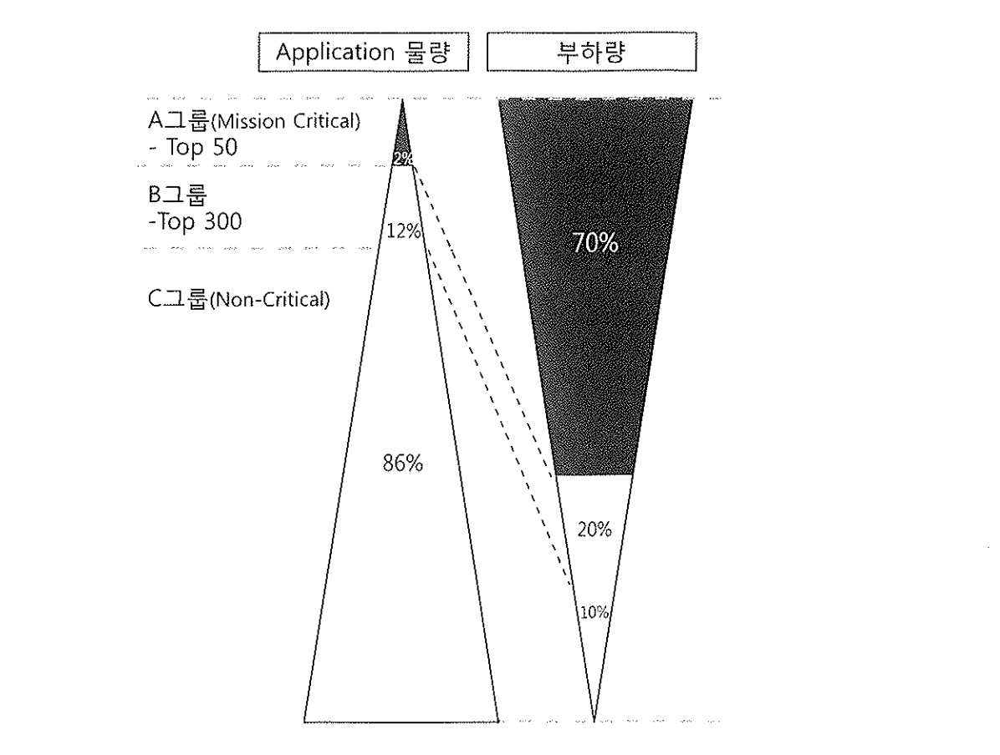
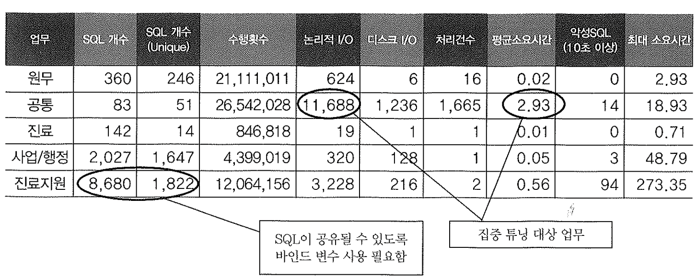
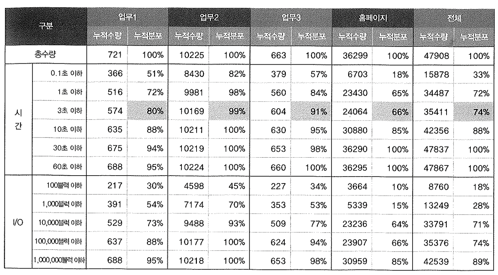

# 10. V$SQL


수만개에 이를 수 있는 쿼리를 모두 튜닝할 수는 없다.

최소인력으로 효율을 극대화 하려면 어떻게 해야 할까?

아래 그림은 모 회사에서 조사한료인데, A그룹이 전체 70% 의 부하를 차지한다.



파레토 최적의 법칙 또는 리처드 코치의 80/20 법칙은 튜닝 대상을 적용하는데 도움을 주는데,

수만개의 SQL이 있더라도 자주쓰는 상위 10%만 튜닝해도 안정화, 고도화를 이룰수 있다.


v$sql은 개별 SQL커서 수행통계 분석용도로도 활용되지만, 튜닝이 필요한 대상을 선정, 선정이후 성능향상도 비교목적에 유용하다.


v$sql은 라이브러리 캐시에 캐싱되어있는 각 Child커서에 대한 수행통계를 보여준다.
v$sqlarea는 Parent커서에대한 수행통계를 나타낸다. (대부분 v$sql 을 group by 한 결과)


v$sql는 쿼리수행마다 갱신되며, 오래걸리면 5초마다 갱신한다.

```sql
select sql_id, child_number, sql_text, sql_fulltext, parsing_schema_name  -----[1]
 , sharable_mem, persistent_mem ,runtime_mem   -----[2]
 , loads, invalidations, parse_calls, executions, fetches, rows_processed -----[3]
 , cpu_time, elapsed_time-----[4]
 , buffer_gets, disk_reads, sorts-----[5]
 , application_wait_time, concurrency_wait_time-----[6]
 , cluster_wait_time, user_io_wait_time-----[6]
 , first_load_time, last_active_time     -----[7]
from v$sql
```

1. 라이브러리 캐시에 적재된 SQL 커서 자체에 대한 정보
2. SQL 커서에 의해 사용되는 메모리 사용
3. 하드파싱 및 무효화 발생횟수, Parse, Execute, Fetch Call 발생 횟수, Execute 또는 Fetch Call 시점에 처리한 로우 건수 등
4. SQL을 수행하면서 사용된CPU time과 소요시간(microsecond)
5. SQL을 수행하면서 발생한 논리적 블럭 읽기와 디스크 읽기, 그리고 소트 발생 횟수
6. SQL 수행 도중 대기 이벤트 때문에 지연이 발생한 시간(microsecond)
7. 커서가 라이브러리 캐시에 처음 적재된 시점, 가장 마지막에 수행된 시점


v$sql에 보이는 통계치들도 다른 동적 성능 뷰처러 누적값이다.

SQL 수행횟수로 나눈 평균값, 즉 SQL 한번 수행당 얼만큼의 일량과 시간을 소비하는지를 계산해야 의미 있는 분석이 가능하다.

~~~sql
select parsing_schema_name 
    , count(*) sql_cnt 
    , count(distinct substr(sql_test, 1, 100)) sql_cnt2 
    , sum(executions) 
    , round(avg(buffer)gets/executions)) bugger_gets 
    , round(avg(disk_read/executions)) disk_reads 
    , round(avg(row_processd/executions)) rows_processed 
    , round(avg(elapsed_time/executions/1000000),2) "ELAPSED TIME(AVG)" 
    , count(case when elapsed_time/executions/1000000 >= 10 then 1 end) "BAD SQL" 
    , round(max(elapsed_time/executions/1000000),2) "ELAPSED_TIME(MAX)" 
from v$sql 
where parsing_schema_name in ('원무', '공통', '진료', '사업/행정', '진료지원') 
    and last_active_time >= to_date('20090315','yyyymmdd') 
group by parsing_schema_name;
~~~



- 세 번째 컬럼 'SQL개수(Unique)'는 SQL 문자열 중 선행 100개 문자가 같으면 동일한 SQL인 것으로 간주하고 집계한 것이다.
- 같은 SQL인데도 바인드 변수를 사용하지 않으면 Literal 상수값 별로 오라클이 다른 sql_id를 부여해 SQL 개수가 무수히 많은 것으로 집계되는 오류를 보완하려는 것이다.
- 프로젝트마다 대개 SQL을 식별할 목적으로 select, insert, update, delete 키워드 바로 뒤에 주석으로 고유한 SQK 식별자를 적어 놓기 때문에 선행 100개 문자가 같으면 동일SQL로 간주하는 데에 큰 무리가 없다.

- '자료지원' 업무에서 라이브러리캐시에 로드된 총 SQL 개수가 8,680개인데, Unique하게는 1,822개이므로 바인드 변수를 사용하지 않아 각각 하드파싱을 발생시키며 캐시에 로드된 SQL 비중이 매우 높은 것을 알 수 있다. SQL이 공유될 수 있도록 바인드 변수를 사용하는 방식으로 프로그램을 수정할 필요가 있다.
- '공통' 업무를 보면, 한번 수행할 때의 평균 논리적 I/O가 11,688개로 다른 업무에 대해 매우 높게 나타나고 있다. 논지적 I/O가 많다 보니 디스크 I/O도 많고 당연히 쿼리 소요시간도 가장 높게 나타나고 있다. 게다가 SQL개수는 가장 적지만 수행 횟수는 가장 많다. 따라서 가장 먼저 시급하게 튜닝해야 할 대상 업무로 판단할 수 있다.




- 3초 이내 수행되는 SQL 비중을 보면, 업무1은 80%, 업무2는 99%, 업무 3은 91%인데 반해, 홈페이지 시스템은 66%로 가장 낮은 것으로 나타났다. 특히, 홈페이지는 인터넷으로 오픈된 시스템이므로 가장 시급하게 튜닝이 필요하다고 판단해 오픈 후 2주간 집중 튜닝을 실시하였다


- v$sql_plan을 통해 실행계획을 확인
- v$sql_plan_statistics를 통해 각 Row Source별 수행 통계를 확인
- v$sql_bind_capture 뷰도 유용한데, 이를 조회하면 전체는 아니더라도 정해진 기간에 한번씩 샘플링한 바인드 변수 값을 확인 할 수 있다. 더 자주 샘플링하도록 하려면 _cursor_bind_capture_interval 파라미터 값을 줄이면 되고, 기본 설정 값은 900초다.
- SQL 커서와 관련된 각종 수행 통계를 주기적으로 AWR에 저장. 아래의 뷰를 통해 조회가능.


```sql
select * from dict 
where table_name like 'DBA_HIST_SQL%'; 

TABLE_NAME                     COMMENTS
------------------------------ ---------------------------------
DBA_HIST_SQLBIND	SQL Bind Information
DBA_HIST_SQLCOMMAND_NAME	Sql command types
DBA_HIST_SQLSTAT	SQL Historical Statistics Information
DBA_HIST_SQLTEXT	SQL Text
DBA_HIST_SQL_BIND_METADATA	SQL Bind Metadata Information
DBA_HIST_SQL_PLAN	SQL Plan Information
DBA_HIST_SQL_SUMMARY	Summary of SQL Statistics
DBA_HIST_SQL_WORKAREA_HSTGRM	SQL Workarea Histogram History
```

스냅샷 시점에 캐시에 남아있던 커서의 수행 통계만 저장된다.

캐시에 남아 있더라도 그 방대한 양의 SQL 수행 통계를 스냅샷 시점별로 모두 저장할 수는 없으므로 아래와 같은 기준에 따라 Top SQL만 수집한다.

- Parse Calls
- Executions
- Buffer Gets
- Disk Reads
- Elapsed Time
- CPU Time
- Wait Time
- Version Count
- Sharable Memory


SQL이라고 명명된 기능으로서, 위 기준에 의해 Top SQL 에 포함되지 않더라도 사용자가 명시적으로 지정한 커서의 수행통계가 AWR에 주기적으로 수집되도록 마크하는 기능이다. (11g)

```sql
- 마크 
begin 
dbms_workload_repository.add_colored_sql(sql_id => '27w835mvfh1ct');
end;
/

- 조회
select * from dba_hist_colored_sql;


3033761339	27w835mvfh1ct	24/03/02


- 삭제
begin
dbms_workload_repository.remove_colored_sql('803b7z0t84sp7')
end;
```

- 이처럼 sql_id에 색깔 표시를 해 두면 오라클이 AWR 정보를 수집할 때마다 Top SQL 선정기준과 상관없이 해당 SQL의 수행 통계를 저장한다. 단, 이 기능을 사용하더라도 스냅샷 시점에 캐시에서 밀려나고 없는 SQL 정보까지 저장할 수는 없다. 아쉬운 것은, Module과 Action 설정 값을 기준으로 색깔 표시하는 기능이 아직 제공되지 않는다는 점이며, 앞으로 추가될 것으로 기대해 본다.
- Colored SQL 목록에서 제거를 수행하더라도 Top SQL 기준에 포함된 SQL은 AWR에 수집된다.
- AWR에 저장된 SQL 실행계획은 다음과 같이 display_awr 프로시저를 통해 쉽게 출력해 볼 수 있다.

```sql
select * from table(dbms_xplan.display_awr('sqlid', NULL, NULL, 'basic rows bytes cost'));
```


