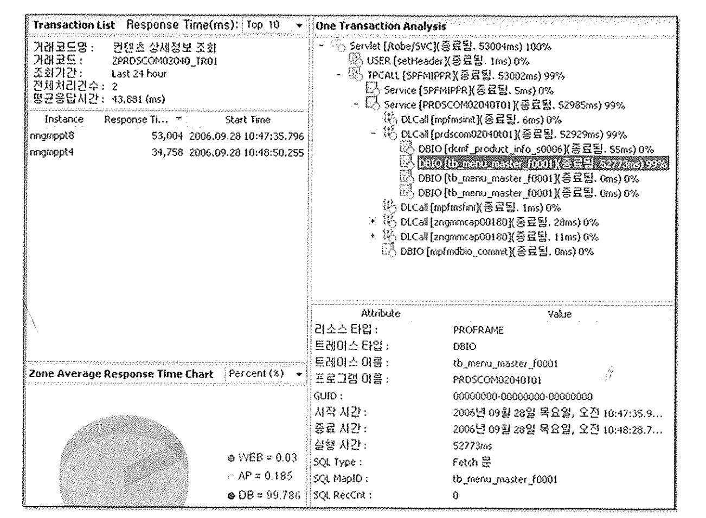

# 11. End To End 성능관리

10절까지 오라클 내부에서 발생하는 일량과 시간, 병목현상 측정을 알아보았다.

Elapsed Time으로 대변되는 Response Time도 DB에 던져진 Call 내에서의 소요시간만을 측정하므로, 사용자가 느끼는 Response Time과는 조금 다르다.

현대 시스템은 점차 n-Tier 환경으로 구축되어가고 있어 DB구간 분석으로는 신속하게 해결이 어려워졌다.
이에 대해 End-To-End 방식의 app성능관리 (APM, Application Performance Management) 툴이 많이 도입되고 있는 추세다.
이를 이용해 Web, App, DB등 각각 관점에서 병목현상을 측정할 수 있다.

### 예시

성능저하요인이 DB라면

오래 걸린 트랜잭션을 확인하고 해당 트랜잭션에서 수행된 서비스드르을 상세분석한다.
서비스 별 수행시간과 서비스 내에서 수행된 SQL의 수행시간, 점유을 등을 보여주어 문제가 되는 SQL을 찾을 수 있다.

수집된 성능자료들이 DB화 되어있어 쿼리를 통해 수행통계를 내고, 집중 튜닝이 필요한 업무영역과 튜닝 대상프로그램을 선정하는데 유용하게 활용할 수 있다.

