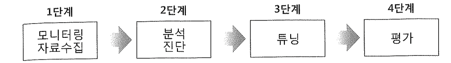
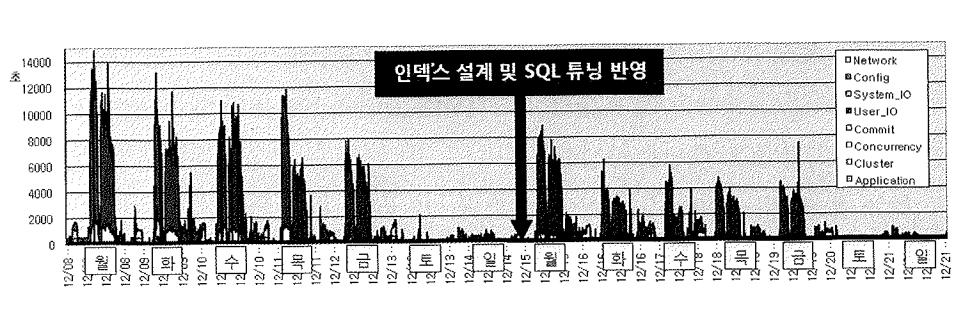
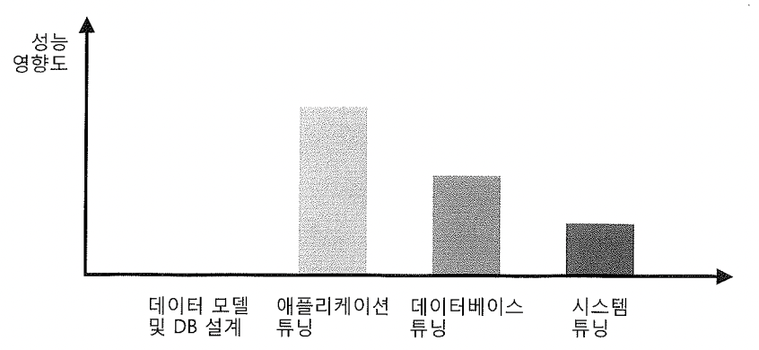
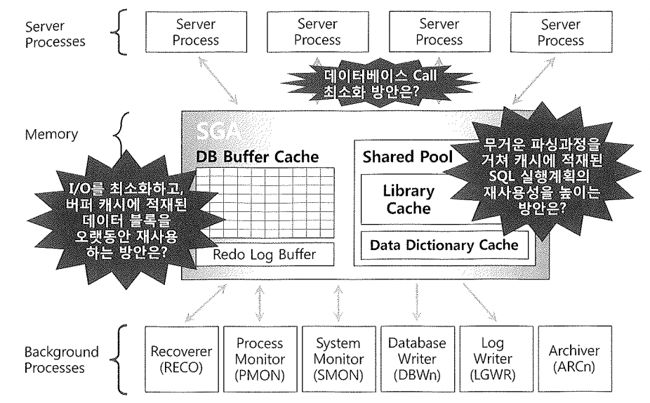

# 12. 데이터베이스 성능고도화 정석 해법

지금까지 내용으로 성능튜닝에 필요한 자료수집, 분석,진단하는 방법에 대한 배경지식을 배웠다.

OWI기반 대기이벤트 분석을 통해 발생원인을 빠르게 찾는 방법도 배웠다.

4단계 평가 역시 OWI를 이용할 수 있는데, AWR에 저장된 성능 통계자료를 정량적으로 분석하여 튜닝전후를 비교할 수 있다.

##### 아래 그림은 인덱스 튜닝 설계 및 SQL튜닝결과를 일요일 야간에 운영서버에 일괄 반영하고 결과 평가를 위해 해당 내용을 도표화 한 것이다.

결국 대부분 성능문제가 애플리케이션 튜닝으로 규결된다. 불필요한 SQL수행, 많은 파싱, 많은 데이터 Fetch, IO문제 등이 문제의 대부분을 차지한다.

이에 대한 튜닝 세가지 핵심요소는 아래와 같다.

- 라이브러리 캐시 최적화
- 데이터베이스 Call최적화 
- I/O효율화 및 버퍼 캐시 최적화 (인덱스 조인원리, 옵티마이저 원리)

물론 가장 큰 성능요소는 DB설계에 있으나 책의 범위에 맞지 않아 위 세가지 관점에서의 튜닝방법을 배울 것이다.

#### 각 요소의 성능영향도 설명

#####  1. 데이터 모델 및 DB 설계

- 업무적 특성을 반영한 정규화된 데이터 모델을 바탕으로 DBMS의 물리적 특성과 성능을 고려한 설계 변경, 그리고 DBMS 요소에 대한 설계를 실시 하는것
- 논리 데이터 모델
  - 물리적 특성을 배제한 업무적특성에 따른 데이터만 반영한 논리 설계 (개녕 모델과, 상세 논리모델로 구분)
- 물리 데이터 모델
  - 물리적 특성과 성능을 고려한 설계 변경, 테이블 정의, 컬럼 정의, pk/fk 정의 등

- DB 설계
  - 파티션 설계, 클러스터 및 IOT구성, 기초 인덱스 설계, 뷰 설계, 시퀀스 설계등

##### 2. 애플리케이션 튜닝

- Lock 경합, 파싱 부하, db call 발생 최소화, 인덱스 설계 조정, SQL 변경을 통한 I/O 효율 향상 튜닝등

##### 3. 데이터베이스 튜닝

- 초기화 파라미터 설정, SGA/PGA 메모리 구성, Redo 파일 구성, 테이블 스페이스, 데이터 파일 구성 전략

##### 4. 시스템 튜닝

- OS레벨에서 CPU와 메모리 구성, I/O 서브 시스템 구성, 네트워크 설정 같은 하드웨어 튜닝

##### DB설계나 시스템 튜닝은 근본적인 처방이 되지 못한다. 결국 애플리케이션에서의 비효율은 시간이 지나면서 결국 무의미해 지기 때문이다.

- 잘못된 데이터 모델은 비효율 적인 액세스 유형을 야기하고 SQL성능 문제해결을 위한 과도한 반정규화등을 행하게 되어결국은 데이터 일관성 및 품질 저하로 연결된다.
- 애플리케이션과 데이터베이스에서는 잘못된 방법으로 처리하고 있지는 않은지 판단하여 발생일량을 최소화 할수 있어야 한다.

##### 데이터 베이스 성능 튜닝의 3대 핵심 요소

- 라이브러리 캐시 최적화
- 데이터베이스 Call 최소화
- I/O 효율화 및 버퍼캐시 최적화

위 그림은 앞으로 4,5,6 장에서 다룰 3가지 튜닝포인트 내용을 그림으로 표현한 것이다.

