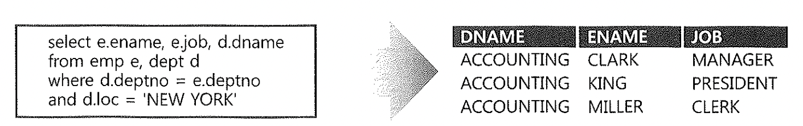
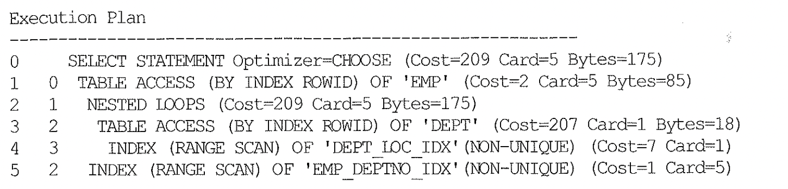
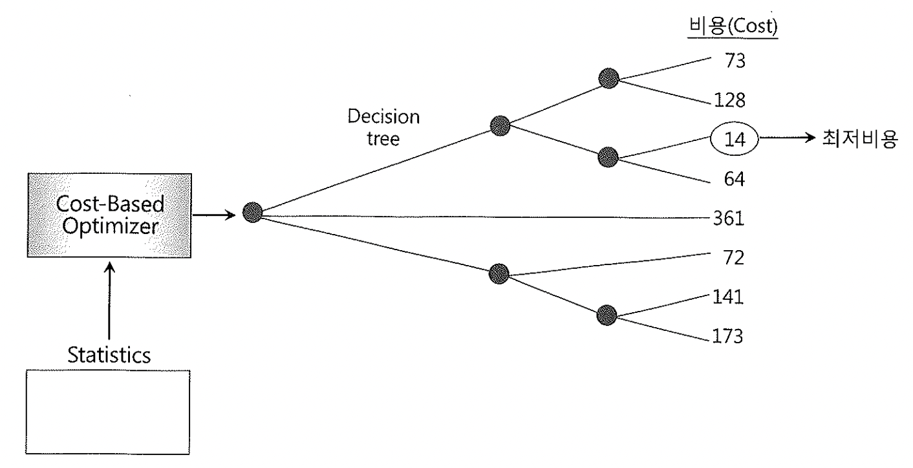

# 01. SQL과 옵티마이저

### SQL ?

SQL(Structured Query Language)을 4세대 언어라고 말한다.
4세대 언어는 Visual Basic 같은 GUI 기반 개발 툴을 말하는데, 버튼을 만들 때 딸깍하면 만들어진다. 이때 내부 처리로직은 개발자가 몰라도 된다.
비슷하게 SQL이라고 하는 구조회된 질의언어를 통해 원하는 결과 집합을 원할 뿐 처리절차를 개발자가 기술하지 않는다는 점에서
4세대 언어라고 부르는 것이다.

4세대 언어가 아닌 파일시스템이나 dBase3+, FoxPro, Clipper 같은 xBase 계열 DB프로그래밍에서는
예를들어 두개 테이블을 Join 한다고 했을때 한쪽 테이블을 먼저 읽고, 결과를 다른 테이블에서 찾는 과정을 코딩해야 했다고 한다.

하지만 4세대 언어 SQL을 사용하면 아래처럼 원하는 결과집합을 옵티마이저가 자동으로 구성해준다.
(결과 집합을 얻기 위한 프로시저는 내부에서 자동으로 생성되기 때문이다.)

즉 옵티마이저는 우리를 대신해 프로그래밍을 해준다.

#### 실행계획

위와 같은 과정을 거쳐 옵티마이저에 의해 생성된 처리절차를 사용자가 확인할 수 있도록 트리구조로 표현한 것이 아래와 같은 실행계획이다.

### SQL 옵티마이저 실행절차

SQL옵티마이저는 최소비용, 경로를 선택해서 가장 효율적인 프로시저를 생성해주는 DBMS 핵심기능이다. 아래는 그 단계를 설명한것이다.

1. 사용자가 던진 쿼리수행을 위해, 후보군이 될만한 실행계획들을 찾아낸다.
2. 데이터 딕셔너리에 미리 수집해놓은 오브젝트 통계 및 시스템 통계정보를 이용해 각 실행계획 비용을 산정.
3. 최소비용을 선택.

##### SQL파싱과 최적화는 누가 하나요?

SQL을 파싱, 최적화, 커서를 열어서 SQL을 실행하며 블록을 읽고, 정렬하고, 결과집합을 만들어 네트워크 전송하는 일련의 작업은 서버 프로세스가 한다.

