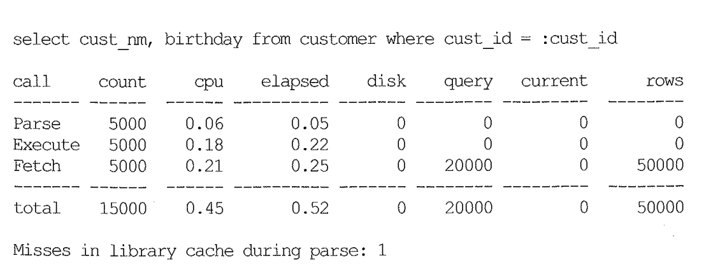

# 02. SQL처리과정

## 1. SQL 처리 과정을 요약

- SQL 문을 실행
- SQL Parsing
- SQL 이 메모리(Libeary cache) 에 있는지 확인
  - --> 있으면 : 바로 실행 (soft parsing)
  - --> 없으면 : 최적화 > Row 소스 생성 > 실행 (hard parsing)

위 그림을 예시로 설명하면
Parse call 횟수가 5000인데, 5000번 실행할 동안 Miss in library cashe 가 1이므로, 처음 1회는 하드파싱을 하고 그 이후는 소프트파싱을 했음을 알 수 있다.

## 2. SQL 실행 절차

### 1) SQL파싱

- SQL문장을 이루는 개별 구성요소를 분석하고 Parsing 하여 Parsing Tree를 만든다.
- Syntax 체크를 한다.
- Parsing Tree가 만들어 지고 Semantic 체크를 통해 존재 하지 않는 오브젝트를 사용했거나 존재하지 않는 컬럼을 참조하는 경우 이 단계에서 에러 메시지를 만나게 된다.
- 문법적으로 완전하고 의미상 오류가 없다면 해싱 알고리즘을 이용해 해당 SQL 커서가 Shared Pool에 캐싱돼 있는지를 확인한다. 이를 위해 먼저 SQL Ascii 텍스트에 대한 숫자 값을 계산하고 이를 다시 해시 값으로 변환한다.
- Shared Pool에서 찾은 SQL문장이 현재 수행하려는 SQL문과 100% 일치하더라도 파싱을 요청한 사용자가 다르거나 옵티마이저 관련 파라미터 설정이 다르다면 새로운 SQL 커서를 생성해야 한다.

### 2) SQL 최적화

- 옵티마이저는 시스템 통계 및 오브젝트 통계 정보를 판단기준으로 삼아 다양한 액세스 경로(Access Path)를 비교하고 그 중 가장 효율적인 실행계획을 선택해주는 DBMS의 핵심 엔진이다.
- 옵티마이저가 최적화를 수행할 때 세부적으로 아래 3개의 서브 엔진을 사용한다.
  - **Query Transformer :** 사용자가 던진 SQL을 그대로 둔 채 최적화하는게 아니라 우선 최적화하기 쉬운 형태로 변환을 시도한다.
  - **Plan Generator :** 하나의 쿼리를 수행하는 데 있어, 후보군이 될만한 실행계획들을 생성해 내는 역할을 한다.
  - **Estimator :** `Query Operation` 각 단계의 선택도(selectivity), 카디널리티(Cardinality), 비용(Cost)를 계산하고, 궁극적으로는 실행계획 전체에 대한 총 비용을 계산해 낸다. 각 단계를 수행하는데 필요한 I/O, CPU, 메모리 사용량 등을 예측하기 위해 데이터베이스 오브젝트 통계정보와 시스템 통계정보를 이용한다.
- `Plan Generator`와 `Estimator`를 수행 시 최적의 실행계획을 선택하기 위해 Query 최적화에 걸리는 시간이 일정 비율을 넘지 않도록 적응적 탐색 전략을 사용(Adaptive Search Strategy)를 사용한다. 두번째는 'Multiple Initial orderings heuristic'으로 조인순서를 무순위로 평가하는게 아니라 최적의 실행계획을 발견할 가능성이 높은 순서대로 비용을 평가하는 방법이다.
  - Adaptive Search Strategy는 1초만에 수행될 수 있는 쿼리를 최적화하기 위해 10초를 소비하는 것은 낭비 이다. 하지만 수십분 내지는 한시간 동안 수행되어야 하는 쿼리를 위해서라면 수초 이상 수분이 걸리더라도 더 나은 실행계획을 찾기 위해 계속적으로 최적화 단게를 수행하는 것은 결코 낭비가 아닐 수 있다. 그러므로 오라클은 쿼리 수행시 예상되는 총 수행시간에 비해 쿼리 최적화에 걸리는 시간이 일정비율을 넘지 않도록 하는 방법이다.
  - Multiple Initial ordering heuristic : 옵티마이져는 탐색도중이더라도 최적이라고 판단되는 실행계획을 발견하면 더 이상 진행하지 않고 멈추게 되는데 그럴 경우 미처 고려하지 않은 실행계획들 중에서 실제로 더 나은 실행계획이 있었을지도 모를 일이다. 그래서 처음 탐색을 시작할 때 임의의 순서로 시작하는 것보다는 heuristic한 (문제해결을 돕는) 방법을 동원해서 거의 최적이거나 최소한 아주 좋은 실행 계획일 것이라고 판단되는 실행계획들 순으로 정렬한 후에 그 순서에 따라 일을 진행하는 방식

### 3) Row-Source Generation

- 옵티망저의 최적화 과정을 거치면 SQL처리과정을 표현한 실행계획이 만들어 진다.
- 이런 실행계획을 실행 가능한 코드 또는 프로시저 형태로 포맷팅하는 작업이 필요하며, 이 역할을 `Row-Source Generator`가 담당 한다. Row-Source는 레코드 집합을 반복 처리하면서 사용자가 요구한 최종 결과집합을 실제적으로 생성하는데 사용되는 제어 구조를 말한다.
