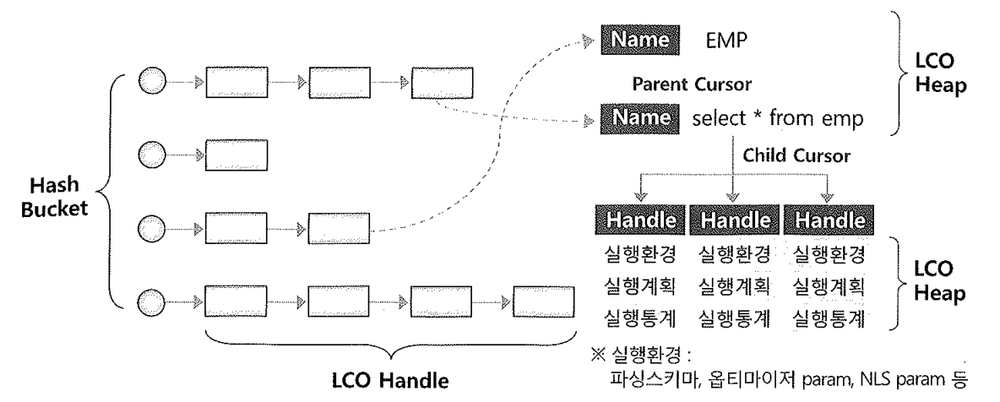

# 03. 라이브러리캐시구조


- Library Cache는 Shared Pool내에 위치하며, SQL 공유 커서 및 Database object에 대한 정보를 관리한다. 
  여기에 저장되는 정보의 단위를 라이브러리 캐시 오브젝트(LCO)라고 부른다.
- SQL 커서(SQL과 Parse Tree, 실행 계획, 이를 실행하는데 필요한 정보를 담은 SQL Area) 및 컴파일을 거친 프로시저, 함수, 패키지, 트리거 등을 담는 PL/SQL Area를 저장
- SQL 커서와 PL/SQL 오브젝트처럼 실행 가능한 오브젝트를 실행가능 LCO 라 부른다.
- 테이블, 인덱스, 클러스터 같은 데이터베이스 오브젝트 정보들도 동등하게 하나의 오브젝트로서 관리되는데, 이들을 지금부터 오브젝트 LCO라 부른다.
- 스키마 오브젝트 정보는 데이터 딕셔너리 캐시에도 캐싱돼 있는데 이를 읽어 라이브러리 캐시에 중복 저장하는 이유는 Library Cache에 스키마 오브젝트 정보를 캐싱하는 것은 LCO간 의존성을 관리하려는 데에 목적이 있다. LCO 각각에는 자신을 참조하는 다른 실행가능 LCO(커서, 함수, 프로시저, 패키지 등) 목록을 갖는다.

```sql
select namespace, gets, pins, reloads, invalidations
from v$librarycache;

NAMESPACE             GETS       PINS    RELOADS INVALIDATIONS
--------------- ---------- ---------- ---------- -------------
SQL AREA           3189614  402276640     179713        103955
TABLE/PROCEDURE     360918  158745828     132155             0
BODY                 39033     404917       1147             0
TRIGGER              19956      54524        175             0
INDEX                49673     413663       4879             0
CLUSTER              13621      40251        315             0
OBJECT                   0          0          0             0
PIPE                     0          0          0             0
JAVA SOURCE              0          0          0             0
JAVA RESOURCE            0          0          0             0
JAVA DATA                0          0          0             0
```

- 라이브러리 캐시에 캥싱되는 정보를 다른 측면에서 두 가지로 나눌 수 있다.
  - 생성 후 Drop 하기 전까지 데이터베이스에 영구적으로 보관되는 오브젝트(Stored Object)정보이고, 테이블, 인덱스, 클러스터, 뷰, 트리거, 패키지, 사용자 정의 함수/프로시저등이 여기에 해당한다.
  - 실행시점에 생성돼서 인스턴스가 떠있는 동안에만 존재하는 일시적인 오브젝트(Transient Object). 커서와 Anonymous PL/SQL문이 대표적인데, 이들은 이름을 따로 지정하지 않으며 문장을 구성하는 전체 문자열 그대로가 이름 역할을 한다.
- Shared Pool도 DB 버퍼 캐시처럼 LRU 알고리즘에 의해 관리되며, 재사용 빈도가 낮은 SQL은 캐시에서 밀어냄으로써 새로운 SQL을 캐싱할 수 있도록 공간을 확보한다.
- Shared Pool에서 특정 오브젝트 정보 또는 SQL 커서를 위한 Free Chunk를 할당 받으려 할 때 필요한 래치가 Shared Pool 래치다. 9i 부터는 Shared pool을 여러 개 Sub Pool로 나누어 관리할 수 있게 되면서 래치도 7개까지 사용할 수 있게 되었다.

```sql
select child#, gets, misses, sleeps, immediate_gets, immediate_misses
from v$latch_children
where name='shared pool'
order by child#;

    CHILD#       GETS     MISSES     SLEEPS IMMEDIATE_GETS IMMEDIATE_MISSES
---------- ---------- ---------- ---------- -------------- ----------------
         1   33837076     383726       3185              0                0
         2        162          0          0              0                0
         3        162          0          0              0                0
         4        162          0          0              0                0
         5        162          0          0              0                0
         6        162          0          0              0                0
         7        162          0          0              0                0
```

- 위에서 보는 것 처럼 사용할 수 있는 래치 개수는 7개 뿐이다. 만약 이 이상의 사용자가 순간적으로 과도한 하드 파싱 부하를 일으킨다면 shared pool래치에 대한 경합 현상이 나타날 수 있다.
- 라이브러리 캐시도 DB 버퍼 캐시처럼 해시구조로 관리된다. 즉, 해시버킷에 LCO 핸들이 체인으로 연결돼 있고, 핸들을 통해 LCO힙을 찾아가는 구조다. DB 버퍼 캐시와 마찬가지로 해시 함수를 통해 리턴된 해시값을 가지고 해시 버킷을 할당한다.



- 오브젝트 LCO인 EMP 테이블 정보와 실행가능한 LCO에 해당하는 SQL 커서가 라이브러리 캐시에 함께 저제돼 있다. Parent 커서 밑에 Child 커서가 연결되는 구조를 갖는다.

- SQL문장이 100% 동일한대도 커서를 공유하지 못하고 커서를 별도로 생성해야 할 때가 있는데, 오라클은 그럴 때 다중 Child 커서를 사용한다.

- DB 버퍼 캐시에서 체인에 연결된 리스트 구조를 보호하기 위해 `cache buffers chains` 래치를 사용하는 것처럼 라이브러리 캐시 체인을 탐색하고 변경하려면 먼저 library cache 래치를 획득해야 한다. 이에 대한 경합이 발생할 때 `latch:library cache` 대기 이벤트가 발생한다.

- DB 버퍼 캐시에서 버퍼 자체를 보호하려고 버퍼 Lock을 사용한 것처럼 LCO를 보호하려고 오라클은 라이브버리 캐시 Lock과 라이브러리 캐시 Pin을 사용한다.

- LCO에 접근 할 때는 먼저 핸들에 대한 Lock을 획득하고 나서 LCO의 실제 내용이 단긴 힙에서 정보를 읽거나 변경할 때는 Pin을 걸어 두어야 한다. LCO를 읽고, 쓰고, 실행하는 동안 다른 프로세스에 의해 정보가 변경되거나 캐시에서 밀려나는 것을 방지 한다.

- Shared Pool 래치와 library cach 래치 경합은 소프트/하드 파싱을 동시에 심하게 일으킬 때 발생하고, library cache lock과 library cache pin 대기 이벤트는 주로 SQL 수행 도중 DDL을 날릴 때 발생한다. 트랜잭션이 활발한 주간에 DDL문을 날려 데이터베이스 오브젝트 정의를 변경하면 라이브러리 캐시에 심한 부하를 유발하게 되므로 주의해야 한다.

  


#### 라이브러리 캐시 최적화를 위한 튜닝 기법 3가지

- 커서를 공유할 수 있는 형태로 SQL을 작성한다. 특히 바인드 변수를 사용해 같은 형태의 SQL에 대한 반복적인 하드파싱이 일어나지 않도록 해야 한다.
- 세션 커서 캐싱 기능을 이용해 라이브러리 캐시에서 SQL 찾는 비용을 줄인다.
- 어플리케이션 커서 캐싱을 이용해 Parse Call 발생량을 줄인다.

다음 절에서 위 세가지 기법에 대해 설명한다.

