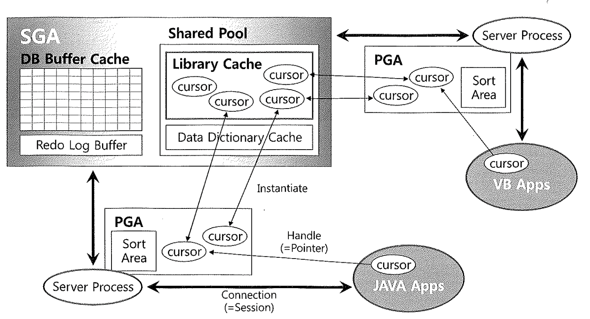

# 04. 커서공유


## 커서 ?

커서(Cursor)는 상황에 따라 여러 가지 의미로 사용되고 있으며 크게 아래의 3가지 의미를 말함

- 공유 커서(shared cursor)
- 세션 커서(session cursor)
- 애플리케이션 커서(application cursor)




### 1) 공유 커서(shared cursor)

- JAVA, VB, Pro*C, PL/SQL등에서 SQL을 수행하면 Server Process는 해당 SQL이 Library Cache에 공유되어
  있는지를 먼저 확인하고 없으면 최적화를 통한 실행계획을 생성, 존재하면 Library Cache에 공유되어
  있는 Cursor를 재활용하는데 이 때 Cursor를 공유 커서(shared cursor)라 부름


### 2) 세션 커서(session cursor)


- Library Cache에 공유되어 있는 커서를 실행할때는 PGA 영역에 'Private SQL Area' 메모리 영역을 할당하며
  이는 'Persisten Area', 'Runtime Area'로 나뉜다.
- Persisten Area : 바인드 변수 등을 저장함. 실행이 종료된 후 커서가 닫힐 때 해제됨
- Runtime Area : SELECT문은 모든 레코드를 Fetch 완료하거나 실행을 취소할 때 해제되지만
  Insert, Update, Delete는 실행이 종료됨가 동시에 해제됨

- 이 때, 'Shared SQL Area(Library Cache)'를 읽어 커서를 실행하는데 필요한 정보들을 Private SQL Area에 담고,
  shared cursor를 가리키는 포인터를 유지하며, 커서의 상태(open, bound, execute, close 등) 정보도 관리함
- 이런 과정들을 "커서를 오픈한다."라고 함
- 이를 JAVA의 Class와 비교한다면 'Shared SQL Area(Library Cache)'는 Class이고 'Private SQL Area'는
  Class를 이용한 객체(Object)이다.


### 3) 애플리케이션 커서(application cursor)

- PGA에 있는 커서를 핸들링하려면 JAVA, VB, Pro*C, PL/SQL 같은 클라이언트 애플리케이션에도 리소스를 할당해야
  하는데, 이 또한 커서라는 용어를 사용함


## 2. 커서 공유

- 오라클에서 "커서를 공유한다."라고 함은, 라이브러리 캐시의 공유 커서를 말함.
- 라이브버리 캐시에 공유돼 있는 커서의 수행 통계를 v$sql을 통해 조회해 볼 수 있음.

```sql
-- 1. 오라클 버전 확인
SELECT *
FROM   V$VERSION
;

BANNER
-------------------------------------------------------------------------
Oracle Database 10g Enterprise Edition Release 10.2.0.3.0 - 64bit
PL/SQL Release 10.2.0.3.0 - Production

-- 2. 테이블 생성
DROP TABLE EMP;

CREATE TABLE EMP (EMPNO NUMBER(4) NOT NULL,
                  ENAME VARCHAR2(10),
                  JOB VARCHAR2(9),
                  MGR NUMBER(4),
                  HIREDATE DATE,
                  SAL NUMBER(7, 2),
                  COMM NUMBER(7, 2),
                  DEPTNO NUMBER(2));

INSERT INTO EMP VALUES (7788, 'SCOTT',  'ANALYST', 7566, TO_DATE('09-DEC-1982', 'DD-MON-YYYY'), 3000, NULL, 20);

COMMIT;

-- 3. 라이브러리 캐시 비움
ALTER SYSTEM FLUSH SHARED_POOL;

-- 4. 1회 조회
SELECT /* CURSOR_TEST */
       EMPNO,
       ENAME,
       JOB,
       SAL,
       DEPTNO
FROM   EMP
WHERE  EMPNO = 7788
;


-- 5. V$SQL 조회
SELECT SQL_ID,
       PARSE_CALLS,
       LOADS,
       EXECUTIONS,
       INVALIDATIONS,
       DECODE(SIGN(INVALIDATIONS), 1, (LOADS - INVALIDATIONS), 0) RELOADS
FROM   V$SQL
WHERE  SQL_TEXT LIKE '%CURSOR_TEST%'
AND    SQL_TEXT NOT LIKE '%V$SQL%'
;


-- 6. 2회 조회
SELECT /* CURSOR_TEST */
       EMPNO,
       ENAME,
       JOB,
       SAL,
       DEPTNO
FROM   EMP
WHERE  EMPNO = 7788
;


-- 7. 3회 조회
SELECT /* CURSOR_TEST */
       EMPNO,
       ENAME,
       JOB,
       SAL,
       DEPTNO
FROM   EMP
WHERE  EMPNO = 7788
;


-- 8. V$SQL 조회
SELECT SQL_ID,
       PARSE_CALLS,
       LOADS,
       EXECUTIONS,
       INVALIDATIONS,
       DECODE(SIGN(INVALIDATIONS), 1, (LOADS - INVALIDATIONS), 0) RELOADS
FROM   V$SQL
WHERE  SQL_TEXT LIKE '%CURSOR_TEST%'
AND    SQL_TEXT NOT LIKE '%V$SQL%'
;

```

| PARSE_CALLS   | 라이브러리 캐시에서 SQL 커서를 찾으려는 요청 횟수            |
| ------------- | ------------------------------------------------------------ |
| LOADS         | 하드파싱을 거친 SQL 실행계획을 라이브러리 캐시에 적재한 횟수 |
| EXECUTIONS    | SQL을 수행한 횟수                                            |
| INVALIDATIONS | 커서가 무효화된 횟수. 커서가 참조하고 있는 오브젝트에 중요한 변화가 일어났음을 의미함. |

- 위의 결과는 SHARED Pool을 모두 비우고 테스트를 시작했으므로 SQL을 첫 번째 수행할 때 하드파싱이 일어난 것이며,
  공유된 하나의 커서를 세번 재사용했음을 알 수 있다.

- 지금까지는 같은 세션에서 커서 공유 테스트를 해 보았고, 다른 세션에서도 공유가 되는지 테스트를 해봄

```sql
-- 1. 새로 연결
conn user/password@instance


-- 2. 4회 조회
SELECT /* CURSOR_TEST */
       EMPNO,
       ENAME,
       JOB,
       SAL,
       DEPTNO
FROM   EMP
WHERE  EMPNO = 7788
;

-- 3. V$SQL 조회
SELECT SQL_ID,
       PARSE_CALLS,
       LOADS,
       EXECUTIONS,
       INVALIDATIONS,
       DECODE(SIGN(INVALIDATIONS), 1, (LOADS - INVALIDATIONS), 0) RELOADS
FROM   V$SQL
WHERE  SQL_TEXT LIKE '%CURSOR_TEST%'
AND    SQL_TEXT NOT LIKE '%V$SQL%'
;
```

- 이렇게 다른 세션에서도 커서를 공유할 수 있지만 아래의 이유로 커서 공유를 할 수 없을 수 있다.
  - 커서가 참조하고 있던 오브젝트에 컬럼이 추가/삭제되는 경우
  - 커서가 참조하고 있던 오브젝트에 새로운 인덱스가 만들어지는 경우
  - 커서가 참조하고 있던 오브젝트의 통계를 새로 수집하는 경우

- 통계정보 생성 이후 커서 공유 테스트

```sql
-- 1. 통계정보 생성
BEGIN
    DBMS_STATS.GATHER_TABLE_STATS(USER,
                                  'EMP',
                                  CASCADE => TRUE,
                                  NO_INVALIDATE => FALSE
                                  );
END;
/


-- 2. 5회 조회
SELECT /* CURSOR_TEST */
       EMPNO,
       ENAME,
       JOB,
       SAL,
       DEPTNO
FROM   EMP
WHERE  EMPNO = 7788
;


-- 3. V$SQL 조회
SELECT SQL_ID,
       PARSE_CALLS,
       LOADS,
       EXECUTIONS,
       INVALIDATIONS,
       DECODE(SIGN(INVALIDATIONS), 1, (LOADS - INVALIDATIONS), 0) RELOADS
FROM   V$SQL
WHERE  SQL_TEXT LIKE '%CURSOR_TEST%'
AND    SQL_TEXT NOT LIKE '%V$SQL%'
;

```

- 커서가 공유되려면 커서를 식별하는 키 값이 같아야 되는데, 이 식별자는 'SQL 문장'임(V$SQL.SQL_FULLTEXT)


## 3. Child 커서를 공유하지 못하는 경우

- SQL 문장이 100% 동일한데도 SQL 커서를 공유하지 못하고 별도의 SQL 커서를 생성해야 할 때가 있음
  만약 EMP 테이블이 SCOTT과 HR 스키마에 각각 생성되어 있다면 SCOTT과 HR로 로긴할 때 다른 테이블을
  액세스해야 하고 실행계획도 달라져야 하며 이 때, Child Cursor를 생성함
- 영구적으로 보관되는 Stored Object(테이블, 인덱스, 함수, 프로시저, 패키지 등)는 이름으로 식별이
  가능하므로 Child 오브젝트가 필요없지만, SQL 커서는 Transient Object는 전체 문자열이 LCO를
  식별하는 식별자이므로 이에 따라 Child 커서가 생성될 수 있다.
- V$SQLAREA는 Parent 커서 정보를 보여주고, V$SQL은 Child 커서를 보여준다.
  (V$SQLAREA는 V$SQL을 GROUP BY 한 결과임)
- 아래는 옵티마이저 모드를 변경하여 테스트 한 결과임

```sql
-- 1. 옵티마이저 모드 ALL_ROWS 활성화
ALTER SESSION SET OPTIMIZER_MODE='ALL_ROWS';

-- 2. EMP 테이블 조회
SELECT * FROM EMP;

-- 3. 옵티마이저 모드 FIRST_ROWS 활성화
ALTER SESSION SET OPTIMIZER_MODE='FIRST_ROWS';

-- 4. EMP 테이블 조회
SELECT * FROM EMP;


-- 5. V$SQL 조회
SELECT SQL_ID,
       CHILD_NUMBER,
       OPTIMIZER_MODE,
       ADDRESS,
       HASH_VALUE,
       PARSING_USER_ID
FROM   V$SQL
WHERE  SQL_TEXT LIKE '%SELECT * FROM EMP%'
AND    SQL_TEXT NOT LIKE '%V$SQL%'
;


-- 6. V$SQLAREA 조회
SELECT SQL_ID,
       VERSION_COUNT,
       OPTIMIZER_MODE,
       ADDRESS,
       HASH_VALUE
FROM   V$SQLAREA
WHERE  SQL_TEXT LIKE '%SELECT * FROM EMP%'
AND    SQL_TEXT NOT LIKE '%V$SQL%'
;

```

- SQL 하나당 여러 개의 Child 커서를 갖는 것은 바람직한 현상은 아님.
  VERSION_COUNT 수치가 높은 SQL일수록 커서를 탐색하는 데 더 많은 시간을 소비하므로 라이브러리 캐시 래치에
  대한 경합 발생 가능성을 증가시킴.

- 하나의 SQL 문장에 여러 개 Child 커서를 갖게 되는 이유
  - SQL에서 참조하는 오브젝트명이 같지만 SQL을 실행한 사용자에 따라 다른 오브젝트를 가리킬 때
  - 참조 오브젝트가 변경돼 커서가 무효화되면 이후 그 커서를 처음 사용하려는 세션에 의해 다시
    하드파싱돼야 하는데, 특정 세션이 아직 기존 커서를 사용중(pin)일 때
  - 옵티마이저 모드를 비롯해 옵티마이저 관련 파라미터가 다를 때
  - 입력된 바인드 값의 길이가 크게 다를 ?
  - NLS 파라미터를 다르게 설정했을 때
  - SQL 트레이스를 활성화했을 때

- 아래 테스트는 입력된 바인드 값이 32, 128, 2000 바이트를 넘을 때마다 새로운 Child 커서가 생성됨을 보여줌

```sql
-- 1. 테이블 생성
CREATE TABLE T(C VARCHAR2(4000));

-- 2. 라이브러리 캐시 비움
ALTER SYSTEM FLUSH SHARED_POOL;

-- 3. BYTE 생성 이미지
WITH TAB AS (SELECT LPAD('A', LEVEL, '0') VAL
             FROM   DUAL
             CONNECT BY LEVEL <= 4000)
SELECT VAL,
       LENGTHB(VAL) BITE
FROM   TAB
;


-- 4. PL/SQL 스크립트
DECLARE
    l_cnt            NUMBER;
    l_child_cnt      NUMBER;
    l_prev_child_cnt NUMBER;
    l_bind_value     VARCHAR2(4000);
    l_sql_id         VARCHAR2(13);
BEGIN
    l_prev_child_cnt := 0;

    FOR c IN 1..4000 LOOP
        l_bind_value := LPAD('A', c, '0');

        SELECT COUNT(*)
        INTO   l_cnt
        FROM   T
        WHERE  C = l_bind_value;

        -- 맨 처음에만 sql_id를 찾아 출력
        IF c = 1 THEN
            SELECT PREV_SQL_ID
            INTO   l_sql_id
            FROM   V$SESSION
            WHERE  SID = USERENV('SID')
            AND    USERNAME IS NOT NULL
            AND    PREV_HASH_VALUE <> 0;

            DBMS_OUTPUT.PUT_LINE('SQL_ID --> ' || l_sql_id);
        END IF;

        SELECT COUNT(*)
        INTO   l_child_cnt
        FROM   V$SQL
        WHERE  SQL_ID = l_sql_id;

        IF l_prev_child_cnt < l_child_cnt THEN -- 새 Child 커서가 생길 때마다
            DBMS_OUTPUT.PUT_LINE(c);

            l_prev_child_cnt := l_child_cnt;
        END IF;
    END LOOP;
END;
/


-- 5. V$SQL_SHARED_CURSOR 조회
SELECT CHILD_NUMBER,
       BIND_MISMATCH
FROM   V$SQL_SHARED_CURSOR
WHERE  SQL_ID = 'f6qwn8zavty07'
ORDER  BY CHILD_NUMBER
;

```


## 4. Parent 커서를 공유하지 못하는 경우

- 이번에는 의미적으로 같고 실행환경이 같음에도 불구하고 커서를 공유하지 못해 Parant 커서 자체가
  여러 개 생성되는 경우임

##### 1) 공백문자 또는 줄바꿈

```sql
SELECT * FROM CUSTOMER;
SELECT * FROM CUSTOMER;
```

##### 2) 대소문자 구분

```sql
SELECT * FROM CUSTOMER;
SELECT * FROM Customer;
```

##### 3) 테이블 Owner 명시

```sql
SELECT * FROM CUSTOMER;
SELECT * FROM HR.CUSTOMER;
```

##### 4) 주석(Comment)

```sql
SELECT * FROM CUSTOMER;
SELECT /* 주석문 */ * FROM CUSTOMER;
```

##### 5) 옵티마이저 힌트 사용

```sql
SELECT * FROM CUSTOMER;
SELECT /*+ ALL_ROWS */ * FROM CUSTOMER;
```

##### 6) 조건절 비교 값

```sql
SELECT * FROM CUSTOMER WHERE CUST_ID = '0000001';
SELECT * FROM CUSTOMER WHERE CUST_ID = '0000002';
```

- 이 중 가장 라이브러리 캐시 효율과 직접적으로 관련된 예는 6)번 예제임
- 이와 같이 조건절에 바인드 변수를 사용하지 않고 서로 다른 Literal 값으로 문자열을 사용하게 되면
  이는 시스템을 장애 상황으로 몰고 갈 수 있다.