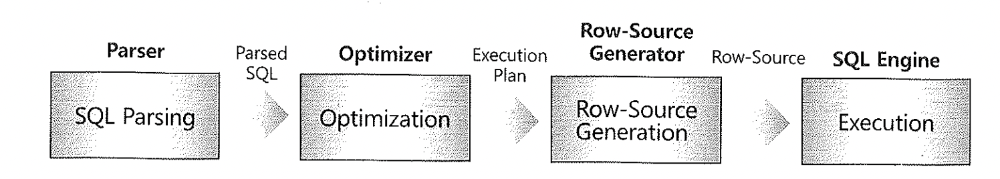
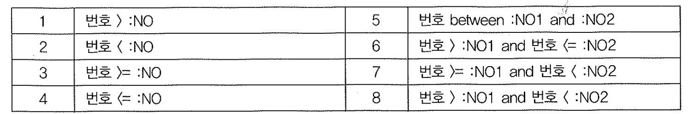
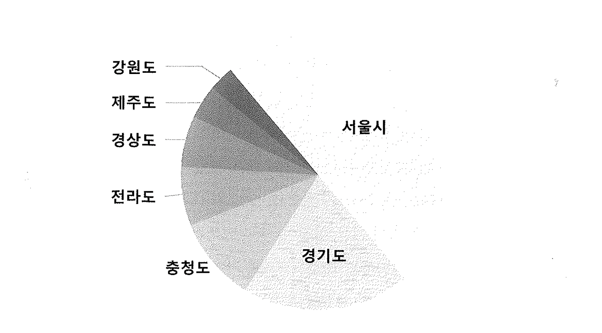

# 06. 바인드변수의부장용과해법




- 바인드 변수를 사용하면 최초 수행할 때 최적화를 거친 실행계획을 캐시에 적재하고,
  실행시점에는 그것을 그대로 가져와 값을 다르게 바인딩하면서 반복 재사용하게 됨
  이는 **변수를 바인딩하는 시점이(최적화 시점보다 나중인) 실행시점이라는 사실에 주목할 필요가**
  **있으며,** 이를 해석하면 바인드 변수를 사용함으로 인해 최적의 실행계획을 만드는 것은 한계가
  있다는 것을 알 수 있다.
- 다르게 해석한다면 바인드 변수를 사용함으로 인해 항상 고정적인 PLAN을 보장받을 수 있으며
  Literal을 사용함으로 인해 실행계획이 유동적으로 변경되는것을 막는 혜택 또한 볼 수 있다.


#### 조건 (범위) 에 대한 성능

옵티마이저는 바인드변수를 이용할 때 평균분포를 이용해서 실행계획을 생성하는데,
실제 분포는 달라서 성능에 영향을 줄 수 있다.




~~~
카디널리티 = 선택도 + 전체 레코드 수
~~~


- 바인드 변수는 정해진 계산식으로 비용을 계산.
- 파티션테이블을 쿼리할 땐 파티션 레벨 통계정보를 이용하지못함.
- 파티션보다 부정확한 테이블 레벨 통계를 이용해 악성 실행계획을 수립,

```sql
drop table t;

create table t as
select rownum no from dual connect by level <= 1000;

테이블이 생성되었습니다.

analyze table t compute statistics for table for all columns;

테이블이 분석되었습니다.

explain plan for
select * from t where no <= :NO;

해석되었습니다.

select * from table
(dbms_xplan.display(null,null,'basic rows'));

------------------------------------------
| Id  | Operation         | Name | Rows  |
------------------------------------------
|   0 | SELECT STATEMENT  |      |    50 |
|   1 |  TABLE ACCESS FULL| T    |    50 |
------------------------------------------

explain plan for
select * from t where no between :no1 and :no2;

해석되었습니다.


select * from table
(dbms_xplan.display(null,null,'basic rows'));

-------------------------------------------
| Id  | Operation          | Name | Rows  |
-------------------------------------------
|   0 | SELECT STATEMENT   |      |     3 |
|   1 |  FILTER            |      |       |
|   2 |   TABLE ACCESS FULL| T    |     3 |
-------------------------------------------

explain plan for
select * from t where no <= 100;

해석되었습니다.


-상수 조건식 ( no <=100, no between 500 and 600)

SQL> select * from table

select * from table
(dbms_xplan.display(null,null,'basic rows'));

------------------------------------------
| Id  | Operation         | Name | Rows  |
------------------------------------------
|   0 | SELECT STATEMENT  |      |    99 |
|   1 |  TABLE ACCESS FULL| T    |    99 |
------------------------------------------

SQL> explain plan for
  2  select * from t where no between 500 and 600;

해석되었습니다.

select * from table
(dbms_xplan.display(null,null,'basic rows'));

------------------------------------------
| Id  | Operation         | Name | Rows  |
------------------------------------------
|   0 | SELECT STATEMENT  |      |    99 |
|   1 |  TABLE ACCESS FULL| T    |    99 |
------------------------------------------

```


## 1. 바인드 변수 Peeking

- 바인드 변수의 부작용을 극복하려고 오라클은 9i부터 바인드 변수 Peeking 기능을 도입함
- 'Peeking'이란 바인드 변수를 가진 CURSOR를 최초 수행할 때 해당 바인드 변수의 Literal 값을 한번
  실행계획을 작성한 뒤 해당 CURSOR가 재사용될 때 이전에 살펴본 Literal 값을 참조하여 실행계획을 작성하는 방식
- 이 방식의 문제는 분포도가 심하게 차이가 나는 경우(예를들어 A=90%, B=9%, C=1%) 최초 수행시 값이 A라면
  FULL SCAN이 좋겠지만, 그 이후 C가 들어옴에도 불구하고 최초 수행됐던 A를 참조하여 계속 FULL SCAN을 하는 단점이 있다.
- 더욱 큰 문제는 10g부터 DBMS_STAT 기본 설정이 히스토그램을 생성할지 여부를 오라클이 판단하게 되어
  이에 대한 통제를 하지 않게 되면 9i보다 더욱 많은 히스토그램이 생성되게 되고 이로 인해 바인드 Peeking에 의한
  폐해가 더욱 커지게 된다.
- 이로 인해 대부분의 사이트에서는 이 Peeking 기능을 FALSE로 설정하고 사용함
- 실제 11g에서는 기본 TRUE로 되어있었다.

```sql
SELECT A.KSPPINM  NAME,
       B.KSPPSTVL VALUE,
       B.KSPPSTDF DEF_YN,
       A.KSPPDESC DESCRIPTION
FROM   X$KSPPI  A,
       X$KSPPSV B
WHERE  A.INDX = B.INDX
AND    LOWER(A.KSPPINM) LIKE '%' || TRIM(LOWER('_optim_peek_user_binds')) || '%'
ORDER  BY 1
;

NAME                   VALUE DEF_YN DESCRIPTION
---------------------- ----- ------ ------------------------------
_optim_peek_user_binds TRUE TRUE  enable peeking of user binds
```


~~~sql
alter system set "_optim_peek_user_binds" = FALSE;
~~~


## 2. 적응적 커서 공유 (Adaptive Cursor Sharing)

- 오라클에서 10g Peeking을 개선한 11g 기능이다.
- 입력된 바인드 변수 값의 분포에 따라 다른 실행계획이 사용되도록 한다.


##### 적응적 커서 공유 수행 통계 뷰

- v$sql_cs_statistics
- v$sql_cs_histogram
- v$sql_cs_selectivity


#####  적응적 커서 공유

- 이 기능을 작동하려면 기본적으로 조건절 컬럼에 히스토그램이 생성돼 있어야 한다.
- 그 상타에서, 옵티마이저가 바인드 변수 값에 따라 실행계획을 달리 가져갈 필요가있다고 판단되는 SQL 커서에 대해서 이 기능을 활성화된다.
- 그런 커서를 'Bind Sensitive 커서' 라고 부르며, v$sql을 조회해 보면 is_bind_sensitive 컬럼이 'Y' 로 표시돼 있다.
- 이것은 아직 바인드 값에 따라 실행 계획이 바뀌지 않는다. 그냥 마킹 했다고 보면된다.
- 그러면 오라클은 이커서에 대해 내부적으로 별도의 히스토그램과 수행 통계를 관리하며, 특정 값으로 실행 했을 때
- 이전에 비해 많은 일량을 처리 한것으로 판단 되는 순간 해당 커서를 Bind Aware 모드로 전환한다.
- 이때부터 기존 커서는 사용이 중지 되고, 새로운 커서가 생성되는 것이다.
- 커서는 값별로 생성되지않고 선택도가 비슷한 것 끼리 커서를 공유하는 방식이다.

###### 



1. 일단 처음에 실행되는 쿼리에서 분포도가 좋은 서울시로 조회하여 Fuul Scan하는 실행계획을 수립힌다.(어떠한값이 들어와도)
2. 처음에 입력되었던 서울시가 아니라 제주도로 입력되면 컬럼히스토그램을 확인후 새로운 실행계획을 만든다. 이때 Bind Aware모드로 전환.
3. 서울시와 비슷한 분포도를 가진 값이 입력되면 비슷한 서울시의 커서를 사용한다. 서울시를 입력하면 기존(실행계획)을 버리고 새로운 실행계획을 만든다. (v$sql 에서 is_sharedable 컬럼이 N으로 설정되고, 라이브러리 캐시에 공간이 필요할 때는 가장 먼저 밀려남)
4. 제주도와 비슷한 분포도를 가진 값이 입력되면 비슷한 강원도의 커서를 사용한다.


- 단점 - 기존 커서 실행계획을 실행해 보고 결과가 안좋으면 그 다음부터 Bind Aware 모드로 변경된다.
- 말그대로 옵티마이저가 스스로 판단하는 자동시스템이지만, 문제가될여지는 충분하다.


## 3. 입력 값에 따라 SQL 분리

- 바인드 변수는 Literal 값처럼 Cardinarity를 옵티마이저가 정확히 구할 수 없으므로 값의 분포도에 따라
  최적의 실행계획을 만들기가 힘들다.
- 이를 해결하기 위해 값의 분포도를 미리 알고 있다면 해당 값에 따라 SQL을 분기하여 최적의 실행계획을 유도할 수 있음
- 아래는 분포도가 큰 '서울시', '경기도' 값은 FULL SCAN, 분포도가 작은 다른 지역은 INDEX RANGE SCAN을 UNION ALL을
  사용하여 유도한 내용


#####  sql을 분리하기위해 union all 을 사용하여 생긴문제

1. 라이브러리 캐쉬 효율 하락
2. Parse, Execute 단계의 CPU 사용률 을 높아져서 시스템부하
3. 네트워크를 통한 메시지 전송량도 증가

```sql
SELECT /*+ FULL(a) */ *
  FROM 아파트매물 a
 WHERE :CITY IN ('서울시', '경기도')
   AND 도시 = :CITY
 UNION ALL
SELECT /*+ INDEX(a idx01) */ *
  FROM 아파트매물 a
 WHERE :CITY NOT IN ('서울시', '경기도')
   AND 도시 = :CITY;
```

위 쿼리보단 아래처럼 분기처리하는 게 낫다.

```sql
IF :CITY IN ('서울시', '경기도') THEN
  SELECT /*+ FULL(a) */ *
    FROM 아파트매물 a
   WHERE 도시 = :CITY;
ELSE
  SELECT /*+ INDEX(a idx01) */ *
    FROM 아파트매물 a
   WHERE 도시 = :CITY;
END IF;
```


## 4. 예외적으로, Literal 상수값 사용

- Literal 값보다 바인드 변수를 사용하는 것이 대부분 CURSOR 재활용 측면에서 좋긴 하지만 일부 측면에서는
  Literal로 사용하는 것이 더 좋은 경우가 있다.
  이는 특정 컬럼의 값 종류가 얼마 없는 경우인데, 이 경우에는 하드파싱의 부하가 미미하게 되며 옵티마이저가
  Literal 값을 미리 알고 있기 때문에 더 좋은 실행계획을 생성할 수 있다.
  - OLAP 등 배치에서의 하드파싱은 전체 처리시간에 비해 미미할 수 있다.
  - OLTP라도 입력경우가 매우 적어 라이브러리 캐시 부하 가능성이 없다면 사용해도 좋다.
- 어디까지나 특별한 경우에 잘 활용하여 사용해야 한다는걸 명심해야 함.


