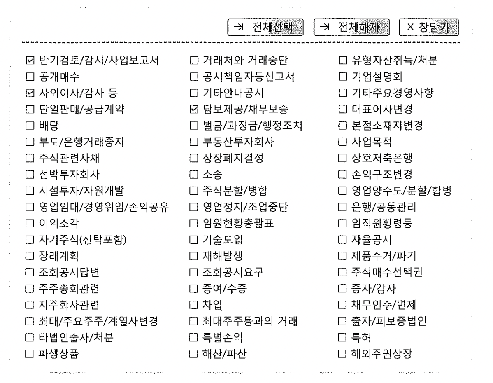
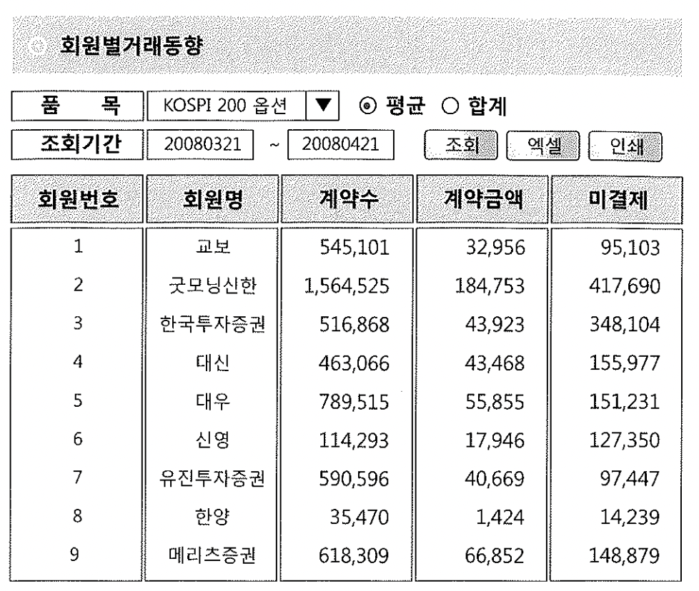
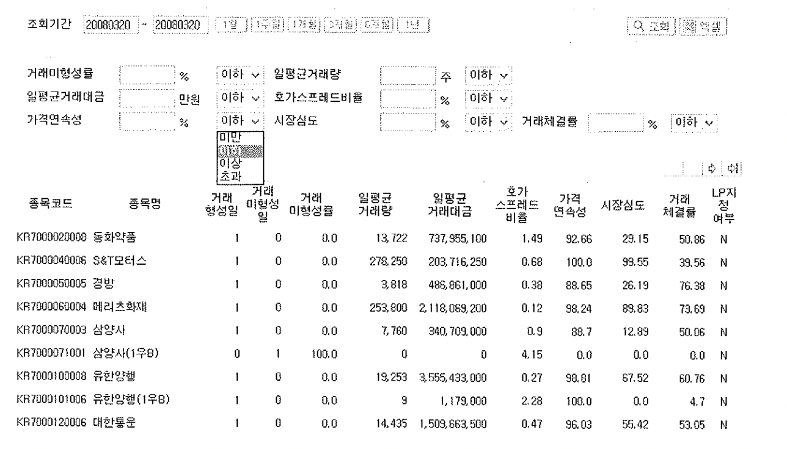

# 11. Static SQL 구현을 위한 기법들


- 사용자의 선택적으로 입력한 검색 조건에 따라 SQL이 다양하게 바뀌는 경우가 있다.
- 문제는 Dynamic SQL을 사용한 순간 조건 값이 리터럴 상수값을 사용 하도록 개발하는 경우가 있다.
- 필요한 경우가 아니라면 Static SQL을 작성 할 수 있는 습관과 능력을 기를수 있는 몇가지 사례에 대해 설명 하고자 한다.


## 1) IN-LIST 항목이 가변적이지만 최대 경우 수가 적은 경우

```
  부서코드 부서이름        지역
 --------  -------------- -------------
      10  ACCOUNTING     NEW YORK
      20  RESEARCH       DALLAS
      30  SALES          CHICAGO
      40  OPERATIONS     BOSTON
```

- 위의 테이블에서 NEW YORK, DALLAS, CHICAGO, BOSTON을 전체 또는 일부만 가져오기 위해서는 아래와 같은 경우의 수가 여러개로 나올수 있다.

```sql
SELECT * FROM DEPT WHERE DEPTNO IN (10);
SELECT * FROM DEPT WHERE DEPTNO IN (10, 20);
SELECT * FROM DEPT WHERE DEPTNO IN (10, 20, 30);
SELECT * FROM DEPT WHERE DEPTNO IN (10, 20, 30, 40);
SELECT * FROM DEPT WHERE DEPTNO IN (20, 30);
SELECT * FROM DEPT WHERE DEPTNO IN (20, 30, 40);
SELECT * FROM DEPT WHERE DEPTNO IN (30, 40);
SELECT * FROM DEPT WHERE DEPTNO IN (40);
```

- 프로그램을 개발함에 있어 경우의 수 만큼 SQL을 만들어 놓고 필요 할때 마다 호출 하는 것은 시간 뿐만 아니라 비용 적인 측면에서도 손실이 발생할 우려가 있다


##### 개선1)

```sql
 SELECT * FROM DEPT WHERE DEPTNO IN (:DEPT1, :DEPT2, :DEPT3, :DEPT4);
```

- 조건에 맞는 경우의 최대의 수에서 바인드 변수로 처리를 해주면 쉽게 해결 하다. 그러나 전체 검색 조건에는 적합하지 않다


##### 개선2)

```sql
SELECT * FROM DEPT WHERE DEPTNO IN ( DECODE(:DEPT1, 'ALL', 10, :a)
				   , DECODE(:DEPT2, 'ALL', 20, :b)
				   , DECODE(:DEPT3, 'ALL', 30, :c)
				   , DECODE(:DEPT4, 'ALL', 40, :d)
				   );
```

- 조건에 맞는 경우의 최대의 수에 바인드 변수처리, 바인드 변수 값이 'ALL'일 경우 전체 검색을 할 수 있도록 처리를 하였다.


## 2) IN-LIST 항목이 가변적이고 최대 경우 수가 아주 많은 경우

1) 검색 조건은 정해저 있으나 경우의 수가 많은 경우




- 경우의 수가 많아 일일이 쿼리로 구현 하기 힘들며 바인드 변수를 이용하여 처리하기에도 쉽지가 않다.


##### 개선방법

1. 선택할 분류 코드를 변수에 대입 한다.
2. 선택할 분류 코드가 있는지 조건에 맞게 검색

```sql
:inlist :='01,02,03,04,14,22,23,25';
SELECT * FROM 수시공시내역
FROM   공시일자 = :일자
WHERE :inlist LIKE '%'|| 분류코드 ||'%'
```


- 오라클 내부적으로 INSTR이 LIKE 보다 빠르므로 INSTR로 수정 후 재 작성

```sql
:inlist :='01,02,03,04,14,22,23,25';
SELECT * FROM 수시공시내역
FROM  공시일자 = :일자
WHERE INSTR(:inlist, 분류코드) > 0;
```

- 분류코드에 인덱스가 설정되어 있다면 컬럼이 가공되어 인덱스를 사용 하지 못해 성능에 문제가 발생할 우려가 있으나 인덱스 구성에 따라 성능이 달라진다.


```sql
1. IN 을 사용 할경우
SELECT * FROM 수시공시내역
WHERE 공시일자 = :일자
AND 분류코드 IN ( ... )

2. LIKE 혹은 INSTR로 검색 할 경우
SELECT * FROM 수시공시내역
WHERE 공시일자 = :일자
AND INSTR(:INLIST, 분류시드) > 0
```


##### 분류코드 + 공시일자 인덱스 설정

- 1번 쿼리가 유리 하지만 2번 쿼리는 인덱스를 사용 하지 못하거나 index full scan을 해야 한다.


##### 공시일자 + 분류 코드 인덱스 설정

- 1번은 분류코드가 적을때 유리 하며 코드가 많아지게 된다면 인덱스를 그 만큼 여러번 탐침하게 되어 느려 2번이 유리 할수도 있다.
- 하루치 데이터가 수십 만건이 아닌 이상은 2번처럼 인덱스 필터 조건을 사용 하는 것만으로도 만족할 만한 성능을 얻을 수 있다.

- 분류코드 + 공시일자 에 대한 해결방법


##### <해결 방법1>

```sql
exec :inlist := '01030814172433464853';

SELECT /*+ ordered_use_nl(B) */ 
      ,b.*
FROM (
	SELECT 분류코드
	FROM 수시공시분류
	WHERE INSTR(:inlist, 분류코드) > 0 
)a, 수시공시내역 b
ON b.분류코드 = a.분류코드
```

- 수시공시분류 100개 이하의 작은 테이블이라면 FULL SCAN으로 읽더라도 비효율없고, NL 조인 방식으로 분류 코드 값을 수시 공시 내역 테이블에 던져줘서 인덱스를 정상적으로 이용 하면서 원하는 결과 내용을 얻을수 있다.


###### <해결 방법2>

```
exec :inlist := '01030814172433464853';
SELECT /*+ ordered_use_nl(B) */ 
      ,b.*
FROM (
	SELECT substr(:inlist, (rownum-1)*2 + 1, 2)AS 분류코드 
	FROM 수시공시분류
	WHERE rownum <=length(:inlist) /2 
)a, 수시공시내역 b
ON b.분류코드 = a.분류코드
```

- 수시공시분류 테이블을 이용 하여 분류코드를 만들고 있지만 분류코드 이상의 테이블이라면 어떤 테이블이던 상관 없이 만들수 있다.


###### <해결 방법3>

```
exec :inlist := '01030814172433464853';

SELECT /*+ ordered_use_nl(B) */ 
      ,b.*
FROM (
	SELECT substr(:inlist, (rownum-1)*2 + 1, 2)AS 분류코드 --데이터를 
	FROM DUAL
	CONNECT BY LEVEL <=length(:inlist) /2 
)a, 수시공시내역 b
ON b.분류코드 = a.분류코드
```

- 위의 방법2와 동일하지만 차이점은 DUAL를 이용하여 테이블을 동적으로 생성한다는 점만 다르다.

- 2,3번의 방법은 결국 분류코드를 변수에서 읽어와 데이터를 가공 하여 코드성 테이블을 인위적으로 만들어 수시공시내역 테이블과 조인하여 원하는 결과를 빠르게 얻어올수 있다.
- 결과는 아래와 같다.

```
01
03
08
14
17
24
33
46
48
53
```


## 3) 체크 조건 적용이 가변적인 경우

###### 증권사별 거래 실적을 집계하는 쿼리

```
SELECT 회원번호
      , SUM(체결건수)
      , SUM(체결수량)
      , SUM(거래대금)
FROM   일별거래실적 E
WHERE  거래일자 = :trd_dd
AND    시장구분 = '유가'
AND EXISTS (
	SELECT 'X'
	FROM 종목
	WHERE 종목코드 = E.종목코드
	AND     코스피종목편입여부 = 'Y'
)
GROUP BY 회원번호
```

- 사실 이 케이스는 라이브러리 캐시 최적화와는 그다지 상관이 없습니다. 나올 수 있는 경우의 수가 두 개뿐이기 때문입니다


##### Static SQL 변환한 쿼리1

```sql
SELECT 회원번호
      , SUM(체결건수)
      , SUM(체결수량)
      , SUM(거래대금)
FROM   일별거래실적 E
WHERE  거래일자 = :trd_dd
AND    시장구분 = '유가'
AND EXISTS (
	SELECT 'X'
	FROM 종목
	WHERE 종목코드 = E.종목코드
	and   코스피종목편입여부 = DECODE(:check_yn, 'Y', 'Y', 코스피종목편입여부)
)
GROUP BY 회원번호
```


##### 전 종목을 대상으로 집계하고자 할때

- 결과: 트레이스를 확인한 결과 블록 I/O가 기존 600개에서 8518개로 증가 불필요한 서브 쿼리로 인해 성능이 저하

```sql
:trd_dd := '20071228'
:check_yn := 'N'

Call         Count    CPU Time    Elapsed Time      Disk     Query    Current       Rows
--------- ----------- ------------ --------------- -------- -------- --------- -----------
Parse          1          0.000           0.000         0        0          0          0
Execute        1          0.000           0.000         0        0          0          0
Fetch        264          0.000           0.000         0     8518          0       2623
--------- ----------- ------------ --------------- -------- -------- --------- -----------
Total        266          0.000           0.000         0     8518          0       2623

Rows      Row Source Operation
------   ------------------------------------------------
   0     STATEMENT
2623       FILETER  (cr=8518 pr=0 pw=0 time=36781 us)
2627         PARTITION RANGE SINGLE PARTITION: 20 20 (cr=641 pr=0 pw=0 time=10547 us)
2627           TABLE ACCESS BY LOCAL INDEX ROWID 일별거래실적 PARTITION: 20 20 (cr=641 ...)
2627             INDEX RANGE SCAN 일별거래실적 X01 PARTITION: 20 20 (cr=274 pr=0 ...)
2623           TABLE ACCESS BY INDEX ROWID 종목 (cr=7877 pr=0 pw=0 time=25166 us)
2623             INDEX RANGE SCAN 종목_PK (cr=5254 pr=0 pw=0 time=16450 us) (Object ID 79702
```


###### 사용자가 코스피 편입 종목만으로 집계하고자 할때

- 결과: 통합전과 I/O블록이 같아 손해를 보지 않음

```sql
:trd_dd := '20071228'
:check_yn := 'Y'

Call         Count    CPU Time    Elapsed Time      Disk     Query    Current         Rows
--------- ----------- ------------ --------------- -------- -------- --------- -----------
Parse           1         0.000           0.000        0        0          0           0
Execute         1         0.000           0.000        0        0          0           0
Fetch          85         0.020           0.000        0     8208          0         839
--------- ----------- ------------ --------------- -------- -------- --------- -----------
Total          87         0.020           0.000        0     8208          0         839

Rows      Row Source Operation
------   ------------------------------------------------
   0     STATEMENT
 839       FILETER  (cr=8208 pr=0 pw=0 time=13410 us)
2627         PARTITION RANGE SINGLE PARTITION: 20 20 (cr=293 pr=0 pw=0 time=5296 us)
2627           TABLE ACCESS BY LOCAL INDEX ROWID 일별거래실적 PARTITION: 20 20 (cr=293 ...)
2627             INDEX RANGE SCAN 일별거래실적 X01 PARTITION: 20 20 (cr=97 pr=0 ...)
 839           TABLE ACCESS BY INDEX ROWID 종목 (cr=7915 pr=0 pw=0 time=27118 us)
2623             INDEX RANGE SCAN 종목_PK (cr=5292 pr=0 pw=0 time=18069 us) (Object ID 79702)
```

- 위의 쿼리를 보면 조건(:check_yn = 'Y')인경우는 문제가 없으나 전체 데이터를 검색은 I/O부분에 성능 저하를 가져오고 있다.


###### Static SQL 변환한 쿼리2

```sql
SELECT 회원번호
      , SUM(체결건수)
      , SUM(체결수량)
      , SUM(거래대금)
FROM   일별거래실적 e
WHERE  거래일자 = :trd_dd
AND    시장구분 = '유가'
AND EXISTS (
	SELECT 'X' 
	FROM DUAL 
	WHERE :check_yn = 'N'
	UNION ALL
	SELECT 'X'
	FROM 종목
	WHERE 종목코드 = e.종목코드
	AND   코스피종목편입여부 = 'Y'
	AND   :check_yn = 'Y'

)
GROUP BY 회원번호
```

- EXISTS는 서브쿼리의 존재 여부만 체크 하기때문에 UNION ALL의 첫번째 쿼리가 조건이 맞다면 아래의 쿼리를 더이상 실행 하지 않고 바로 TRUE


###### 전 종목을 대상으로 집계하고자 할 때

- Static SQL 변환 쿼리 테스트 1 보다 7.5% 감소

```sql
:trd_dd := '20071228'
:check_yn := 'N'

Call         Count    CPU Time       Elapsed Time    Disk     Query    Current       Rows
--------- ----------- ------------ --------------- -------- -------- --------- -----------
Parse           1        0.000             0.000         0        0         0           0
Execute         1        0.000             0.000         0        0         0           0
Fetch         264        0.000             0.000         0      641         0        2627
--------- ----------- ------------ --------------- -------- -------- --------- -----------
Total         266        0.000             0.000         0      641         0        2627

Rows      Row Source Operation
------   ------------------------------------------------
   0   STATEMENT
2627     FILTER (cr=641 pr=0 pw=0 time=18443 us)
2627       PARTITION RANGE SINGLE PARTITION: 20 20 (cr=641 pr=0 pw=0 time=7924 us)
2627         TABLE ACCESS BY LOCAL INDEX ROWID 일별거래실적 PARTITION:20 20 (cr=641 ...)
2627            INDEX RANGE SCAN 일별거래실적_X01 PARTITION: 20 20 (cr=274 pr=0 ...)
2627         UNION-ALL  (cr=0 pr=0 pw=0 time=9061 us)
2627           FILTER  (cr=0 pr=0 pw=0 time=4659 us)
2627             FAST DUAL  (cr=0 pr=0 pw=0 time=1874 us)
   0           TABLE ACCESS BY INDEX ROWID 종목 (cr=0 pr=0 pw=0 time=0 us)
   0              INDEX RANGE SCAN 종목_PK  (cr=0 pr=0 pw=0 time=0 us)(Object ID 79702)
```

- 10g 부터는 FAST DUAL 방식을 사용 하기 때문에 블록 I/O는 발생 되지 않는다
- 다만 9i이전 버전에 대해서는 종목 코드수 많큼 DUAL 테이블을 반복적으로 읽어야 하므로 2~4개 정도의 I/O를 추가적으로 발생 하기 때문에 분리 하는게 나을수도 있다.


###### 사용자가 코스피 편입 종목만 집계하고자 할 때

- 결과: 통합하기 전에도 어차피 서브 쿼리를 수행해야 하므로 동일한 결과가 출력 된다.

```sql
:trd_dd := '20071228'
:check_yn := 'Y'

Call         Count    CPU Time       Elapsed Time      Disk   Query    Current         Rows
--------- ----------- ------------ --------------- -------- -------- --------- -----------
Parse            1         0.000          0.000          0        0         0           0
Execute          1         0.000          0.000          0        0         0           0
Fetch           85         0.040          0.053          0     8208         0         839
--------- ----------- ------------ --------------- -------- -------- --------- -----------
Total           87         0.040          0.053          0     8208         0         839

Rows      Row Source Operation
------   ------------------------------------------------
   0   STATEMENT
 839     FILTER (cr=8208 pr=0 pw=0 time=15177 us)
2627       PARTITION RANGE SINGLE PARTITION: 20 20 (cr=293 pr=0 pw=0 time=7919 us)
2627         TABLE ACCESS BY LOCAL INDEX ROWID 일별거래실적 PARTITION:20 20 (cr=293 ...)
2627            INDEX RANGE SCAN 일별거래실적_X01 PARTITION: 20 20 (cr=97 pr=0 pw=0 ...)
 839         UNION-ALL  (cr=0 pr=0 pw=0 time=36922 us)
   0           FILTER  (cr=0 pr=0 pw=0 time=1817 us)
   0             FAST DUAL  (cr=0 pr=0 pw=0 time=0 us)
 839           TABLE ACCESS BY INDEX ROWID 종목 (cr=7915 pr=0 pw=0 time=26760 us)
2623              INDEX RANGE SCAN 종목_PK  (cr=5292 pr=0 pw=0 time=17769 us)
```


## 4) select-list가 동적으로 바뀌는 경우




- 위의 그림에 맞게 사황에 따라 평균, 합계를 선택 하여 검색 하고자 한다.

- Pro*c에서 컬럼을 동적으로 변경

```sql
/* 1 : 평균 2: 합계 */
if( pfmStrCmpTrim(INPUT->inData.gubun, "1", 1) == 0){
	snprintf(..., " avg(계약수), avg(계약금액), avg(미결제약정금액) ");
} else {
	snprintf(..., " sum(계약수), sum(계약금액), sum(미결제약정금액) ");
}
```


- Static SQL로 변경할 경우 decode 나 case 구문을 활용 하여 아래와 바꾸면된다.

```sql
/* 1 : 평균 2: 합계 */
,decode(:gubun, '1', avg(계약수), sum(계약수))
,decode(:gubun, '1', avg(계약금액), sum(계약금액))
,decode(:gubun, '1', avg(미결재약정금액), sum(미결재약정금액))
```


## 5) 연산자가 바뀌는 경우



- 위의 그림과 같이 연산자가 달라지는 경우 Static SQL처리 방법
- 나올수 있는 검색 조건을 작성 하고 값만 바인딩으로 처리 하면 된다.

```sql
WHERE 거래미형성률      BETWEEN :min1 AND :max1
AND   일평균거래량      BETWEEN :min2 AND :max2
AND   일평균거래대금    BETWEEN :min3 AND :max3
AND   호가스프레드비율  BETWEEN :min4 AND :max4
AND   가격연속성        BETWEEN :min5 AND :max5
AND   시장심도          BETWEEN :min6 AND :max6
AND   거래체결률        BETWEEN :min7 AND :max7
```


###### 일평균거래량 기준으로 검색하기 위한 분석해보자

```sql
1. 도메인에 해당하는 데이터 타입과 자리수를 할당 받는다(스키마 정보를 확인하자)

거래량            | NUMBER(9)
거래대금	         | NUMBER(15)
가격연속성	| NUMBER(5,2)

2. 거래량의 도메인은 9자리가 정수형 값만 허용 하고 있으며 최소 0~ 최도:999,999,999 까지 범위를 가질수 있다.

3. 사용자가 검색할 값과 숫자의 범위에 대한 선택 조건을 나열한다.
위의 그림을 보면 미만, 이하, 이상, 초과로 나오고 있다.

4. 선택조건에 해당하는 값의 범위를 지정한다.
EX> 1000주일경우
     최소값	 최대값
미만 : 0	        ~ 999
이하 : 0	        ~ 1000
이상 : 1000	~ 999999999
초과 : 1001	~ 999999999
2번에서 지정한 숫자 범위와 검색 조건 값에 따라 시작 범위와 종료 범위를 파악

5. 해당 선택 조건에 맞는 범위 값을 가져와 변수 값에 바인딩 처리를 한다.
```


