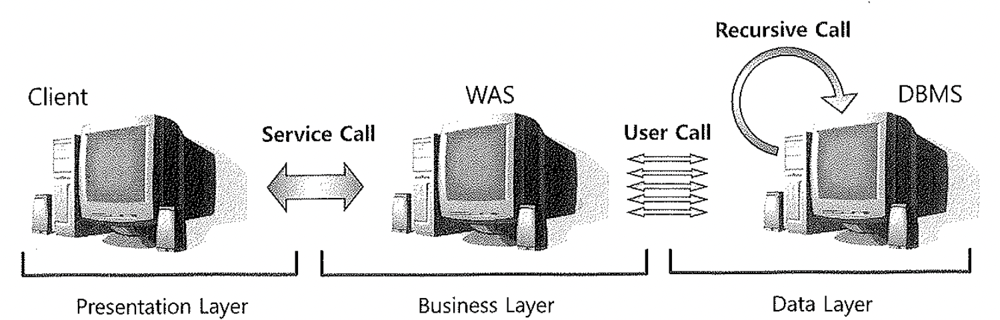
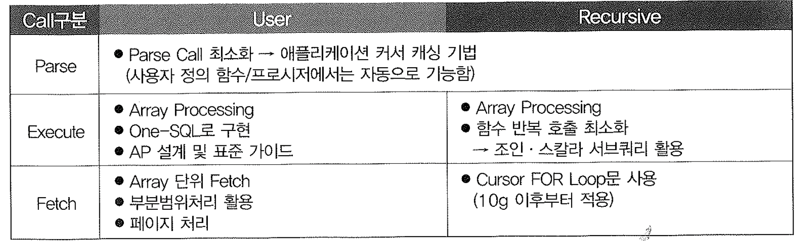

# 02. UserCall-VS-RecursiveCall


- DB Call 커서 활동 상태에 따른 구분 : Parse, Execute, Fetch
- DB Call 발생 위치에 따른 구분 : User Call, Recursive Call

- SQL 트레이스 파일을 TKProf 유틸리티로 포맷팅하면 맨 아래쪽에 아래와 같은 Overall Total 통계가 나온다. 이 중 NON-RECURSIVE 통계가 User Call에 해당하며, 그 아래쪽 RECURSIVE 통계가 Recursive Call에 해당한다.

```sql
OVERALL TOTALS FOR ALL NON-RECURSIVE STATEMENTS

call     count       cpu    elapsed       disk      query    current        rows
------- ------  -------- ---------- ---------- ---------- ----------  ----------
Parse        7      0.01       0.02          0          1          0           0
Execute      9      0.01       0.09          0         19         69          28
Fetch        4      0.00       0.00          0         16          0          28
------- ------  -------- ---------- ---------- ---------- ----------  ----------
total       20      0.03       0.11          0         36         69          56

Misses in library cache during parse: 5


OVERALL TOTALS FOR ALL RECURSIVE STATEMENTS

call     count       cpu    elapsed       disk      query    current        rows
------- ------  -------- ---------- ---------- ---------- ----------  ----------
Parse        8      0.00       0.01          0          0          0           0
Execute     41      0.04       0.07          0          0          0           0
Fetch       64      0.01       0.03          4        122          0         318
------- ------  -------- ---------- ---------- ---------- ----------  ----------
total      113      0.06       0.12          4        122          0         318

Misses in library cache during parse: 7
Misses in library cache during execute: 7

   10  user  SQL statements in session.
   40  internal SQL statements in session.
   50  SQL statements in session.
```




## 1. User Call

- User Call 은 OCI(Oracle Call Interface)를 통해 오라클 외부로부터 들어오는 Call을 말한다.
- Peak 시간대에 시스템 장애를 발생시키는 가장 큰 주범은 User Call 이다.
- User Call이 많이 발생되도록 개발된 애플리케이션은 결코 좋은 성능을 낼 수 없다.

- **DBMS 성능과 확장성(Scalability)를 높이려면 User Call을 최소화 하려는 노력이 무엇보다 중요하며, 이를 위해 아래와 같은 기능과 기술을 적극적으로 활용해야만 한다.**
  1. Loop 쿼리를 해소하고 집합적 사고를 통해 One-SQL로 구현
  2. Array Processing : Array 단위 Fetch, Bulk Insert/Update/Delete
  3. 부분범위처리 원리 활용
  4. 효과적인 화면 페이지 처리
  5. 사용자 정의 함수/프로시저/트리거의 적절한 활용


## 2. Recursive Call

- Recursive Call은 오라클 내부에서 발생하는 Call을 말한다.
- SQL 파싱과 최적화 과정에서 발생하는 Data Dictionary 조회, PL/SQL로 작성된 사용자 정의 함수/프로시저/트리거 내에서의 SQL 수행이 여기에 해당한다.
- Recursive Call을 최소화 하려면, 바인드변수를 적극적으로 사용해 하드파싱 횟수를 줄여야한다.
- PL/SQL로 작성한 프로그램을 이해하고 시기 적절하게 사용한다.

```sql
SELECT code,.... 
FROM ....

call     count       cpu    elapsed       disk      query    current        rows
------- ------  -------- ---------- ---------- ---------- ----------  ----------
Parse        0      0.00       0.00          0          0          0           0
Execute    493      0.01       0.00          0          0          0           0
Fetch      493      0.03       0.02          0       3451          0         493
------- ------  -------- ---------- ---------- ---------- ----------  ----------
total      986      0.04       0.02          0       3451          0         493

Misses in library cache during parse: 0
Optimizer mode: ALL_ROWS
Parsing user id: 41     (recursive depth: 1)
```


- 위의 결과에 나오는 recursive depth는 PL/SQL실행시에 나오는 결과로 옆의 숫자값은 프로시져의 호출 횟수이다.
- recursive depth가 2이상이면 특정프로시져에서 또 다른 프로시져를 호출한 경우이며, 트레이스 결과는 마지막 프로시저에서 사용된 SQL에 대한 수행결과이다.

- PL/SQL은 가상머신(Virtual Machine)상에서 수행되는 인터프리터(Interpreter)언어이므로 빈번한 호출 시 컨텍스트 스위칭(Context Switching)때문에 성능이 매우 나빠진다. 성능을 위해서라면 PL/SQL에 대한 지나친 모듈화는 지양해야 한다.

- 또한, 대용량 데이터 조회시에 함수를 잘못사용하면 건건이 함수 호출이 발생되어 성능이 극도로 제한될수 있는등의 문제가 있다.
- 될수있으면 조인 또는 스칼라 서브쿼리 형태로 변환하려는 노력이 필요하다.
- 기타 자세한 함수에 대한 설명은 7절 이하 참고하세요.

- 지금까지의 내용을 간략히 요약하면 아래표와 같다.




