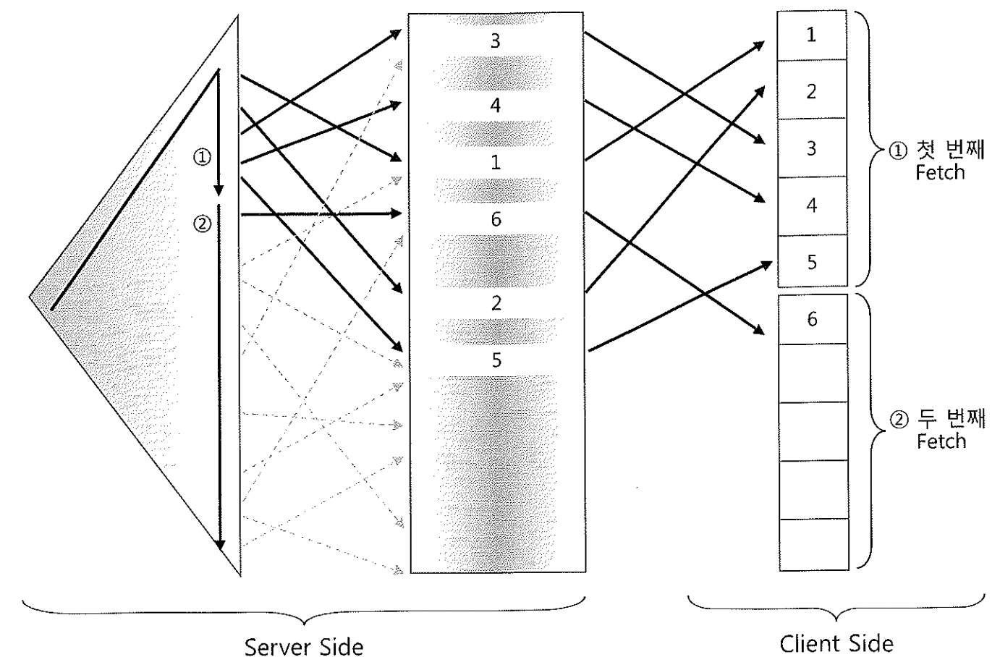
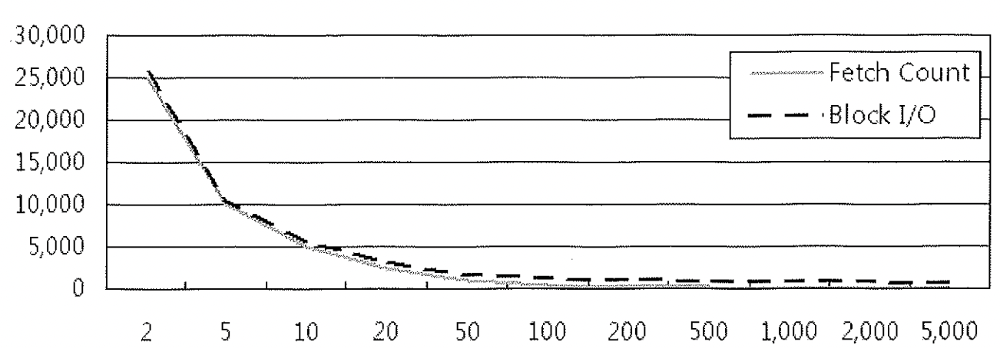
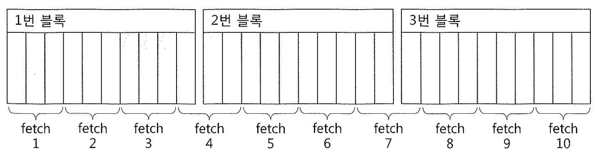

# 05. FetchCall최소화


## $$$$$$$$$$$$$$$$$$$$$$$$$$$$$$$$$$$$$$$$$$$$$$$$$$$

java call test, plsql test 는 2회독에서 하도록 하자

## $$$$$$$$$$$$$$$$$$$$$$$$$$$$$$$$$$$$$$$$$$$$$$$$$$$


이번 절은 아래 네 가지 주제로 fetch call 최소화를 말한다.

- 부분범위처리 원리
- OLTP 환경에서 부분범위처리에 의한 성능개선 원리
- ArraySize 조정에 의한 Fetch Call 감소 및 블록 I/O 감소 효과
- 프로그램 언어에서 Array 단위 Fetch 가능 활용


## 1. 부분범위처리 원리

```sql
drop table t;

create table t ( 
  x NUMBER   not null 
, y NUMBER   not null ) ; 
 
insert into t 
select * 
from ( 
 select rownum x, rownum y 
 from   dual 
 connect by level <= 5000000 
) 
order by dbms_random.value   
; 
 
alter table t add 
constraint t_pk primary key (x); 
 
alter system flush buffer_cache; 
 
set arraysize 5
set timing on 
 
select /*+ index(t t_pk) */ x, y 
from   t 
where  x >  0 
and    y <= 6 ; 
X        Y 
---------- ---------- 
1        1 
2        2 
3       3 
4       4 
5       5     ? 엔터를 치자마자 여기까지 출력하고 멈춤 
6       6     ? 33초 경과한 후에 이 라인을 출력하고 수행 종료
```

- DBMS는 데이터를 클라이언트에게 전송할 때 일정량씩 나누어 전송
  (오라클의 경우 ArraySize(FetchSize)설정을 통해 네트워크 운반단위 조절)
- 전체 결과집합 중 아직 전송하지 않은 분량이 많이 남아있어도 클라이언트로부터 추가 Fetch Call을 받기 전까지는 그대로 멈춰 서서 기다린다.

##### 1억 건짜리 BIG_TABLE을 쿼리하는 데 1초가 채 걸리지 않는 이유

- 1억 건 전체를 읽고 처리한 것은 아니며, rs.next()를 한 번만 호출하고 곧바로 ResultSet과 Statement를 닫아 버렸다. rs.next()를 호출하는 순간 오라클은 FetchSize만큼을 전송했고, 클라이언트는 그 중 한 건만 콘솔에 출력하고는 곧바로 커서를 닫은 것이다.
- 추가 요청 없이 그대로 커서를 닫아버리면 오라클은 데이터를 더는 전송하지 않고 바로 일을 마친다.

- 부분범위처리 : 쿼리 결과집합을 전송할 때, 전체 데이터를 쉼 없이 연속적으로 처리하지 않고 사용자로부터 Fetch Call이 있을 때마다 일정량씩 나누어서 전송하는 것.

- 적정한 데이터 운반단위는 얼마일까? '적당한 게 좋다'
- 대량 데이터를 파일로 내려받는다면 가급적 그 값을 크게 설정
  (전송해야 할 총량이 변하기는 하지만 Fetch Call 횟수를 그만큼 줄일 수 있다.)
- 앞쪽 일부 데이터만 Fetch하다가 멈추는 프로그램이라면 ArraySize를 작게 설정
  (불필요하게 많은 데이터를 전송하고 버리는 비효율을 줄일 수 있다)

##### ArraySize를 5로 설정

- 서버 측에서는 Oracle Net으로 데이터를 내려 보내다가 5건당 한 번씩 전송 명령을 날리고는 클라이언트로부터 다시 Fetch Call이 올 때까지 대기
- 클라이언트 측에는 서버로부터 전송받은 5개 레코드를 담을 Array 버퍼가 할당되며, 그곳에 서버로부터 받은 데이터를 담았다가 한 건씩 꺼내 화면에 출력하거나 다른 작업들을 수행


## 2. OLTP 환경에서 부분범위처리에 의한 성능개선 원리



```sql
set arraysize 5
 
select /*+ index(t t_pk) */ x, y 
from   t 
where  x >  0 
and    y <= 6 ; 
X        Y 
---------- ---------- 
1        1 
2        2 
3       3 
4       4 
5       5     ? 엔터를 치자마자 여기까지 출력하고 멈춤 
6       6     ? 33초 경과한 후에 이 라인을 출력하고 수행 종료
```

- 첫 번째 Fetch Call에서는 인덱스를 따라 x 컬럼 값이 1~5인 5개 레코드를 전송받아 Array 버퍼에 담는다.
- 오라클 서버는 이 5개 레코드를 아주 빠르게 찾았으므로 지체 없이 전송 명령을 통해 클라이언트에게 전송하고, 클라이언트는 Array 버퍼에 담긴 5ro 레코드를 곧바로 화면에 출력한다.
- 사용자로부터 두 번째 Fetch Call 명령을 받자마자 x = y =6 인 레코드를 찾아 Oracle Net으로 내려 보낸다.
- 끝까지 가 본 후에야 더는 전송할 데이터가 없음을 인식하고 그대로 한 건만 전송하도록 Oracle Net에 명령.
- Oracle Net은 한 건만 담은 패킷을 클라이언트에게 전송.
- 클라이언트는 Array 버퍼가 다시 채워지기를 기다리면서 30여 초 이상을 허비 했지만 결국 한 건밖에 없다는 신호를 받고 이를 출력한 후에 커서를 닫는다.

```sql
select /*+ index(t t_pk) */ x, y 
from   t 
where  x >  0 
and    y <= 1 ; 
X        Y 
---------- ---------- 
1        1          ? 307초 후에 이라인을 출력하고 곧바로 수행 종료
```

- 화면에 아무것도 출력하지 않은 채 30초 이상을 대기하다가 한 건밖에 없다는 메시지를 그제야 출력하고 수행을 마친다.

- **부분범위처리 원리 때문에 OLTP 환경에서는 결과집합이 많을수록 오히려 성능이 좋아진다.**

```sql
1. select /*+ index(t t_pk) */ * from t where x > 0 and mod(y, 50) = 0 
2. select /*+ index(t t_pk) */ * from t where x > 0 and mod(y, 50000) = 0
```

- 1번 쿼리를 수행해 보면 처음부터 끝까지 쉬지않고 결과를 출력
- 2번 쿼리는 화면에 레코드를 뿌리는 도중에 잠깐씩 멈칫하는 현상을 보인다.
- 데이터가 많을수록 더 빨라진다는 의미는 부분범위처리가 가능한 업무에 한하며, 서버 가공 프로그램이나 DW성 쿼리처럼 결과 집합 전체를 Fetch 해야 한다면 결과 집합이 많을수록 느려진다


#### One-Row Fetch 

```
SQL*Plus에서 쿼리를 수행하면 첫 번째 Fetch에서는 항상 한 건만 요청(One-Row Fetch)하고, 두 번째부터 ArraySize 만큼을 요청한다. 
 
'x > 0 and y <= 5' 조건일 때, 결과전체수는 총 5건이므로 첫 번째 Fetch에서 1건을 우선 가져왔지만 두 번째 Fetch에서 4건 밖에 
찾을 수 없어 끝까지 대기하느라고 오래 걸리는 것이다. 
첫 번째 Fetch에서 1건을 빠르게 리턴 받지만 곧바로 출력하지 않은 이유는, Fetch 해 오는 방식과는 무관하게 Array 버퍼로는 5개를 
할당하기 때문이며 클라이언트는 이 버퍼가 다 채워져야 출력을 시작한다. 
 
'x > 0 and y <-1' 조건으로 수행할 때는 첫 번째 Fetch Call에서 대기할 것 같지만 실장은 두 번째 Fetch Call에서 대기한다. 
첫 번째 Fetch에서 이미 1건을 가져왔지만 클라이언트 쪽 Array 버퍼 크기가 5이므로 나머지 4개를 마저 채우려고 두 번째 Fetch Call을 날리고 기다리는 것이다. 
 
'x > 0 and y <= 6' 조건일 경우는 첫 번째 Fetch에서는 1건만 가져오고, 두 번째 Fetch에서 5건을 가져와 클라이언트 측 Array 버퍼를 채운다, 
5개가 채워졌으므로 일단 화면에 출력하고, 남은 1건 외에 4건을 더 가져와 Array 버퍼를 채우려고 세 번째 Fetch를 수행하는데, 이 때 지연이 발생하게 된다. 
 
- 쿼리 툴마다 다른 방식으로 데이터를 Fetch 한다. 
- Array 단위로 멈추지 않고 모든 데이터를 다 Fetch하는 쿼리 툴도 있다. 
- 어떤 클라이언트 툴을 사용하든 서버 측에서는 항상 Array 단위로 전송한다.
```


## 3. ArraySize 조정에 의한 Fetch Call 감소 및 블로 I/O 감소 효과

- 대량 데이터를 내려받을 때 ArraySize를 크게 설정할수록 그만큼 Fetch Call 횟수가 줄어 네트쿼크 부하가 감소하고, 쿼리 성능이 향상된다.
- 서버 프로세스가 읽어야 할 블록 개수까지 줄어드는 일거양득의 효과를 얻게 된다.





- ArraySize를 키울수록 Fetch Count 횟수가 줄고 더불어 Block I/O까지 주는 것을 볼 수 있다.
- ArraySize를 키운다고 해서 같은 비율로 Fetch Count와 Block I/O가 줄지는 않는다.
- 무작정 크게 설정하면 일정 크기 이상이면 오히려 리소스만 낭비하게 된다.
- 위 데이터 상황에서는 100 정도로 설정하는 게 적당해 보인다.





- 10개의 행으로 구성된 3개의 Block이 있다.
- 총 30개의 레코드이므로 ArraySize를 3으로 설정하면 Fetch 횟수는 10, Block I/O는 12번.
- 10개 레코드가 담긴 블록들을 각각 4번에 걸쳐 반복 액세스해야 하기 때문.
- 첫 번째 Fetch에서 읽은 1번 블록을 2~4번째 Fetch에서도 반복 액세스하게 된다. 2번 블록은 4~7번째 Fetch, 3번 블록은 7~10번 Fetch에 의해 반복적으로 읽힌다.
- ArraySize를 10으로 설정하면 3번의 Fetch와 3번의 Block I/O 발생.
- ArraySize를 30으로 설정하면 Fetch 횟수는 1번으로 줄어든다. (Block I/O는 3번)


## 4. 프로그램 언어에서 Array 단위 Fetch 기능 활용

- PL/SQL에서 커서를 열고 레코드를 Fetch하면 9i까지는 한 번에 한 로우씩만 처리.
- 10g부터는 자동으로 100개씩 Array Fetch가 일어난다. 단 Cursor FOR Loop 구문일 경우 작동.
- Cursor FOR Loop 문은 커서의 Open, Fetch, Close가 내부적으로 이루어지는 것이 특징이며 Implicit Cursor FOR Loop와 Explicit Cursor FOR Loop 두 가지 형태가 있다.

```sql
*# Implicit Cursor FOR Loop* 
 
declare 
  l_object_name big_table.object_name%type; 
begin 
  for item in ( select object_name from big_table where rownum <= 1000 ) 
  loop 
    l_object_name := item.object_name; 
    dbms_output.put_line(l_object_name); 
  end loop; 
end;   
/ 
 
*# Explicit Cursor FOR Loop* 
 
declare 
  l_object_name big_table.object_name%type; 
  cursor c is select object_name from big_table where rownum <= 1000; 
begin 
  for item in c 
  loop 
    l_object_name := item.object_name; 
    dbms_output.put_line(l_object_name); 
  end loop; 
end;   
/
```

- Fetch 횟수 11, 블록 I/O 25

```sql
declare 
cursor c is  
  select object_name  
  from big_table where rownum <= 1000; 
  l_object_name big_table.object_name%type; 
begin 
  open c; 
  loop 
    fetch c into l_object_name; 
    exit when c%notfound; 
    dbms_output.put_line(l_object_name); 
  end loop; 
  close c; 
end; 
/
```

- Fetch 횟수 1001, 블록 I/O 1003
  (Array 단위 Fetch가 작동하지 않음, sys_refcursor를 사용해도 마찬가지)

- JAVA에서 ArraySize 조정

```java
PreparedStatment stmt = conn.prepareStatment(sql); 
Stmt.setFetchSize(100);
ResultSet rs = stmt.executeQuery() 
// rs.setFetchSize(100); // ResultSet에서 조정할 수도 있다.
```

- JAVA에서 FetchSize 기본 값은 10.
- 대량 데이터를 Fetch 할 때 이 값을 100~500 정도로 늘려 주면 기본 값을 사용할 때보다 데이터베이스 Call 부하를 1/10 ~ 1/50로 줄일 수 있다.
- FetchSize를 100으로 설정했을 때 데이터를 Fetch 해오는 메커니즘
  1. 최초 rs.next() 호출 시 한꺼번에 100건을 가져와서 클라이언트 Array 버퍼에 캐싱한다.
  2. 이후 rs.next() 호출할 때는 데이터베이스 Call을 발생시키지 않고 Array 버퍼에서 읽는다.
  3. 버퍼에 캐싱 돼 있던 데이터를 모두 소진한 후 101번째 rs.next() 호출 시 다시 100건을 가져온다.
  4. 모든 결과집합을 다 읽을 때까지 2~3번 과정을 반복한다.
