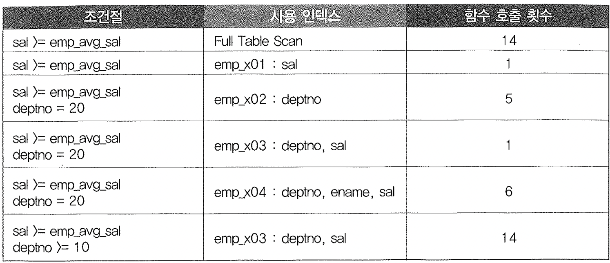
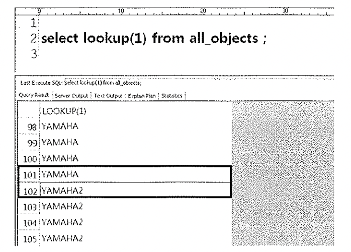

# 07. PL/SQL함수의특징과성능부하


## 1. PL/SQL 함수의 특징


```sql
show parameter plsql

NAME                                 TYPE        VALUE
------------------------------------ ----------- ------------------------------
plsql_ccflags                        string
plsql_code_type                      string      INTERPRETED
plsql_compiler_flags                 string      INTERPRETED, NON_DEBUG
plsql_debug                          boolean     FALSE
plsql_native_library_dir             string
plsql_native_library_subdir_count    integer     0
plsql_optimize_level                 integer     2
plsql_v2_compatibility               boolean     FALSE
plsql_warnings                       string      DISABLE:ALL
```

1. 인터프리터 언어다.

2. Oracle Forms, Oracle Reports 같은 제품에서도 수행될 수 있도록 설계
3. PL/SQL엔진(가상머신, Virtual machine)만 있으면 어디서든 실행가능.
4. native 코드로 완전 컴파일된 내장 함수 (built-in)에 비해 많이 느리다.
5. 매번 SQL 실행엔진과 PL/SQL 가상머신 사이에 컨텍스트 스위칭이 일어난다.


## 2. Recursive Call을 포함하지 않는 함수의 성능 부하

- 내장함수 TO_CHAR와 사용자정의한 함수를 사용했을때 차이

```sql
create or replace function data_to_char(p_Dt date) return varchar2
as
begin
return to_char(p_dt,'yyyy/mm/dd hh24:mi:ss');
end;
/

함수가 생성되었습니다.

drop table t;
create table t (no number, char_time varchar2(21));
테이블이 생성되었습니다.

경   과: 00:00:00.01

-- 내장함수사용
insert into t
select rownum no,
to_char(sysdate+rownum, 'yyyy/mm/dd hh24:mi:ss') char_time
from dual
connect by level <= 1000000;

1000000 개의 행이 만들어졌습니다.
경   과: 00:01:52.21

-- 사용자가만든 함수사용
insert into t
select rownum no,
data_to_char(sysdate+rownum) char_time
from dual
connect by level <= 1000000;

1000000 개의 행이 만들어졌습니다.
경   과: 00:03:27.40
```


## 3. Recursive Call를 포함 하는 함수의 성능 부하

- select 문 삽입후 테스트

```sql
create or replace function date_to_char(p_dt date) return varchar2
as
l_empno number;
begin
select 1 into l_empno from dual;
return to_char(p_dt,'yyyy/mm/dd hh24:mi:ss');
end;
/

함수가 생성되었습니다.

경   과: 00:00:00.03

delete from t;

2000000 행이 삭제되었습니다.

경   과: 00:01:27.14
insert into t
select rownum no,
date_to_char(sysdate+rownum) char_time
from dual
connect by level <= 1000000;

1000000 개의 행이 만들어졌습니다.
경   과: 00:01:51.39

- 트레이스결과
SELECT 1
FROM DUAL;


call     count       cpu    elapsed       disk      query    current        rows
------- ------  -------- ---------- ---------- ---------- ----------  ----------
Parse        1      0.00       0.00          0          0          0           0
Execute 1000001     15.09      12.98          0          0          0           0
Fetch   1000000     10.64       8.73          0          0          0     1000000
------- ------  -------- ---------- ---------- ---------- ----------  ----------
total   2000002     25.73      21.71          0          0          0     1000000

Misses in library cache during parse: 0
Optimizer mode: ALL_ROWS
Parsing user id: 73     (recursive depth: 1)

Rows     Row Source Operation
-------  ---------------------------------------------------
1000000  FAST DUAL  (cr=0 pr=0 pw=0 time=6174443 us)
```


## 4. 함수를 필터 조건으로 사용할 때 주의 사항

- 함수를 where절에 필터조건으로 사용할때 예제

```sql
create or replace function emp_avg_sal return number
is
l_avg_sal number;
begin
select avg(sal) into l_avg_sal from emp;
return l_avg_sal;
end;
/

함수가 생성되었습니다.

create index emp_x01 on emp(sal);
인덱스가 생성되었습니다.

create index emp_x02 on emp(deptno);
인덱스가 생성되었습니다.

create index emp_x03 on emp(deptno, sal);
인덱스가 생성되었습니다.

create index emp_x04 on emp(deptno, ename, sal);
인덱스가 생성되었습니다.
```


#### <케이스1> - 인덱스를 사용하지 않고 Full Scan할때는 읽은 전체 건수만큼 함수호출

```sql
select /*+ full(emp) */ * from emp
       where sal >= emp_avg_sal;

-------------------------------------
SELECT AVG(SAL)
FROM EMP

call     count       cpu    elapsed       disk      query    current        rows
------- ------  -------- ---------- ---------- ---------- ----------  ----------
Parse        1      0.01       0.00          0          0          0           0
Execute     15      0.01       0.02          0          0          0           0
Fetch       14      0.00       0.00          0         98          0           6
------- ------  -------- ---------- ---------- ---------- ----------  ----------
total       30      0.03       0.02          0         98          0           6
```


#### <케이스2> -   인덱스를 이용하도록 하면 함수호출이 한번일어난다.

```sql
select /*+ index(emp(sal)) */ * from emp
where sal >= emp_avg_sal;

call     count       cpu    elapsed       disk      query    current        rows
------- ------  -------- ---------- ---------- ---------- ----------  ----------
Parse        1      0.00       0.00          0          0          0           0
Execute      1      0.00       0.00          0          0          0           0
Fetch        2      0.00       0.00          0          4          0           6
------- ------  -------- ---------- ---------- ---------- ----------  ----------
total        4      0.00       0.00          0          4          0           6
```


#### <케이스3> -  조건절에 deptno = 20 추가, exp_x02인덱스이용하여 조회

```sql
-- 필터링 건수 3건
select /*+ index(emp, emp_x02) */ * from emp
where sal >= emp_avg_sal
and deptno =20;

---------------------------------------------------------------------------------------
| Id  | Operation                   | Name    | Rows  | Bytes | Cost (%CPU)| Time     |
---------------------------------------------------------------------------------------
|   0 | SELECT STATEMENT            |         |     1 |    37 |     2   (0)| 00:00:01 |
|*  1 |  TABLE ACCESS BY INDEX ROWID| EMP     |     1 |    37 |     2   (0)| 00:00:01 |
|*  2 |   INDEX RANGE SCAN          | EMP_X02 |     5 |       |     1   (0)| 00:00:01 |
---------------------------------------------------------------------------------------

Predicate Information (identified by operation id):
---------------------------------------------------

   1 - filter("SAL">="EMP_AVG_SAL"())
   2 - access("DEPTNO"=20)

테이블액세스 하는 횟수만큼 5번 함수호출이 일어난걸 확인할수있다.
```


#### <케이스4> -  deptno + sal 순으로 구성된 emp_x03 인덱스이용

```
SQL>  select /*+ index(emp(deptno, sal) */ * from emp
  2         where sal >= emp_avg_sal
  3           and deptno =20;

---------------------------------------------------------------------------------------
| Id  | Operation                   | Name    | Rows  | Bytes | Cost (%CPU)| Time     |
---------------------------------------------------------------------------------------
|   0 | SELECT STATEMENT            |         |     1 |    37 |     2   (0)| 00:00:01 |
|   1 |  TABLE ACCESS BY INDEX ROWID| EMP     |     1 |    37 |     2   (0)| 00:00:01 |
|*  2 |   INDEX RANGE SCAN          | EMP_X03 |     1 |       |     1   (0)| 00:00:01 |
---------------------------------------------------------------------------------------

Predicate Information (identified by operation id):
---------------------------------------------------

   2 - access("DEPTNO"=20 AND "SAL">="EMP_AVG_SAL"() AND "SAL" IS NOT NULL)

sal >= 까지 조건까지 인덱스 조건으로 사용으로 함수호출이 한번 일어난걸확인
```


#### <케이스5> - 조건은 같고, deptno 와 sal 컬럼중간인 ename 컬럼이 낀 emp_x04 인덱스사용

- 첫번째 액세스 단계에서 1번, 필터 단계에서 나머지 4건을 찾는동안 4번 , deptno = 20 범위를 넘어 더이상 조건을 만족하는 레코드가
  없음을 확인하는 one-plus 스캔과정에서 1번, 하여 총 6번의 함수 호출이 일어난다고 하는데 **1번만 발생. 왜그러지 ?????**

```sql
select /*+ index(emp(deptno, ename, sal)) */ * from emp
where sal >= emp_avg_sal
and deptno =20;

---------------------------------------------------------------------------------------
| Id  | Operation                   | Name    | Rows  | Bytes | Cost (%CPU)| Time     |
---------------------------------------------------------------------------------------
|   0 | SELECT STATEMENT            |         |     1 |    37 |     2   (0)| 00:00:01 |
|   1 |  TABLE ACCESS BY INDEX ROWID| EMP     |     1 |    37 |     2   (0)| 00:00:01 |
|*  2 |   INDEX RANGE SCAN          | EMP_X04 |     1 |       |     1   (0)| 00:00:01 |
---------------------------------------------------------------------------------------

Predicate Information (identified by operation id):
---------------------------------------------------

   2 - access("DEPTNO"=20 AND "SAL">="EMP_AVG_SAL"())
       filter("SAL">="EMP_AVG_SAL"())
```


#### <케이스6> - = 조건이 아닌경우

- 인덱스 스캔할 첫 번째 레코드를 액세스하는 단계에서 1번 deptno >= 10 조건을 만족하는 나머지 13건을 스캔하는 동안 13번
  하여 총 14번 스캔 발생한다고 하는데 **테스트 결과는 한번만 나옴 왜그러지?**

```sql
select /*+ index(emp(deptno, sal)) */ * from emp
where sal >= emp_avg_sal
and deptno >=10;

---------------------------------------------------------------------------------------
| Id  | Operation                   | Name    | Rows  | Bytes | Cost (%CPU)| Time     |
---------------------------------------------------------------------------------------
|   0 | SELECT STATEMENT            |         |     1 |    37 |     2   (0)| 00:00:01 |
|   1 |  TABLE ACCESS BY INDEX ROWID| EMP     |     1 |    37 |     2   (0)| 00:00:01 |
|*  2 |   INDEX RANGE SCAN          | EMP_X03 |     1 |       |     1   (0)| 00:00:01 |
---------------------------------------------------------------------------------------

Predicate Information (identified by operation id):
---------------------------------------------------

   2 - access("DEPTNO">=10 AND "SAL">="EMP_AVG_SAL"() AND "DEPTNO" IS NOT NULL)
       filter("SAL">="EMP_AVG_SAL"())
```

- 대용량테이블에서 조건절과 인덱스 구성에 따라 성능 차이가 매우 크게나타날 수 있음을 확인할수있다.





## 5. 함수와 읽기 일관성

```sql
drop table lookuptable;
create table lookuptable(key number, value varchar2(100));

테이블이 생성되었습니다.

insert into lookuptable values (1, 'YAMAHA');

1 개의 행이 만들어졌습니다.

commit;

커밋이 완료되었습니다.

create or replace function lookup(l_input number) return varchar2
as
l_output lookuptable.value%TYPE;
begin
select value into l_output from lookuptable where key = l_input;
return l_output;
end;
/

함수가 생성되었습니다.

update lookuptable
set value ='YAMAHA2';

1 행이 갱신되었습니다.

commit;

커밋이 완료되었습니다.
```



- 생성한 lookup 함수를 참조하는 쿼리를 수행하고 결과집합을 Fetch 하는 동안 다른 세션에서 LookupTable로부터 value값을 변경한다면?
- 레코드를 Fetch 하면서 lookup 함수가 반복 호출되는데, 중간부터 다른 결과 값을 리턴하게 된다.
- 문장수준 읽기일관성(Statement-level consistency)이 보장 되지 않는다.
- 함수 내에서 수행되는 Recursive 쿼리는 메인 쿼리의 시작 시점과 무관하게 그 쿼리가 수행되는 시점을 기준으로 블록을 읽기 때문.
- Deterministic 함수로 선언하거나, 함수에 스칼라 서브쿼리를 덧씌우더라도 이 문제를 완전히 해소할 수는 없다. (캐시의 제한)
- 일반 조인문 또는 스칼라 서브쿼리를 사용할 때만 완벽한 문장수준 읽기 일관성이 보장된다.
- 프로시저, 패키지, 트리거를 사용할 때도 공통적으로 나타나는 현상.


### (6) 함수의 올바른 사용 기준

- 함수를 사용했을 때 성능이 느려지는 원리를 이해하고 잘 활용해야 한다.
- 트리거를 통해 처리하려 했던 그 목적을 트리거보다 더 빠르게 달성할 수 있는 방법은 없다. 없다면 트리거를 사용해라.
- 조인으로 처리 할 수 있다면 조인으로 처리하라.
- 함수/프로시저를 사용하지 않았을 때 결국 User Call을 발생시키도록 구현해야 한다면, 함수/프로시저를 사용하라.
- 오라클 함수를 사용하지 않고 애플리케이션 단에서 구현하더라도 읽기 일관성 문제가 발생하므로 데이터 일관성이 깨지지 않도록 설계하고 개발하라.
- 모든 프로그램을 PL/SQL 함수와 프로시저로 구현하면 라이브러리 캐시에서 관리할 오브젝트 개수와 크기가 증가하여 히트율 및 경합이 증가해 효율성이 저하된다.
- 오브젝트 정의를 변경하면 라이브러리 캐시 오브젝트간 Dependency 체인을 따라 순간적으로 동시 컴파일을 유발해 시스템 장애로 연결될 가능성도 있다.
  (Dependency 체인에 의한 라이브러리 캐시 부하를 최소화하려면 가급적 패키지를 사용하라)
- 역할을 분담해 연산 위주의 작업은 애플리케이션 서버 단에서 주로 처리하고, SQL수행을 많이 요하는 작업은 오라클 함수/프로시저를 이용하도록 설계할 필요가 있다.