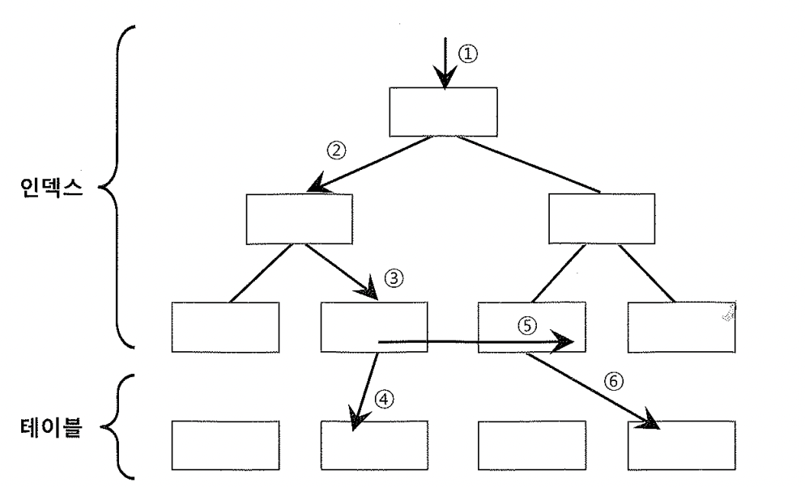

# 01. 블록단위IO

오라클을 포함한 모든 DBMS에서 I/O는 블록 단위로 되어있다.

블록 단위로 I/O를 한다는 것은, 하나의 레코드에서 하나의 컬럼만을 읽으려 할 때도 레코드가 속한 블록 전체를 읽게 됨을 뜻한다.


##### Sequential 액세스

- 하나의 블록을 액세스해서 그 안에 저장돼 있는 모든 레코드를 순차적으로 읽어들이는 것.
- 무거운 디스크 I/O를 수반하더라도 비효율은 없다.

##### Random 액세스

- 레코드 하나를 읽으려고 블록을 통째로 액세스 하는 것.
- 메모리 버퍼에서 읽더라도 비효율이 존재함.


##### SELECT 별 사이즈 차이

- 블록 단위 I/O 원리 때문에 아래 쿼리를 처리할 때 서버에서 발생하는 I/O 측면에서의 일량은 같다.
- 이것은 실행계획이 같을 때이고, 실행 계획이 같더라도 네트워크를 통해 클라이언트에 전송되는 일량에는 차이가 남.

```sql
-- 쿼리 1)
SELECT ENAME FROM EMP WHERE SAL >= 2000;

-- 쿼리 2)
SELECT * FROM EMP WHERE SAL >= 2000;
```


- 컬럼 단위 I/O를 지원하는 DMBS도 있어 DW 분야에서 각광을 받고 있는데, 아래처럼 일부 컬럼만 읽어 집계할 때 I/O 측면에서 성능을 극대화한다.

```sql
select deptno, avg(sal) from emp group by deptno ;
```

- SQL 성능을 좌우하는 가장 중요한 성능지표는 액세스하는 블록 개수이며, 옵티마이저의 판단에 가장 큰 영향을 미치는 것도 액세스해야 할 블록 개수다.
- 예를 들어, 옵티마이저가 인덱스를 이용해 테이블을 액세스할지 아니면 Full Table Scan 할지를 결정하는 데 있어 **가장 중요한 판단 기준은 읽어야 할 레코드 수가 아니라 읽어야 하는 블록 개수다.**


##### 블록 단위 I/O는 버퍼 캐시와 데이터파일 I/O 모두에 적용된다.

- 메모리 버퍼 캐시에서 블록을 읽고 쓸 때
- 데이터파일에 저장된 데이터 블록을 직접 읽거나 쓸 때(Direct Path I/O)
- 데이터파일에서 DB 버퍼 캐시로 블록을 적재할 때 : Single Block Read 또는 Multiblock Read 방식을 사용
- 버퍼 캐시에서 변경된 블록을 다시 데이터파일에 저장할 때 : Dirty 버퍼를 주기적으로 데이터파일에 기록하는 것을 말하며, DBWR 프로세스에 의해 수행된다. 성능향상을 위해 한 번에 여러 블록씩 처리한다.


- 참고로, 오라클 딕셔너리 정보를 저장하는 딕셔너리 캐시는 로우 단위로 I/O를 수행한다.
- 딕셔너리 캐시를 '로우 캐시'라고도 부르는 이유가 여기에 있다.
- 오라클에서 허용하는 블록 크기는 2k, 4k, 8k, 16k, 32k이다. 데이터베이스를 생성할 때 db_block_size를 지정하며, 다른 크기의 블록을 동시에 사용하려면 각각 별도의 테이블스페이스와 버퍼 Pool을 구성해 주어야 한다.
- db_block_size는 Default로 8K이다.


## 1) Sequential vs. Random 액세스




###### Sequential 액세스는 레코드간 논리적 또는 물리적인 순서를 따라 차례대로 읽어 나가는 방식

- 인덱스 리프 블록에 위치한 모든 레코드는 포인터를 따라 논리적으로 연결돼 있고, 이 포인터를 따라 스캔하는 것을 Sequential 액세스 방식이다.
- 테이블 레코드 간에는 포인터로 연결되어 있지 않지만 테이블을 스캔할 때는 물리적으로 저장된 순서대로 읽어 나가므로 이것 또한 Sequential 액세스 방식이다.
- Sequential 액세스 성능을 향상시키려고 오라클 내부적으로 Multiblock I/O, 인덱스 Prefetch 같은 기능을 사용한다.


###### Random 액세스는 레코드간 논리적, 물리적인 순서를 따르지 않고, 한 건을 읽기 위해 한 블록씩 접근 하는 방식

- ①,②,③,④,⑤,⑥이 Random Acess에 해당하며, ①,②,③번 액세스는 인덱스 깊이에 따라 1~3블록 정도 읽는 것이므로 대개 성능에 영향을 미치지 않고, ,④, ⑥번 액세스가 성능 저하를 일으킨다.
- NL 조인에서 Inner 테이블 액세스를 위해 사용되는 인덱스는 ①,②,③번까지도 성능에 지대한 영향을 미칠 수 있다.
- Random 액세스 성능을 향상시키려고 오라클 내부적으로 버퍼 Pinning, 테이블 Prefetch 같은 기능을 사용


- 블록단위 I/O를 하더라도 한번 액세스할 때 Sequential 방식으로 그 안에 저장된 모든 레코드를 읽으면 비효율이 없다고 할 수 있으나, 하나의 레코드를 읽으려고 한 블록씩 읽는다면 매우 비효율적이다.
- **Sequential 액세스 효율은 Selectivity에 의해 결정된다.**
- 즉, 같은 결과 건수를 내면서 얼마나 적은 레코드를 읽느냐로 효율성을 판단 할 수 있다. (100개를 읽었는데 그중 99개를 버리고 1개를 취한다면 Random 액세스 보다 나을게 없다)


###### I/O 튜닝의 핵심 원리

- **Sequential 액세스의 선택도를 높인다.**
- **Random 액세스 발생량을 줄인다.**


## 2) Sequential 액세스 선택도 높이기

```sql
drop table t;

create table t
as
select * from all_objects
order by dbms_random.value;

select count(*) from t;

  COUNT(*)
----------
     14939

select count(*) from t
where owner like 'SYS%';


  COUNT(*)
----------
      9697
```

- 위 쿼리는 9697개 레코드를 선택하려고 14939개 레코드를 스캔했으므로 선택도는 64%다.
- (선택도 : 9697 / 14939 X 100 = 64%)
- 읽은 블록 수는 267개였다.


```sql
select count(*) from t
where owner like 'SYS%'
and object_name = 'ALL_OBJECTS'
```

- 위 쿼리는 1개 레코드를 선택하려고 14939개 레코드를 스캔했으므로 선택도는 0.001%다.
- 선택도가 매우 낮으므로 테이블 Full Scan 비효율이 크다.
- 여기서도 읽은 블록 수는 똑같이 267개다.
- 이처럼 테이블을 스캔하면서 읽은 레코드 중 대부분 필터링되고 일부만 선택된다면 아래처럼 인덱스를 이용하는게 효과적이다.


```sql
create index t_idx on t (owner, object_name);

Index created.

select /*+ index(t t_idx) */ count(*) from t
where owner like 'SYS%'
and object_name = 'ALL_OBJECTS';

  COUNT(*)
----------
         1

select /*+ index(t t_idx) */ count(*) from t
where owner like 'SYS%'
and object_name = 'ALL_OBJECTS'
```

- 위 쿼리에서 참조하는 컬럼이 모두 인덱스에 있으므로 인덱스만 스캔하고 결과를 낼 수 있었다.
- 인덱스를 스캔하면서 114개 블록을 읽고 1개 레코드를 얻었다.
- 인덱스 선두 컬럼이 '='조건이 아니므로 owner like 'SYS%' 조건에 해당하는 로우가 읽어야 할 대상 범위지만, 다행히 스캔 시작 지점은 owner='SYS' 조건과 object_name >= 'ALL_OBJECTS' 조건에 의해 결정된다.


```sql
-- 1개 레코드를 얻으려고 실제 스캔한 레코드 수.
select /*+ index(t t_idx) */ count(*) from t
where owner like 'SYS%'
and ((owner = 'SYS' and object_name >= 'ALL_OBJECTS' ) or (owner >'SYS'));

  COUNT(*)
----------
     9545
```

- 1 / 9545 X 100 = 0.0001%의 선택도다.
- 테이블뿐만 아니라 인덱스를 Sequential 액세스 방식으로 스캔할 때도 비효율이 있는 것을 알 수 있다.
- 인덱스는 테이블과 달리 정렬된 순서를 유지하므로 일정 범위를 읽다가 멈출 수 있다는 점만 다르다.
- **인덱스 스캔의 효율은 조건절에 사용된 컬럼과 연산자 형태, 인덱스 구성에 의해 영향을 받는다.**


```sql
-- 인덱스 컬럼 순서를 변경하고 같은 쿼리를 수행.
drop index t_idx;

create index t_idx on t(object_name, owner);

select /*+ index(t t_idx) */ count(*) from t
where owner like 'SYS%'
and object_name = 'ALL_OBJECTS';
```

- 2개 CR 블록 읽기가 발생했다.
- 인덱스 루트 블록과 하나의 리프 블록만 읽었기 때문이다.
- 한 건을 얻으려고 스캔한 건수도 한 건(정확히 얘기하면, one-plus 스캔까지 두 건)일 것이다.
- 선택도가 100%이므로 가장 효율적인 방식으로 Sequential 액세스를 수행했다.

**ONE PLUS SCAN**

- RANGE LOOKUP의 경우 발생하는 연결시도 횟수만큼의 LOOKUP INDEX 스캔량을 의미함.
- UNIQUE LOOKUP이 아닌 경우, 매 연결시도마다 한번 더 인덱스를 스캔해야 하므로 발생.


## 3) Random 액세스 발생량 줄이기

- Random 액세스 발생량을 낮추는 방법.
- 인덱스에 속하지 않는 컬럼(object_id)을 참조하도록 쿼리를 변경함으로써 테이블 액세스가 발생하도록 할 것이다.

```sql
drop index t_idx;

create index t_idx on t(owner);

select object_id from t
where owner = 'SYS'
and object_name = 'ALL_OBJECTS';
```

- 왼쪽에 보이는 Rows는 각 수행 단계에서 출력(Flow-Out)된 로우 수를 의미한다.
- 인덱스로부터 3276건을 출력했으므로 테이블을 그 횟수만큼 방문하게 된다.
- 그 과정에서 266(=287-21)개 블록을 Random 액세스했다.
- 내부적으로 블록을 3276번 방문했지만 Random 액세스 횟수가 266번에 머무는 것은 1장에서 설명한 버퍼 Pinning 효과 때문이다.
- 클러스터링 팩터가 좋을수록 버퍼 Pinning에 의한 블록 I/O 감소 효과는 더 커진다.

- 최종 한 건을 선택하려고 너무 많은 Random 액세스가 발생했다.
- object_name을 필터링하려고 테이블을 많이 방문한 것이므로 인덱스 액세스 단계에서 필터링할 수 있도록 object_name을 추가해보자.

```sql
drop index t_idx;

create index t_idx on t(owner, object_name);

select object_id from t
where owner = 'SYS'
and object_name = 'ALL_OBJECTS'
```

- 인덱스로부터 1건을 출력했으므로 테이블을 1번 방문한다.
- 실제 발생한 테이블 Random 액세스도 1(=5-4)번이다.
- 같은 쿼리를 수행했는데 인덱스 구성이 바뀌자 테이블 Random 액세스가 대폭 감소한 것이다.