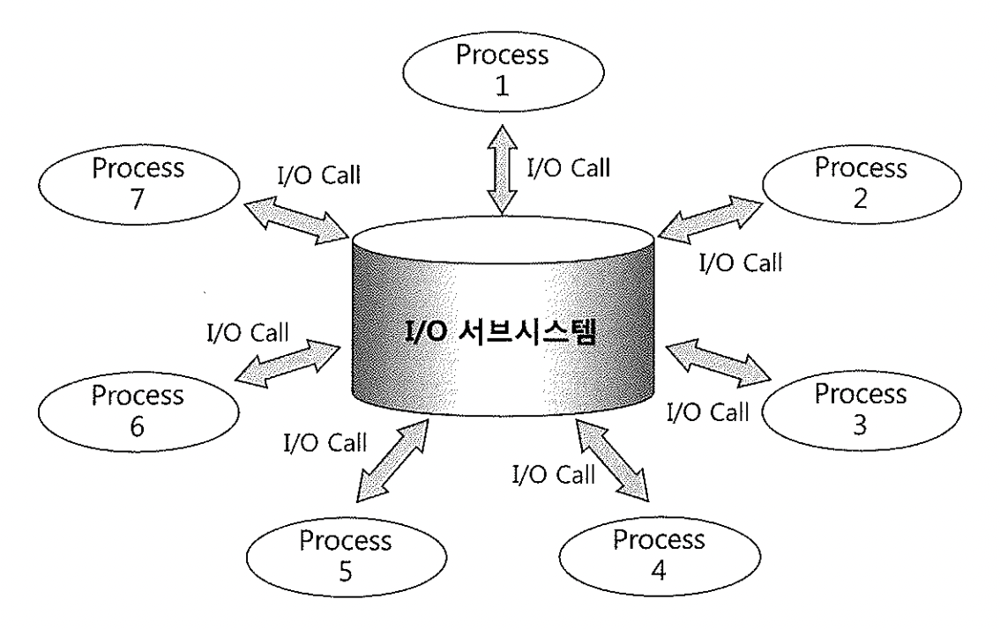

# 02. Memory-VS-Disk I/O


## 1) I/O 효율화 튜닝의 중요성

- 디스크를 경유한 입출력은 물리적으로 액세스 암(Arm)이 움직이면서 헤드를 통해 데이터를 읽고 쓰기 때문에 느리다.
- 반면, 메모리를 통한 입출력은 전기적 신호에 불과하기 때문에 디스크 I/O에 비해 비교할 수 없을 정도로 빠르다.

- 그래서 모든 DBMS는 버퍼 캐시를 경유해 I/O를 수행한다.
- DB 버퍼 캐시를 경유한다는 것은, 읽고자 하는 블록을 먼저 버퍼 캐시에서 찾아보고, 찾지 못할 때만 디스크에서 읽는 것을 말한다.

- 메모리로부터 블록이 찾아진다면 디스크 상의 데이터파일에서 읽는 것보다 평균적으로 10,000배 이상 나은 성능을 보인다.


##### 물리적인 디스크 I/O가 필요할 때면 서버 프로세스는 I/O 서브시스템에 I/O Call을 발생시키고 잠시 대기하게 되므로 비용이 큰 것이다.

- 디스크에 발생하는 경합이 심할수록 대기 시간도 길어진다.

- 유한한 메모리 자원을 좀 더 효율적으로 사용해야 하므로 자주 액세스하는 블록들이 캐시에 더 오래 남아 있도록 LRU 알고리즘을 사용한다.




#### 결국 디스크 I/O를 최소화하고, 대부분 처리를 메모리에서 할 수 있도록 버퍼 캐시 효율성을 높이는 것이 데이터베이스 성능을 좌우하는 열쇠라고 하겠다.


## 2) 버퍼 캐시 히트율(Buffer Cache Hit Ratio)

- 버퍼 캐시 효율을 측정하는 지표로서 전통적으로 가장 맣이 사용돼 온 것은 버퍼 캐시 히트율(BCHR) 이다.
- 전체 읽은 블록 중에서 얼만큼을 메모리 버퍼 캐시에서 찾았는지를 나타내는 것으로서, 구하는 공식은 아래와 같다.

```
BCHR = ( 캐시에서 곧바로 찾은 블록 수 / 총 읽은 블록 수 ) X 100
     = ( (논리적 블록읽기 - 물리적 블록읽기) / 논리적 블록읽기 ) X 100
     = ( 1 - (물리적 블록읽기) / (논리적 블록읽기) ) X 100
```

- '논리적 블록읽기' = '총 읽은 블록 수'
- '캐시에서 곧바로 찾은 블록 수' = '논리적 블록읽기' - '물리적 블록읽기'

- 공식에서 알 수 있듯 BCHR는 물리적인 디스크 읽기를 수반하지 않고 곧바로 메모리에서 블록을 찾은 비율을 말한다.


##### Direct Path Read 방식으로 읽는 경우를 제외하면 +모든 블록 읽기는 버퍼 캐시를 통해 이루어진다.

- 즉, 읽고자 하는 블록을 먼저 버퍼 캐시에서 찾아보고 없을 때 디스크로부터 읽어들이며, 이때도 디스크로부터 곧바로 읽는 게 아니라 먼저 버퍼 캐시에 적재한 후에 읽는다.
- 따라서 SQL을 수행하는 동안 캐시에서 읽은 총 블록 수를 '논리적 블록읽기(Logical Reads)'라고 한다.
- 그리고 '캐시에서 곧바로 찾은 블록 수'는 디스크를 경유하지 않고 버퍼 캐시에서 찾은 블록 수를 말하므로 '총 읽은 블록 수(=논리적 블록읽기)'에서 '물리적 블록읽기(Physical Reads)'를 차감해서 구한다.

```
Call     Count       Cpu    Elapsed       Disk      Query    Current        Rows
------- ------  -------- ---------- ---------- ---------- ----------  ----------
Parse        1    0.000      0.001          0          0          0           0
Execute      1    0.010      0.006          0          0          0           0
Fetch        2  138.680    1746.630    601458     1351677         0           1
------- ------  -------- ---------- ---------- ---------- ----------  ----------
total        4  138.690    1746.637    601458     1351677         0           1
```

- 위에서 Disk 항목(다섯 번째 열)이 '물리적 블록읽기'에 해당한다.
- '논리적 블록읽기'는 Query와 Current 항목을 더해서 구하며, Direct Path Read 방식으로 읽은 블록이 없다면 이 두 값을 더한 것이 '총 읽은 블록 수'가 된다.
- 총 1351677개 블록을 읽었는데, 그중 601458개는 디스크에서 버퍼캐시로 적재한 후에 읽었다.
- 따라서 위 샘플에서 BCHR는 56%다.

```
BCHR = ( 1 - (Disk / (Query + Current))) X 100
     = ( 1 - (601,458 / (1,351,677 + 0))) X 100
     = 55.5 %
```

- 논리적으로 100개 블록 읽기를 요청하면 56개는 메모리에서 찾고, 44개는 메모리에 없어 디스크 I/O를 발생시켰다는 의미가 된다.
- 다른 대기 이벤트가 없었다면 CPU time과 Elapsed time 간에 발생한 시간차는 대부분 디스크 I/O 때문이라고 이해하면 된다.

- BCHR를 구하는 공식을 통해 알 수 있는 것처럼 '논리적 블록 읽기'를 '메모리 블록일기'로 이해하기 보다 **'블록 요청횟수' 또는 '총 읽은 블록 수'로 이해하는 것이 정확하다.**
- 모든 블록을 메모리를 경유해 읽기 때문에 결과적으로 같은 것일 수 있지만 '논리적'을 '메모리로부터'로 해석해 Call 통계를 잘못 해석하는 경우를 자주 보기 때문에 의미를 명확히 하고자 하는 것이다.
- 즉, 많은 분들이 위 Call 통계를 보고 디스크에서 601,458개, 메모리에서 1,351,677개 블록을 읽어 총 1,953,135개 블록을 읽었다고 잘못 해석한다.


- 아래는 위 Call 통계의 원본 SQL을 튜닝한 결과다.

```
call     count       cpu    elapsed       disk      query    current        rows
------- ------  -------- ---------- ---------- ---------- ----------  ----------
Parse        1      0.00       0.000          0          0          0           0
Execute      1      0.00       0.000          0          0          0           0
Fetch        2      0.00       0.001          0        27          0           1
------- ------  -------- ---------- ---------- ---------- ----------  ----------
total        4      0.00       0.001          0        27          0           1
```

- 튜닝 전에는 논리적으로 1,351,677개의 블록을 요청했고, 많은 블록을 읽다 보니 디스크 블록 읽기도 601,458번이나 발생했었다.
- 하지만 튜닝을 통해 논리적인 블록 요청 횟수가 27번만 발생하니까 메모리에서 읽은 블록 수도 27개에 그치고, 설령 BCHR가 0%여서 27개를 모두 디스크에서 읽더라도 쿼리는 항상 빠르게 수행될 것이다.

- 이처럼 논리적인 블록 요청 횟수를 줄이고, 그럼으로써 물리적으로 디스크에서 읽어야 할 블록 수를 줄이는 것이 I/O 효율화 튜닝의 핵심 원리다.

- **같은 블록을 반복적으로 엑세스 하는 형태의 애플리케이션이라면 논리적인 I/O 요청이 비효율적으로 많이 발생하는데도 BCHR는 매우 높게 나타난다.**
  - **BCHR가 성능지표로서 갖는 한계점이 바로 여기에 있다.**
  - **작은 테이블을 자주 액세스하면 모든 블록이 메모리에서 찾아지므로 BCHR는 높겠지만 블록을 찾는 과정에서 래치를 얻어야 하므로 의외로 큰 비용을 수반한다.**

- 같은 블록을 여러 세션이 동시에 액세스함으로 인해 래치 경합과 버퍼 Lock 경합까지 발생한다면 메모리 I/O 비용이 오히려 디스크 I/O 이상으로 커질 수 있다.
  - **따라서 BCHR가 100%라고 하더라도 논리적으로 읽어야 할 블록 수의 절대량이 많다면 반드시 SQL 튜닝을 실시해서 논리적인 블록 읽기를 최소화해야 한다.**
  - **대량의 데이터를 기준으로 NL 조인 방식을 사용해 작은 테이블을 반복적으로 Lookup 하는 경우가 대표적이다.**


#### 핵심은 논리적인 블록 요청 횟수를 줄이고, 물리적으로 디스크에서 읽어야 할 블록 수를 줄이는것이 I/O 효율화 튜닝의 핵심이다


## 3) 네트워크, 파일시스템 캐시가 I/O 효율에 미치는 영향

- 메모리 I/O, 디스크 I/O 발생량뿐 아니라 최근에는 네트워크 속도가 I/O 성능에 지대한 영향을 미치고 있다.
- 예전에는 서버에 전용 케이블로 직접 연결된 외장형 저장 장치를 사용했지만 이제는 데이터베이스 서버와 스토리지 간에 NSA 서버나 SAN을 통해 연결되는 아키텍처를 사용한다.
- 대용량 데이터 저장과 관리 기법에 이런 네트워크 기술이 사용되기 시작한지 이미 오래고, 따라서 디스크 속도뿐 아니라 네트워크 속도까지 맞물려 I/O 튜닝은 더 복잡해진 느낌이다.

- 오라클은 CPU, RAM, 디스크를 일체형으로 개발한 MPP 방식의 어플라이언스 제품들을 이용하여 네트워크 속도를 줄일려고 함.
- RAC 서버에서 INSTANCE 끼리 네트워크를 통해 캐시된 블록들을 서로 공유하므로 메모리 I/O성능에도 네트워크 속도가 영향을 미침.


위에서 설명한 디스크 속도문제든 SAN이 문제이든 RAC 인터커넥트 문제이든 

#### I/O 성능에 관한 가장 확실하고 근본적인 해결책은 논리적인 블록 요청 횟수를 최소화 하는 것이다.