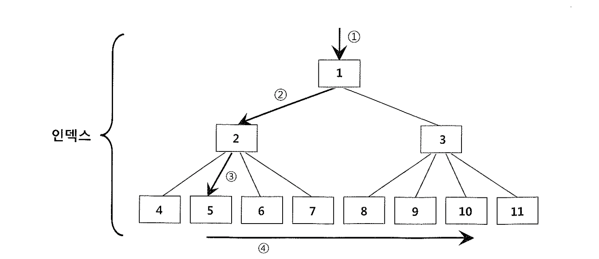
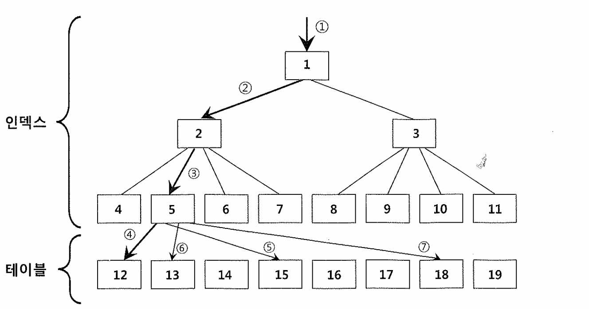

# 04. Prefetch


- 본 절에서 설명하는 Prefetch는 테이블 Prefetch와 인덱스 Prefetch를 지칭한다.
- 오라클을 포함한 모든 DBMS는 디스크 블록을 읽을 때 곧이어 읽을 가능성이 높은 블록을 미리 읽어 오는 Prefetch 기능을 제공한다.
- 디스크 I/O 비용이 높으므로 한번의 I/O Call을 통해 다량의 블록을 퍼 올릴 수 있다면 성능향상에 도움이 되기 때문이다.

- Prefetch는 한번에 여러 개 Single Block I/O를 동시 수행하는 것을 말한다.
- Multiblock I/O도 Prefetch 기능 중 하나이다. 테이블 Prefetch와 인덱스 Prefetch와 다른 점은 한 익스텐트에 속한 인접한 블록들을 Prefetch 한다는 점이다.
- **Prefetrch는 한번에 여러 개 Single Block I/O를 동시 수행하는 것을 말한다**
- Multiblock I/O는 한번의 I/O Call로써 서로 인접한 블록들을 같이 읽어 적재 하는 것이지만, 테이블 Prefetch와 인덱스 Prefetch는 인접하지 않는 블록을 적재 한다.

- 서로 다른 익스텐트에 위치한 블록을 배치방식으로 미리 적재하는 것으로 I/O Call을 병렬 방식으로 동시에 여러 개 수행하는 것이므로 읽어야 할 블록들이 서로 다른 디스크 드라이브에 위치한다면 Prefetch에 의한 성능 향상은 더욱 배가 된다.
- 오라클은 미리 적재했을 때 효과를 얻을 수 있는 오퍼레이션에만 이 기능을 적용하고, 그럼에도 Prefetch한 블록들이 실제 액세스로 연결되지 못한 채 캐시에서 밀려나는 비율이 높다면 더는 이 기능이 작동되지 못하도록 정지 시킨다.
- Prefetch된 블록들을 모니터링 하는 기능은 CKPT(SYS.X$KCBKPFS 뷰 참조) 프로세스가 맡는다.

```sql
-- SYS.X$KCBKPFS 정보
select * from X$KCBKPFS where PREFETCH_BLOCKS > 0;

ADDR                   INDX    INST_ID BUFFER_POOL_ID  TIMESTAMP PREFETCH_OPS PREFETCH_BLOCKS WASTED_BLOCKS CLIENTS_PREFETCH PREFETCH_LIMIT
---------------- ---------- ---------- -------------- ---------- ------------ --------------- ------------- ---------------- --------------
00007F5CB70ED540        100          1              3    6517084           53             312             0                1           5319
```


```sql
select name, value from v$sysstat
  2  where name in ('physical reads cache prefetch','prefetched blocks aged out before use');

NAME                                                                  VALUE
---------------------------------------------------------------- ----------
physical reads cache prefetch                                          8613
prefetched blocks aged out before use                                     0
```


- 앞으로 읽어야 할 블록들을 미리 적재하는 기능이므로 시스템 전반의 디스크 경합을 줄여주기 보다는 I/O를 위한 시스템 Call을 줄이고 개별 쿼리의 수행 속도를 향상시키는데 주로 도움을 준다.
- 데이터 블록을 읽는 도중에 물리적인 디스크 I/O가 필요할 때면 서버 프로세스는 I/O 서브시스템에 I/O Call을 발생시키고 잠시 대기 상태에 빠진다.
- 어차피 대기 상태에 잠시 쉬어야 하므로, 곧이어 읽을 가능성이 높은 블록들을 버퍼 캐시에 미리 적재해 놓는다면 대기 이벤트 발생횟수를 그만큼 줄일 수 있다.

- Prefetch는 db file parallel read 대기 이벤트로 측정된다.

##### 10046 이벤트 모니터링

```sql
   WAIT #2: nam='db file scattered read' ela= 16809 file#=511 block#=46077 blocks=4 obj#=79955 tim=245420303473
   WAIT #2: nam='*db file parallel read*' ela= 1166 file#=1 blocks=5 requests=5 obj#=79955 tim=245422093812
   WAIT #2: nam='*db file parallel read*' ela= 14151 file#=1 blocks=2 requests=2 obj#=79955 tim=245429134621
   WAIT #2: nam='db file scattered read' ela= 9371 file#=580 block#=45357 blocks=1 obj#=79955 tim=245440385315
   WAIT #2: nam='*db file parallel read*' ela= 13349 file#=1 blocks=4 requests=4 obj#=79955 tim=245447176624
   WAIT #2: nam='*db file parallel read*' ela= 13180 file#=1 blocks=4 requests=4 obj#=79955 tim=245454432524
```


## 1) 인덱스 Prefetch

- 오라클 7.2 버전부터 사용돼 온 기능이다.
- 브랜치 블록에서 앞으로 읽게 될 리프 블록 주소를 미리 얻을 수 있으므로 I/O Call이 필요한 시점에 미리 캐싱해 두는 것이 가능하다.




- ① -> ② -> ③ -> ④ 순으로 Index Range Scan을 진행
- 2번 브랜치 블록을 읽고 5번 리프 블록을 읽으려는 시점에 5번 블록이 버퍼 캐시에 없으면 물리적인 디스크 I/O가 필요
- 이때 6,7번 블록까지 같이 적재해 놓는다면, "④"번 작업 수행 시 리프 블록 스캔이 진행하는 동안 디스크 I/O때문에 대기할 가능성을 줄일 수 있다.
- 인덱스 Prefetch 기능이 가장 효과적일 수 있는 상황은 Index Full Scan이 일어날 때다.
- 부분 범위 처리 방식으로 중간에 멈추지만 않는다면 모든 인덱스 리프 블록을 읽게 되기 때문이다.
- Index Full Scan시 Prefetch 방식으로 I/O하려면 리프 블록 위쪽에 있는 브랜치 블록들을 추가로 읽어야 하기 때문에 Prefetch하지 않을 때 보다 I/O가 약간 더 발생한다.(일반적인 Index Full Scan 시에는 가장 왼쪽 브랜치 블록만 읽는다.)


##### Prefetch를 제어하는 파라미터

- _index_prefetch_factor : 기본값은 100이며, 이 값을 더 작게 설정할수록 옵티마이저는 인덱스 Prefetch를 더 선호하게 된다.
- _db_file_noncontig_mblock_read_count : 한번에 최대 몇 개 블록을 Prefetch 할지를 지정한다. 1로 지정하면 Prefetch 기능이 정지된다.


## 2) 테이블 Prefetch

- `테이블 Lookup Prefetch` 또는 `데이터 블록 Prefetch`
- 인덱스를 경유해 테이블 레코드를 액세스하는 도중 디스크에서 캐시로 블록을 적재해야 하는 상황이 발생할 수 있는데, 그때 다른 테이블 블록까지 미리 적재해 두는 기능이다.
- 리프 블록에 있는 인덱스 레코드는 논리적인 순서를 따라 읽는다. 읽는 도중에 디스크 I/O가 필요해지면 현재 읽던 리프 블록 내에서 앞으로 액세스해야 할 테이블 블록 주소 목록을 미리 취합 할 수 있다.




- ① -> ② -> ③ -> ④ -> ⑤ -> ⑥ -> ⑦순서로 진행된다.
- 5번 인덱스 리프 블록을 읽고 12번 테이블 블록을 읽으려는 시점에 12번 블록이 버퍼 캐시에 없으면 물리적인 디스크 I/O가 필요하다.
- 이때, 13, 15, 18번 블록까지 같이 적재해 놓는 다면 ⑤,⑥,⑦번 액세스 시에 디스크 I/O 때문에 대기하지 않아도 된다.

- Random 액세스 성능을 향상시키려고 버퍼 Pinning과 테이블 Prefetch 같은 기능을 사용한다.
- 버퍼 Pinning은 Random 액세스에 의한 논리적 블록 요청 횟수를 감소시키고, 테이블 Prefetch는 디스크 I/O에 의한 대기 횟수를 감소 시킨다.
- 이 기능은 인덱스 클러스터링 팩터가 나쁠 때 특히 효과적으로 사용할 수 있다. 클러스터링 팩터가 나쁘면 논리적 I/O가 증가할 뿐 아니라 디스크 I/O도 많이 발생하기 때문이다.


##### 테이블 Prefetch를 제어하는 파라미터

- _table_lookup_prefetrch_size : 기본 값은 40
- _table_lookup_prefetch_thresh : 기본값은 2
- _multi_join_key_table_lookup : 기본값은 TRUE