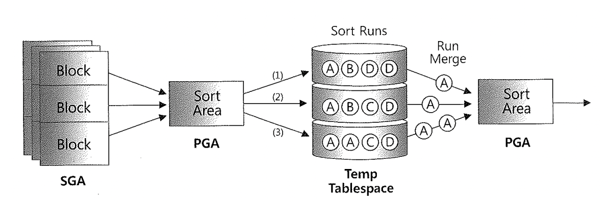

# 05. DirectPathIO

## $$$$$$$$$$$$$$$$$$$$$$$$$$$$

sql 예제는 2회차때,,

## $$$$$$$$$$$$$$$$$$$$$$$$$$$$

DirectPath IO 가 작동하는 경우

- Temp 세그먼트 블록들을 읽고 쓸 때
- 병렬 쿼리로 Full scan 을 수행할 때
- nocache 옵션으로 지정한 LOB 컬럼을 읽을 때
- Direct 옵션을 지정한 LOB 컬럼을 읽을 때
- Parallel DML 수행할 때
- Dierect Patch Insert 를 수행할때

## 1) Direct Path Read/Wirte Temp

- 데이터를 정렬할 때 PGA 에 할당되는 Sort Area 를 이용하는데 정렬할 데이터가 부족하면 TEMP 을 이용한다. 이 경우 Direct I/O 을 사용한다.
- (관련 Wait : direct path write temp , direct path read temp )

## 2) Direct Path Read

- 병렬쿼리로 Full Scan 하는 경우 Direct Path 사용.
- Direct Path Read 하는 경우 버퍼캐시에 읽을 관련된 데이터가 있을 수 있으므로(즉 변경된 데이터) Check point가 발생하여 동기화를 먼저 시도한다.
- (관련 Wiat : Direct Path Read)

## 3) Direct Path Write

- 병렬로 DML 을 수행하거나 Direct path Insert 방식으로 데이터를 insert 하는 경우 발생한다 . (관련 Wait : Direct Path Write )

- insert .. select 문장에 /*+ append */ 힌트 사용
- 병렬 모드로 insert
- Direct 옵션을 지정하고 SQL*Loader(sqlldr)로 데이터 로드
- CATS (Create table .. as select ) 문장을 사용.

#### Conventional insert  (일반적)

  Freelist를 통해 데이터를 삽입할 블록을 할당. 
  Freelist를 조회하면서 Random 액세스 방식으로 버퍼 캐시에서 해당 블록을 찾고,
  없으면 데이터파일에서 읽어 캐시에 적재한 후에 데이터를 삽입하므로 
  대량의 데이터를 insert 할 때 매우 느리다.

#### Direct Path Insert

  Freelist를 참조하지 않고 테이블 세그먼트 또는 각 파티션 세그먼트의 HWM 바깥 
  영역에 데이터를 순차적으로 입력한다
  Direct Path Insert에서는 Redo와 Undo 엔트리를 로깅하지 않도록 옵션을 
  줄 수도 있어 훨씬 빠르다.

- 이 경우 Redo 엔트리를 기록 하지 않는다는것은 리커버리 단계시 롤포워드 작업에 복구가 불가능 합니다.
- 무엇보다 이 작업을 하면 Exclusive 모드 테이블 Lock이 걸린다.
- 일반적으로 트랜잭션이 빈번한 업무시간에 사용하지 않습니다.(초기적재 및 배치 위주로 진행됩니다.)
- 이외 Segment 할당 사이즈, Sort area 관련 등 관련된 것들이 있습니다.

**nogogging 테스트 필요**