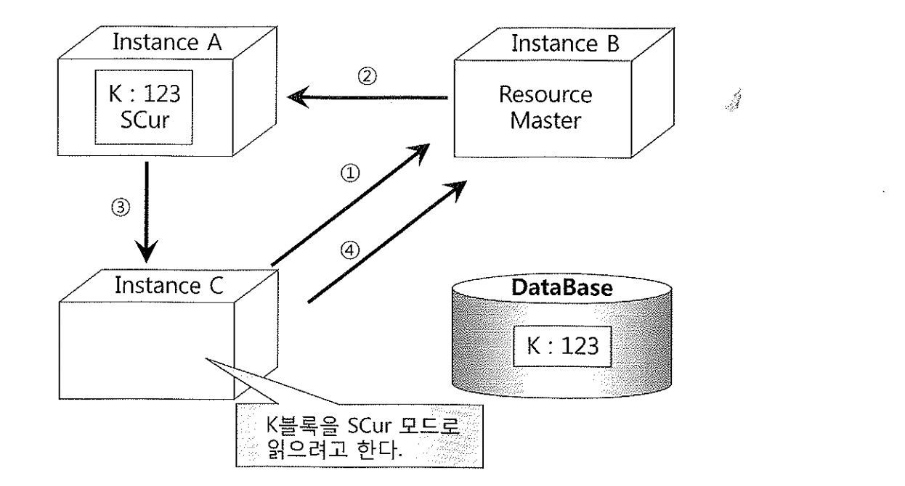

# 06. RAC캐시퓨전

- 데이터베이스의 부하를 분산할 목적으로 시스템마다 다양한 분산전략을 사용하는데, 최근에는 데이터베이스를 물리적으로 분할하여 분산하는 방식이 아니라, 데이터베이스를 하나로 두되 이를 엑세스하는 인스턴스를 여러 개 두는 공유 디스크(Shared Disk)방식의 데이터베이스 클러스터링 기법이 도입되기 시작했다.
- 오라클 RAC모델은 공유디스크 방식에 기반을 두면서 인스턴스 간에 버퍼캐시까지 공유하는 캐시퓨전(Cache Fusion)기술로 발전하였다.
- 많은 장점이 있는데도 불구하고, 튜닝이 잘 되지 않아 많은 블록I/O를 일으키는 애플리케이션에서 RAC를 도입하면, 단일 인스턴스 환경에서보다 더욱 심각한 성능저하현상이 나타나며, RAC 모델특성 상 발생하는 성능문제를 해결하기 위해서는 캐시퓨전 프로세싱 원리를 이해할 필요가 있다.

- 글로벌 캐시
  - 클러스터링 되어있는 모든 인스턴스 노드의 버퍼캐시를 하나의 버퍼캐시로 간주한다.
  - 모든 데이터 블록에 대해서 마스터 노드가 각각 정해져 있고, 그 노드를 통해서 글로벌 캐시에 캐싱되어 있는 블록의 상태와 Lock정보를 관리한다.
- Current 블록
  - Shared 모드 Current(SCur)와 Exclusive 모드 Current(XCur)로 나뉨
  - **SCur상태의 블록은 동시에 여러 노드에 캐싱될 수 있지만, XCur상태의 블록은 단 하나의 노드에만 존재할 수 있다.**

- RAC 노드간 버퍼캐시를 공유하면서 블록을 서로 주고받는 전송 매커니즘은 5가지로 나누어 설명할 수 있다.

### (1) 전송 없는 읽기: Read with No Transfer

##### 노드A가 K블록을 읽는다

1. A노드는 그 블록의 리소스 마스터인 B 노드에게 전송 요청을 보낸다. 이때 gc cr request 이벤트에서 대기한다.
2. B노드는 현재 어떤 노드에도 K블록을 캐싱하고 있지 않음을 확인하고 A노드에게 데이터파일에서 직접 블록을 SCur 모드로 읽도록 권한을 부여한다.
3. A노드는 디스크에서 블록을 읽어 로컬 캐시에 캐싱한다.

### (2) 읽기/읽기 전송: Read to Read Transfer

##### 노드C가 K블록을 읽는다

1. C노드는 리소스 마스터인 B노드에게 K블록에 대한 전송 요청을 보낸다.
2. B노드는 현재 K블록을 A노드가 캐싱하고 있음을 확인하고 C노드에 블록을 전송해 주도록 A노드에게 지시한다.
3. A노드는 C노드에게 블록을 전송해 준다.
4. C노드는 블록을 성공적으로 전송받아 SCur 모드로 캐싱하게 되었음을 알리려고 마스터 노드인 B에게 메시지를 보낸다

### (3) 읽기/쓰기 전송: Read to Write Transfer

##### 노드C가 K블록을 업그레이드한다

1. C노드는 마스터 노드인 B에게 K블록을 XCur 모드로 업그레이드하겠다고 요청한다.
2. B노드는 현재 K블록을 A노드도 캐싱하고 있음을 확인하고 Null 모드로 다운그레이드하도록 지시한다.
3. A노드는 C노드에게 Null 모드로 다운그레이드 했음을 알려준다.
4. C노드는 K블록을 XCur모드로 업그레이드하고 그 결과를 마스터 노드인 B에게 알려준다. 이때 A노드의 K블록이 Null 모드로 다운그레이드 된것까지 함께 알려준다.

- C노드의 K블록 SCN이 123 -> 154로 증가한다.

### (4) 쓰기/쓰기 전송: Write to Write Transfer

##### 노드A가 K블록을 업그레이드한다

1. A노드는 마스터 노드인 B에게 K블록을 XCur 모드로 요청한다.
2. B노드는 현재 K블록을 C노드가 XCur 모드로 캐싱하고 있음을 확인하고 A노드에게 보내주도록 지시한다.
3. C노드는 A노드에게 블록을 전송하고 자신이 갖고 있던 블록은 Null 모드로 다운그레이드한다.
4. A노드는 K블록을 XCur 모드로 캐싱하게 됐음을 B노드에게 알려준다.

- A노드의 K블록 SCN이 154 -> 168로 증가한다.

다른 인스턴스가 갱신 중인 블록을 읽고자 할 때 로우 Lock이 해제될 때까지 기다리지 않고 로우Lock이 설정된 채, 블록을 주고 받는다.

### (5) 쓰기/읽기 전송: Write to Read Transfer

##### 노드C가 K블록을 읽는다

1. C노드는 마스터 노드인 B에게 K블록을 SCur 모드로 요청한다.
2. B노드는 현재 K블록을 A노드가 XCur 모드로 캐싱하고 있음을 확인하고 C노드에게 보내주도록 지시한다.
3. A노드는 C노드에게 블록을 전송하고 자신일 갖고 있던 블록은 SCur모드로 다운그레이드한다.
4. C노드는 K블록을 SCur모드로 캐싱하게 됐음을 B노드에게 알려준다. 이때 A노드에 캐싱돼 있던 블록이 SCur모드로 다운그레이드된 사실까지 함께 알려준다.

~~~
XCur모드 블록을 가지고 있는경우, 이 블록의 커밋여부에 따라 처리가 다르다.
커밋하지 않았으면 Current블록을 보내지 않고 CR Copy를 만들어 전송한다.
커밋되었다면 일정 횟수까지는 CR Copy를 전송하고, 일정 횟수가 넘어가면 Current 블록을 보내준다.
CR Copy를 보내는 횟수는 \_fairness_threshold 파라미터에 의해 결정된다.
~~~

