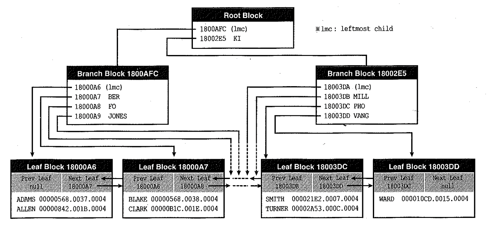
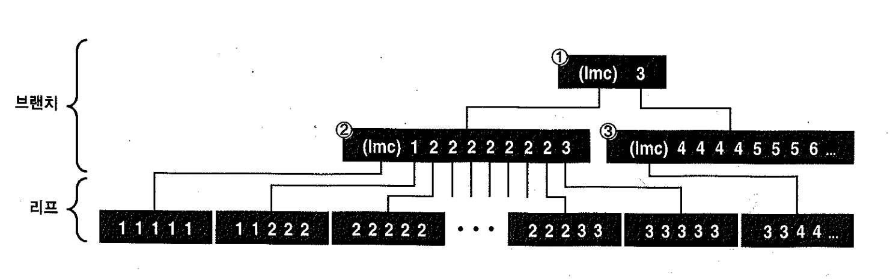
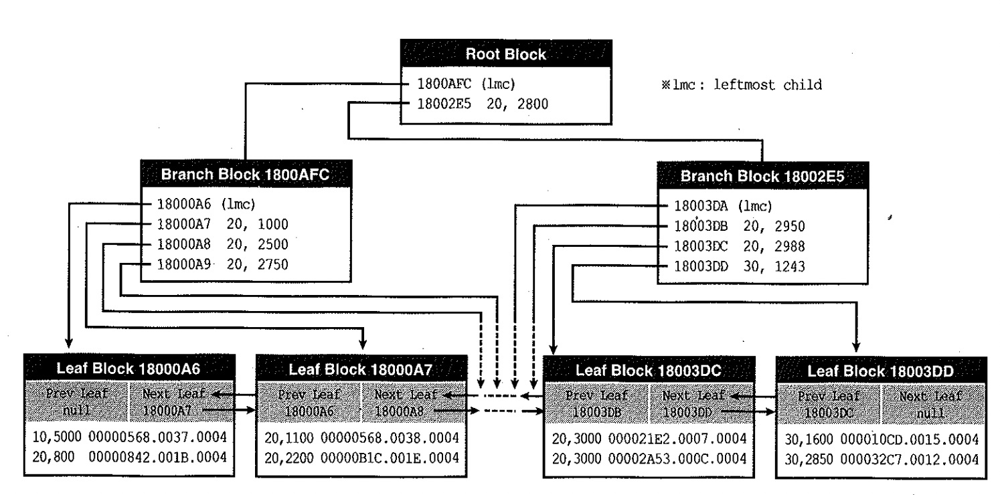

# 01. 인덱스구조


## 1) 범위 스캔

- 인덱스는 키 컬럼 순으로 정렬돼 있기 때문에 특정 위치에서 스캔을 시작해 검색 조건에 일치하지 않는 값을 만나는 순간 멈추는데, 이것이 Range Scan이다.
- 테이블범위스캔은 6절 IOT(index-organized table) 에서 설명한다.


## 2) 인덱스 기본 구조

- 루트(Root)를 포함한 브랜치(Branch)블록에 저장된 엔트리에는 하위 노드 블록을 찾아가기 위한 DBA(Data Block Address)정보를 갖음
- 최말단 리프(Leaf) 블록에는 인덱스 키 컬럼과 함께 해당 테이블 레코드를 찾아가기 위한 주소정보(rowid)를 갖음
- 오라클은 인덱스 구성 컬럼이 모두 null인 레코드를 저장하지 않음
- 인덱스와 테이블 레코드 간에는 서로 1:1 대응 관계를 갖음
- 브랜치에 저장된 레코드 개수는 바로 하위 레벨 블록 개수와 일치
- 테이블 레코드에서 값이 갱신되면 리프 노드 인덱스 키 값도 같이 갱신(delete&insert) : 브랜치 블록은 변경되지 않음
- 브랜치 노드는 인덱스 분할(split)에 의해 새로운 블록이 추가되거나 삭제될 때만 갱신





**LeftMost Child**

- 키 값을 갖지 않는 특별한 엔트리(lmc)
- lmc는 명시적인 키 값을 갖지 않더라도 '키 값을 가진 첫 번째 엔트리보다 작은 값의 의미
- 브랜치 블록의 자식 노드 중 가장 왼쪽 끝에 위치한 블록을 가리킴


##### 인덱스 기본 구조 요약

- 리프 노드상의 인덱스 레코드와 테이블 레코드 간에는 1:1관계
- 리프 노드상의 키 값과 테이블 레코드 키 값은 서로 일치
- 브랜치 노드상의 레코드 개수는 하위 레벨 블록 개수와 일치
- 브랜치 노드상의 키 값은 하위 노드가 갖는 값의 범위를 의미


## 3) 인덱스 탐색

- 수평 탐색 : 범위 스캔(Range Scan)을 의미하며, 리프 블록을 인덱스 레코드 간 논리적 순서에 따라 좌에서 우, 또는 우에서 좌로 스캔
- 수직적 탐색 : 수평적 탐색을 위한 시작 지점을 찾는 과정. 루트에서 리프블록까지 아래쪽으로 진행


1. 루트 블록을 스캔하면서 왼쪽 브랜치 블록으로 갈지 오른쪽 브랜치 블록으로 갈지를 결정.
2. 찾아간 브랜치 블록을 스캔하면서 그 다음 찾아갈 인덱스 블록을 탐색
3. 다음이 리프블록 이므로 데이터를 찾거나 못 찾거나 둘 중 하나다.
   1. 찾으면 수평적 탐색 과정으로 넘어가고, 못 찾으면 거기서 인덱스 탐색을 마친다.
4. 인덱스 리프 블록을 스캔하면서 값이 맞는지 확인한다.
5. 데이터 값이 맞으면 rowid를 이용하여 해당 테이블 레코드를 찾아가 필요한 다른 컬럼 값들을 읽는다.
   1. 만약 쿼리에서 인덱스 컬럼만 필요로 한다면 이과정은 생략 된다.
6. 4번과 5번 과정을 반복하다가 검색조건을 만족하지 못하는 레코드를 만나는 순간 멈춘다.


#### 브랜치 블록 스캔

- 방금 설명한 인덱스 탐색 과정 중 1번과 2번에서 브랜치 블록을 스캔할 때는 뒤에서부터 스캔하는 방식이 유리
- 왼쪽 브랜치 블록을 예로 들면, 뒤에서부터 스캔할 대는 'CLARK' 보다 작은 첫 번째 레코드('BER')를 만나는 순간 바로 하위 블록으로 내려가면 됨.
- 앞에서부터 스캔할때대는 'CLARK'보다 크거나 같은 첫 번째 레코드('FO')를 만ㅌ나는 순간 멈춰서 한 칸 뒤로 이동해야 하기 때문
- 브랜치 블록을 따라 수직적 탐색을 진행할 때는 찾고자 하는 값보다 키 값이 작은 엔트리를 따라 내려감.





- 이 과정을 설명할 때는 뒤쪽부터 스캔한다고 가정(실제로 뒤쪽부터 스캔하는지는 알 수 없음)


1. 1번 루트 블록에서 lmc가 가리키는 2번 브랜치 노드로 따라 내려 감 (정확히 같은 값이면 왼쪽 브랜치로 이동)
   1. 만약 같은 값인 3을 따라 3번 브랜치로 내려가면 2번 브랜치 끝에 놓인 3을 놓치게 되기 대문에 2번으로 감
2. 2번 브랜치에서 맨 뒤쪽 3부터 거꾸로 스캔하다가 2를 만나는 순간 리프 블록으로 내려감
3. 거기서 키 값이 3인 첫 번째 레코드를 찾아 오른쪽으로 리프 블록을 스캔해 나가면 조회 조건을 만족하는 값을 모두 찾을 수 있음


#### 결합 인덱스 구조와 탐색




- emp 테이블에 deptno + sal 컬럼 순으로 생성한 결합 인덱스
- deptno=20 and sal >=2000' 조건으로 쿼리할 경우 두번째 리프 블록, 두번째 레코드부터 스캔이 시작
- 수직적 탐색 과정에서 deptno뿐만 아니라 sal값에 대한 필터링도 같이 이루어 지기 때문
- 마지막 블록 첫 번 째 레코드에서 스캔을 멈추게 될 것


## 4) ROWID 포맷

- rowid에는 데이터파일 번호, 블록 번호, 로우 번호 같은 테이블 레코드의 물리적 위치정보를 포함
- 데이터 블록 헤더에 오브젝트 및 데이터파일 번호, 상대적인 블록 번호가 저장
- 레코드를 읽는 시점에, 현재 도달한 블록 헤더와 각 레코드에 할당된 슬롯 번호를 이용해 가공
- 오라클 7버전 까지 rowid는 내부적으로 6 바이트 크기를 차지하며, 파일번호, 블록번호, 로우 번호로 구성
- 오라클 8부터 rowid 크기를 10바이트로 증가. 데이터베이스 저장해야할 데이터량이 점차 증가해 더 많은 데이터 파일을 관리할 필요가 생겼고 파티션 기능을 지원하기 위해 오브젝트 번호까지 저아할 필요가 생겼음


##### 항상 10바이트로 저장하는 것이 아니라 테이블과 인덱스 유형에 따라 여전히 6바이트를 사용

- 파티션되지 않은 일반 테이블에 생성한 인덱스
- 파티션된 테이블에 생성한 로컬 파티션(Local Partitioned) 인덱스


##### 아래의 경우는 10Byte 사용

- 파티션 테이블에 생성한 글로벌 파티션(Global Partitioned) 인덱스
- 파티션 테이블에 생성한 비파티션(Non Partitioned) 인덱스


달라진 새로운 rowid 포맷을 '확장(Extend) rowid 포맷'이라 부르고, 이전에 사용된 포맷은 '제한(Restircted) Rowid 포맷'


##### 오라클 7까지 사용하던 '제한 rowid 포맷'

- 데이터파일 번호(4자리) : 로우가 속한 데이터파일 번호로서, 데이터베이스 내에서 유일한 값
- 블록 번호(8자리) : 해당 로우가 저장된 데이터 블록 번호이며, (테이블 스페이스가 아니라) 데이터파일 내에서의 상대적 번호
- 로우 번호(4자리) : 블록 내에서 각 로우에 붙여진 일련번호로서, 0부터 시작


##### 오라클 8부터 사용되기 시작한 '확장 rowid 포맷'

- 데이터 오브젝트 번호(6자리) : 데이터베이스 세그먼트를 식별하기 위해 사용되는 데이터 오브젝트 번호
- 데이터파일 번호(3자리) : 로우가 속한 데이터파일 번호(테이블스페이스 내에서의 상대적인 파일 번호)
- 블록 번호(6자리) : 해당 로우가 저장된 데이터 블록 번호이며, (테이블 스페이스가 아니라) 데이터파일 내에서의 상대적 번호
- 로우번호 (3자리) : 블록 내에서 각 로웨 붙여진 일련번호로서, 0부터 시작


~~~sql
SELECT 
  rowid 
FROM url_trace a 
--------------------------------------------
AAA6Y2AARAAAAkTAAA
AAA6Y2AARAAAAkTAAB
AAA6Y2AARAAAAkTAAC
AAA6Y2AARAAAAkTAAD
AAA6Y2AARAAAAkTAAE
AAA6Y2AARAAAAkTAAF
AAA6Y2AARAAAAkTAAG
AAA6Y2AARAAAAkTAAH
AAA6Y2AARAAAAkTAAI
AAA6Y2AARAAAAkTAAJ 
~~~


~~~sql
select rowid extended_format 
, dbms_rowid.rowid_to_restricted(rowid,0) restricted_format
, dbms_rowid.rowid_object(rowid) object
, dbms_rowid.rowid_relative_fno(rowid) file_o
, dbms_rowid.rowid_block_number(rowid) block_no
, dbms_rowid.rowid_row_number(rowid) row_number
, rowid 
FROM url_trace 
--------------------------------------------
AAA6Y2AARAAAAkTAAA	00000913.0000.0011	239158	17	2323	0	AAA6Y2AARAAAAkTAAA
AAA6Y2AARAAAAkTAAB	00000913.0001.0011	239158	17	2323	1	AAA6Y2AARAAAAkTAAB
AAA6Y2AARAAAAkTAAC	00000913.0002.0011	239158	17	2323	2	AAA6Y2AARAAAAkTAAC
AAA6Y2AARAAAAkTAAD	00000913.0003.0011	239158	17	2323	3	AAA6Y2AARAAAAkTAAD
AAA6Y2AARAAAAkTAAE	00000913.0004.0011	239158	17	2323	4	AAA6Y2AARAAAAkTAAE
AAA6Y2AARAAAAkTAAF	00000913.0005.0011	239158	17	2323	5	AAA6Y2AARAAAAkTAAF
AAA6Y2AARAAAAkTAAG	00000913.0006.0011	239158	17	2323	6	AAA6Y2AARAAAAkTAAG
AAA6Y2AARAAAAkTAAH	00000913.0007.0011	239158	17	2323	7	AAA6Y2AARAAAAkTAAH
AAA6Y2AARAAAAkTAAI	00000913.0008.0011	239158	17	2323	8	AAA6Y2AARAAAAkTAAI
~~~


```sql
select rowid extended_format
       , dbms_rowid.rowid_to_restricted(rowid, 0) restricted_format
       , dbms_rowid.rowid_object(rowid) object
       , dbms_rowid.rowid_relative_fno(rowid) file_no
       , dbms_rowid.rowid_block_number(rowid) block_no
       , dbms_rowid.rowid_row_number(rowid) row_number
  from   emp e
  where  empno = 7369;

EXTENDED_FORMAT    RESTRICTED_FORMAT      OBJECT    FILE_NO   BLOCK_NO ROW_NUMBER
------------------ ------------------ ---------- ---------- ---------- ----------
AAAMgzAAEAAAAAgAAA 00000020.0000.0004      51251          4         32          0

select dbms_rowid.rowid_type('AAAM6PAAEAAAE2cAAA') extended_format
       , dbms_rowid.rowid_type('00004D9C.0000.0004') restricted_format
  from   dual;

EXTENDED_FORMAT RESTRICTED_FORMAT
--------------- -----------------
              1                 0
```