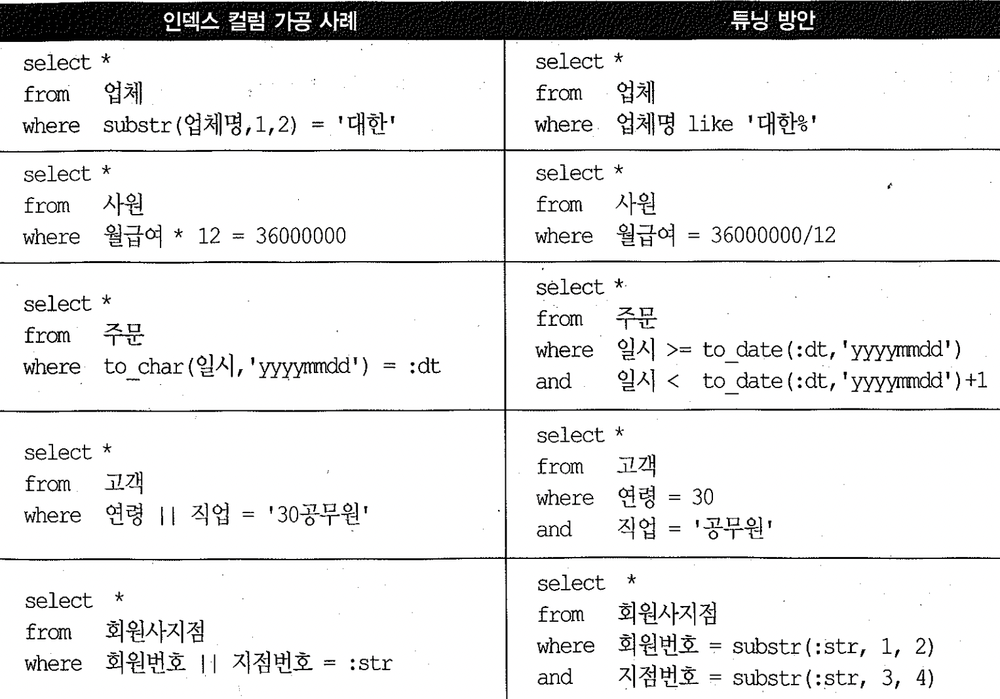

# 02. 인덱스 기본원리


조건절에 인덱스를 작성하더라도 인덱스 범위스캔이 안되는 경우가 있다. 


## 1) 인덱스 사용이 불가능하거나 범위 스캔이 불가능한 경우

1. 인덱스 컬럼을 조건절에서 가공 : where substr(업체명,1,2) ='대한'
2. 부정형 비교 : where 직업 <> '학생'
3. is not null 조건 ( 부정형 비교에 해당) : where 부서코드 is not null

위 세가지는 범위스캔만 불가능하며, index full scan 은 가능
세번째 의 경우 '부서코드' 단일 컬럼에 인덱스가 존재한다면 인덱스 전체를 스캔하면서 얻은 레코드가 전부 조건을 만족(오라클은 null 값은 인덱스 저장하지 않음)


- 인덱스 사용 불가 is null : where 연락처 is null
  (예외)

  ==> not null 제약조건으로 인덱스 스캔을 통해 공집합을 리턴
  not null 을 사용하더라도 다른 인덱스 구성컬럼에 is null 이외 조건식이 있으면 index Range Scan 가능 (선두컬럼이 조건에 누락되지 않아야 함)


## 2) 인덱스 컬럼의 가공




### 튜닝 사례

| 전제조건                                                 | 컬럼 가공                                                    | 튜닝                                                         | 이슈                                                         |
| :------------------------------------------------------- | :----------------------------------------------------------- | :----------------------------------------------------------- | ------------------------------------------------------------ |
| null 은 원래포함 안됨.                                   | select * from 주문 where nvl(주문수량， 0) >= 100            | select * from 주문 where 주문수량 >= 100                     | null 은 원래포함 안됨                                        |
| 컬럼이 null이다.                                         | select * from 주문 where nvl(주문수량， 0) < 100             | 해결1) select * from 주문 where 주문수량 < 100 or 주문수량 is null<br />해결2) create index 주문_x01 on 주문 (nvl(주문수량， 0)); | 주문수량 컬럼이 not null이 아니면 테이블 풀 스캔이 불가피하다.(해결1)혹은 함수인덱스로 해결할 수 있다.(해결2)<br /> |
| PK : 지수구분코드+지수업종코드+거래일자 INDEX : 거래일자 | where 거래일자 between :startDate and :endDate and 지수구분코드 \ | \| 지수업종코드 in ('1001', '2003')                          | **IN-List 활용** where 거래일자 between :startDate and :endDate and ( 지수구분코드 , 지수업종코드) in (('1','001'), ('2','003')) |
| PK : 수신번호 INDEX : 정정대상접수번호+금감원접수번호    | where decode ( 정정대상접수번호 , lpad(' ', 14), 금감원접수번호,정정대상접수번호) = :접수번호 | **decode 조건절 재구성** where 정정대상접수번호 in (:접수번호, lpad(' ', 14)) and 금감원접수번호 = decode( 정정대상접수번호, lpad(' ', 14 )，:접수번호, 금감원접수번호 ) |                                                              |


## 3) 묵시적 형변환

- 숫자형과 문자형이 비교될때 숫자형이 우선

```sql
개선 전: and y.대상연월(+) = substr(x.파트너지원요청일자，1, 6) - 1 
			내부적으로 변환되면 : and to_number(y.대상연월(+)) = to_number(substr(x.파트너지원요청일자，1, 6)) - 1 
			와 같이 변경되어 인덱스컬럼을 가공한 꼴이 된다.
개선 후: and y.대상연월(+) = to_char(add_month(to_date(x.파트너지원요청일자，'yyyymmdd'),- 1), 'yyyymmdd')   
```


### 묵시적 형변환 사용시 주의사항

- 성능뿐 아니라 쿼리수행도중 에러나 결과가 틀릴수 있음이 중요

#### 숫자형(n_col) 과 문자형(v_col) 컬럼 비교시 숫자형으로 변환될때 변화할수 없는 문자열이 있을수있음

~~~sql
# 기본적으로 v_col이 숫자형으로 변환되지만, 숫자형 변환이 불가한 경우 쿼리 수행 중 에러가 발생함.
where n_col = v_col 
~~~

```sql
# like는 n_col이 문자형으로 변환된다.
where n_col like v_col || '%'  =>  where to_char(n_col) like v_col || '%'
```

#### decode 함수 묵시적 형변환 : decode(a,b,c,d) 에서 데이터타입은 c 가 결정

1) c 문자형 d 숫자형일경우 d 가 문자형으로 변환
2) c 가 null 이면 varchar2 취급

```sql
개선 전: max(decode(job ，'PRESIDENT'，NULL, sal)) max_sa12
개선 후: max(decode(job ，'PRESIDENT'，to_number(NULL), sal)) max_sa12
```


### 함수기반 인덱스(FBI) 활용

- 개발완료 시점에 성능이슈의 원인이 묵시적 형변환이며, 프로그램 수정 여유가 없을 때 활용 될수 있으나 권장할만한 해법은 아님


~~~sql
create table emp as select * from scott.emp;
alter table emp add v_deptno varchar2(2);
update emp set v_deptno = deptno;

create index emp_x01 on emp(v_deptno);
set autotrace traceonly exp;

select * from emp where v_deptno = 20;

drop index emp_x01;

create index emp_x01 on emp( to_number(v_deptno) ) ;
select * from emp where v_deptno = 20;
~~~


