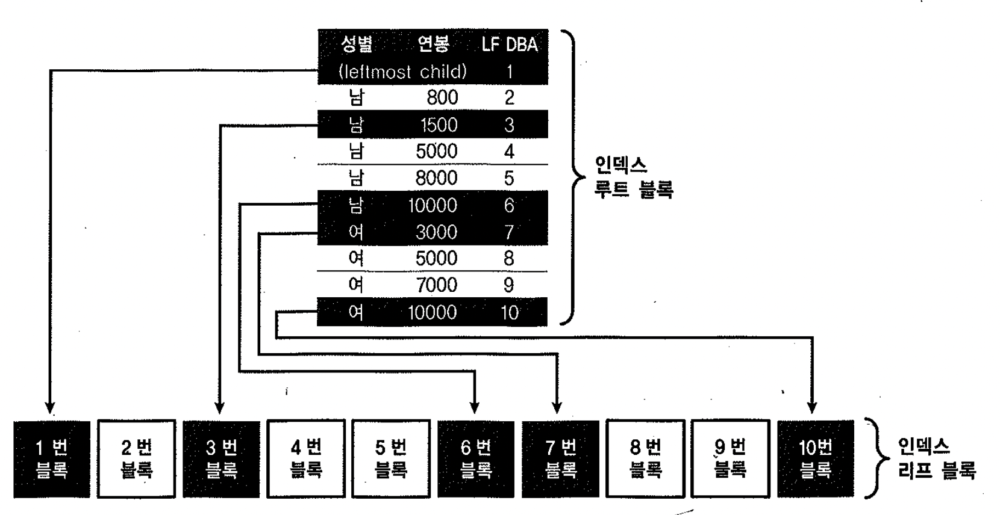

# 03. 다양한 인덱스 스캔방식


## 1) Index Range Scan

- 정의 : 인덱스 루트 블록에서 리프 블록까지 수직적으로 탐색한 후에 리프 블록을 필요한 범위만 스캔하는 방식
- B*Tree 인덱스의 가장 일반적이고 정상적인 액세스 방식
- 중요 point : 인덱스를 스캔하는 범위(range)를 얼마만큼 줄일 수 있느냐와 테이블로 액세스하는 횟수를 얼마만큼 줄일 수 있느냐 인덱스를 구성하는 선두 컬럼이 조건절에 사용되어야 index range scan 가능
- Index range scan과정을 거쳐 생성된 결과집합은 인덱스 컬럼 순으로 정렬 : sort order by 연산을 생략하거나 min/max 값을 빠르게 추출 가능


```sql
create index emp_idx on emp (ename, sal);
set autotrace traceonly explain;
select * from emp where deptno=20;

Execution Plan
----------------------------------------------------------
Plan hash value: 2468466201

----------------------------------------------------------------------------------------------
| Id  | Operation                   | Name           | Rows  | Bytes | Cost (%CPU)| Time     |
----------------------------------------------------------------------------------------------
|   0 | SELECT STATEMENT            |                |     5 |   160 |     2   (0)| 00:00:01 |
|   1 |  TABLE ACCESS BY INDEX ROWID| EMP            |     5 |   160 |     2   (0)| 00:00:01 |
|*  2 |   INDEX RANGE SCAN          | EMP_DEPTNO_IDX |     5 |       |     1   (0)| 00:00:01 |
----------------------------------------------------------------------------------------------

Predicate Information (identified by operation id):
---------------------------------------------------

   2 - access("DEPTNO"=20)
```


## 2) Index Full Scan

- 수직적 탐색 없이 인덱스 리프 블록을 처음부터 끝까지 수평적으로 탐색하는 방식
- 최적의 인덱스가 없을 때 차선으로 선택
- 효용성 : 인덱스 선두 컬럼이 조건절에 없으면 Table Full Scan을 고려하나, Table Full Scan보다 I/O를 줄일 수 있거나 정렬된 결과를 쉽게 얻을 수 있을 경우 `Index Full Scan` 선택
- 인덱스를 이용한 sort 연산 대체 : `first_rows`
- 전체 집합 중 처음 일부만을 빠르게 리턴해야하므로 옵티마이저는 전략적으로 `Index Full Scan` 수행
- 만약 결과 집합이 많을 경우 데이터 읽기를 멈추지 않고 끝까지 fetch한다면 인덱스 스캔이 테이블 스캔보다 불리 : 많은 I/O를 일으키면서 서버 자원을 낭비 초래


```sql
create index emp_idx on emp(ename,sal);

인덱스가 생성되었습니다.


1. 인덱스 첫 번째 컬럼이 조건절에서 사용되지 않았으나 ename으로 정렬해야 하므로 emp_idx 인덱스 사용하는 것이 Table Full Scan보다 유리
  1) INDEX FULL SCAN 선택
set autotrace traceonly explain
select * from emp where sal > 2000 order by ename; 

Execution Plan
----------------------------------------------------------
Plan hash value: 737262432

---------------------------------------------------------------------------------------
| Id  | Operation                   | Name    | Rows  | Bytes | Cost (%CPU)| Time     |
---------------------------------------------------------------------------------------
|   0 | SELECT STATEMENT            |         |    10 |   320 |     2   (0)| 00:00:01 |
|   1 |  TABLE ACCESS BY INDEX ROWID| EMP     |    10 |   320 |     2   (0)| 00:00:01 |
|*  2 |   INDEX FULL SCAN           | EMP_IDX |    10 |       |     1   (0)| 00:00:01 |
---------------------------------------------------------------------------------------

Predicate Information (identified by operation id):
---------------------------------------------------

   2 - access("SAL">2000)
       filter("SAL">2000)

  2) TABLE ACCESS FULL 선택 : order by ename이 빠짐
set autotrace traceonly explain
select * from emp where sal > 2000;

Execution Plan
----------------------------------------------------------
Plan hash value: 3956160932

--------------------------------------------------------------------------
| Id  | Operation         | Name | Rows  | Bytes | Cost (%CPU)| Time     |
--------------------------------------------------------------------------
|   0 | SELECT STATEMENT  |      |    10 |   320 |     3   (0)| 00:00:01 |
|*  1 |  TABLE ACCESS FULL| EMP  |    10 |   320 |     3   (0)| 00:00:01 |
--------------------------------------------------------------------------

Predicate Information (identified by operation id):
---------------------------------------------------

   1 - filter("SAL">2000)


```


### 인덱스를 이용한 소트 연산 대체

책에서는 first_rows 힌트의 사용으로인해 옵티마이저는 소트연산을 생략함으로써 전체 집합 중 처음 일부만을 빠르게 리턴할 목적으로 
Index Full Scan방식을 선택 했다고 하나, 실제 테스트에서는 힌트의 사용 유무와 상관없이 Index Full Scan방식이 선택됨

~~~sql
set autotrace traceonly explain
select /*+ first_rows */ * from emp where sal > 1000 order by ename;

Execution Plan
----------------------------------------------------------
Plan hash value: 737262432

---------------------------------------------------------------------------------------
| Id  | Operation                   | Name    | Rows  | Bytes | Cost (%CPU)| Time     |
---------------------------------------------------------------------------------------
|   0 | SELECT STATEMENT            |         |    13 |   416 |     2   (0)| 00:00:01 |
|   1 |  TABLE ACCESS BY INDEX ROWID| EMP     |    13 |   416 |     2   (0)| 00:00:01 |
|*  2 |   INDEX FULL SCAN           | EMP_IDX |    13 |       |     1   (0)| 00:00:01 |
---------------------------------------------------------------------------------------

Predicate Information (identified by operation id):
---------------------------------------------------

   2 - access("SAL">1000)
       filter("SAL">1000)
~~~


~~~sql
set autotrace traceonly explain
select * from emp where sal > 1000 order by ename;

Execution Plan
----------------------------------------------------------
Plan hash value: 737262432

---------------------------------------------------------------------------------------
| Id  | Operation                   | Name    | Rows  | Bytes | Cost (%CPU)| Time     |
---------------------------------------------------------------------------------------
|   0 | SELECT STATEMENT            |         |    13 |   416 |     2   (0)| 00:00:01 |
|   1 |  TABLE ACCESS BY INDEX ROWID| EMP     |    13 |   416 |     2   (0)| 00:00:01 |
|*  2 |   INDEX FULL SCAN           | EMP_IDX |    13 |       |     1   (0)| 00:00:01 |
---------------------------------------------------------------------------------------

Predicate Information (identified by operation id):
---------------------------------------------------

   2 - access("SAL">1000)
       filter("SAL">1000)
~~~


~~~sql
set autotrace traceonly explain
select * from emp where sal > 1000;

Execution Plan
----------------------------------------------------------
Plan hash value: 3956160932

--------------------------------------------------------------------------
| Id  | Operation         | Name | Rows  | Bytes | Cost (%CPU)| Time     |
--------------------------------------------------------------------------
|   0 | SELECT STATEMENT  |      |    13 |   416 |     3   (0)| 00:00:01 |
|*  1 |  TABLE ACCESS FULL| EMP  |    13 |   416 |     3   (0)| 00:00:01 |
--------------------------------------------------------------------------

Predicate Information (identified by operation id):
---------------------------------------------------

   1 - filter("SAL">1000)
~~~


~~~sql
set autotrace traceonly explain
select /*+ first_rows */ * from emp where sal > 1000;

Execution Plan
----------------------------------------------------------
Plan hash value: 3956160932

--------------------------------------------------------------------------
| Id  | Operation         | Name | Rows  | Bytes | Cost (%CPU)| Time     |
--------------------------------------------------------------------------
|   0 | SELECT STATEMENT  |      |    13 |   416 |     3   (0)| 00:00:01 |
|*  1 |  TABLE ACCESS FULL| EMP  |    13 |   416 |     3   (0)| 00:00:01 |
--------------------------------------------------------------------------

Predicate Information (identified by operation id):
---------------------------------------------------

   1 - filter("SAL">1000)
~~~


## 3) Index Unique Scan

- 수직적 탐색만으로 데이터를 찾는 스캔 방식
- 작동 시점 : unique 인덱스를 통해 "=" 조건으로 탐색하는 경우
- 중복되지 않은 unique한 값을 "="조건으로 검색할 경우 해당 데이터 한 건을 찾는 순간 더 이상 탐색 하지 않음


**between**

- unique 결합인덱스에 대해 일부 컬럼만으로 검색 : index range scan으로 처리
  - ex) 주문상품 PK 인덱스 = 주문일자 + 고객 ID + 상품ID

- 주문일자와 고객 ID로만 검색하는 경우


```sql
create unique index pk_emp on emp(empno);
alter table emp add constraint pk_emp primary key(empno) using index pk_emp;

set autotrace traceonly explain
select empno,ename from emp where empno=7788;

Execution Plan
----------------------------------------------------------
Plan hash value: 2949544139

--------------------------------------------------------------------------------------
| Id  | Operation                   | Name   | Rows  | Bytes | Cost (%CPU)| Time     |
--------------------------------------------------------------------------------------
|   0 | SELECT STATEMENT            |        |     1 |     8 |     1   (0)| 00:00:01 |
|   1 |  TABLE ACCESS BY INDEX ROWID| EMP    |     1 |     8 |     1   (0)| 00:00:01 |
|*  2 |   INDEX UNIQUE SCAN         | PK_EMP |     1 |       |     0   (0)| 00:00:01 |
--------------------------------------------------------------------------------------

Predicate Information (identified by operation id):
---------------------------------------------------

   2 - access("EMPNO"=7788)
```


## 4) Index Skip Scan

- 조건절에 빠진 인덱스 선두 컬럼의 `distinct value` 개수가 적고 후행 컬럼의 distinct value 개수가 많을 때 유용
- root 또는 브랜치 블록에서 읽은 컬럼 값 정보를 이용해 조건에 부합하는 레코드를 포함할 가능성이 있는 리프 블록만 골라서 액세스하는 방식
- 첫 번째 리프 블록을 항상 방문하고 마지막 리프 블록도 항상 방문




##### 버퍼 pinning을 이용한 skip 원리

- 상위블록 방문 방법 : 브랜치 블록 버퍼를 pinning 한 채로 리프 블록을 방문했다가 다시 브랜치 블록으로 되돌아와 다음 방문할 리프 블록을 찾는 과정 반복
- 브랜치 블록들 간에도 서로 연결할 수 있는 주소정보를 갖지 않기 때문에 하나의 브랜치 블록을 모두 처리하고 나면 다시 그 상위 노드를 재방문하는 식으로 진행
- Root 또는 브랜치 블록을 재방문하더라도 pinning한 상태이므로 추가적인 블록 I/O는 발생하지 않음


##### index skip scan 작동 조건

- 최선두 컬럼은 입력하고 중간 컬럼에 대한 조건절이 누락된 경우
- Distinct Value가 적은 두 개의 선두컬럼이 모두 누락된 경우
- 선두컬럼이 부등호, between, like 같은 범위 검색 조건일 때

- 관련 힌트 : index_ss, no_index_ss


##### In-List Iterator 와 비교

- In-list Iterator : 조건절 in-list에 제공된 값의 종류만큼 인덱스 탐색을 반복 수행
- 제공하는 값이 적다면 빠른 결과 집합을 얻을 수 있음


##### index skip scan과 in-list iterator의 동작 원리

```sql
set autotrace traceonly explain
select * from emp where sal between 2000 and 4000;
       
Execution Plan
----------------------------------------------------------
Plan hash value: 3956160932

--------------------------------------------------------------------------
| Id  | Operation         | Name | Rows  | Bytes | Cost (%CPU)| Time     |
--------------------------------------------------------------------------
|   0 | SELECT STATEMENT  |      |     9 |   288 |     3   (0)| 00:00:01 |
|*  1 |  TABLE ACCESS FULL| EMP  |     9 |   288 |     3   (0)| 00:00:01 |
--------------------------------------------------------------------------

Predicate Information (identified by operation id):
---------------------------------------------------

   1 - filter("SAL">=2000 AND "SAL"<=4000)
   

set autotrace traceonly explain
select /*+ index_ss(emp emp_idx) */ * from emp where sal between 2000 and 4000;

Execution Plan
----------------------------------------------------------
Plan hash value: 302813946

---------------------------------------------------------------------------------------
| Id  | Operation                   | Name    | Rows  | Bytes | Cost (%CPU)| Time     |
---------------------------------------------------------------------------------------
|   0 | SELECT STATEMENT            |         |     9 |   288 |    15   (0)| 00:00:01 |
|   1 |  TABLE ACCESS BY INDEX ROWID| EMP     |     9 |   288 |    15   (0)| 00:00:01 |
|*  2 |   INDEX SKIP SCAN           | EMP_IDX |     7 |       |    14   (0)| 00:00:01 |
---------------------------------------------------------------------------------------

Predicate Information (identified by operation id):
---------------------------------------------------

   2 - access("SAL">=2000 AND "SAL"<=4000)
       filter("SAL">=2000 AND "SAL"<=4000)
       

set autotrace traceonly explain      
select * from emp where sal between 2000 and 4000 and job in ('MANAGER','ANALYST');

Execution Plan
----------------------------------------------------------
Plan hash value: 1754328461

--------------------------------------------------------------------------------------------
| Id  | Operation                    | Name        | Rows  | Bytes | Cost (%CPU)| Time     |
--------------------------------------------------------------------------------------------
|   0 | SELECT STATEMENT             |             |     4 |   128 |     2   (0)| 00:00:01 |
|   1 |  INLIST ITERATOR             |             |       |       |            |          |
|*  2 |   TABLE ACCESS BY INDEX ROWID| EMP         |     4 |   128 |     2   (0)| 00:00:01 |
|*  3 |    INDEX RANGE SCAN          | EMP_JOB_IDX |     6 |       |     1   (0)| 00:00:01 |
--------------------------------------------------------------------------------------------

Predicate Information (identified by operation id):
---------------------------------------------------

   2 - filter("SAL">=2000 AND "SAL"<=4000)
   3 - access("JOB"='ANALYST' OR "JOB"='MANAGER')
```


## 5) Index Fast Full Scan


- 인덱스 트리 구조를 무시하고 인덱스 세그먼트 전체를 multiblock read 방식으로 스캔
- multiblock read 방식 : 디스크로부터 대량의 인덱스 블록을 읽어야 하는 상황에서 큰 효과 발휘
- 물리적으로 디스크에 저장된 순서대로 인덱스 블록을 읽어 들임
- 인덱스가 파티션 돼 있지 않더라도 병렬 쿼리 가능(병렬 쿼리 시 direct path read 방식 사용하므로 I/O속도가 더 빨라짐)

##### 단점

- 인덱스 리프 노드가 갖는 연결 리스트 구조를 이용하지 않기 때문에 얻어진 결과집합이 인덱스 키 순서대로 정렬되지 않음
- 쿼리에 사용되는 모든 컬럼이 인덱스 컬럼에 포함 되어 있을 때만 사용 가능

- 관련 힌트 : index_ffs, no_index_ffs


##### Index Full Scan vs. Index Fast Full Scan

| Index Full Scan                                              | Index Fast Full Scan                                         |
| :----------------------------------------------------------- | :----------------------------------------------------------- |
| 1. 인덱스 구조를 따라 스캔 2. 결과 집합 순서 보장 3. Single Block I/O 4. 병렬스캔 불가(파티션 되어 있지 않을 경우) 5. 인덱스에 포함되지 않은 컬럼 조회 시에도 사용 가능 | 1. 세그먼트 전체를 스캔 2. 결과집합 순서 보장 안 됨 3. multiblock I/O 4. 병렬스캔 가능 5. 인덱스에 포함된 컬럼으로만 조회할 때 사용 가능 |