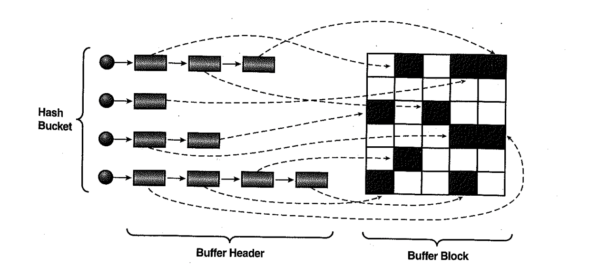

# 04. 테이블Random액세스부하

이번 절에서는 대량의 데이터를 엑세스 했을 때 테이블 Random 액세스의 큰 부하 원인을 찾아본다 5~6절에서 이에 대한 튜닝방안을 설명할 것이다.

## 1) 인덱스 ROWID에 의한 테이블 액세스

##### 물리적 주소? 논리적 주소?

- 오브젝트 번호, 데이터파일 번호, 블록 번호와 같은 물리적 요소들로 구성되어 있어 '물리적 주소 정소'라고도 함
- 보는 시작에 따라서는 rowid가 테이블 레코드로 직접 연결되는 구조가 아니므로 '논리적 주소정보'라고도 표현하기도 함.

##### 메인 메모리 DB와의 비교

- 메인 메모리 DB(MMDB)란 데이터를 모두 메모리에 로드해 놓고 메모리를 통해서만 I/O를 수행하는 DB
- OLTP성 오라클 DB경우 버퍼 캐시 히트율이 99%이상이므로 대부분 디스크를 경유하지 않고 메모리상에서 I/O를 수행하더라도 MMDB만큼 빠르지 않다.
- MMDB에서 인스턴스를 기동하면 디스크에 저장된 데이터를 버퍼 캐시로 로딩하고 인덱스를 실시간으로 만든다.
- 이때, 인덱스는 오라클처럼 디스크 상의 주소정보를 담는 게 아니라 메모리상의 주소정보(POINTER)를 담는다
- 오라클의 경우는 테이블 블록이 수시로 버퍼캐시에서 밀려났다가 다시 캐싱되며, 그때 마다 다른 공간에 캐싱되기 대문에 인덱스에서 직접 포인터로 연결할 수 없는 구조.
- 대신 디스크 상의 블록 위치 정보인 DBA를 해시 키 값으로 삼아 해싱 알고리즘을 통해 버퍼 블록을 찾는다.
- 매번 위치가 달라지더라도 캐싱되는 해시 버킷만큼은 고정적.

##### 인덱스 rowid에 의한 테이블 액세스 구조

- 오라클도 버퍼 Pinning 기법을 사용하여 포인터로 빠르게 액세스 하지만, 반복적으로 읽힐 가능성이 큰 블록에 대해서만 일부 적용
- 일반적인 인덱스 rowid에 의한 테이블 액세스는 실제로 고비용

- 인덱스에서 하나의 rowid를 읽고 DBA(Data Block Address, 디스크 상의 블록 위치 정보)를 해시 함수에 적용해 해시 값을 확인
- 각 해시 체인은 래치(Latch)에 의해 보호되므로 해시 값이 가리키는 해시 체인에 대한 래치(-> cache buffers chains 래치)를 얻으려고 시도
- 하나의 cache buffers chains 래치가 여러 개 해시 체인을 동시에 관리
- 다른 프로세스가 래치를 잡고 있으면 래치가 풀렸는지 확인하는 작업을 일정 횟수(기본 설정은 2,000번) 만큼 반복
- 그러고도 실패하면 CPU를 OS에 반환하고 잠시 대기 상태로 빠지는데, 이때 latch free(10g 부터는 latch : cache buffers chains으로 세분화) 대기 이벤트 발생
- 정해진 시간 동안 잠을 자다가 개어나서 다시 래치 상태를 확인하고, 게속해서 래치가 풀리지 않으면 또다시 대기 상태로 빠질 수 있음
- 래치가 해제되었다면 래치를 재빨리 획득하고 원하던 해시 체인으로 진입
- 거기서 데이터 블록이 찾아지면 래치를 해제하고 바로 읽으면 되는데, 앞서 해당 블록을 액세스한 프로세스가 아직 일을 마치지 못해 버퍼 LOCK을 쥔 상태라면 또 다시 대기.
- 이때 나타나는 대기 이벤트가 buffer busy waits
- 블록 읽기를 마치고 나면 버퍼 LOCK을 해제해야 하므로 다시 해시 체인 래치를 얻으려고 시도한다. 이때 또다시 경합이 발생할 수 있다.

##### 해시 체인을 스캔 했음에도 데이터 블록을 찾지 못했을 경우

- 디스크로부터 블록을 퍼 올리려면 우선 Free 버퍼를 할당 받아야 하므로 LRU 리스트를 스캔한다. 이를 위해서는 cache buffers lru chain 래치를 얻어야 하는데,
- 래치 경합이 심할때는 latch free이벤트(10g부터는 latch:cache buffers lru chain으로 세분화)가 나타날 수 있음
- LRU 리스트를 정해진 임계치만큼 스캔했는데도 FREE 상태의 버퍼를 찾지 못하면 dbwr에게 Dirty 버퍼를 디스크에 기록해 Free 버퍼를 확보해 달라는 신호를 보낸다.
- 그런 후 해당 작업이 끝날 때까지 잠시 대기 상태에 빠지는데, 이때 나타나는 대기 이벤트가 free buffer waits임
- Free 버퍼를 할당 받은 후에는 I/O 서브시스템에 I/O 요청을 하고 다시 대기 상태에 빠지는데, 이때 db file sequential read 대기 이벤트가 발생
- 마지막으로, 읽은 블록을 LRU 리스트 상에서 위치를 옮겨야 하기 대문에 다시 cache buffers lru chain 래치를 얻어야 하는데, 이 또한 원활하지 못할때는 latch free 이벤트 발생

#### 요약

요약하면, 인덱스 rowid는 테이블 레코드와 물리적으로 연결 돼 있지 않기 때문에 인덱스를 통한 테이블 액세스는 고비용 구조이다.

모든 데이터가 메모리에 캐싱되어 있더라도 테이블레코드를 찾기위해 매번 DBA를 해싱하고 래치획득 과정을 반복해야 하기 때문이며

동시 액세스가 심할때는 래치와 버퍼 Lock에 대한 경합까지 발생한다.

실행계획에 `Table Access By Index ROWID` 오퍼레이션이 있다면, 이번 절을 기억하기 바란다.