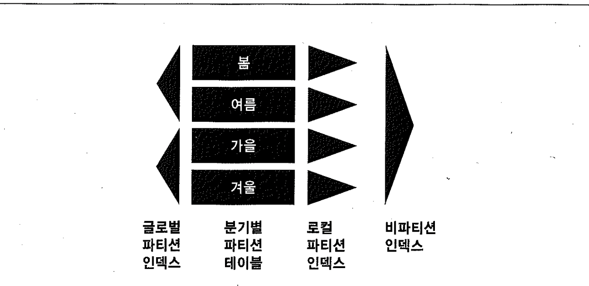

# 04. 테이블Random액세스부하


이번 절에서는 대량의 데이터를 엑세스 했을 때 테이블 Random 액세스의 큰 부하 원인을 찾아본다 5~6절에서 이에 대한 튜닝방안을 설명할 것이다.


## 1) 인덱스 ROWID에 의한 테이블 액세스


##### 물리적 주소? 논리적 주소?

- 오브젝트 번호, 데이터파일 번호, 블록 번호와 같은 물리적 요소들로 구성되어 있어 '물리적 주소 정소'라고도 함
- 보는 시작에 따라서는 rowid가 테이블 레코드로 직접 연결되는 구조가 아니므로 '논리적 주소정보'라고도 표현하기도 함.


##### 메인 메모리 DB와의 비교

- 메인 메모리 DB(MMDB)란 데이터를 모두 메모리에 로드해 놓고 메모리를 통해서만 I/O를 수행하는 DB
- OLTP성 오라클 DB경우 버퍼 캐시 히트율이 99%이상이므로 대부분 디스크를 경유하지 않고 메모리상에서 I/O를 수행하더라도 MMDB만큼 빠르지 않다.
- MMDB에서 인스턴스를 기동하면 디스크에 저장된 데이터를 버퍼 캐시로 로딩하고 인덱스를 실시간으로 만든다.
- 이때, 인덱스는 오라클처럼 디스크 상의 주소정보를 담는 게 아니라 메모리상의 주소정보(POINTER)를 담는다
- 오라클의 경우는 테이블 블록이 수시로 버퍼캐시에서 밀려났다가 다시 캐싱되며, 그때 마다 다른 공간에 캐싱되기 대문에 인덱스에서 직접 포인터로 연결할 수 없는 구조.
- 대신 디스크 상의 블록 위치 정보인 DBA를 해시 키 값으로 삼아 해싱 알고리즘을 통해 버퍼 블록을 찾는다.
- 매번 위치가 달라지더라도 캐싱되는 해시 버킷만큼은 고정적.


##### 인덱스 rowid에 의한 테이블 액세스 구조

- 오라클도 버퍼 Pinning 기법을 사용하여 포인터로 빠르게 액세스 하지만, 반복적으로 읽힐 가능성이 큰 블록에 대해서만 일부 적용
- 일반적인 인덱스 rowid에 의한 테이블 액세스는 실제로 고비용


- 인덱스에서 하나의 rowid를 읽고 DBA(Data Block Address, 디스크 상의 블록 위치 정보)를 해시 함수에 적용해 해시 값을 확인
- 각 해시 체인은 래치(Latch)에 의해 보호되므로 해시 값이 가리키는 해시 체인에 대한 래치(-> cache buffers chains 래치)를 얻으려고 시도
- 하나의 cache buffers chains 래치가 여러 개 해시 체인을 동시에 관리
- 다른 프로세스가 래치를 잡고 있으면 래치가 풀렸는지 확인하는 작업을 일정 횟수(기본 설정은 2,000번) 만큼 반복
- 그러고도 실패하면 CPU를 OS에 반환하고 잠시 대기 상태로 빠지는데, 이때 latch free(10g 부터는 latch : cache buffers chains으로 세분화) 대기 이벤트 발생
- 정해진 시간 동안 잠을 자다가 개어나서 다시 래치 상태를 확인하고, 게속해서 래치가 풀리지 않으면 또다시 대기 상태로 빠질 수 있음
- 래치가 해제되었다면 래치를 재빨리 획득하고 원하던 해시 체인으로 진입
- 거기서 데이터 블록이 찾아지면 래치를 해제하고 바로 읽으면 되는데, 앞서 해당 블록을 액세스한 프로세스가 아직 일을 마치지 못해 버퍼 LOCK을 쥔 상태라면 또 다시 대기.
- 이때 나타나는 대기 이벤트가 buffer busy waits
- 블록 읽기를 마치고 나면 버퍼 LOCK을 해제해야 하므로 다시 해시 체인 래치를 얻으려고 시도한다. 이때 또다시 경합이 발생할 수 있다.


##### 해시 체인을 스캔 했음에도 데이터 블록을 찾지 못했을 경우

- 디스크로부터 블록을 퍼 올리려면 우선 Free 버퍼를 할당 받아야 하므로 LRU 리스트를 스캔한다. 이를 위해서는 cache buffers lru chain 래치를 얻어야 하는데,
- 래치 경합이 심할때는 latch free이벤트(10g부터는 latch:cache buffers lru chain으로 세분화)가 나타날 수 있음
- LRU 리스트를 정해진 임계치만큼 스캔했는데도 FREE 상태의 버퍼를 찾지 못하면 dbwr에게 Dirty 버퍼를 디스크에 기록해 Free 버퍼를 확보해 달라는 신호를 보낸다.
- 그런 후 해당 작업이 끝날 때까지 잠시 대기 상태에 빠지는데, 이때 나타나는 대기 이벤트가 free buffer waits임
- Free 버퍼를 할당 받은 후에는 I/O 서브시스템에 I/O 요청을 하고 다시 대기 상태에 빠지는데, 이때 db file sequential read 대기 이벤트가 발생
- 마지막으로, 읽은 블록을 LRU 리스트 상에서 위치를 옮겨야 하기 대문에 다시 cache buffers lru chain 래치를 얻어야 하는데, 이 또한 원활하지 못할때는 latch free 이벤트 발생


#### 요약

요약하면, 인덱스 rowid는 테이블 레코드와 물리적으로 연결 돼 있지 않기 때문에 인덱스를 통한 테이블 액세스는 고비용 구조이다.

모든 데이터가 메모리에 캐싱되어 있더라도 테이블레코드를 찾기위해 매번 DBA를 해싱하고 래치획득 과정을 반복해야 하기 때문이며

동시 액세스가 심할때는 래치와 버퍼 Lock에 대한 경합까지 발생한다.

실행계획에 `Table Access By Index ROWID` 오퍼레이션이 있다면, 이번 절을 기억하기 바란다.


## 2) 인덱스 클러스터링 팩터


##### 군집성 계수(=데이터가 모여 있는 정도)

- 특정 컬럼을 기준으로 같은 값을 갖는 데이터가 서로 모여있는 정도를 의미


#### 클러스터링 팩터 조회

```sql
-- 테이블 레코드가 object_id 순으로 입력되도록 함
drop table t;

create table t
as
select * from all_objects
order by object_id;

create index t_object_id_idx on t(object_id);

create index t_object_name_idx on t(object_name);

-- 통계정보 수집
exec dbms_stats.gather_table_stats(user, 'T');

select i.index_name, t.blocks table_blocks, i.num_rows, i.clustering_factor
from   user_tables t, user_indexes i
where  t.table_name = 'T'
and    i.table_name = t.table_name;

INDEX_NAME                     TABLE_BLOCKS   NUM_ROWS CLUSTERING_FACTOR
------------------------------ ------------ ---------- -----------------
T_OBJECT_ID_IDX                         705      49831               685
T_OBJECT_NAME_IDX                       705      49831             25072
```

- clustering_factor 수치가 테이블 블록(table_blocks)에 가까울수록 데이터가 잘 정렬돼 있음을 의미
- 레코드 개수(num_rows)에 가까울수록 흩어져 있음을 의미


##### 인덱스 통계를 수집할 때 clustering_factor 계산을 위해 오라클이 사용하는 로직

1. counter 변수 하나 선언
2. 인덱스 리프 블록을 처음부터 끝까지 스캔하면서 인덱스 rowid로부터 블록 번호를 취한다.
3. 현재 읽고 있는 인덱스 레코드의 블록 번호가 바로 지적에 읽은 레코드의 블록 번호와 다를때마다 counter 변수 값을 1씩 증가
4. 스캔을 완료하고서, 최종 counter 변수 값을 clustering_factor로서 인덱스 통계에 저장


##### 측정된 CF 값은 옵티마이저가 (테이블 Full Scan과 비교해) 인덱스 Range Scan을 통한 테이블 액세스 비용을 평가하는 데에 사용

```
  비용 = blevel +                   -- 인덱스 수직적 탐색 비용
 (리프 블록 수 x 유효 인덱스 선택도) +    -- 인덱스 수평적 탐색 비용
 (클러스터링 팩터 x 유효 테이블 선택도)   -- 테이블 Random 액세스 비용 
```

- blevel : 리프 블록에 도달하기 전 읽게 될 브랜치 블록 개수
- 유효 인덱스 선택도 : 전체 인덱스 레코드 중에서 조건절을 만족하는 레코드를 찾기 위해 스캔할 것으로 예상되는 비율(%)
- 유효 테이블 선택도 : 전체 레코드 중에서 인덱스 스캔을 완료하고서 최종적으로 테이블을 방문할 것으로 예상되는 비율(%)


#### 클러스터링 팩터와 물리적 I/O

- "인덱스 CF가 좋다"고 하면 인덱스 정렬 순서와 테이블 정렬 순서가 서로 비슷하다는 것.
- I/O는 블록 단위로 이루어지므로 인덱스를 통해 하나의 레코드를 읽으면 같은 블록에 속한 다른 레코드들도 함께 캐싱되는
- 결과를 가져올 것이고, CF가 좋은 인덱스 였다면 그 레코드들도 가까운 시점에 읽힐 가능성이 높다.
- 인덱스를 스캔하면서 읽은 테이블 블록들의 캐시 히트율이 높아지므로 물리적인 디스크 I/O 횟수가 감소
- 값이 같은 레코드들이 서로 멀리 떨어져 있다면 논리적으로 더 많은 블록을 읽어야 하므로 물리적인 디스크 I/O 횟수도 같이 증가.
- 또 앞서 읽었던 테이블 블록을 다시 방문하고자 할 때 이미 캐시에서 밀려나고 없다면 같은 블록을 디스크에서 여러 번 읽게 되므로 I/O 효율은 더 나빠질 진다.


#### 클러스터링 팩터와 논리적 I/O

- **인덱스 CF는 인덱스를 경유해 테이블 전체 로우를 액세스할 때 읽을 것으로 예상되는 논리적인 블록 개수.**
- 옵티마이저가 사용하는 비용 계산식은 기본적으로 물리적인 I/O만을 고려(논리적 I/O가 모두 물리적 I/O를 수반한다고 가정)하므로 CF도 궁긍적으로 물리적 I/O 비용을 평가하기 위한 수단.
- 앞서 읽었던 테이블 블록을 다시 읽을 때 실제로는 캐싱된 블록을 읽을 가능성이 훨씬 높아 비현실적.
- 캐싱 효과를 예측하기가 매우 어렵기 때문에 옵티마이저는 CF를 통해 계산된 논리적 I/O 횟수를 그대로 물리적 I/O 횟수로 인정하고 인덱스 비용을 평가.
- 인덱스 통계의 clustering_factor는 인덱스를 통해 테이블을 액세스할 때 예상되는 논리적 I/O 개수를 더 정확히 표현.


##### t 테이블 전체 레코드를 CF가 좋은 t_object_id_idx 인덱스를 통해 알아보자

- 테이블 액세스하는 단계에서 읽을 블록수 25072(25318 - 246) , clustering_factor 수치와 일치한다.

```sql
select /*+ index(t t_object_id_idx) */ count(*) from t
where  object_name >= ' '
and    object_id >= 0

Rows     Row Source Operation
-------  ---------------------------------------------------
      0  STATEMENT
      1   SORT AGGREGATE (cr=796 pr=0 pw=0 time=60718 us)
  49831    TABLE ACCESS BY INDEX ROWID T (cr=796 pr=0 pw=0 time=747513 us)
49831     INDEX RANGE SCAN T_OBJECT_ID_IDX (cr=111 pr=0 pw=0 time=448511 us)(Object ID 52939)
- 테이블 액세스하는 단계에서 읽을 블록수 685(796 - 111), clustering_factor 수치와 일치

select /*+ index(t t_object_name_idx ) */ count(*) from t
where  object_name >= ' '
and    object_id >= 0

Rows     Row Source Operation
-------  ---------------------------------------------------
      0  STATEMENT
      1   SORT AGGREGATE (cr=25318 pr=0 pw=0 time=108574 us)
  49831    TABLE ACCESS BY INDEX ROWID T (cr=25318 pr=0 pw=0 time=348875 us)
49831     INDEX RANGE SCAN T_OBJECT_NAME_IDX (cr=246 pr=0 pw=0 time=99702 us)(Object ID 52940)
```


### 버퍼 Pinning에 의한 논리적 I/O 감소 원리

- 똑 같은 개수의 레코드를 읽는데 인덱스 CF에 따라 논리적인 블록 I/O 개수가 차이 나는 이유?
- 인덱스를 통해 액세스되는 하나의 테이블 버퍼 블록을 Pinning 하기 때문


- 굵은 실선은 해시 체인 래치를 획득하고서 블록을 액세스.
- 흐린 점선은 래치 획득 없이 버퍼를 Pin한 상태에서 액세스.


- 똑같이 12개의 사원 레코드를 인덱스를 통해 읽는 데 매번 해시 채인 래치 획득 과정을 거쳐 무겁게 논리적 블록 읽기를 수행.


## 3) 인덱스 손익분기점

- Index Rang Scan에 의한 테이블 액세스가 Table Full Scan 보다 느려지는 지점을 손익분기점 이라 한다.
- 인덱스에 의한 액세스가 Full Table Scan 보다 더 느려지게 만드는 가장 핵심적이 두가지 요인


1. 인덱스 rowid에 의한 테이블 액세스는 Random 액세스, Full Table Scan은 Sequential 액세스 (1권 6장 2절)
2. 디스크 I/O시, 인덱스 rowid에 의한 테이블 액세스는 Single Block Read 방식, Full Table Scan은 Multiblock Read 방식. (1권 6장 3절)


- CF가 나쁘면 손익 분기점은 5% 미만, 심할 때는 1% 미만
- CF가 좋을 때는 90%까지 올라는 가는 경우도 있음.
- 일반적으로 5 ~ 20%.
- 손익분기점 테스트 (p.75 ~ p.77)
- 테이블 스캔이 항상 나쁜 것은 아니며, 인덱스 스캔이 항상 좋은 것도 아니다.
- 테이블 Reorg로의 CF 향상은 최후의 수단으로 사용해라.


## $$$$$$$$$$$$$$$$$$$$$$$$$$$$$$$$$

CF 관련 테스트는 2회독때ㅔ 하자./

스크립트 1-5와 책의 내용을 토대로 테스트할 수 잇는데 좀 복잡함..

## $$$$$$$$$$$$$$$$$$$$$$$$$$$$$$$$$


### 손익분기점을 극복하기 위한 기능들

#### [1] IOT(Index-Organized Table) 

테이블 자체가 인덱스 구조이므로 항상 정렬된 상태 유지, 테이블 레코드를 읽기 위한 추가적인 Random 액세스 불가피 (6절에서 설명)


#### [2] 클러스터 테이블(Clustered Table) 

클러스터 테이블(Clustered Table) : 키 값이 같은 레코드는 같은 블록에 모이도록 저장, 클러스터 인덱스를 이용할 때는 테이블 Random 액세스가 키 값별로 한 번씩만 발생, 클러스터에 도달해서는 Sequential 방식으로 스캔하기 때문에 넓은 범위를 읽더라도 비효율은 없다. (6절에서 설명)


#### [3] 파티셔닝

- 대량 범위 조건으로 자주 사용되는 컬럼 기준으로 테이블을 파티셔닝, Full Table Scan 하더라도 일부 파티션만 읽고 멈춘다.
- 클러스터는 기준 키 값이 같은 레코드를 블록 단위로 모아 놓지만, 파티셔닝은 세그먼트 단위로 모아 놓는다.
- 자세한건 6장에서 설명




