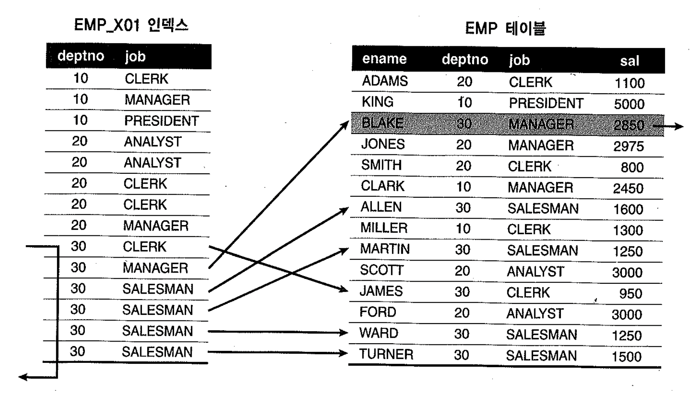
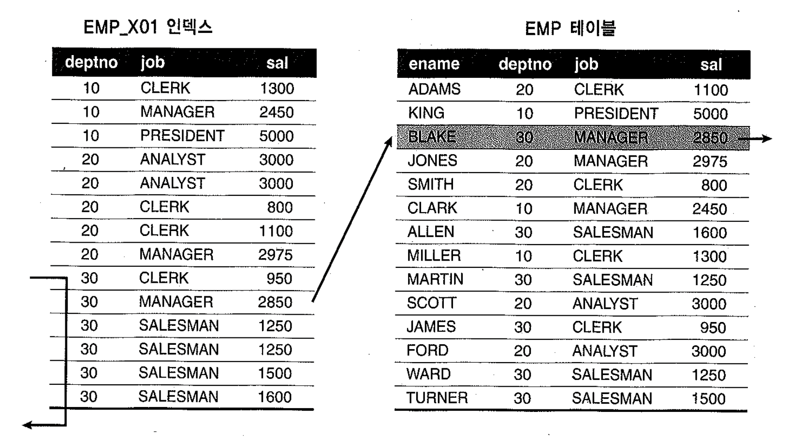
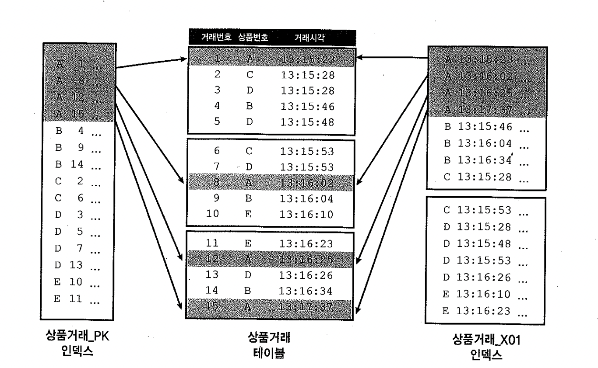

# 05. 테이블Random액세스최소화튜닝


4절에 이어서 튜닝방법을 알아보자.


## 1) 인덱스 컬럼 추가

- EMP 테이블의 PK (emp_x01) : deptno + job

```sql
select /*+ index(emp emp_x01) */
from   emp
where  deptno = 30
and    sal>=2000
```




- 이와 같은 경우, 위의 조건을 만족하는 사원이 단 한 명 뿐인데도, 이를 찾기 위해 Table Access는 과도하게 발생한다.
- 인덱스 구성을 [deptno + sal] 순으로 변경되면 좋으나 실 운경 환경에서는 인덱스 구성을 변경하기가 어렵다.
- 하나를 더 만들면 인덱스 관리 비용이 증가함은 물론 DML 부하게 따른 트랜잭션 성능 저하가 생길 수 있다.
- 이럴 경우 기존 인덱스에 sal 컬럼을 추가한는 것만으로 큰 효과를 거둘 수 있다


- EMP_X01 : deptno + job + sal




- 실제로 인덱스 스캔량은 줄지 않지만 테이블 Random 액세스 횟수를 줄여주기 때문이다.


##### 사례

-  인덱스: 로밍렌탈_N2 : 서비스 번호

```sql
select 렌탈관리번호, 서비스관리번호,서비스번호,예약접수일시,
       방문국가코드1,방문국가코드2,방문국가코드3,로밍승인번호,자동로밍여부
from   로밍렌탈
where  서비스번호 like '010%'
and    사용여부 = 'Y'

call     count       cpu    elapsed       disk      query    current        rows
------- ------  -------- ---------- ---------- ---------- ----------  ----------
Parse        1     0.010      0.012          0          0          0           0
Execute      1     0.000      0.000          0          0          0           0
Fetch       78    10.150     49.199      27830     266968          0        1909
------- ------  -------- ---------- ---------- ---------- ----------  ----------
total       80    10.160     49.211      27830     266968          0        1909

Rows     Row Source Operation
-------  ---------------------------------------------------
   1909  TABLE ACCESS BY INDEX ROWID 로밍렌탈 (cr=266968 pr=27830 pw=0 time=...)
 266476   INDEX RANGE SCAN 로밍렌탈_N2 (cr=1011 pr=900 pw=0 time=1893462 us) 
```

- 테이블을 액세스하는 단계에서만 265,957(266968-1011)개의 블록 I/O가 발생하였고, 99.6%를 차지하는 양이다.
- 테이블을 총 266,476번 방문하는 동안 블록 I/O가 265,957개 발생한 것을 보면, 클러스터링 팩터도 아주 안좋은 상태인 것을 알 수 있다.
- 최종 결과집합이 1,909건이라는건, 테이블을 방문하고서 사용여부 = 'Y' 조건을 체크하는 과정에서 대부분 버려진 것이다.


#### 개선

- 인덱스: 로밍렌탈_N2: 서비스번호 + 사용여부

```sql
 call     count       cpu    elapsed       disk      query    current        rows
------- ------  -------- ---------- ---------- ---------- ----------  ----------
Parse        1     0.010      0.001          0          0          0           0
Execute      1     0.000      0.000          0          0          0           0
Fetch       78     0.140      0.154          0       2902          0        1909
------- ------  -------- ---------- ---------- ---------- ----------  ----------
total       80     0.140      0.156          0       2902          0        1909

Rows     Row Source Operation
-------  ---------------------------------------------------
   1909  TABLE ACCESS BY INDEX ROWID 로밍렌탈 (cr=2902pr=27830 pw=0 time=...)
   1909   INDEX RANGE SCAN 로밍렌탈_N2 (cr=1011 pr=900 pw=0 time=1893462 us) 
```


## 2) PK인덱스 컬럼 추가

- **단일 테이블을 PK로 액세스할 때는 단 한건만 조회하는 것이므로 테이블 Random 액세스도 단 1회 발생{}{**}한다.
- **NL조인할 때 Inner쪽 (=right side)에서 액세스될 때는 Random 액세스 부하가 만만치 않다.**
- 특히 Outer **테이블에서 Inner 테이블 쪽으로 조인 액세스가 많은 상황에서 Inner쪽** 필터 조건에 의해 버려지는 레코드가 많다면 그 비효율은 매우 심각할 수 있다.


```sql
select /*+ ordered use_nl(d) */*
from   emp e,
       dept d
where  d.deptno = e.deptno
and    d.loc = 'NEW YORK'

Rows     Row Source Operation
-------  ---------------------------------------------------
      3  NESTED LOOPS  (cr=25 pr=0 pw=0 time=198 us)
     14   TABLE ACCESS FULL EMP (cr=8 pr=0 pw=0 time=111 us)
      3   TABLE ACCESS BY INDEX ROWID DEPT (cr=17 pr=0 pw=0 time=223 us)
     14    INDEX UNIQUE SCAN PK_DEPT (cr=3 pr=0 pw=0 time=108 us)(object id 51150)
```

- Emp를 기준으로 NL조인하고, 조인에 성공한 14건 중 loc='NEW YORK'인 레코드만 취하므로 최종 결과 집합은 3건 뿐이다.
- DEPT_PK인덱스에 loc 컬럼을 추가하면 불필요한 11번의 Random 액세스를 없앨 수 있지만 PK 인덱스에는 컬럼을 추가 할 수 없다.
- **PK컬럼 + 필터조건 컬럼** 형태의 Non-Unique 인덱스를 추가
- 인덱스가 없다면 값이 입력될 때 마다 테이블 전체를 읽어 중복 값 존재 여부를 체크해야 하기 때문에 PK제약에는 중복 값 확인을 위한 인덱스가 반드시 필요하다.
- 중복체크를 위해 Non-Unique 인덱스를 이용하여 중복 여부를 체크하며 이때는 on-plus 스캔이 발생하는 약간의 비효율이 있을 수 있다.


```sql
alter table dept drop primary key cascade;

create index dept_x01 on dept(deptno,loc);


alter table dept add
constraint dept_pk primary key (deptno) using index dept_x01;


call     count       cpu    elapsed       disk      query    current        rows
------- ------  -------- ---------- ---------- ---------- ----------  ----------
Parse        1      0.04       0.03          0          0          0           0
Execute      1      0.00       0.00          0          0          0           0
Fetch        2      0.00       0.00          0         14          0           3
------- ------  -------- ---------- ---------- ---------- ----------  ----------
total        4      0.04       0.03          0         14          0           3

Rows     Row Source Operation
-------  ---------------------------------------------------
      3  TABLE ACCESS BY INDEX ROWID DEPT (cr=14 pr=0 pw=0 time=97 us)
     18   NESTED LOOPS  (cr=12 pr=0 pw=0 time=888 us)
     14    TABLE ACCESS FULL EMP (cr=8 pr=0 pw=0 time=66 us)
      3    INDEX RANGE SCAN DEPT_X01 (cr=4 pr=0 pw=0 time=46 us)(object id 52924)
```


- PK 제약을 위해 사용되는 인덱스는 PK제약 순서와 서로 일치하지 않아도 상관없다. 
  중복 값 유무를 체크하는 용도이므로 PK 제약 컬럼들이 선두에 있기만 하면 된다.
- **PK 구성 : 고객번호 + 상품번호 + 거래일자**
  - 거래일자 + 고객번호 + 상품번호
  - 상품번호 + 거래일자 + 고객번호 + 거래구분
  - 고객번호 + 거래일자 + 상품번호 + 매체구분 + 거래구분
  - **고객번호 + 상품번호 + 거래구분 + 거래일자 ->** **중복 값 유무는 가능하나 비효율적이기 때문에 허용하지 않음**


## 3) 컬럼 추가에 따른 클러스터링 팩터 변화

- 인덱스에 컬럼을 추가함으로써 테이블 Random 액세스 부하를 줄이는 효과가 있지만 인덱스 클러스터링 팩터가 나빠지는 부작용을 초래할 수 있다.


```sql
create table t
as
select * from all_objects
order by object_type;

create index t_idx on t(object_type);

exec dbms_stats.gather_table_stats(user, 't');


select i.index_name, t.blocks table_blocks, i.num_rows, i.clustering_factor
from   user_tables t, user_indexes i
where  t.table_name = 'T'
and    i.table_name = t.table_name;

INDEX_NAME                     TABLE_BLOCKS   NUM_ROWS CLUSTERING_FACTOR
------------------------------ ------------ ---------- -----------------
T_IDX                               705      49788               685
```

- 클러스터링 팩터가 좋다.


```sql
select /*+ index(t t_idx) */count(object_name),count(owner)
from   t
where  object_type >' '

Rows     Row Source Operation
-------  ---------------------------------------------------
      1  SORT AGGREGATE (cr=824 pr=0 pw=0 time=70919 us)
  49788   TABLE ACCESS BY INDEX ROWID T (cr=824 pr=0 pw=0 time=199217 us)
  49788    INDEX RANGE SCAN T_IDX (cr=139 pr=0 pw=0 time=50232 us)(object id 52926)
```

- Object_name과 owner는 null허용 컬럼 이므로 이를 읽으려고 테이블을 49,788번 방문하지만 블록 I/O는 685(=824-139)회만 발생하였다.
- 인덱스 클러스터링 팩터가 좋기 때문이다.


##### 인덱스 추가 (object_type, object_name)

```sql
drop index t_idx;

create index t_idx on t(object_type, object_name);

exec dbms_stats.gather_index_stats(user, 't_idx');

select i.index_name, t.blocks table_blocks, i.num_rows, i.clustering_factor
from   user_tables t, user_indexes i
where  t.table_name = 'T'
and    i.table_name = t.table_name;

INDEX_NAME                     TABLE_BLOCKS   NUM_ROWS CLUSTERING_FACTOR
------------------------------ ------------ ---------- -----------------
T_IDX                                   705      49788             33572
```

- Object_type과 object_name 두 조건으로 조회하는 또 다른 쿼리가 있어 성능 향상을 위해 object_name을 추가 하였다.
- 인덱스 내에서 키 값이 같은 레코드는 rowed 순으로 정렬되므로, 여기에 변별력이 좋은 object_name 같은 컬럼을 추가하면 rowed 이전에 object_name 순으로 정렬되므로 클러스터링 factor가 33,572로 나빠졌다.


##### 이전 쿼리 다시실행

```sql
select /*+ index(t t_idx) */ count(object_name), count(owner) from t
where  object_type >= ' '

Rows     Row Source Operation
-------  ---------------------------------------------------
      1  SORT AGGREGATE (cr=33880 pr=0 pw=0 time=125177 us)
  49788   TABLE ACCESS BY INDEX ROWID T (cr=33880 pr=0 pw=0 time=249000 us)
  49788    INDEX RANGE SCAN T_IDX (cr=308 pr=0 pw=0 time=50251 us)(object id 52927)
```

- 인덱스 스캔 단계에서 블록 I/O횟수가 139에서 308로 증가하였고, 테이블 Random Acess에서의 블록 I/O 횟수는 685(=824-139) 에서 33,672(33880-308) 으로 증가 한 것을 보아 **인덱스에 컬럼을 추가 했더니 기존에 사용하던 쿼리 성능이 매우 나빠졌다**
- Object_type 처럼 변별력이 좋지 않은 컬럼 뒤에 변별력이 좋은 다른 컬럼을 추가할 때는 클러스터링 팩터 변화에 주의를 기울여야 한다.


## 4) 인덱스만 읽고 처리

- Random액세스가 아무리 많더라도 필터조건에 의해 버려지는 레코드가 없는 경우에는 아예 테이블 액세스가 발생하지 않도록 모든 필요한 컬럼을 인덱스에포함 시키는 방법을 고려하면 된다.
- 이것을 '{*}{+}Covered Index'{+}{*}라고 부르고, 인덱스만 읽고 처리하는 쿼리를 **Covered 쿼리**라고 한다.


### 사례1

요약하면, 스칼라 쿼리의 cmpgn_obj_cust 테이블 조건에 7개 가 있었지만 그 중 인덱스 컬럼이 6개로 이루어져 있어 Random액세스 부하가 심하므로 맨 뒤에 asgn_yn 을 추가 한다.

그 결과 IO블록 개수가 극단적으로 줄었고, 시간도 31초 -> 0.x 초로 개선되었다.


### 사례2

두번 째 사례도 where조건 _+ order by 컬럼에 대한 인덱스를 만들어 Random액세스 부하를 해결하였다.


### $$$ 사례1,2는 나중에 2회독 때 비슷한 상황을 만들 수 있다면 예제를 만들어보자. $$$


## 5) 버퍼 pinning 효과 활용

- 오라클의 경우, 한번 입력된 테이블 레코드는 절대 rowid가 바뀌지 않는다.

```sql
select * from emp 
where rowid='AAAMfPAAEAAAAAgAAA'

Rows     Row Source Operation
-------  ---------------------------------------------------
      1  TABLE ACCESS BY USER ROWID EMP (cr=1 pr=0 pw=0 time=32 us)

- 인라인 뷰에서 읽은 rowid값을 이용해 테이블을 액세스하는 것도 가능
select /*+ ordered use_nl(b) rowid(b) */b.*
from   (select /*+ index(emp emp_pk) no_merge */rowid rid
        from   emp
        order by rowid) a, emp b
where  b.rowid = a.rid

Rows     Row Source Operation
-------  ---------------------------------------------------
     14  NESTED LOOPS  (cr=15 pr=0 pw=0 time=100 us)
     14   VIEW  (cr=1 pr=0 pw=0 time=165 us)
     14    SORT ORDER BY (cr=1 pr=0 pw=0 time=135 us)
     14     INDEX FULL SCAN PK_EMP (cr=1 pr=0 pw=0 time=39 us)(object id 51152)
     14   TABLE ACCESS BY USER ROWID EMP (cr=14 pr=0 pw=0 time=176 us)
```

- Emp_pk 인덱스 전체를 스캔해 얻은 레코드를 rowid 순으로 정렬한 다음(이 중간집합의 CF는 가장 완벽하게 좋은 상태가 됨) 한 건씩 순차적으로 (NL조인 방식) emp 테이블을 액세스가 일어 난다.

- 이런 경우에도 Buffer Pinning이 일어 날까?
  ~~~sql
  -- 아래 테이블을 만들어 테스트해보자
  create table emp
  as
  select * from scott.emp, (select rownum no from dual connect by level <= 1000)
  order by dbms_random.value;
  
  alter table emp add constraint emp_pk primary key(no, empno);
  ~~~

  - 10g에서는 발생하지 않지만, 11g에서는 Buffer Pinning 효과가 나타난다.
  - Buffer Pinning 효과 => Random액세스 비효율을 최소화 할 수 있다.


## 6) 수동으로 클러스터링 팩터 높이기

- 테이블 데이터가 무작위로 입력되는 반면, 인덱스는 정해진 키(Key)순으로 정렬되기 때문에 대개 CF가 좋지 않게 마련이다.
- CF가 나쁜 인덱스일 경우, **CF를 인위적으로 좋게 만드는 방법**을 생각해 볼 수 있고, 그 효과는 매우 극적이다.
- **인덱스가 여러 개인 상황에서 특정 인덱스를 기준으로 테이블을 재정렬 하면 다른 인덱스의 CF가 나빠**질 수 있으므로, 인위적으로 CF를 높일 목적으로 테이블을 Reorg 할 때는 가장 자주 사용되는 인덱스를 기준으로 삼아야 한다.
- 이 방법을 주기적으로 사용해야 한다면 (DB관리비용이 증가하므로) 테이블과 인덱스 Rebuild 하는 부담이 적고 효과가 확실할 때만 사용하자.





책에서 상품거래에 대한 인덱스 여러개를 생성하고 CF와 Random액세스 등을 확인한다.

데이터를 입력할수록 CF는 안좋아 진다 (인덱스 테이블은 데이터가 순차적 입력됨)

뒤에 나올 IOT, 클러스터 를 이용한 구조적 개선 방법도 있지만 (insert 성능 하락)

여기선 PK인덱스 컬럼 순으로 데이터를 정렬하면 CF가 좋아짐을 테스트해보자(업무협의를 통해 테이블Reorg를 해보자)

모든 인덱스에 대한 CF가 어떤 지 알아보고, 인덱스 설계에 대한 고찰도 해보자 (기존 인덱스와 반대순서로 인덱스컬럼를 추가한다면 ?)

