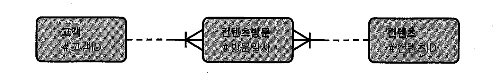
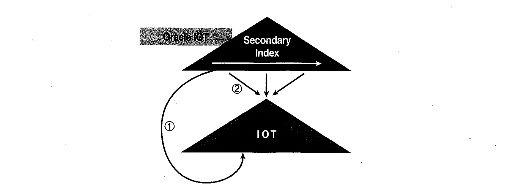
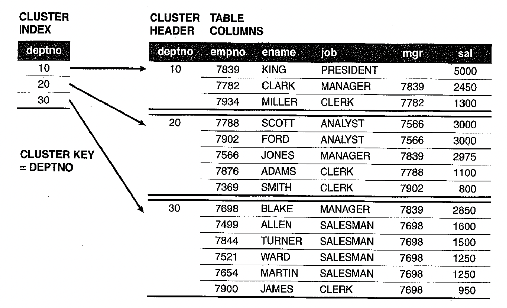

# 06. IOT클러스터테이블활용


## 1) IOT ?

- Random 액세스가 발생하지 않도록 테이블을 아예 인덱스 구조로 생성되어 있는 Table이 바로 IOT(Index-Organized Table)'라고 부른다.
- 테이블을 찾아가기 위한 rowid를 갖는 일반 인덱스와는 달리 IOT는 모든 행 데이터를 리프블록에 저장하고 있다.
- IOT는 "인덱스 리프 블록이 곧 데이터 블록"인 셈이다.
- 테이블을 인덱스 구조로 만드는 구문은 아래와 같다.
- 일반적으로 사용하는 테이블을 '힙 구조 테이블'이라고 부르며, 테이블 생성 시 대개 생략하지만 organization 옵션을 명시할 수도 있다.

```sql
create table index_org_t (a number primary key, b varchar(10));
create table heap_org_t (a number primary key, b varchar(10));
```


- 일반적인 힙 구조 케이블로의 데이터 삽입은 Random 방식으로 이루어 진다. Freelist로부터 할당 받은 블록에 정해진 순서 없이 값을 입력한다.
- **IOT는 인덱스 구조 테이블이므로 정렬 상태를 유지 하며 데이터를 삽입**한다.
- IOT는 SQL서버나 Sybase에서 말하는 '클러스터형 인덱스(Clustered index)'와 비슷한 개념이다. 다만 오라클 IOT는 PK 컬럼 순으로만 정렬할 수 있다는 점이 다르다.


## 2) IOT의 장점과 단점


##### 장점

- **같은 값을 가진 레코드들이 100% 정렬된 상태로 모여 있기 때문에 Random 액세스가 아닌 Sequential 방식으로 데이터를 액세스** 할 수 있고, 이 때문에 넓은 범위를 액세스 할 때 유리하다.
- PK 컬럼 기준으로 데이터가 모여 있더라도 선행 컬럼이 '=' 조건이 아니면 조회 대상 레코드들이 서로 흩어져 많은 스캔을 유발하지만, 적어도 테이블 Random 액세스는 발생하지 않아 빠른 성능을 낼 수 있다.
- PK 인덱스를 위한 별도의 세그먼트를 생성하지 않아도 돼 저장공간을 절약하는 부수적인 이점도 있다.


##### 단점

- 데이터 입력 시 성능이 느리다
- **인덱스 분할(Split) 발생량의 차이**로 일반 힙 구조 테이블과 성능 차이가 클 수 있다. IOT는 인덱스 구조이므로 중간에 꽉 찬 블록에 새로운 값을 입력할 일이 종종 생기고 그럴 때 인덱스 분할(Split)이 발생한다. 그런데 **IOT가 PK 이외에 많은 컬럼을 갖는다면 리프 블록에 저장해야 할 데이터량이 늘어나 그만큼 인덱스 분할 발생빈도도 높아** 진다. 컬럼 수가 많은 테이블이라면 인덱스 스캔 효율 때문이라도 IOT 대상으로 부적합하다.
- IOT에 Direct Path Insert가 작동하지 않는다


### IOT, 언제 사용할 것인가?

- Iot는 아래와 같은 상황에서 유용하다.


#### 크기가 작고 NL 조인으로 반복 Lookup 하는 테이블

- 코드성 테이블이 여기에 속함.
- NL 조인에서 Inner 쪽 Lookup 테이블로서 액세스되는 동안 건건이 인덱스와 테이블 블록을 다 읽는 다면 비효율적이므로 IOT로 구성하면 테이블은 반복 액세스하지 않아도 된다.
- IOT 구성 시 PK이외 속성의 크기 때문에 인덱스 높이가 증가한다면 역효과가 날 수 있으므로 이를 반드시 확인해야 한다.


#### 폭이 좁고 긴(=로우 수가 많은)테이블

- 두 테이블 간 M:M 관게를 해소하기 위한 Association(=Intersection) 테이블이 주로 여기에 속한다.




- 컨텐츠 방문 테이블은 PK(고객 ID, 컨텐츠 ID, 방문일시)이외 컬럼이 전혀 없거나 있더라도 아주 소수에 불과 하다. PK 인덱스는 어차피 생성해야 하므로 테이블과 거의 중복된 데이터를 갖게 된다. 그럴 때 IOT로 구성해 주면 중복을 피할 수 있다.


### 넓은 범위를 주로 검색하는 테이블

- **주로 Between, Like 같은 조건으로 넓은 범위를 검색하는 테이블이라면, IOT 구성을 고려{}{**}할 만 하다.
- **PK 이외 컬럼이 별로 없는 통계성 테이블에는 최적의 솔루션{}{**}이라고 할 수 있다.
- 통게성 테이블은 주로 넓은 범위 조건을 검색하는데다, 일반적으로 컬럼은 많으면서 일반(Non-Key) 속성은 몇 개 되질 않는다.
- 정렬 순서는 검색 시 항상 사용되는 일자 컬럼은 대부분 between 조건이므로 선두 컬럼으로 부적합한다. '{*}{+}=' 족건으로 항상 사용되는 컬럼 한 두개를 찾아 선두에 두고 바로 이어서 일자 컬럼이 오도록 IOT를 구성하는 것이 효과적{+}{*}이다.


### 비트맵 인덱스에 대한 오해

- 성별처럼 Distinct value 개수가 적은 컬럼으로 조회할 때 비트맵 인덱스를 사용하면 빠르다고 생각 하는 사람들이 많다. 즉, 넓은 범위를 조회할 때 B*Tree 인덱스보다 성능을 크게 향상시켜 준다는 얘긴데 과연 그럴까?
- 비트맵 인덱스의 저장 효율이 좋은 것은 사실이지만 조회 성능이 그다지 좋지는 않다. 테이블 Random 액세스 발생 측면에서는 B*Tree 인덱스와 똑같기 때문이며, 스캔할 인덱스 블록이 줄어드는 정도의 이점만 생긴다.
- 하나의 비트맵 인덱스 단독으로는 쓰임새가 별로 없다. 비트맵 인덱스가 가진 여러가지 특징(특히, 용량이 작고 여러 인덱스를 동시에 사용할 수 있다는 특징) 때문에 읽기 위주의 대용량 DW환경에 적합한 것일 뿐 대용량 데이터 조회에 유리한 것은 아니다.


### 데이터 입력과 조회 패턴이 서로 다른 테이블

- 회사에 100명의 영업사원이 있고, 이 영업 사원들의 일별 실적을 집게 하는 테이블이 있는데, 한 블록에 100개 레코드가 담긴다. 그러면 매일 한 블록씩 1년이면 365개 블록이 생긴다. 이처럼 실적 등록은 일자별로 진행되지만 실적조회는 주로 사원별로 이루어진다.


```sql
select substr(일자, 1, 6) 월도, sum(판매금액) 총판매금액, avg(판매금액) 평균판매금액
from   영업실적
where  사번 = 's1234'
and    일자 between '20090101' and '20091231'
group by substr(일자, 1, 6)

Create table 영업실적(사번 varchar2(5), 일자 varchar2(8), ...
Constraint 영업실적_PK primary key (사번, 일자) ) organization index;
```

* 이럴경우 인덱스를 경유해 사원마다 365개 테이블 블록을 읽어야 한다. 클러스터링 팩터가 매우 안 좋기 때문이며, 입력과 조회 패턴이 서로 달라서 생기는 현상이다. 이럴 경우 아래와 같이 사번이 첫 번째 정렬 기준이 되도록 IOT를 구성해 주면, 한 블록만 읽고 처리 할 수 있다.


## 3) Partitioned IOT

- 수억건에 이르는 일별 상품별게좌별거래 테이블이 있다.
- 아래 쿼리 처럼 넓은 범위의 거래 일자를 기준으로 특정 상품을 조회하는 쿼리가 가장 자주 수행한다.


```sql
select 거래일자,지점번호,계좌번호,sum(거래량),sum(거래금액)
from   일별상품별계좌별거래
where  상품번호 = 'P7006050009'
and    거래일자 between '20080101' and '20080630'
group by 거래일자, 지점번호, 계좌번호
```


- 상품별 거래건수가 워낙 많아 위의 쿼리1에 인덱스를 사용하면 Random 액세스 부하가 심하게 발생한다.
- 거래일자 기준으로 월별 Range 파티셔닝돼 있다면 인덱스를 이용하기 보다 필요한 파티션만 Full Scan하는 편이 오히려 빠르겠지만 다른 종목의 거래 데이터까지 모두 읽는 비효율이 생긴다.
- 상품번호 + 거래일자 순으로 정렬되도록 IOT를 구성하면 읽기 성능이야 획기적으로 개선되겠지만, 수억 건에 이르는 테이블을 단일 IOT로 구성하는 것은 관리상 부담스럽다.단일 IOT를 구성하면 다음 쿼리는 수억 건에 이르는 데이터를 Full Scan해야만 한다.


```sql
select 거래일자,지점번호,계좌번호,sum(거래량),sum(거래금액)
from   일별상품별계좌별거래
where  거래일자 between '20080101' and '20080630'
group by 거래일자, 지점번호, 계좌번호
```

- 거래일자 기준 Range 파티셔닝
- 상품번호 + 거래일자 순으로 PK를 정의하고, IOT 구성


## 4) Overflow 영역

- PK 이외 컬럼이 많은 테이블일수록 IOT로 구성하기에 부적합하다. 인덱스 분할에 의한 DML 부하는 물론, 검색을 위한 스캔량도 늘어나기 때문이다.
- **OVERFLOW TABLESPACE** : Overflow 세그먼트가 저장될 테이블 스페이스를 지정한다. (* SYS_IOT_38645 등의 이름을 가진 세그먼트가 자동으로 생성됨)
- **PCTTHRESHOLD** : DEFAULT 값은 50이다. 예를 들어 **이 값이 30이면, 블록 크기의 30%를 초과하기 직전 컬럼까지만 인덱스 블록에 저장하고 그 뒤쪽 컬럼은 모두 Overflow세그먼트에 저장**한다. 물론 로우 전체 크기가 지정된 비율 크기보다 작다면 모두 인덱스 블록에 저장한다. 테이블을 생성하는 시점에 모든 컬럼의 데이터 타입 Max 길이를 합산한 크기가 이 비율 크기보다 작다면 Overflow 세그먼트는 불필요하지만 만약 초과한다면 오라클은 Overflow Tablespace 옵션을 반드시 지정하도록 강제하는 에러를 던진다.
- **INCLUDING** : Including에 지정한 컬럼까지만 인덱스 블록에 저장하고 나머지는 무조건 Overflow 세그먼트에 저장한다.
- **Overflow 영역을 읽을 때도 건건이 Random 액세스가 발생한다는 사실**이다. 따라서 Overflow 세그먼트에 저장된 컬럼 중 일부를 자주 액세스해야 하는 상황이 발생한다면 IOT 액세스 효율은 급격히 저하된다.
- Overflow 영역에서도 버퍼 Pinning 효과가 나타나기 때문에 연속적으로 같은 Overflow 블록을 읽을 때는 Random 블록 I/O 를 최소화 할 수 있다.


## 5) Secondary 인덱스

- IOT는 secondary 인덱스 추가 가능성이 크지 않을 때만 선택하자.


#### 오라클 Logical Rowid

- 오라클은 secondary 인텍스로부터 IOT 레코드를 가리킬때 물리적 주소 대신 logical rowid 를 사용한다.
- logical rowid는 PK와 physical guess로 구성된다.
- physical guess는 seconddary 인텍스를 "최초 생성하거나 재생성(Rebuild)한 시점" IOT레코드가 위치했던 데이터 블록주소(DBA)다
- 인텍스분할에 의해 IOT 레코드가 다른블록으로 이동하더라도 secondary 인텍스에 저장된 physical guess 값은 갱신되지 않는다.
  
- ①은 physical guess를 통해 IOT 레묘드를 직접 액세스하는 것을 표현한 것- ①은 physical guess를 통해 IOT 레묘드를 직접 액세스하는 것을 표현한 것
- ②는 PK를 통해 IOT 를탐색하는것을 표현한 것

h5.PCT_DIRECT_ACCESS

- dba/all/user_indexes 테이블을 조회하면 pct_direct_access 값을 확인할 수 았다.
- secondary 인텍스가 유효한 physical guess를 가진 비율(Direct 액셰스 성공 비율)을 나타내는 지표
- 통계정보 수집을 통해 얻어지는 이 값이 100% 미만이면 오라클은 바로 PK를 이용해 IOT를 탐색한다.100% 일 때만 physical guess를 이용
- 인텍스를 최초 생성하거나 재생성(Rebuild)하고 나면 (통계정보를 따로 수집해 주지 않더라도) pct_ direct _ access 값은 100 이다

#### 비휘발성 IOT에 대한 Secondary 인텍스 튜닝 방안

- pct_direct_access 값이 100을 가리 키도록 유지하는 것이 효과적인 튜닝 방안
- 읽기전용 태이블이면 pct_direct_access 값이 100을 가리키도록 한 상태에서 더 이상 통계정보를 수집하지 않으면 되겠지만， 맨 우측에 지속적으로 값이 입력되는 경우라면 통계정보 수집이 필수적이다.

```
-- Right- Growing 10T이더라도 pct_direct_access 값이 100이 아닐수 있다
-- 통계정보 수집후 아래 프로시져 호출
exec dbms_stats.set_index_stats (user,'t1_x1' , guessq => 100) ;
```

- physical guess에 의한 Direct 액세스 성공률이 100%에 가깝다면 일반 테이블을 인텍스 rowid로 액세스할 때와 거의 같은 수준의 성능을 보인다.


#### 휘발성 IOT에 대한 Secondary 인텍스 튜닝 방안

1.주기적으로 physical guess를 정확한 값으로 갱신 - secondary 인텍스 크기가 작을 때

- 휘발성 이 강한(레코도 위치가 자주 변하는) IOT의 경우 시간이 지나면서 physical guess에 의한 액세스 실패 확률이 높아져 성능이 점점 저하된다 ( 이럴때는 통계정보 수집)
- 아래처럼 인텍스를 Rebuild하거나 update block references 옵션을 이용해 physical guess를 주기적으로 갱신해 준다면 가장 효과

```
alter index iot_second_idx REBUILD;
alter index iot_second_idx UPDATE BLOCK REFERENCES;
```

2.physical guess가 사용되지 못하도록 pct_direct_access 값을 100 미만으로 떨어뜨리는 것

- 인텍스 크기가 커서 주기적으로 physical guess를 갱신해 줄 수 없을 때 쓸수 있는 방법
- 인텍스 분할이 어느 정도 발생한 상태에서 통계정보를 수집해 주면 된다.
- 선택도(선두 컬럼의 선택도를 말하는것 같음 - 결합인덱스의 경우 첫번째 컬럼이 = 관계를 가져야 INDEX 활용도가 높음)가 매우 낮은 secondary 인텍스 위주로 구성해 주변 큰 비효율은 없다.


## 6) 인텍스 클러스터 테이블

- 클러스터 키(여기서는 deptno) 값이 같은 레코드가 한 블록에 모이도록 저장하는 구조를 사용한다.
- 한 블록에 모두 담을 수 없을 때는 새로운 블록을 할당해 클러스터 체인으로 연결한다.
- 이미 클러스터값의 기준으로 JOIN 되어있는 구조다.
- 인덱스 클러스터 키 값이 같은데이터를 물리적으로 한곳에 저장해둘뿐 IOT처럼 정렬하지 않는다.




- 유형
  1.단일 테이블 인텍스 클러스터
  2.다중 테이블 인텍스 클러스터

- 넓은 범위를 검색할때 유리하다.
- 클러스터 인텍스를 '=' 조건으로 액세스할 때는 항상 Unique Scan ( 클러스트 키값으로 모여있으로 )

- 테이블이 실무적으로 자주 활용되지 않는 이유는 DML 부하(정해진 블록을 찾아서 값을 입력해야 하기 때문에 DML 성능이 다소 떨어진다.)


```sql
create cluster c_deptno# ( deptno number(2) ) index ;
-- 클러스터가 생성되었습니다.
```

- **클러스터 테이블에 담기 전에 아래와 같이 클러스터 인덱스를 반드시 정의해야** 한다. 왜냐하면, 클러스터 인덱스는 데이터 검색용도로 사용될 뿐만 아니라 데이터가 저장될 위치를 찾을 때도 사용되기 때문이다.

```sql
create index i_deptno# on cluster c_deptno#;
-- 인덱스가 생성되었습니다.
```

- 클러스터 인덱스도 일반적인 B*Tree 인덱스 구조를 사용하지만, 해당 키 값을 저장하는 첫 번째 데이터 블록만을 가리킨다는 점에서 다르다.
- **클러스터 인덱스의 키 값은 항상 Unique(중복 값이 없음)하며, 레코드와 1:M 관계**를 갖는다. 일반 테이블에 생성한 인덱스 레코드는 테이블 레코드와 1:1 대응 관계를 갖는다.
- **클러스터 인덱스를 스캔하면서 값을 찾을 때는 Random 액세스가(클러스터 체인을 스캔하면서 발생하는 Random 액세스는 제외하고) 값 하나당 한 번씩 밖에 발생**하지 않는다.
- **클러스터에 도달해서 Sequential 방식으로 스캔하기 때문에 넓은 범위를 읽더라도 비효율이 없다는 게 핵심 원리**이다.
- 인덱스 클러스터 테이블의 종류
  - 단일 테이블 인덱스 클러스터
  - 다중 테이블 인덱스 클러스터


```sql
create table emp1
cluster c_deptno# (deptno)
as
select * from scott.emp;
-- 테이블이 생성되었습니다.


create table dept1
cluster c_deptno# (deptno)
as
select * from scott.dept;
-- 테이블이 생성되었습니다.


select owner, table_name from dba_tables where cluster_name = 'C_DEPTNO#';

OWNER                          TABLE_NAME
------------------------------ ------------------------------
SCOTT                          DEPT1
SCOTT                          EMP1
```

- C_deptno# 클러스터에 dept와 emp두 테이블이 같이 담기도록 정의하였다.


```sql
break on deptno skip 1;
select d.deptno, e.empno, e.ename
       , dbms_rowid.rowid_block_number(d.rowid) dept_block_no
       , dbms_rowid.rowid_block_number(e.rowid) emp_block_no
  from   dept1 d, emp1 e
  where  e.deptno = d.deptno
  order by d.deptno;

    DEPTNO      EMPNO ENAME      DEPT_BLOCK_NO EMP_BLOCK_NO
---------- ---------- ---------- ------------- ------------
        10       7839 KING                2352         2352
                 7782 CLARK               2352         2352
                 7934 MILLER              2352         2352

        20       7902 FORD                2350         2350
                 7876 ADAMS               2350         2350
                 7788 SCOTT               2350         2350
                 7369 SMITH               2350         2350
                 7566 JONES               2350         2350

        30       7900 JAMES               2351         2351
                 7844 TURNER              2351         2351
                 7698 BLAKE               2351         2351
                 7654 MARTIN              2351         2351
                 7499 ALLEN               2351         2351
                 7521 WARD                2351         2351
```

- 위의 결과를 통해 'deptno가 같은 dept, emp 레코드'가 '같은 블록'에 담긴 것을 알 수 있다.


#### 인덱스 클러스터는 넓은 범위를 검색할 때 유리

```sql
create cluster objs_cluster# ( object_type VARCHAR2(19) ) index ;
-- 클러스터가 생성되었습니다.
 
create index objs_cluster_idx on cluster objs_cluster#;
-- 인덱스가 생성되었습니다.

create table objs_cluster   -- 클러스터 테이블
cluster objs_cluster# ( object_type )
as
select * from all_objects
order by dbms_random.value ;
-- 테이블이 생성되었습니다.

SQL> create table objs_regular   -- 일반 테이블
  2  as
  3  select * from objs_cluster
  4  order by dbms_random.value;
테이블이 생성되었습니다.

create index objs_regular_idx on objs_regular(object_type);
-- 인덱스가 생성되었습니다.

alter table objs_regular modify object_name null;
-- 테이블이 변경되었습니다.

alter table objs_cluster modify object_name null;
-- 테이블이 변경되었습니다.
```


- B*Tree 인덱스와 Heap Table은 테이블을 1.763번 Random 액세스하는 동안 616(=622-6) 개의 블록 I/O가 발생

~~~sql
select /*+ index(t objs_regular_idx) */ count(object_name)
from   objs_regular t
where  object_type = 'TABLE';

Rows     Row Source Operation
-------  ---------------------------------------------------
      0  STATEMENT
      1   SORT AGGREGATE (cr=622 pr=0 pw=0 time=4153 us)
   1632    TABLE ACCESS BY INDEX ROWID OBJS_REGULAR (cr=622 pr=0 pw=0 time=8220 us)
   1632     INDEX RANGE SCAN OBJS_REGULAR_IDX (cr=6 pr=0 pw=0 time=1678 us)(Object ID 53035)
~~~


- B*Tree Cluster 인덱스를 통해 클러스터 테이블을 액세스 했더니 Random 액세스는 단 1회만 발생하였고, 클러스터를 스캔하는 동안 20(=21-1)개의 블록 I/O가 발생하였다.
- 클러스터 인덱스를 '=' 조건으로 액세스할 때는 항상 Unique Scan이 나타난다

~~~sql
select count(object_name)
from   objs_cluster t
where  object_type = 'TABLE';

Rows     Row Source Operation
-------  ---------------------------------------------------
      0  STATEMENT
      1   SORT AGGREGATE (cr=21 pr=0 pw=0 time=943 us)
   1632    TABLE ACCESS CLUSTER OBJS_CLUSTER (cr=21 pr=0 pw=0 time=1664 us)
      1     INDEX UNIQUE SCAN OBJS_CLUSTER_IDX (cr=1 pr=0 pw=0 time=18 us)(Object ID 53031)
~~~


#### 클러스터 테이블과 관련한 성능 이슈

- 클러스터 테이블은 넓은 범위를 검색할 때 유리하다.
- 하지만 클러스터 테이블이 실무적으로 **자주 활용되지 않는 이유는 DML부하** 때문이다.
- 일반적인 Heap Table에 데이터를 입력할 때는 Freelist로 터 할당 받은 공간에 정해진 순서 이 값을 입력한다.
- IOT는 정렬 상태를 유지하면서 값을 입력한다.
- 클러스터 테이블은 정해진 블록을 찾아서 값을 입력해야 하기 때문에 DML 성능이 다소 떨어 진다. 특히, 전에 없던 값을 입력할 때는 블록을 새로 받아야 하기 때문에 더 느리다.
- 클러스터를 구성하지 않는 대신 인덱스를 생성할거면 DML부하는 어차피 비슷하다고 볼 수 있다. 특히 이미 블록이 할당된 클러스터 키 값을 입력할 때는 별차이가 없고, 만약 계속 새로운 값이 입력돼 많이 느려진다면 클러스터 키를 잘 못 선정한 경우 이다. **클러스터 테이블을 구성하면서 기존에 사용하던 인덱스 두세 개를 없앨 수 있다면 DML부하가 오히려 감소 할 수**도 있다.
- 수정이 자주 발생하는 컬럼은 클러스터 키로 선정하지 않는 것이 좋지만, 삭제 작업 때문에 클러스터테이블이 불리할 것은 없다. 다만, 전체 데이터를 지우거나 테이블을 통째로 Drop할 때 성능 문제가 생길 수 있다.
- 전체 데이터를 지울 때는 **Truncate Table 문장을 쓰는 것이 빠른데, 클러스터 테이블에는 이 문장을 쓸 수가 없다**. 단일 테이블 클러스터일 때도 마찬가지이다.
- **Drop 하려 할 때도 내부적으로 건건이 delete가 수행**된다.
- 전체 데이터를 빠르게 지우고 싶을 때는 아래와 같이 하는 것이 빠르다. 다중 테이블 클러스터일 때는 클러스터링된 테이블이 모두 삭제 되므로 주의해야 한다.

```sql
Truncate cluster objs_cluster#;
Drop cluster objs_cluster# including tables;
```


#### DML부하 이외의 고려 사항

- Direct path Loading을 수행할 수 없다.
- 파티셔닝 기능을 함께 적용할 수 없다.
- 다중 테이블 클러스터를 Full Scan할 때는 다른 테이블 데이터까지 스캔하기 때문에 불리 하다.


#### Size 옵션

- 클러스터 키 하나당 레코드 개수가 많지 않을 때 클러스터마다 한 블록씩 통째로 할당하는 것은 낭비 이므로 하나의 블록에 여러 키 값이 같이 상주할 수 있도록 SIZE옵션을 두었다.
- SIZE 옵션은 한 블록에 여러 클러스터 키 값이 같이 담기더라도 하나당 가질 수 있는 최소 공간(바이트 단위)를 미리 예약하는 기능이다.


```sql
show parameter block_size;
NAME                                 TYPE        VALUE
------------------------------------ ----------- ------------------------------
db_block_size                        integer     8192

drop cluster c_deptno# including tables;
-- 클러스터가 삭제되었습니다.

create cluster emp_cluster# ( empno number(4) ) pctfree 0 size 2000 index ;
-- 클러스터가 생성되었습니다.

create index emp_cluster_idx on cluster emp_cluster#;
-- 인덱스가 생성되었습니다.

create table emp1
cluster emp_cluster# ( empno )
as
select * from scott.emp;
-- 테이블이 생성되었습니다.

select emp.empno, emp.ename, dbms_rowid.rowid_block_number(rowid) block_no
from   emp1 emp;

     EMPNO ENAME        BLOCK_NO
---------- ---------- ----------
      7902 FORD              628
      7934 MILLER            628
      7369 SMITH             630
      7499 ALLEN             630
      7521 WARD              630
      7566 JONES             630
      7654 MARTIN            631
      7698 BLAKE             631
      7782 CLARK             631
      7788 SCOTT             631
      7839 KING              632
      7844 TURNER            632
      7876 ADAMS             632
      7900 JAMES             632
```

- 위의 예처럼 블록 크기가 8KB 일 때 SIZE 옵션으로 2000 바이트를 지정하면 한 블록당 최대 4개 클러스터 키 만을 담을 수 있다{}.
- Emp 레코드 하나가 2,000 바이트에 한참 못 미치지만 각 블록당 4개의 empno를 입력하고는 새로운 블록에 담기 시작한다.


```
drop table emp1 purge;
-- 테이블이 삭제되었습니다.

create table emp1
  cluster emp_cluster# ( empno )
  as
  select empno, ename, lpad('*', 970) data   -- 한 로우가 1000 바이트쯤 되도록
  from   scott.emp,(select rownum no from dual connect by level <= 10)
  where  empno = 7900;
-- 테이블이 생성되었습니다.

select empno, ename, dbms_rowid.rowid_block_number(rowid) block_no
from   emp1;
     EMPNO ENAME        BLOCK_NO
---------- ---------- ----------
      7900 JAMES             630
      7900 JAMES             630
      7900 JAMES             632
      7900 JAMES             632
      7900 JAMES             632
      7900 JAMES             632
      7900 JAMES             632
      7900 JAMES             632
      7900 JAMES             632
      7900 JAMES             632
```

- 같은 블록내에 공간이 있다면 (최대 클러스터 키 개수를 초과하지 않는 범위 내에서) 계 그곳에 저장하고, 그 블록마저 차면 새로운 블록을 할당해서 계속 저장한다.
- SIZE 옵션은 공간을 미리 예약해 두는 것일 뿐 그 크기를 초과했다고 값을 저장하지 못하도록 하지는 않는다.
- SIZE옵션 때문에 데이터 입력이 방해 받지는 않지만 대부분 클러스터 키 값이 한 블록씩을 초과한다면 굳이 이 옵션을 두어 클러스터 체인이 발생하도록 할 필요는 없다.
- 같은 키 값을 가진 데이터가 물리적으로 서로 모여서 저장되도록 하려고 클러스터 테이블을 사용하는 것인데, 이 옵션을 **너무 작게 설정하면 그 효과가 반감**된다. 반대로 이 **값을 너무 크게 설정하면 공간을 낭비**할 수 있으며, 판단 기준은 클러스터 키마다의 평균 데이터 크기다. **SIZE 옵션을 지정하지 않으면 한 블록에 하나의 클러스터 키만** 담긴다.


## 7) 해시 클러스터 테이블

- 해시 클러스터 테이블은 해시 함수에서 반환된 값이 같은 데이터를 물리적으로 함께 저장하는 구조이다.
- 클러스터 키로 데이터를 검색하고 저장할 위치를 찾을 때는 해시 함수를 사용한다.
- 해시 함수가 인덱스 역할을 대신하는 것이며, 해싱 알고리즘을 이용해 클러스터 키 값을 데이터 블록 주소로 변환해 준다.
- 해시 클러스터 테이블의 두 가지 유형
  - 단일 테이블 해시 클러스터
  - 다중 테이블 해시 클러스터
- **해시 클러스터의 가장 큰 제약사항은 '=' 검색만 가능하다는 점이다.**
- 물리적인 인덱스를 따로 갖지 않기 때문에 해시 클러스터 키로 검색할 때는 그만큼 블록 I/O가 덜 발생한다는 이점이 있다.

```sql
create cluster username_cluster# ( username varchar2(30) )
hashkeys 100 size 50;
-- 클러스터가 생성되었습니다.

create table user_cluster
cluster username_cluster# ( username )
as
select * from all_users;
-- 테이블이 생성되었습니다.

create table user_regular as select * from all_users;
-- 테이블이 생성되었습니다.

create unique index user_regular_idx on user_regular(username);
-- 인덱스가 생성되었습니다.

alter table user_regular modify user_id null;
-- 테이블이 변경되었습니다.

alter table user_cluster modify user_id null;
-- 테이블이 변경되었습니다.

alter session set sql_trace = true;
-- 세션이 변경되었습니다.

declare
   l_user_id user_regular.user_id%type;
 begin
   for c in (select owner from objs_regular where owner <> 'PUBLIC')
   loop
     select user_id into l_user_id from user_regular where username = c.owner;
     select user_id into l_user_id from user_cluster where username = c.owner;
   end loop;
 end;
/
-- PL/SQL 처리가 정상적으로 완료되었습니다.


alter session set sql_trace = false;
-- 세션이 변경되었습니다.

SELECT USER_ID
FROM USER_REGULAR
WHERE USERNAME = :B1;

call     count       cpu    elapsed       disk      query    current        rows
------- ------  -------- ---------- ---------- ---------- ----------  ----------
Parse        1      0.00       0.00          0          0          0           0
Execute  29856      0.35       0.41          0          0          0           0
Fetch    29856      0.34       0.30          0      59712          0       29856
------- ------  -------- ---------- ---------- ---------- ----------  ----------
total    59713      0.70       0.72          0      59712          0       29856

Rows     Row Source Operation
-------  ---------------------------------------------------
  29856  TABLE ACCESS BY INDEX ROWID USER_REGULAR (cr=59712 pr=0 pw=0 time=351640 us)
  29856   INDEX UNIQUE SCAN USER_REGULAR_IDX (cr=29856 pr=0 pw=0 time=202659 us)(object id 53043)


SELECT USER_ID
FROM USER_CLUSTER
WHERE USERNAME = :B1;


call     count       cpu    elapsed       disk      query    current        rows
------- ------  -------- ---------- ---------- ---------- ----------  ----------
Parse        1      0.00       0.00          0          0          0           0
Execute  29856      0.26       0.33          0          0          0           0
Fetch    29856      0.42       0.25          0      29856          0       29856
------- ------  -------- ---------- ---------- ---------- ----------  ----------
total    59713      0.68       0.59          0      29856          0       29856

Rows     Row Source Operation
-------  ---------------------------------------------------
  29856  TABLE ACCESS HASH USER_CLUSTER (cr=29856 pr=0 pw=0 time=225642 us)
```


