# 07. 인덱스 스캔효율


- Sequential Access는 레코드간 논리적 또는 물리적인 순서를 따라 차례대로 읽어 나가는 방식

- Random 액세스는 레코드간 논리적, 물리적인 순서를 따르지 않고 한 건을 읽기 위해 한 블록씩 접근(=touch)하는 방식


##### I/O 튜닝

1. Sequential 액세스의 선택도를 높인다 (7절)
2. Random 액세스 발생량을 줄인다. (5~6절)


**Sequential 액세스 선택도**

- 선택도는 전체 레코드 중에서 조건절에 의해 선택되는 비율
- 조나단 루이스의 저서 Cost-Based Oracle Fudmental에서 비용 공식을 설명하기 위한 용어 두가지
  - 유효 인덱스 선택도 : 전체 인덱스 레코드 중에서 조건절을 만족하는 레코드를 찾기 위해 스캔할 것으로 에상되는 비율(%)
  - 유효 테이블 선택도 : 전체 레코드 중에서 인덱스 스캔을 완료하고서 최종적으로 테이블을 방문할 것으로 예상되는 비율(%)

- 조나단 루이스가 말하는 유효 테이블 선택도가 높다면 인덱스 스캔 후 테이블 Random 액세스 비율이 높은 것이므로 앞서 선택도가 높아야 효율적이 이라는 말과는 배치되나 본 절에서 말하는 'Sequential 액세스 선택'는 인덱스를 스캔한 건수 중 결과로 선택되는 비율을 말하는 것이며, 그 비율이 높아야 효율적이라는 의미 같은 결과 건수를 내기 위해 적은 양을 읽어야 함을 이르는 것이다.


## 1) 비교 연산자 종류와 커럼 순서에 따른 인덱스 레코드의 군집성

- 인덱스 레코드는 '같은 값을 갖는' 레코드들이 항상 서로 군집해 있음
- '같은 값을 갖는다'라고 하면 '=' 비교가 전제되므로, 만약 비교 연산자가 '=' 조건이 아닐 때는 인덱스 레코드도 서로 흩어진 상태 일 수 있음


**선두 컬럼**

- 선두 컬럼은 인덱스 구성상 맨 앞쪽에 있는 단 하나의 컬럼을 지지칭할 때 사용
- 선행 컬럼은 상대적으로 앞쪽에 놓인 컬럼을 칭할 때 사용
- 선두 컬럼은 당연히 선행 컬럼에 포함


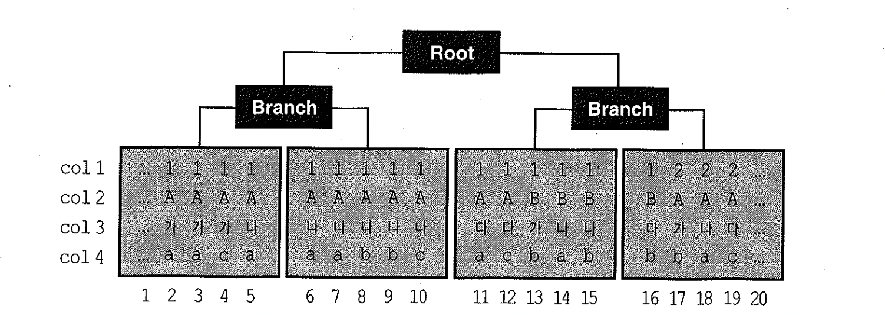


```sql
where col1 = 1 and col2 = 'A' and col3 = '나' and col4 = 'a'
-- 인덱스 구성 컬럼이 모두 '=' 조건으로 비교될 때는 조건을 만족하는 레코드들이 모두 연속되게 모여 있다.(5~7번까지)

where col1 = 1 and col2 = 'A' and col3 = '나' and col4 >= 'a';
-- 선행 컬럼은 모두 '='이고 맨 마지막 컬럼만 범위검색 조건(부등호, between, like)일 때도
-- 조건을 만족하는 레코드가 모두 모여 있다(5~10번)

where col1 = 1 and col2 = 'A' and col3 between '가' and '다' and col4 = 'a'
-- 중간 컬럼이 범위검색 조건일 때는 col1부터 col3까지 세 조건만을 만족하는 인덱스 레코드는
-- 서로 모여 있지만(2~12번) col4 족건까지 만족하는 레코드는 흩어지게 된다(2,3,5,6,7,11번)

where col1 = 1 and col2 <='B' and col3 = '나' and col4 between 'a' and 'b'
-- 두 번째 컬럼 col2가 범위검색 조건인 경우는 col1부터 col2가지 두 조건만을 만족하는 인덱스 레코드는 
-- 서로 모이지만(2~16번) col3와 col4 조건까지 만족하는 레코드는 흩어지게 된다.(5,6,7,8,9,14,15번)
```


## 2) 인덱스 선행 컬림이 등치(=) 조건이 아닐 때 발생하는 비효율

- Sequential 액세스 효율은 같은 결과 건수를 내는데 얼마나 적은 레코드를 읽느냐로 효율성을 판단 할 수 있음
- Sequential 액세스에 다른 선택도는 인덱스 컬럼이 조건절에 모두 등치(=) 조건으로 사용될 때 가장 높음
- 리프 브록을 스캔하면서 읽은 레코드는 하나도 필터링 되지 않고 모두 테이블로 액세스로 이어지므로 비효율은 전혀 없음
- 인덱스 컬럼 중 일부가 조건절에서 생략되거나 '=' 조건이 아니더라도, 뒤쪽 컬럼일 때는 비효율이 없음


```sql
-- 인덱스 : 아파트시세코드 + 평형 + 평형타입 + 인터넷매물
where 아파트시세코드 = :a
where 아파트시세코드 = :a and 평형 = :b
where 아파트시세코드 = :a and 평형 = :b and 평형타입 = :c
where 아파트시세코드 = :a and 평형 = :b and 평형타입 between :c and :d
```


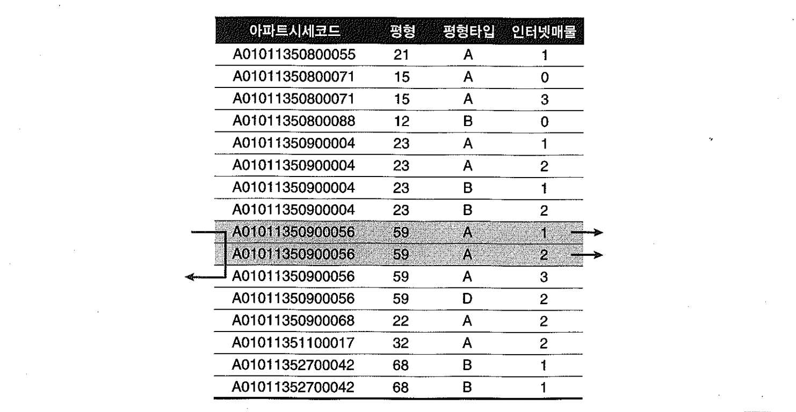

- 인덱스 선행 컬럼이 조건에 누락되거나 between, 부등호, like 같은 범위검색 조건이 사용되면 인덱스를 스캔하는 단계에서 비효율이 발생


```sql
-- 인덱스 : 아파트시세코드 + 평형 + 평형타입 + 인터넷매물
select   해당층, 평당가, 입력일, 해당동, 매물구분, 연사용일수, 중개업소코드
from    매물아파트매매
where   아파트시세코드='A0101450900056'
and     평형 = '59'
and     평형타입 = 'A'
and     인터넷매물 between '1' and '2'
order by 입력일 desc;

-- 인덱스매물이 between 조건이지만 선행 컬럼들이 모두 '=' 조건이기 때문에 전혀 비효율 없이 조건을 만족하는 2건을 빠르게 찾았다. 
-- 인덱스 선행 컬럼이 모두 '=' 조건일 때 필요한 범위만 스캔하고 멈출 수 있는 것은, 조건을 만족하는 레코드가 모두 한데 모여 있기 때문.

-- 인덱스 : 인터넷매물 + 아파트시세코드 + 평형 + 평형타
-- 인덱스 선두 컬럼 인터넷매물에 between 연산자를 사용하면 나머지 조건을 만족하는 레코드들이 인터넷 매물 값범위로 뿔뿔이
-- 흩어져 있다. 조건을 만족하지 않는 레코드까지 스캔하고서 버려야 하는 비효율 발생.
```


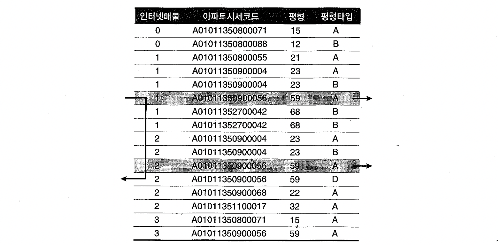

###### 

##### **선두 컬럼이 BETWEEN일 때 스캔 시작과 종료 지점**

- 위 사례 에서 스캔 시작점은 6번 째 레코드 이다.

##### 인덱스 스캔 시작점을 찾는 수직적 탐색 과정에서

- `인터넷 매물='1' AND 아파트시세코드 <'A01011350900056' AND 평형 <'59' AND 평형타입 <'A'` 인 레코드들은 이미 필터링 되었다.

##### BETWEEN 조건의 종료 값 구간(인터넷 매물 = '2')을 스캔할 때는

- `아파트시세코드 > 'A01011350900056' OR 평형 > '59' OR 평형타입 > 'A'`인 지점에서 스캔을 멈출 수 있다.

- 스캔 종료지점은 밑에서 2번째 레코드(인터넷 매물='3'이 시작되는 지점)가 아니라 밑에서 5번째 레코드가 됨


## 3) BETWEEN 조건을 IN-LIST로 바꾸었을 때 인덱스 스캔 효율

- 범위검색 컬럼이 맨 뒤로 가도록 인덱스를 `아파트시세코드 + 평형 + 평형타입 + 인터넷매물` 순으로 변경하면 좋겠지만 운영중인 시스템에서 인덱스 구성을 바꾸끼는 어려우므로 이 때, BETWEEN을 IN-LIST로 바꿔주면 효과가 큰 경우가 있다.


```sql
select 해당층, 평당가, 입력일, 해당동, 매물구분, 연사용일수, 중개업소코드
  from 매물아파트매매
 where 인터넷매물 in ('1', '2')
   and 아파트시세코드 = 'A01011350900056'
   and 평형 = '59'
   and 평형타입 = 'A'
 order by 입력일 desc;
```

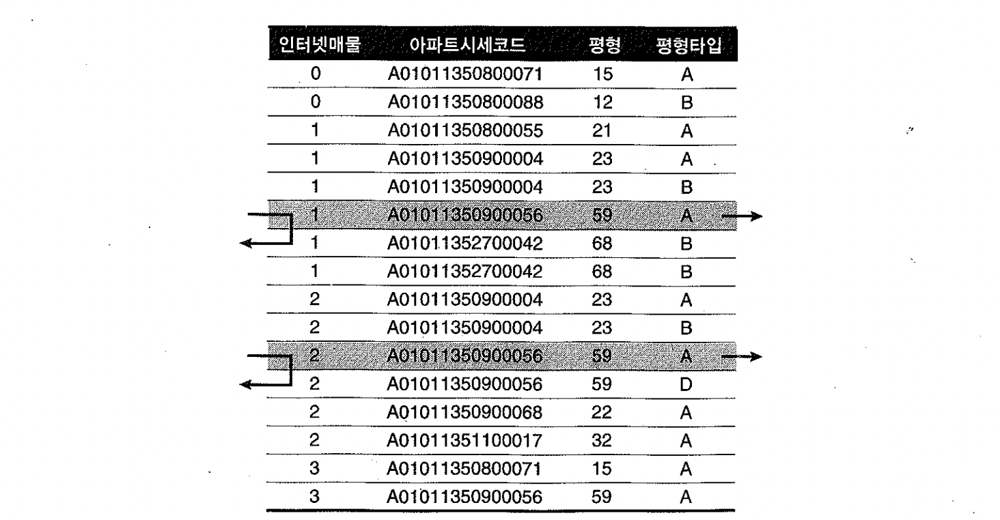


##### between VS IN-LIST 주의 사항

- IN-LIST 개수가 많지 않아야 함
  - 인덱스 수직 탐색이 여러 번 발생하기 때문에 IN-LIST 개수가 많을 때는, 리프 블록을 추가로 스캔하는 비효율보다 IN-LIST 조건 때문에 브랜치 블록을 반복 탐색하는 비효율이 더 클 수 있고, 인덱스 높이(height)가 높을 대 특히 그렇다.
- 인덱스 스캔 과정에서 선택되는 레코드들이 서로 멀리 떨어져 있을 때만 유용
- between 조건인 선행 컬럼 때문에 많은 인덱스 리프 블록을 스캔하지만 거기서 선택되는 레코드 개수가 적을 때  IN-LIST로의 변환이 효과를 낸다.


## 4) Index Skip Scan을 이용한 비효율 해소

- 인덱스 선두 컬럼이 누락됐을 때뿐만 아니라 부등호, between, like같은 범위검색 조건일 때도 Index Skip Scan이 유용하게 사용될 수 있고, 데이터 상황에 따라서는 '=' 조건 컬럼들을 인덱스 선두에 위치시킨 것에 버금가는 효과를 얻음
- 선두 컬럼이 between이고 검색 조건을 만족하는 데이터들이 서로 멀리 떨어져 있을 경우 효과.


```sql
- 월별로 10만 개 판매데이터 입력
- 'A'가 10만개, 'B'가 110만개
create table 월별고객별판매집계
as
select rownum 고객번호
     , '2008' || lpad(ceil(rownum/100000), 2, '0') 판매월
     , decode(mod(rownum, 12), 1, 'A', 'B') 판매구분
     , round(dbms_random.value(1000,100000), -2) 판매금액
from   dual
connect by level <= 1200000 ;
```


#### between - 인덱스 : 판매구분, 판매월

- IDX1 인덱스를 스캔하면서 281개 블록 I/O 발생

~~~sql
create index 월별고객별판매집계_IDX1 on 월별고객별판매집계(판매구분, 판매월);

select count(*)
from   월별고객별판매집계 t
where  판매구분 = 'A'
and    판매월 between '200801' and '200812';

Rows     Row Source Operation
-------  ---------------------------------------------------
      0  STATEMENT
      1   SORT AGGREGATE (cr=281 pr=269 pw=0 time=95791 us)
 100000    INDEX RANGE SCAN 월별고객별판매집계_IDX1 (cr=281 pr=269 pw=0 time=...)
~~~


#### between - 인덱스: 판매월, 판매구분

- IDX2 인덱스를 스캔하면서 3,090개 블록 I/O가 발생

~~~sql
create index 월별고객별판매집계_IDX2 on 월별고객별판매집계(판매월, 판매구분);

select /*+ index(t 월별고객별판매집계_IDX2) */ count(*)
from   월별고객별판매집계 t
where  판매구분 = 'A'
and    판매월 between '200801' and '200812';

Rows     Row Source Operation
-------  ---------------------------------------------------
      0  STATEMENT
      1   SORT AGGREGATE (cr=3090 pr=3100 pw=0 time=981731 us)
 100000    INDEX RANGE SCAN 월별고객별판매집계_IDX2 (cr=3090 pr=3100 pw=0 time=...)
~~~


#### in list  - 인덱스: 판매월, 판매구분

- between 조건을 IN-List로 변환, 블록 I/O 개수가 314개로 감소
- 인덱스 브랜치 블록을 10번 반복 탐색하는 비효율이 있긴 하지만 리프 블록을 스캔할 때의 비효율을 제거, 1/10 수준으로 성능 개선

~~~sql
select /*+ index(t 월별고객별판매집계_IDX2) */ count(*)
from   월별고객별판매집계 t
where  판매구분 = 'A'
and    판매월 in ( '200801', '200802', '200803', '200804', '200805', '200806'
                 , '200807', '200808', '200809', '200810', '200811', '200812' ) ;

Rows     Row Source Operation
-------  ---------------------------------------------------
      0  STATEMENT
      1   SORT AGGREGATE (cr=314 pr=2 pw=0 time=115212 us)
 100000    INLIST ITERATOR  (cr=314 pr=2 pw=0 time=800042 us)
 100000     INDEX RANGE SCAN 월별고객별판매집계_IDX2 (cr=314 pr=2 pw=0 time=...)
~~~


#### index skip scan -  인덱스: 판매월, 판매구분

- 큰 비효율 없이 단 300 블록만 읽었다.

~~~sql
select /*+ INDEX_SS(t 월별고객별판매집계_IDX2) */ count(*)
from   월별고객별판매집계 t
where  판매구분 = 'A'
and    판매월 between '200801' and '200812' ;

Rows     Row Source Operation
-------  ---------------------------------------------------
      0  STATEMENT
      1   SORT AGGREGATE (cr=300 pr=0 pw=0 time=120292 us)
 100000    INDEX SKIP SCAN 월별고객별판매집계_IDX2 (cr=300 pr=0 pw=0 time=...)
~~~


## 5) 범위검색 조건을 남용할 때 발생하는 비효율


#### like 비효율 예제

~~~
* 회사, 지역, 상품명을 입력하여 '가입상품' 테이블에서 데이터를 조회하는 프로그램.
1. 회사는 반드시 입력
2. 지역은 입력하지 않을 수도 있다.
3. 상품명은 단어 중 일부만 입력하고도 조회 가능
~~~

- 인덱스 : 회사 + 지역 + 상품명
- 각각의 스캔 범위

```
# 쿼리 1 : 회사, 지역, 상품명 모두 입력
SELECT ....
FROM  가입상품
WHERE 회사 = :com
AND   지역 = :reg
AND   상품명 LIKE :prod || '%'

# 쿼리 2 : 회사, 상품명만 입력
SELECT ....
FROM  가입상품
WHERE 회사 = :com
AND   상품명 LIKE :prod || '%'
```


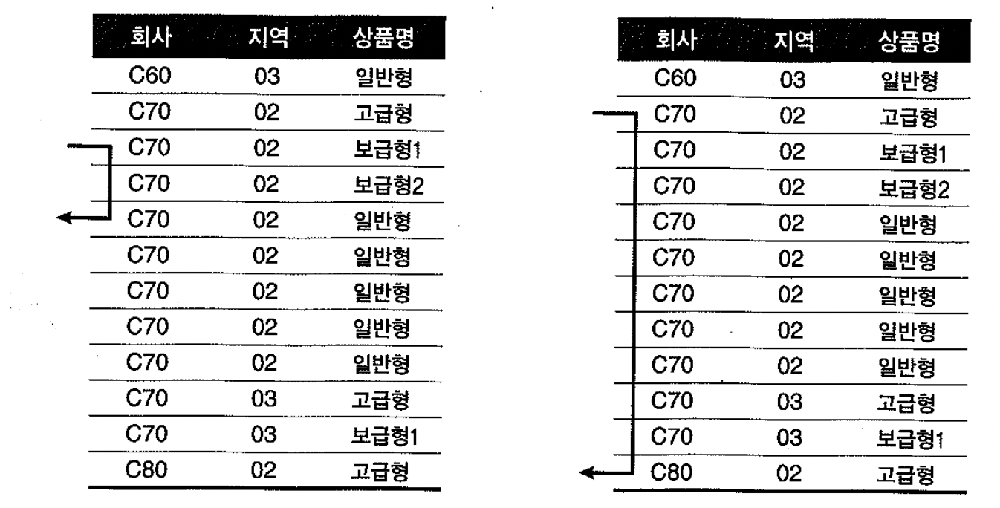


##### 쿼리분기가 귀찮아서 아래처럼 지역 조건에 like를 작성함

- 회사, 지역, 상품명이 모두 입력했을 때와 지역을 입력하지 않았을 때의 스캔 범위
- 지역을 입력한 경우 인덱스 스캔 범위가 늘어난다.
- 인덱스 컬럼에 범위검색 조건을 남용하면 첫 번째 범위검색 조건에 의해 스캔 범위가 대부분 결정되며, 그 다음을 따르는 조건부터는 스캔 범위를 줄이는 데에 크게 기여하지 못하므로 성능상 불리할 수 있음

```
# 하나의 쿼리로 작성
SELECT ....
FROM  가입상품
WHERE 회사 = :com
AND   지역 LIKE :reg || '%'
AND   상품명 LIKE :prod || '%'
```

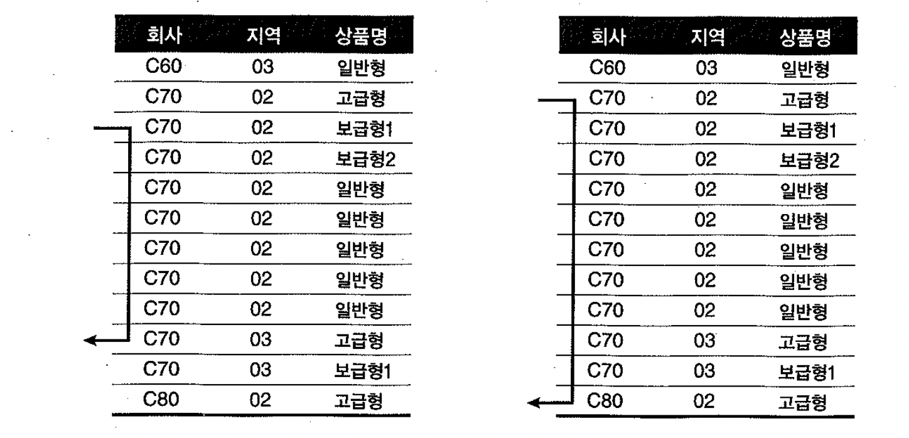


#### 범위검색 조건만으로 구성된 쿼리 튜닝 사례

- 운행 중인 택스들로부터 10초마다 송신돼 온 위치정보를 데이터베이스에 저장
- 고객으로부터 콜(Call)이 오면 반경 1Km 이내의 가장 가까운 택시에게 신호를 보내는 시스템

```sql
인덱스 : gis데이터_x01 : gis_위도 + gis_경도 + gis_시작일자 + gis_종료일자 + gis_지역코드 + gis_위치명

select *
from  gis데이터
where gis_위도 betwwen :승객위도 - 1 and :승객위도 + 1
and   gis_경도 between :승객경도 - 1 and :승객경도 + 1
and   sysdate between gis_시작일자 and gis_종료일자


문제점 :
- 조건절이 모두 between 범위검색 조건
- 인덱스 스캔 범위는 인덱스 선두 컬럼인 'gis_위도' 컬럼에 대한 between 조건에 의해 결정.
- gis데이터 테이블에는 당일치만 보관.
- 당일 영업 시작시에는 빠르지만 밤 시간에는 고객의 특정 위치 기준으로 위도상 좌우 1km 이내에 평균 100만 개 레코드.
- 인덱스 스캔 원리상 현재 데이터 모델로는 과도한 인덱스 스캔 범위를 줄일 방법은 없다.

튜닝 :
- 1km 이내를 한 번에 조회하지 말고 50m, 200m, 1km 순으로 나눠서 쿼리
- 가장 가까운 데 위치한 하나의 택시를 찾는게 목적.
- 세 구간으로 나누어 쿼리하면 대부분 첫 번째 쿼리에서 찾게 된다.
- 인덱스 스캔량을 1/20로 줄일 수 있다.
- 50m, 200m, 1km 이내의 가장 가까운 택시를 찾을 때 위의 쿼리의 1을 0.05, 0.2, 1 로 바꾸어 쿼리.
- 추가로 최종 건수 한 건만을 우편번호와 조인하도록 쿼리 변경.
```

- 거리에 대해 쿼리조건을 다르게 적용(범위를 좁힘)해서 튜닝을 하였다.


## 6) 같은 컬럼에 두 개의 범위검색 조건 사용 시 주의 사항


#### 도서 조회용 프로그램 개발 예제

- '오라클'을 키워드로 입력하면, '오라클'로 시작하는 모든 도서가 조회돼야 함
- 한 화면에 10개씩 출력


#### 1] 앞쪽 일부 레코드만 본다면

- 도서명 컬럼에 인덱스가 있다면 첫 번째 rownum 조건에 해당하는 레코드만 읽고 멈춘다. count(stopkey)오퍼레이션 적용.
- 사용자들이 앞쪽 일부 레코드만 주로 볼 경우 효과적

~~~sql
select *
from (
  select rownum rnum, 도서번호, 도서명, 가격, 저자, 출판사, isbn
  from (
    select 도서번호, 도서명, 가격, 저자, 출판사, isbn
    from   도서
    where  도서명 like :book_nm || '%'
    order by 도서명
  )
  where rownum <= 100
)
where rnum >= 91
~~~


- 뒤쪽 어느 페이지로 이동하더라도 빠르게 조회되도록 구현해야 한다면?
  - 아래는 첫번째 페이지를 출력하고 나서 '다음' 버튼을 누를 경우 예

~~~sql
select *
from (
    select /*+ index(도서 도시명_idx) */
           rowid rid, 도서번호, 도서명, 가격, 저자, 출판사, isbn
    from   도서
    where  도서명 like :book_nm || '%'
    and    도서명 = :last_book_nm    -- 이전 페이지에서 출력된 마지막 도서명
    and    rowid  > :last_rid        -- 이전 페이지에서 출력된 마지막 도서의 rowid
    union all
    select /*+ index(도서 도시명_idx) */
           rowid rid, 도서번호, 도서명, 가격, 저자, 출판사, isbn
    from   도서
    where  도서명 like :book_nm || '%'
    and    도서명 > :last_book_nm    -- 이전 페이지에서 출력된 마지막 도서명
)
where   rownum <= 10
;
~~~

- union all 위쪽 브랜치에서 한건, 아래쪽에서 9건 읽었다.
- 아래쪽 인덱스 스캔단계에서 377 블록을 읽었다.
- 도서명에 대한 범위검색 조건이 두 개인데 그 중 like 조건을 인덱스 액세스 조건으로 사용했기 때문.
- '오라클' 도서를 처음부터 스캔하다가 :last_book_nm 보다 큰 9개 레코드를 찾고서 멈추었다.
- 뒤쪽 페이지로 많이 이동할수록 그 비효율은 커진다.

~~~sql
Rows     Row Source Operation
-------  ---------------------------------------------------
      0  STATEMENT
     10   COUNT STOPKEY (cr=382 pr=0 pw=0 time=218 us)
     10    VIEW  (cr=382 pr=0 pw=0 time=197 us)
     10     UNION-ALL  (cr=382 pr=0 pw=0 time=180 us)
      1      FILTER  (cr=4 pr=0 pw=0 time=141 us)
      1       TABLE ACCESS BY INDEX ROWID 도서 (cr=4 pr=0 pw=0 time=108 us)
      1        INDEX RANGE SCAN 도시명_IDX (cr=3 pr=0 pw=0 time=137 us)(Object ID 52955)
      9      TABLE ACCESS BY INDEX ROWID 도서 (cr=378 pr=0 pw=0 time=56979 us)
      9       INDEX RANGE SCAN 도시명_IDX (cr=377 pr=0 pw=0 time=56916 us)(Object ID 52955)

Predicate Information (identified by operation id):
---------------------------------------------------
   1 - filter(ROWNUM<=10)
   4 - filter(:LAST_BOOK_NM LIKE :BOOK_NM||'%')
   6 - access("도서명"=:LAST_BOOK_NM)
       filter("도서명" LIKE :BOOK_NM||'%' AND ROWID>CHARTOROWID(:LAST_RID))
   8 - access("도서명" LIKE :BOOK_NM||'%')
       filter("도서명">:LAST_BOOK_NM AND "도서명" LIKE :BOOK_NM||'%')
~~~


- 해결방안 : '도서명 > :last_book_nm' 조건이 인덱스 액세스 조건으로 사용하도록 한다.

~~~sql
select *
from (
    select /*+ index(도서 도시명_idx) */
           rowid rid, 도서번호, 도서명, 가격, 저자, 출판사, isbn
    from   도서
    where  도서명 like :book_nm || '%'
    and    도서명 = :last_book_nm    -- 이전 페이지에서 출력된 마지막 도서명
    and    rowid  > :last_rid        -- 이전 페이지에서 출력된 마지막 도서의 rowid
    union all
    select /*+ index(도서 도시명_idx) */
           rowid rid, 도서번호, 도서명, 가격, 저자, 출판사, isbn
    from   도서
    where  rtrim(도서명) like :book_nm || '%'
    and    도서명 > :last_book_nm    -- 이전 페이지에서 출력된 마지막 도서명
)
where   rownum <= 10
;
~~~

- 부등호 조건을 만족하는 첫 번째 레코드부터 스캔을 시작했기 때문에 스캔한 블록수는 2.

```sql
Rows     Row Source Operation
-------  ---------------------------------------------------
      0  STATEMENT
     10   COUNT STOPKEY (cr=7 pr=0 pw=0 time=143 us)
     10    VIEW  (cr=7 pr=0 pw=0 time=128 us)
     10     UNION-ALL  (cr=7 pr=0 pw=0 time=117 us)
      1      FILTER  (cr=4 pr=0 pw=0 time=93 us)
      1       TABLE ACCESS BY INDEX ROWID 도서 (cr=4 pr=0 pw=0 time=72 us)
      1        INDEX RANGE SCAN 도시명_IDX (cr=3 pr=0 pw=0 time=76 us)(Object ID 52955)
      9      TABLE ACCESS BY INDEX ROWID 도서 (cr=3 pr=0 pw=0 time=123 us)
      9       INDEX RANGE SCAN 도시명_IDX (cr=2 pr=0 pw=0 time=75 us)(Object ID 52955)

Predicate Information (identified by operation id):
---------------------------------------------------

   1 - filter(ROWNUM<=10)
   4 - filter(:LAST_BOOK_NM LIKE :BOOK_NM||'%')
   6 - access("도서명"=:LAST_BOOK_NM)
       filter("도서명" LIKE :BOOK_NM||'%' AND ROWID>CHARTOROWID(:LAST_RID))
   8 - access("도서명">:LAST_BOOK_NM)
       filter(RTRIM("도서명") LIKE :BOOK_NM||'%')
```


##### OR-Expansion을 이용하는 방법과 주의 사항

- use_concat 힌트를 사용
- OR 조건에 대한 expansion(union all 분기)이 일어나면 뒤쪽 조건절이 먼저 실행된다.

```sql
select /*+ index(도서 도시명_idx) use_concat ordered_predicates */
       rowid rid, 도서번호, 도서명, 가격, 저자, 출판사, isbn
from   도서
where  도서명 like :book_nm || '%'
and  ((도서명 > :last_book_nm)
       or
      (도서명 = :last_book_nm and rowid > :last_rid) )
and    rownum <= 10
;
```

- 버전에 따라 실행되는 순서가 달라진다.
- 9i까지는 I/O 비용 모델, CPU 비용 모델을 불문하고 뒤쪽에 있는 조건 값을 먼저 실행
- 10g CPU 비용 모델에서는 계산된 카디널리티가 낮은 쪽을 먼저 실행
- ordered_predicates 힌트 : 10g에서 값 분포에 상관없이 항상 뒤쪽에 있는 조건식이 먼저 처리

- 상식적으로 부등호보다 '=' 조건의 선택도가 낮고 카디널리티도 낮겠지만 옵티마이저가 사용하는 내부규칙에 의해 역전될 수 있다.
- 부등호 조건을 변수로 비교할 때는 '5% 규칙'을 사용하기 때문에 선택도가 고정.
- '=' 조건의 선택도는 실제 데이터 분포에 의해 결정.
- 따라서 부등호보다 '=' 조건의 선택도가 더 높게 구해질 수 있다. (3장 6절 참고)


##### rowid를 concatenation하면 결과에 오류 발생

- 아래처럼 작성하면 결과가 달라짐

```sql
select /*+ index(도서 도시명_idx) */
       rowid rid, 도서번호, 도서명, 가격, 저자, 출판사, isbn
from   도서
where  도서명 like :book_nm || '%'
and    도서명 >= :last_book_nm
and    lpad(도서명, 50) || rowid > lpad(:last_book_nm, 50) || :last_rid
and    rownum <= 10
;

=>

and    lpad(도서명, 50) || rowidtochar(rowid) > lpad(:last_book_nm, 50) || :last_rid


-- 문자형으로 변환된 rowid는 rowid 값 그대로 비교할 때와 정렬순서가 다르다 (아래 예시 참조)
select greatest('AAAH+WAAJAAAHxTAA9', 'AAAH+WAAJAAAHxTAA+') from dual;

GREATEST('AAAH+WAA
------------------
AAAH+WAAJAAAHxTAA9 -- Char 비교 결과

 select greatest( chartorowid('AAAH+WAAJAAAHxTAA9')
              , chartorowid('AAAH+WAAJAAAHxTAA+') ) from dual;

GREATEST(CHARTOROW
------------------
AAAH+WAAJAAAHxTAA+ -- Rowid 비교결과
```


##### 인덱스를 스캔하면서 rowid를 필터링할 때 발생하는 비효율

- '이전' 페이지에서 출력된 마지막 레코드와 이름이 같은 도서를 찾는 쿼리는 비효율이 없는가?
- rowid를 가지고 '='조건으로 바로 엑세스할 땐 어떤 액세스보다 빠르지만 인덱스를 스캔하면서 rowid를 필터링할 때는 아니다.
- 인덱스 rowid는 리프블록에만 있다.
- 이를 필터링하려면 다른 액세스 조건만으로 리프 블록을 찾아가 거기서 스캔을 시작해 rowid를 필터링.
- '도서' 테이블에 같은 도서명을 가진 레코드가 '아주' 많다면 뒤 페이지로 이동할수록 비효율.
- 가장 완벽한 구현은 인덱스 뒤쪽에 PK컬럼을 붙이고 쿼리를 수정하는 것이다.
- 하지만 인덱스 뒤에 PK 컬럼을 붙이기는 쉽지 않다.(PK가 다중 컬럼으로 구성된 경우는 더 복잡)
- 중복 값이 아주 많은 경우가 아니라면 rowid를 이용하는 방안이 현실적이다.


##### 좀전의 두 방식 성능 차이 테스트

```sql
drop table t purge;

set feedback off

create table t as select * from all_objects ;

insert into t select * from t;
insert into t select * from t;
insert into t select * from t;
insert into t select * from t;

select count(*) from t;

  COUNT(*)
----------
    797200

update t set object_id = rownum;

column rid new_value rid
select * from (
  select rowid rid from t where owner = 'SYS' order by rowid desc
) where rownum <= 5 ;

RID
------------------
AAAM7cAAGAAAFv8AAH
AAAM7cAAGAAAFv8AAG
AAAM7cAAGAAAFv8AAF
AAAM7cAAGAAAFv8AAE
AAAM7cAAGAAAFv8AAD

set autotrace on statistics
select /*+ index(t t_owner_idx) */ rowid
from   t
where  owner = 'SYS'
and    rowid >= chartorowid('&rid')
and    rownum <= 5 ;

ROWID
------------------
AAAM7cAAGAAAFv8AAD
AAAM7cAAGAAAFv8AAE
AAAM7cAAGAAAFv8AAF
AAAM7cAAGAAAFv8AAG
AAAM7cAAGAAAFv8AAH

Statistics
----------------------------------------------------------
          8  recursive calls
          0  db block gets
        205  consistent gets
          0  physical reads
          0  redo size
        554  bytes sent via SQL*Net to client
        400  bytes received via SQL*Net from client
          2  SQL*Net roundtrips to/from client
          0  sorts (memory)
          0  sorts (disk)
          5  rows processed

set autotrace off

create index t_owner_idx2 on t(owner, object_id);

column oid new_value oid
select * from (
  select object_id oid from t where owner = 'SYS' order by rowid desc
) where rownum <= 5 ;

OID
----------
    756976
    756960
    756944
    756928
    756912

set autotrace on statistics
select /*+ index(t t_owner_idx2) */ object_id
from   t
where  owner = 'SYS'
and    object_id >= &oid
and    rownum <= 5 ;

OBJECT_ID
----------
    756912
    756913
    756914
    756915
    756916

Statistics
----------------------------------------------------------
          0  recursive calls
          0  db block gets
          4  consistent gets
          0  physical reads
          0  redo size
        498  bytes sent via SQL*Net to client
        400  bytes received via SQL*Net from client
          2  SQL*Net roundtrips to/from client
          0  sorts (memory)
          0  sorts (disk)
          5  rows processed
```


## 7) Between과 Like 스캔 범위 비교

```sql
select * from 월별고객별판매집계
where 판매월 like '2009%';

select * from 월별고객별판매집계
where 판매월 between '200901' and '200912';
```

- 검색을 위해 입력한 값과 테이블의 실제 데이터 상황에 따라 둘 간의 인덱스 스캔량이 다를 수 있다.
- between을 사용한다면 적어도 손해는 없다.

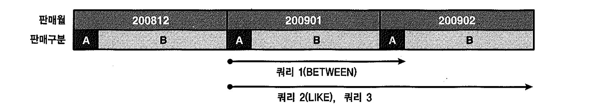


- Index Skip Scan에서 이용한 '월별고객별판매집계' 테이블에서 2009년 1월과 2월 데이터가 추가로 입력.
- 판매구분으로는 'A'와 'B' 두 개의 값이 8.3%와 91.7% 비중.

```sql
<쿼리 1>
select count(*)
from  월별고객별판매집계
where 판매월 between '200901' and '200902'
and   판매구분 = 'A';

<쿼리 2>
select count(*)
from  월별고객별판매집계
where 판매월 like '2009%'
and   판매구분 = 'A';

<쿼리 3>
select count(*)
from  월별고객별판매집계
where 판매월 >= '200901'
and   판매월 < '200903'
and   판매구분 = 'A';
```

- 위의 세 쿼리는 결과는 같지만 I/O 발생량에서 큰 차이를 보인다.
- 쿼리 1 : 2009년 1월 데이터는 모두, 2009년 2월 데이터는 판매구분이 'A'인 데이터만 읽는다.
- 쿼리 2 : 2009년 1월과 2월 데이터를 모두 읽는다.
- 쿼리 3 : '200902' || 'A' 구간만 읽고서 멈추지 못해 결국 like 쿼리과 같은 스캔량을 보인다.


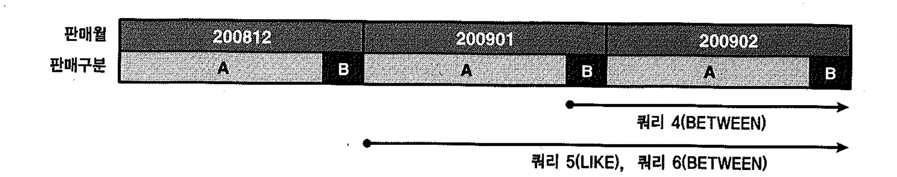

- 'A'와 'B' 값의 비중이 91.7%와 8.3%로 입력된 상태에서 판매구분이 'B'인 레코드를 찾는 경우
- (스캔량의 차이를 크게 나타내 보이려고 바꾸는 것일 뿐 스캔 범위 결정 원리와는 무관)


```sql
<쿼리 4>
select count(*)
from  월별고객별판매집계
where 판매월 between '200901' and '200902'
and   판매구분 = 'B';

<쿼리 5>
select count(*)
from  월별고객별판매집계
where 판매월 like '2009%'
and   판매구분 = 'B';

<쿼리 6>
select count(*)
from  월별고객별판매집계
where 판매월 between '200900' and '200902'
and   판매구분 = 'B';

<쿼리 7>
select count(*)
from  월별고객별판매집계
where 판매월 like '200901%'
and   판매구분 = 'B';

<쿼리 8>
select count(*)
from  월별고객별판매집계
where 판매월 = '200901'
and   판매구분 = 'B';
```

- 쿼리 4 : 2009년 2월 데이터는 모두 읽더라도 1월 데이터는 판매구분이 'B'인 값만 읽는다.
- 쿼리 5 : 2009년 1월과 2월 데이터 모두 읽는다. 1월 데이터를 모두 스캔하는 이유는 리프블록에 실제 없는 '2009'으로 조회 했기 때문.
- 쿼리 6 : 쿼리 5와 스캔량은 같다. between이라고 하더라도 쿼리 시작값을 '29900'으로 입력하고 조회하면 LIKE와 스캔량이 값음
- 쿼리 7 : like지만, 인덱스에서 실제 찾아지는 값을 입력하면 스캔 범위를 줄일 수 있음. 
  - 판매구분 B일때는 쿼리8과 같은 효율이다.


#### 범위검색 조건이 스캔 시작점 결정 원리

- 범위검색 조건 뒤를 따르는 조건절은 스캔 범위를 줄이는 데에 영향을 미칠 수도 있고 그렇지 않을 수도 있다.
- 사용자가 조건 비교를 위해 입력한 값이나 테이블의 실제 데이터 상황에 따라 다르다.
- **적어도 between이 like보다 더 넓은 범위를 스캔하는 경우는 없다.(like말고 between 사용하자)**


- 인덱스 컬럼 조건에 대해 범위검색 조건이 나타나면 이후 조건은 인덱스 스캔 범위를 줄여주지 못해 비효율 발생.
- 위와 같이 범위검색 조건 뒤에 사용된 조건들도 제한적이나마 스캔 범위를 줄이는데 기여할 수 있다.


##### 쿼리 5의 like인 경우

- **(판매원 = '2009' 이고 판매구분 = 'B')인 레코드를 목표로 수직적 탐색.**
- 브랜치 블록에서 뒤쪽 엔트리부터 스캔을 시작해 비교 값보다 작은 값을 만나는 순간 거기서 가리키는 하위 노드로 이동.
- 그림 1-45와 같은 상황에서는 '200812' || 'B'인 레코드가 담긴 가장 마지막 리프 블록에 도달.
- 만약 그 값이 포함되지 않는다면 바로 다음 리프 블록의 처음 레코드 키 값이 '200901' || 'A'인 경우이다.
- 수직 탐색 과정에서 사용한 비교 조건이 '200812' || 'B' 와 '200901' || 'A' 사이 값이므로 이 블록부터 스캔한다면 원하는 값을 모두 읽을 수 있다.
- 이 때문에 불필요하게 '2009' || 'A' 구간까지 읽는다.
- 여기서는 판매구분 = 'B' 조건이 스캔 범위를 줄이는데에 기여하지 못했다.


##### 쿼리 4의 between의 경우

- **(판매월 = '200901' 이고 판매구분 = 'B')인 레코드를 목표로 수직적 탐색.**

- 브랜치 블록에서 뒤쪽 엔트리부터 스캔하다가 위 조건보다 작은 값을 만나는 순간 거기서 가리키는 하위 노드로 이동.

- 그러다 보면 그림 1-45에서 '200901' || 'B'인 첫 번째 레코드가 담긴 리프 블록에 도달하거나, '200901' || 'A'인 레코드가 담긴 가장 마지막 리프 블록에 도달하게 된다.

- 여기서는 판매구분 = 'B' 조건이 스캔 범위를 줄이는 데에 큰 기여를 한다.

  

##### 

키 포인트는 실제 테이블에 존재하는 값을 수직적 탐색 조건으로 사용했다는 점이다.

- 같은 between이더라도 쿼리 6과 같이 실제 테이블에 없는 데이터 값을 입력하고 조회한 경우에는 '200812' || 'B' 인 레코드가 담긴 가장 마지막 리프 블록부터 스캔을 시작하게 되므로 불필요하게 '200901' || 'A' 구간까지 읽게 된다.
- like 조건이더라도 쿼리 7과 같이 실제 테이블에 있는 데이터 값을 입력하고 조회할 때는 판매구분 = 'B' 조건이 스캔 범위를 줄이는 데에 큰 역할을 한다.


## 8) 선분이력의 인덱스 스캔 효율

항상 두 개의 부등호 조건을 함께 사용하는 선분이력에선 데이터 특성상 두 번째 부등호 조건이 스캔 범위를 줄이는 데 전혀 도움을 주지 못한다.


#### 선분이력?

##### 점이력

- 고객의 변경이력을 관리할 때 이력의 시작시점만을 관리하는 것
- PK : 고객번호 + 변경일자
- 쿼리가 복잡하다
- PK 제약을 설정하는 것만으로 개체 무결성이 완벽히 보장 된다.


##### 선분이력

- 시작시점과 종료시점을 관리하는 것
- PK : 고객번호 + 시작일자 + 종료일자(99991231 or 99991231235959)
- 쿼리가 간단해 진다
- 이력이 추가될 때마다 기존 최종 이력의 종료일자도 같이 변경해 주어야 한다.
- DML 성능이 나빠지며 이력 데이터를 관리하는 프로그램이 복잡해 진다.
- 개체 무결성을 사용자(애플리케이션)에서 직접 관리해 주어야 한다.
- (예를 들어, 5/5~5/18, 5/15~6/23 두 개의 선분이 입력되면 5/15~5/18 구간에 중복 발생)
- 선분이 겹치거나 끊어지지 않도록 방지해야 하므로 프로그래밍할 때 동시성 제어 기법을 철저히 적용해야 한다.
- 사용자가 직접 데이터를 입력/수정하는 과정에서 정합성이 깨지는 문제는 근본적인 해결이 불가능하다(트리거를 이용하지 않는 한)
- RDBMS 설계 사상에 맞지 않게 PK 값이 변경된다.
- PK 제약만으로 개체 무결성이 보장되지 않으니 인덱스 스캔 효율이라도 높이기 위해 통상 PK 구성에 시작일자와 종료일자가 모두 포한되도록 설계하기 때문.
- (고객번호+시작일자) 또는 (고객번호+종료일자)로 PK를 구성한 상태에서 update/insert 순서를 잘 조절하면 PK 값이 변경되지 않도록 구현할 수 있지만, 그때는 시작일자와 종료일자를 모두 포함한 인덱스를 별도로 생성해 주어야 한다.


##### 과거, 현재, 미래 임의 시점을 조회

- 선분이력 기본 조회 패턴

```sql
- 과거, 현재, 미래 임의 시점을 조회
:dt between 시작일 and 종료일

- 현재 시점을 조회할 경우(종료일을 '99991231'로 넣는다고 약속한 경우)
1. 선분이력 테이블에 정보를 미리 입력해 두는 경우
to_char(sysdate, 'yyyymmdd') between 시작일 and 종료일
2. 미리 입력해 두지 않는 경우
종료일 = '99991231'
```


#### 시작일 + 종료일 구성일 때 최근 시점 조회

- 인덱스 : 고객번호 + 시작일 + 종료일

```sql
select *
from  고객별연체금액
where 고객번호 = '123'
and   '20050131' between 시작일 and 종료일;

=>

select *
from  고객별연체금액
where 고객번호 = '123'
and   시작일 <= '20050131'
and   종료일 >= '20050131';
```


​	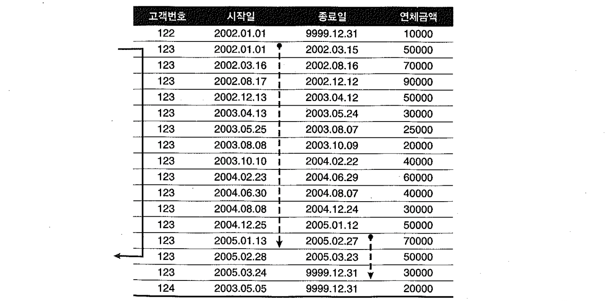


- '=' 조건인 고객번호 다음 인덱스 컬럼(시작일)이 '<=' 조건이므로 2005년 1월 31일 이전의 많은 이력 레코드를 모두 스캔.
- 종료일 조건은 시작일 보다 훨씬 적은 범위지만 선두 컬럼이 부등호 조건이기 때문에 스캔 범위를 줄이는데 기여하지 못한다.
- 종료일이 인덱스 컬럼에 포함되 있기 때문에 테이블 Random 액세스 없이 필터링.
- 최종 레코드는 한 건이지만 많은 인덱스 레코드를 스캔하는 문제가 있다.


- index_desc 힌트를 주고 rownum <= 1 조건을 추가하여 개선.

- 시작일 컬럼에 desc 옵션을 준다면 rownum <= 1 조건만 사용.
  ~~~sql
  select /*+ index_desc(a idx_x01) */ *
  from  고객별연체금액
  where 고객번호 = '123'
  and   '20050131' between 시작일 and 종료일
  and   rownum <= 1;
  ~~~

  

##### 시작일 + 종료일 구성일 때 과거 시점 조회

- 인덱스 : 고객번호 + 종료일 + 시작일

```sql
select *
from  고객별연체금액
where 고객번호 = '123'
and   '20050131' between 시작일 and 종료일;

=>

select *
from  고객별연체금액
where 고객번호 = '123'
and   시작일 <= '20050131'
and   종료일 >= '20050131';
```


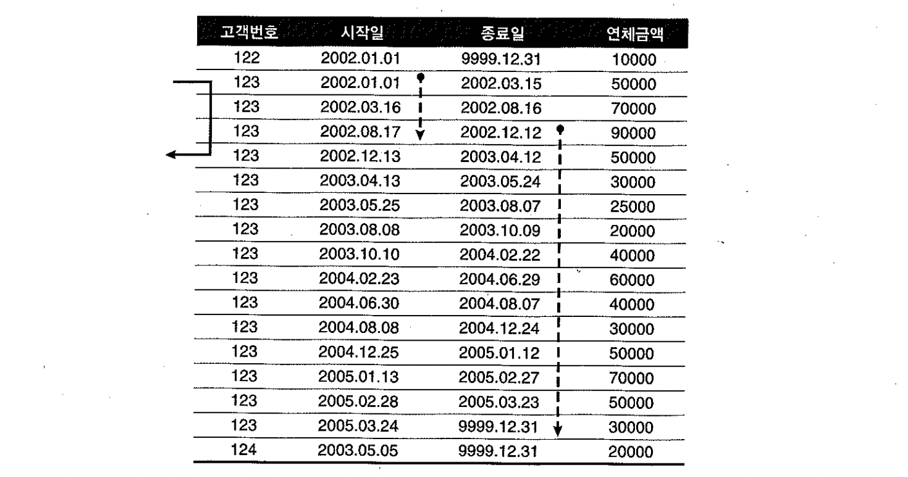

- =' 조건인 고객번호 다음 인덱스 컬럼(종료일)이 '<=' 조건이므로 2005년 1월 31일 이후 소량 이력 레코드만 스캔.

- 인덱스 스캔량이 얼마 되지 않지만 rownum <= 1 조건을 추가하여 개선.
  ~~~sql
  select *
  from  고객별연체금액
  where 고객번호 = '123'
  and   '20050131' between 시작일 and 종료일
  and   rownum <= 1;
  ~~~

  


##### "종료일 + 시작일" 구성일 때 최근 시점 조회

- 인덱스 : 고객번호 + 종료일 + 시작일

```sql
select *
from  고객별연체금액
where 고객번호 = '123'
and   '20050131' between 시작일 and 종료일;

=>

select *
from  고객별연체금액
where 고객번호 = '123'
and   시작일 <= '20050131'
and   종료일 >= '20050131';
```


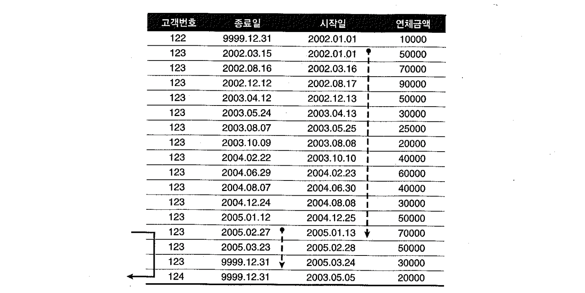


- '=' 조건인 고객번호 다음 인덱스 컬럼(종료일)이 '<=' 조건이므로 2005년 1월 31일 이후 소량 이력 레코드만 스캔.

- 인덱스 스캔량이 얼마 되지 않지만 rownum <= 1 조건을 추가하여 개선.
  ~~~sql
  select *
  from  고객별연체금액
  where 고객번호 = '123'
  and   '20050131' between 시작일 and 종료일
  and   rownum <= 1;
  ~~~

  


##### "종료일 + 시작일" 구성일 대 과거 시점 조회

- 인덱스 : 고객번호 + 종료일 + 시작일

```sql
select *
from  고객별연체금액
where 고객번호 = '123'
and   '20020930' between 시작일 and 종료일;

=>

select *
from  고객별연체금액
where 고객번호 = '123'
and   시작일 <= '20020930'
and   종료일 >= '20020930';
```


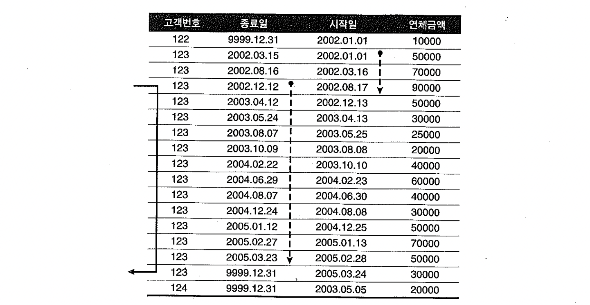


- '=' 조건인 고객번호 다음 인덱스 컬럼(종료일)이 '<=' 조건이므로 2002년 9월 30일 이후의 많은 이력 레코드를 모두 스캔

- 스캔량해야 할 범위가 아무리 넓더라도 rownum <= 1 조건을 추가하여 개선.
  ~~~sql
  select *
  from  고객별연체금액
  where 고객번호 = '123'
  and   '20050131' between 시작일 and 종료일
  and   rownum <= 1;
  ~~~

  


##### 중간 시점 조회

- 중간 시점 이력을 조회할 때는 인덱스 구성을 어떻게 하든 어느 정도 비효율을 감소.
- 인덱스 구성이 (고객번호 + 시작일 + 종료일) 일 경우는 index_desc 힌트 및 rownum <= 1 조건으로 개선.
- 인덱스 구성이 (고객번호 + 종료일 + 시작일) 일 경우는 rownum <= 1 조건으로 개선.


##### 선분이력 스캔 효율을 높이는 방법 요약

- 선분이력처럼 between 검색 조건이 사용될 때는 어느 시점을 주로 조회하느냐에 따라 인덱스 전략을 달리 가져가라.
- 최근 데이터를 주로 조회할 경우는 (종료일 + 시작일)순으로 구성
- 과거 데이터를 주로 조회한다면 (시작일 + 종료일) 순으로 구성
- (시작일 + 종료일) 일 때는 index_desc 힌트와 rownum <= 1 조건을 추가
- (종료일 + 시작일) 일 때는 rownum <= 1 조건만 추가
- 중간지점을 조회할 때도 위의 방식 사용.
- 미래 시점 데이터를 미리 입력하는 경우가 없다면, 현재 시점 데이터를 조회할 때는 (종료일 = '99991231') 조건을 사용하는 것이 효과적.


## 9) Access Predicate와 Filter Predicate

- explain plan 명령을 통해 실행계획을 수집하고 dbms_xplan 패키지(@?/rdbms/admin/utlxpls.sql 참조)를 통해 실행계획을 확인해 보면 Predicate 정보를 확인할 수 있다.
- 오라클 9i부터 plan_table에 추가된 access_predicates 와 filter_predicates 컬럼으로부터 가져온 값.
- 10gR2부터는 Autotrace 명령을 통해서도 Predicate 정보를 출력해 볼 수 있다


```sql
create index emp_x01 on emp(deptno, job, sal, ename, mgr, comm);

set autotrace traceonly explain;

select /*+ ordered use_nl(e) index(e emp_x01) */ *
from   dept d, emp e
where  d.loc = 'CHICAGO'
and    e.deptno = d.deptno
and    e.job like 'SALE%'
and    e.job between 'A' and 'Z'
and    e.sal >= 1000
and    e.ename like '%A%'
and    trim(e.ename) = 'ALLEN'
and    e.comm >= 300
and    to_char(e.hiredate, 'yyyymmdd') like '198102%' ;

Execution Plan
----------------------------------------------------------
Plan hash value: 346692358

---------------------------------------------------------------------------------------
| Id  | Operation                   | Name    | Rows  | Bytes | Cost (%CPU)| Time     |
---------------------------------------------------------------------------------------
|   0 | SELECT STATEMENT            |         |     1 |    57 |     5   (0)| 00:00:01 |
|*  1 |  TABLE ACCESS BY INDEX ROWID| EMP     |     1 |    37 |     2   (0)| 00:00:01 |
|   2 |   NESTED LOOPS              |         |     1 |    57 |     5   (0)| 00:00:01 |
|*  3 |    TABLE ACCESS FULL        | DEPT    |     1 |    20 |     3   (0)| 00:00:01 |
|*  4 |    INDEX RANGE SCAN         | EMP_X01 |     1 |       |     1   (0)| 00:00:01 |
---------------------------------------------------------------------------------------

Predicate Information (identified by operation id):
---------------------------------------------------

   1 - filter(TO_CHAR(INTERNAL_FUNCTION("E"."HIREDATE"),'yyyymmdd') LIKE
              '198102%')
   3 - filter("D"."LOC"='CHICAGO')
   4 - access("E"."DEPTNO"="D"."DEPTNO" AND "E"."JOB" LIKE 'SALE%' AND
              "E"."SAL">=1000 AND "E"."COMM">=300 AND "E"."SAL" IS NOT NULL)
       filter("E"."ENAME" LIKE '%A%' AND "E"."JOB" LIKE 'SALE%' AND
              TRIM("E"."ENAME")='ALLEN' AND "E"."JOB">='A' AND "E"."JOB"<='Z' AND
              "E"."SAL">=1000 AND "E"."COMM">=300)
```

- 인덱스를 경유해 테이블을 액세스할 때는 최대 3가지 Predicate정보가 나타날 수 있다.

  1. 인덱스 단계에서의 Access Predicate (id=4 access 부분)

  2. 인덱스 단계에서의 Filter Predicate (id=4 filter 부분)

  3. 테이블 단계에서의 Filter Predicate (id=1 filter 부분)

- 인덱스를 경유하지 않고 테이블 전체를 스캔할 때는 아래 한가지만 나타난다.
  4. 테이블 단계에서의 Filter Predicate (id=3 filter 부분)


##### '인덱스 단계에서의 Access Predicate'는 인덱스 스캔 범위를 결정하는 데에 영향을 미치는 조건을 의미.

- 인덱스 컬럼에 대한 조건절은, 설령 범위검색 조건을 뒤따르는 조건(sal >= 1000)이거나 선행 컬럼이 조건절에서 누락될지라도 (comm >= 300), 액세스 범위를 결정하는 데에 기여하므로 대부분 Access Predicate에 포함
- 아래의 경우는 Access Predicate에서 제외 (스캔 범위 결정에 전혀 영향을 미치지 않는다)
  - 좌변 컬럼을 가공한 조건절 : trim(e.ename) = 'ALLEN'
  - 왼쪽 '%' 또는 양쪽 '%' 기호를 사용한 like 조건절 : ename like '%A%'
  - 같은 컬럼에 대한 조건절이 두 개 이상일 때, 인덱스 액세스 조건으로 선택되지 못한 다른 조건절 : job betwwen 'A' and 'Z'


- 수직적 탐색 과정에서 모든 인덱스 컬럼을 비교 조건으로 사용한다.
- 수평적 탐색 종료 지점을 결정하는 비교조건으로도 사용된다.


##### ''인덱스 단계에서의 Filter Predicate'는 테이블로의 액세스 여부를 결정짓는 조건절을 의미.

- 첫 번째 나타나는 범위검색 조건부터 이후 모든 조건절 컬럼들이 여기에 포함되며, 조건절에서 누락된 컬럼 뒤쪽에 놓인 인덱스 컬럼들도 포함한다.


##### '테이블 액세스 단계에서의 Filter Predicate'(id 3, 4)는 테이블을 액세스하고 나서 최종 결과집합으로의 포함여부를 결정짓는 조건절을 의미


## 10) Index Fragmentation

- 오라클에서는 B*Tree 인덱스의 'B'는 'Balanced'의 약자로서, 인덱스 루트에서 리프 블록까지 어떤 값으로 탐색하더라도 읽는 블록 수가 같음을 의미.
- 루트로부터 모든 리프 블록까지의 높이(height)가 동일.
- Index Fragmentation에 의해 Index Skew 또는 Sparse 현상이 생기는 경우는 종종 있다. (인덱스 스캔 효율에 나쁜 영향을 미칠 수 있다.)


### Index Skew

- **인덱스 엔트리가 왼쪽 또는 오른쪽에 치우치는 현상.**
- 인덱스 왼쪽에 있는 리프 블록들은 텅비는 반명 오른쪽 블록들은 꽉 찬 상태가 된다.
- 텅빈 인덱스 블록은 커밋하는 순간 `freelist`로 반환되지만 인덱스 구조상에는 그대로 남는다.
- 상위 브랜치에서 해당 리프 블록을 가리키는 엔트리가 그대로 남아 있어 인덱스 정렬 순서상 그곳에 입력될 새로운 값이 들어오면 언제든 재사용될 수 있다.
- 재사용되더라도 이 경우에는 곧바로 `freelist`에서 제거되지 않으며 나중에 빈 블록을 찾기 위해 `freelist`를 스캔하는 프로세스에 의해 정리된다.
- 새로운 값이 하나라도 일력되기 전 다른 노드에서 인덱스 분할이 발생하면 이들 블록이 재사용된다.
- 이때 상위 브랜치에서 해당 리프 블록을 가리키는 엔트리가 제거돼 다른 쪽 브랜치의 자식 노드로 이동하고, `freelist`에서도 제거 된다.
- **레코드가 모두 삭제된 블록은 이처럼 언제든 재사용 가능하지만 문제는 다시 채워질 때까지 인덱스 스캔 효율이 낮다는데 있다.**

```sql
create table t as select rownum no from dual connect by level <= 1000000 ;

create index t_idx on t(no) pctfree 0;

delete from t where no <= 500000 ;

commit; -- 이 시점에 freelist로 반환되지만 인덱스 구조는 남는다.

set autotrace on statistics

- 맨 왼쪽부터 스캔하도록 조건 부여
select * from t where no > 0 and rownum <= 1;

Statistics
----------------------------------------------------------
          0  recursive calls
          0  db block gets
       1001  consistent gets
          0  physical reads
          0  redo size
        420  bytes sent via SQL*Net to client
        400  bytes received via SQL*Net from client
          2  SQL*Net roundtrips to/from client
          0  sorts (memory)
          0  sorts (disk)
          1  rows processed
```

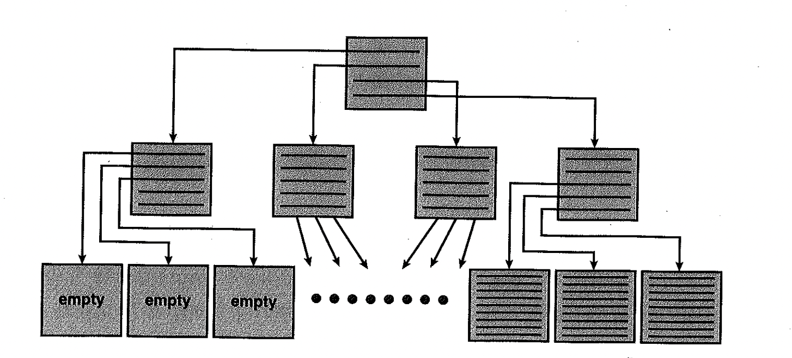

- 위와 같은 Index Skew 때문에 성능이 나빠지는 경우는 대개 Index Full Scan 할 때다
- 대량의 데이터를 매일 지웠다가 새로 입력하는 통계성 테이블일 때는 Index Skew가 발생하지 않도록 트랜잭션 패턴에 신경을 써야 한다.


##### 예제1

- 보관주기가 3일인 일별고객별판매집계 테이블, 매일 10시에 트랜잭션 수행
  - PK 인덱스 : 판매일자 + 고객번호
  - 지난 데이터를 삭제 후 집계 데이터를 인서트 후 커밋
  - PK 인덱스 왼쪽에 놓인 상당수 리프 블록들이 delete 문을 통해 비워진 상태
    - commit 전까지는 freelist 반환되지 않아 insert 과정에서 재사용 못함
  - 다음날 다시 insert시 재사용 되겠지만 delete문으로 인해 지워진 블록들이 새로 발생.
  - delete 직후에 commit을 수행하여 insert 과정에서 재사용 되도록 변경.
    - 업무의 중요도와 트랜잭션이 실패했을 때 재사용 가능한지 등에 따라 판단
    - 배치 업무이므로 트랜잭션을 짧게 변경해도 괜찮다.


##### 예제2

- 문장단위로 커밋을 하지만 insert를 먼저 수행하고 delete를 나중에 수행한 경우
  - insert문에 의해 Skew가 해소 되었다가 곧 이은 delete문에 의해 왼쪽 리프 노드가 또다시 지워진다.
  - insert문과 delete문 수행순서를 바꾸지 않는한 해결되지 않는다.


### Index Sparse

- 인덱스 블록 전반에 걸쳐 밀도(density)가 떨어지는 현상.

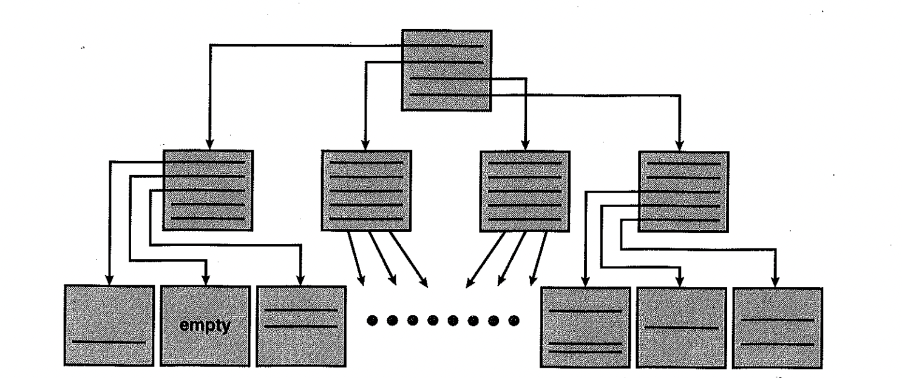


```sql
drop table t;

create table t as select rownum no from dual connect by level <= 1000000 ;

create index t_idx on t(no) pctfree 0 ;

select /*+ index(t) */ count(*) from t where no > 0;

Statistics
----------------------------------------------------------
          0  recursive calls
          0  db block gets
       2001  consistent gets
          0  physical reads
          0  redo size
        424  bytes sent via SQL*Net to client
        400  bytes received via SQL*Net from client
          2  SQL*Net roundtrips to/from client
          0  sorts (memory)
          0  sorts (disk)
          1  rows processed

delete from t where mod(no, 10) < 5 ;

commit;

select /*+ index(t) */ count(*) from t where no > 0;

Statistics
----------------------------------------------------------
          0  recursive calls
          0  db block gets
       2001  consistent gets
          0  physical reads
          0  redo size
        424  bytes sent via SQL*Net to client
        400  bytes received via SQL*Net from client
          2  SQL*Net roundtrips to/from client
          0  sorts (memory)
          0  sorts (disk)
          1  rows processed
```

- 지워진 자리에 인덱스 정렬 순서에 따라 새로운 값이 입력되면 그 공간은 재사용되지만 위와 같이 대량의 delete 작업이 있고 난 후 한동안 인덱스 스캔 효율이 낮다.
- **Index Sparse는 지워진 자리에 새로운 값이 입력되지 않으면 영영 재사용되지 않을 수 있다.**
- 총 레코드 건수가 일정한데도 인덱스 공간 사용량이 계속 커지는 것은 대개 이런 현상에 기인한다.
- 100만건 중 50만건을 지워도 스캔한 인덱스 블록 수가 똑같이 2001개 이다


### Index rebuild

- coalesce : 여러 인덱스 블록을 하나로 병합(merge)하고, 그 결과로서 생긴 빈 블록들은 freelist에 반환한다. (인덱스 분할과 반대작업이 일어남)
- 인덱스 세그먼트에 할당된 **미사용 공간(HWM 아래쪽에서 freelist에 등록된 블록과 HWM 위쪽 미사용 블록)은 반환되지 않는다.**

```
alter index t_idx coalesce;
```


- shrink space : : Index Fragmentation을 해소하면서 공간까지 반환, ASSM에서만 작동

```
alter index t_idx shrink space;
```


- shrink space compact : 공간을 반환하지 않는다. coalesce와 같다.

```
alter index t_idx shrink space compact;
```


- coalesce와 shrink는 레코드를 건건히 지웠다가 다시 입력하는 방식을 사용.
- 작업량이 많을 때는 rebuild 명령을 사용.

```
alter index t_idx rebuild;
alter index t_idx rebuild online;
```


- 인덱스 구조를 슬림화하면 저장 효율이나 스캔 효율은 좋아지지만 일반적으로 인덱스 블록에는 어느 정도 공간을 남겨두는 것이 좋다.
- (맨 우측 리프 블록에만 값이 입력되는 right-growing 인덱스일 때는 pctfree를 0으로 설정하는 것이 좋다)
- 인덱스 블록에 공간이 전혀 없으면 인덱스 분할이 자주 발생해 DML 성능을 떨어 뜨린다.
- 인덱스 분할 때문에 Shared 모드 enq: TX - index contention 대기 이벤트가 자주 나타난다면 pctfree를 높게 설정하는 것을 고려해 볼 수 있다.( pctfree를 높게 설정하는 것만으로는 전혀 효과가 없다.)
- **인덱스에서의 pctfree는 인덱스를 처음 생성하거나 rebuild할 때만 적용되므로 인덱스 경합을 줄이려면 pctfree를 높이고 나서 인덱스를 rebuild해야 한다**
- 하지만 효과는 일시적, 언젠가 빈 공간이 다시 채워지기 때문.
- **아래와 같이 예상효과가 확실할 때만 인덱스 rebuild를 고려**
  - 인덱스 분할에 의한 경합이 현저히 높을 때
  - 자주 사용되는 인덱스 스캔 효율을 높이고자 할 때, 특히 NL 조인에서 반복 액세스되는 인덱스 높이가 증가했을 때
  - 대량의 delete 작업을 수행한 이후 다시 레코드가 입력되기까지 오랜 기간이 소요될 때
  - 총 레코드 수가 일정한대도 인덱스가 계속 커질 때


#### 인덱스 freelist

테이블에서의 pctfree와 pctused는 각각 freelist에서 제외되는 시점과 다시 등록되는 시점을 지정하는 파라미터 다.

테이블은 Heap방식으로 데이터를 입력하므로 **매번 freelist를 참조해 데이터삽입이 가능한 블록을 찾아야 한다.**

인덱스는 정렬된 구조로 자료를 삽입하므로 값이 입력될 때마다 freelist참조가 필요없다. (정렬순서에 따라 정해진곳에 레코드를 삽입하기 때문)

**인덱스 freelist는 인덱스 분할로 빈 블록이 필요할 때만 참조한다.**

이처럼 테이블과 인덱스의 freelist의미,작동방식이 다르고, 인덱스에는 pctused파라미터가 없다.


