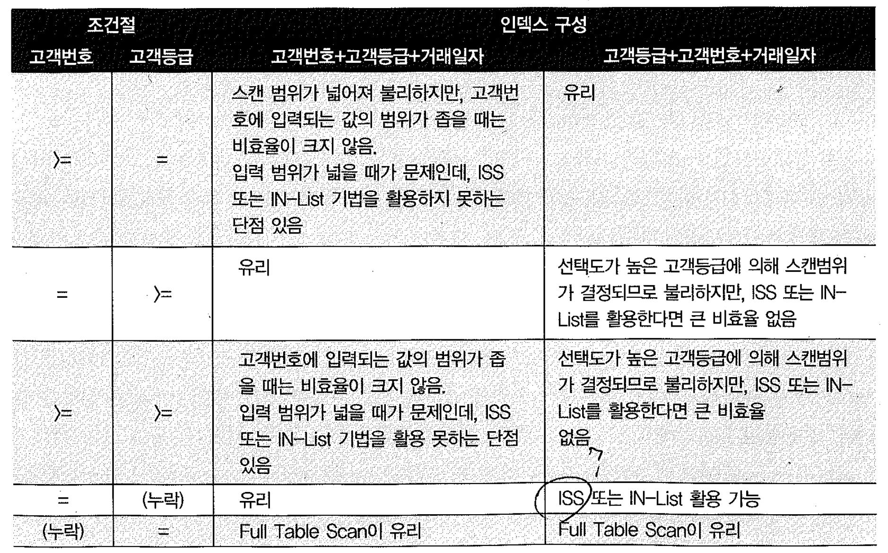
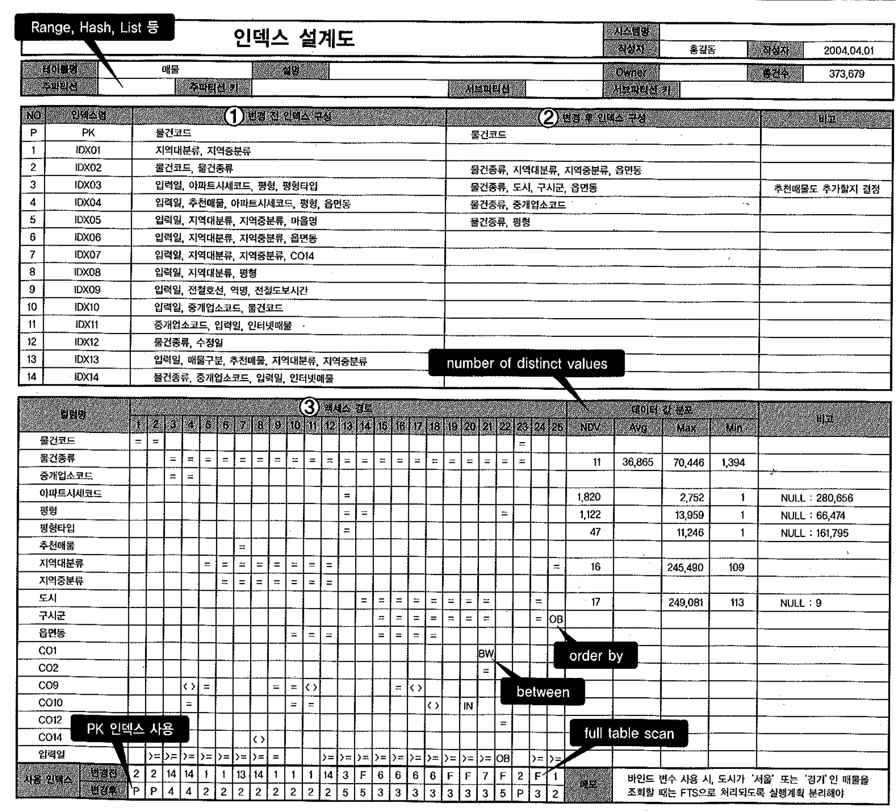

# 08. 인덱스설계


## 1) 가장 중요한 두 가지 선택 기준

- 인덱스에 사용할 컬럼을 선택하고, 순서를 정하는 데는 중요한 기준이 두 가지 있다.


**인덱스 선택기준 두가지**

- 조건절에 항상 또는 자주 사용되는 컬럼을 선택한다.
- '='조건으로 자주 조회되는 컬럼들을 앞쪽에 둔다.


## 2) 인덱스 설계는 공식이 아닌 전략과 선택의 문제

- 공식은 기본이 되는 기준이다. 공식만 지키다 보면, 인덱스 개수만 자꾸 늘어간다.
- 인덱스 설계에는 정답이 없다. 그러므로, 인덱스 구성을 왜 그렇게 했는지에 대해 판단근거를 논리적으로 제시할 수 있으면 된다.
- 최소의 인덱스의 개수로 다수의 DML의 성능을 만족시키는 것이 궁극의 목표다.


##### 간단한 설계 예제

- 거래 테이블을 액세스하는 조건절이 아래 4가지만 있다고 가정하면, 어떻게 인덱스를 구성하는 것이 최적일까?
- (고객수:100만명, 상품:10만개, 거래일자의 검색범위는 유동적)

```sql
<검색조건1>
where 고객번호 = 1
and 거래일자 between '20090101'and '20090331'

<검색조건2>
where 상품번호 = 'A'
and 거래일자 between '20090101'and '20090331'

<검색조건3>
where 고객번호 = 1
and 상품번호 = 'A'
and 거래일자 between '20090101'and '20090331'

<검색조건4>
where 거래일자 between '20090101'and '20090331'
```


- 스타일 A: 모든 조건절 경우 만큼, 인덱스 만들거야? DML부하도 있고 관리도 힘들고.
- 스타일 B: 조건3일때, X1을 사용하면, 테이블필터링이 발생하나, 고객번호가 워낙 변별력이 좋으니 괜찮겠지? 허나 아주 넓은 거래일자를 범위검색하면 상품번호 필터링때문에 다소 비효율적
- 스타일 C: 그래서\!\! 스타일 B에서 조건3을 비효율을 만회하고자, X1인덱스에 상품번호를 추가하였어..
- 스타일 D: 스타일B와 유사한 전략으로 여기도 조건3의 비효율을 만회하려고, X2인덱스에 고객번호를 추가했는데, 상품번호의 선택도가 고객번호보다 높아 C보다는 인덱스스캔이 많을걸.
- 스타일 E: between 조건 뒤는 거의 인덱스 필터역할만 하므로 둘중하나만 있어도 무방. 그럼 스타일 I랑 동일
- 스타일 F: 4개의 조건에는 그닥 효과없음
- 스타일 G: 검색조건 1,2 에서 인덱스 스캔 비효율.
- 스타일 H: 검색조건 2,4에대한 대비 없고, 검색조건1에서도 인덱스 스캔 비효율큼
- 스타일 I: 변별력이 좋은 고객번호가 조건에 포함되면 X1인덱스를 효과적으로 이용가능, X2의 선두에 거래일자가 약간의 비효율이 있으나 범용적으로 사용하는 컬럼이므로 좋게 평가.
- 스타일 J: 인덱스 활용성이 높으나, 근본적으로 비효율이 있으므로 신중히 고려


##### 효율성 비교분석

- 스타일 A와 I의 설계의 효율 비교

| 스타일A                                                      | 스타일I                                             |
| :----------------------------------------------------------- | :-------------------------------------------------- |
| X1:고객번호+거래일자  X2:상품번호+거래일자  X3:상품번호+고객번호+거래일자  X4:거래일자 | X1:고객번호+거래일자  X2:거래일자+상품번호+고객번호 |


| 조건  | 스타일A                    | 스타일I                                                      | 비고                                            |
| :---- | :------------------------- | :----------------------------------------------------------- | :---------------------------------------------- |
| 조건1 | X1                         | X1                                                           | 두번의 테이블 Random Access                     |
| 조건2 | X2                         | X2-불필요한 상품번호까지 스캔하는 비효율존재                 | 세번의 테이블 Random Access                     |
| 조건3 | X3-단 한건의 Random Access | X1-두번의 테이블액세스, 거래범위가 좁으면 X2를 이용해 불필요한 Random Access를 없애는게 좋을수도 |                                                 |
| 조건4 | X4                         | X2                                                           | 동일한 테이블 Random Access, Range파티션 고려ㄴ |

- 테이블 Random 액세스 측면에서 보면, 스타일I가 조건3에서 약간불리. 하지만 고객번호가 변별력이 워낙 좋으니 큰 차이가 안날 수 있다. 부하가 심하면 X2사용
- 인덱스스캔효율 측면에서 보면, 스타일I가 조건2, 조건3에서 비효율적. 하지만 인덱스 블록에는 하나당 수백개의 레코드가 담기므로 괜찮을것이다.


###### 스캔 효율성 이외의 판단 기준

- 인덱스를 설계할 때는 인덱스 스캔의 효율성 뿐만아니라, 시스템 전체적인 관점에서의 아래와 같은 추가적인 요소들을 고려해야한다.
  - 쿼리수행빈도
  - 업무상 중요도
  - 클러스터링 팩터
  - 데이터량
  - DML부하(=기존 인덱스 개수, 초당 DML 발생량, 자주 갱신되는 컬럼 포함 여부 등)
  - 저장공간
  - 인덱스 관리비용 등


##### 인덱스 설계는 공식이 아닌 전략과 선택의 문제

- 인덱스 설계는 개별 쿼리 성능 뿐만 아니라, 인덱스 개수를 최소화하여 DML부하를 줄이는 것도 목표로 삼아야 한다.
- 그리고 왜 그런 선택을 했는지, 전략적 판단 근거가 무엇인지 답할 수 있어야 한다.
- 실무적으로는 파티션 설계를 먼저 진행하거나, 최소한 인덱스 설계와 병행하는 것이 바람직하다.


##### 인덱스 전략 수립을 위한 훈련

- 고객 테이블에 대해 인덱스 구성전략 수립해보기.

```sql
<쿼리1> - 사용빈도 높음
select * from 고객
where 고객번호 = :no;

<쿼리2>
select * from 고객
where 연령 = :age
and 성별 = :gender
and 이름 like :name || '%';

<쿼리3>
select * from 고객
where 연령 between :age1 and :age2
and 거주지역 = :region
and 등록일 like :rdate || '%';

<쿼리4> - 사용빈도 높음
select /*+ orderd use_nl(b) */ * from 주문 a, 고객 b
where a.거래일자 = :tdate
and a.상품번호 = :good
and a.고객번호 = b.고객번호
and b.거주지역 = :region;
```

 인덱스 구성

- IX01: 고객번호+거주지역(쿼리1, 쿼리4)
- IX02: 연령+거주지역(쿼리2, 쿼리3)


## 4) 결합 인덱스 컬럼 순서 결정 시, 선택도 이슈

- 선택도 : 전체레코드 중에서 조건절에 의해 선택되는 비율
- 선택도가 높은 인덱스는 생성해봐야 효용가치가 없음 (Full Table Scan이 비용이 더 적게드니까..)
- 결합 인덱스 컬럼간에 순서를 정할 때, 선택도가 낮은 컬럼을 앞에 두는게 항상 유리할까? (i) 그때 그때 달라요\!\!


#### 선택도가 액세스 효율에 영향을 주지 않는 경우

- '='조건으로 항상 사용되는 컬럼들중에 선택도가 낮은 것을 앞쪽에 두려는 노력은 의미없거나, 더 손해일 수 있다.


~~~
IDX01 : 고객등급 + 고객번호 + 거래일자 + 거래유형 + 상품번호
~~~

- 항상 '=' 조건으로 사용하는 컬럼 : 고객등급, 고객번호(고객등급은 선택도가 높고, 고객번호는 선택도가 낮다.)
- between으로 사용하는 컬럼 : 거래일자


- 선택도가 낮은 고객번호를 고객등급보다 앞에 두는게 유리할까? (i) 아니. 별로 상관없다.
  - 수직적 탐색과정에서는 모든 인덱스 컬럼이 비교조건으로 사용하므로 스캔시작지점은 어느것을 앞에 두더라도 동일하게 결정된다.
  - 선행컬럼이 모두 '='조건이면 범위검색까지의 인덱스 레코드는 한곳에 모여 있으며, 선택도가 높은 컬럼(고객등급)을 앞에두더라도 수평적 탐색을 위한 스켄범위는 최소화 될 것이므로 인덱스 엑세스 효율에 영향을 미치지 않는다.


#### 선택도가 '높은 컬럼'을 앞쪽에 두는 것이 유리한 경우

- 오히려 선택도가 높은 컬럼(고객등급)을 선두에 두면 오라클 9i부터는 Index Skip Scan을 효과적으로 사용할 수 있어 유리.
- (Index Skip Scan은 선행컬럼의 Distinct Value개수가 적고, 후행컬럼의 Distinct Value개수가 많아야 효율적이기 때문)
- 그 밖에도 IN-List로 값을 제공함으로써 쉽게 튜닝할 여지를 준다.
- 인덱스 압축기능을 고려하더라도 고객등급을 앞으로 두는게 유리


#### 상황에 따라 유,불리가 바뀌는 경우




- 선택도가 높은 컬럼을 선두에 두면 나중에 범위검색조건이 사용되거나 조건절에 누락되더라도 ISS 또는 IN-List를 활용할 수 있어 유리
- 선택도가 낮은 컬럼을 선두에 두면 범위검색조건으로 조회할 때는 불리하나, 입력값의 범위가 좁다면 비효율이 크지않아 ISS나 IN-List를 활용못해도 오히려 유리할 수 있다.


#### 선택도가 '낮은 컬럼'을 앞쪽에 두는 것이 유리한 경우

- 범위조건을 사이에 둔 컬럼은 선택도가 낮은 컬럼을 앞쪽에 두는 것이 유리하다.


~~~
where 고객번호 = :a and 상품번호 = :b and 거래일자 between :c and :d
~~~

- 위와 같은 조건절을 사용하는 쿼리에서 두가지 공식에 입각하여 아래와 같은 인덱스 중 하나만 선택해야 한다면?

~~~
X01 : 고객번호 + 거래일자 + 상품번호 => 이거
X02 : 상품번호 + 거래일자 + 고객번호
~~~

- 최선의 인덱스 설계는 고객번호+상품번호+거래일자


#### 선택도가 낮은 컬럼을 '선택'하는 것이 유리한 경우

~~~
<검색조건1> where 거래일자 = :a and 상품번호 = :b
<검색조건2> where 거래일자 = :a and 고객번호 = :b
~~~

- 위와 같은 조건절에서 거래일자를 선두에 둔 단하나의 인덱스를 생성한다고 한다면 어떤 인덱스 선택할래?
- 거래일자+상품번호
- 거래일자+고객번호
  - 사용빈도를 보고 선택, 빈도까지 같다면, 선택도가 낮은 컬럼(고객번호)를 선택하는 것이 현명


**결합인덱스 컬럼간 순서를 정할 때는, 개별컬럼의 선택도보다는 조건절에서 어떤형태로 자주 사용되는지, 사용빈도는 어느 쪽이 더 높은지, 데이터를 빠르게 검색하는 데에 어느쪽 효용성이 더 높은지 등이 더 중요한 판단기준이다.**


## 4) 소트 오퍼레이션을 생략하기 위한 컬럼 추가

- 인덱스는 항상 정렬상태를 유지한다. 인덱스를 이용하면 우리가 select절에 기술한 order by, group by의 연산을 생략할 수도 있다.
- 인덱스를 이용하여 소트연산을 대체하려면, 인덱스 컬럼 구성과 같은 순서로 누락없이 order by절에 기술한다. 단, 인덱스 구성 컬럼이 조건절에서 '='조건으로 비교되면, 누락되거나, 다른 순서로 기술해도 상관없다.


```sql
create table t
as select rownum a, rownum b, rownum c, rownum d, rownum e
from dual
connect by level <= 100000;
테이블이 생성되었습니다.

create index t_idx on t(a, b, c, d);
인덱스가 생성되었습니다.
```


#### 소트오퍼레이션 생략

```sql
select * from t where a=1 order by a, b, c;
select * from t where a=1 and b=1 order by c, d;
select * from t where a=1 and c=1 order by b, d;
select * from t where a=1 and b=1 order by a, c, b, d;
```


```sql
explain plan for
  select * from t
  where a between 1 and 2
  and b not in (1, 2)
  and c between 2 and 3
  order by a, b, c, d;

해석되었습니다.

select * from table(dbms_xplan.display);

PLAN_TABLE_OUTPUT
----------------------------------------------------------------------------------------------------
Plan hash value: 470836197

-------------------------------------------------------------------------------------
| Id  | Operation                   | Name  | Rows  | Bytes | Cost (%CPU)| Time     |
-------------------------------------------------------------------------------------
|   0 | SELECT STATEMENT            |       |     1 |    24 |     3   (0)| 00:00:01 |
|   1 |  TABLE ACCESS BY INDEX ROWID| T     |     1 |    24 |     3   (0)| 00:00:01 |
|*  2 |   INDEX RANGE SCAN          | T_IDX |     1 |       |     2   (0)| 00:00:01 |
-------------------------------------------------------------------------------------
```


```sql
explain plan for
 select * from t
 where a between 1 and 2
 and c between 2 and 3
 order by a, b, c;

해석되었습니다.

select * from table(dbms_xplan.display);

PLAN_TABLE_OUTPUT
----------------------------------------------------------------------------------------------------
Plan hash value: 470836197

-------------------------------------------------------------------------------------
| Id  | Operation                   | Name  | Rows  | Bytes | Cost (%CPU)| Time     |
-------------------------------------------------------------------------------------
|   0 | SELECT STATEMENT            |       |     1 |    24 |     3   (0)| 00:00:01 |
|   1 |  TABLE ACCESS BY INDEX ROWID| T     |     1 |    24 |     3   (0)| 00:00:01 |
|*  2 |   INDEX RANGE SCAN          | T_IDX |     1 |       |     2   (0)| 00:00:01 |
-------------------------------------------------------------------------------------
```


```sql
explain plan for
select * from t
where a between 1 and 2
and b <> 3
order by a, b, c;

해석되었습니다.

select * from table(dbms_xplan.display);

PLAN_TABLE_OUTPUT
----------------------------------------------------------------------------------------------------
Plan hash value: 470836197

-------------------------------------------------------------------------------------
| Id  | Operation                   | Name  | Rows  | Bytes | Cost (%CPU)| Time     |
-------------------------------------------------------------------------------------
|   0 | SELECT STATEMENT            |       |     1 |    24 |     3   (0)| 00:00:01 |
|   1 |  TABLE ACCESS BY INDEX ROWID| T     |     1 |    24 |     3   (0)| 00:00:01 |
|*  2 |   INDEX RANGE SCAN          | T_IDX |     1 |       |     2   (0)| 00:00:01 |
-------------------------------------------------------------------------------------
```


#### Index Full Scan 방식으로 정렬작업 생략

- 인덱스로 소트오퍼레이션 대체 불가

```sql
explain plan for
 select /*+ index(t) */ * from t
 where b between 2 and 3
 order by a, b, c, d;

해석되었습니다.

select * from table(dbms_xplan.display);

PLAN_TABLE_OUTPUT
----------------------------------------------------------------------------------------------------
Plan hash value: 3778778741

-------------------------------------------------------------------------------------
| Id  | Operation                   | Name  | Rows  | Bytes | Cost (%CPU)| Time     |
-------------------------------------------------------------------------------------
|   0 | SELECT STATEMENT            |       |     1 |    24 |   434   (2)| 00:00:06 |
|   1 |  TABLE ACCESS BY INDEX ROWID| T     |     1 |    24 |   434   (2)| 00:00:06 |
|*  2 |   INDEX FULL SCAN           | T_IDX |     1 |       |   433   (2)| 00:00:06 |
-------------------------------------------------------------------------------------
```


##### CASE 1)

```sql
explain plan for
select * from t where a=1 order by c;

해석되었습니다.

select * from table(dbms_xplan.display);

PLAN_TABLE_OUTPUT
----------------------------------------------------------------------------------------------------
Plan hash value: 1454352066

--------------------------------------------------------------------------------------
| Id  | Operation                    | Name  | Rows  | Bytes | Cost (%CPU)| Time     |
--------------------------------------------------------------------------------------
|   0 | SELECT STATEMENT             |       |     1 |    24 |     4  (25)| 00:00:01 |
|   1 |  SORT ORDER BY               |       |     1 |    24 |     4  (25)| 00:00:01 |
|   2 |   TABLE ACCESS BY INDEX ROWID| T     |     1 |    24 |     3   (0)| 00:00:01 |
|*  3 |    INDEX RANGE SCAN          | T_IDX |     1 |       |     2   (0)| 00:00:01 |
--------------------------------------------------------------------------------------
```


##### CASE 2)

```sql
explain plan for
 select * from t
  where a=1
 and b between 1 and 2
 order by c, d;

해석되었습니다.

select * from table(dbms_xplan.display);

PLAN_TABLE_OUTPUT
----------------------------------------------------------------------------------------------------
Plan hash value: 1454352066

--------------------------------------------------------------------------------------
| Id  | Operation                    | Name  | Rows  | Bytes | Cost (%CPU)| Time     |
--------------------------------------------------------------------------------------
|   0 | SELECT STATEMENT             |       |     1 |    24 |     4  (25)| 00:00:01 |
|   1 |  SORT ORDER BY               |       |     1 |    24 |     4  (25)| 00:00:01 |
|   2 |   TABLE ACCESS BY INDEX ROWID| T     |     1 |    24 |     3   (0)| 00:00:01 |
|*  3 |    INDEX RANGE SCAN          | T_IDX |     1 |       |     2   (0)| 00:00:01 |
--------------------------------------------------------------------------------------
```


##### CASE 3)

```sql
explain plan for
select * from t
where a=1
and b between 1 and 2
order by a, c, b;

해석되었습니다.

select * from table(dbms_xplan.display);

PLAN_TABLE_OUTPUT
----------------------------------------------------------------------------------------------------
Plan hash value: 1454352066

--------------------------------------------------------------------------------------
| Id  | Operation                    | Name  | Rows  | Bytes | Cost (%CPU)| Time     |
--------------------------------------------------------------------------------------
|   0 | SELECT STATEMENT             |       |     1 |    24 |     4  (25)| 00:00:01 |
|   1 |  SORT ORDER BY               |       |     1 |    24 |     4  (25)| 00:00:01 |
|   2 |   TABLE ACCESS BY INDEX ROWID| T     |     1 |    24 |     3   (0)| 00:00:01 |
|*  3 |    INDEX RANGE SCAN          | T_IDX |     1 |       |     2   (0)| 00:00:01 |
--------------------------------------------------------------------------------------
```

- 단, 정렬연산을 생략할 수 있다는 것이지, 항상 그런건 아니다. 옵티마이저 판단에 의해 Full Table Scan을 선택하거나, 다른 인덱스를 선택한다면 얘기는 또 달라진다.


## 5) 인덱스 설계도 작성

- 앞 절들의 예시로 아래처럼 설계도를 꾸릴 수 있다.




