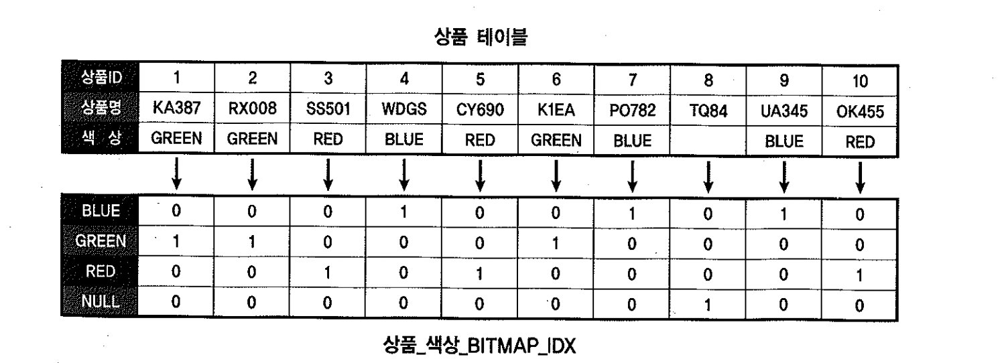

# 09. 비트맵인덱스


- 인덱스는 키 값에 해당하는 테이블 레코드를 찾아갈 수 있도록 주소 정보를 제공 한다.
- B*Tree 인덱스는 테이블 레코드를 가리키는 rowed 목록을 키 값과 함께 저장하는 구조이다. 테이블에 100개 레코드가 있으면 인덱스에도 100개의 rowid를 키 값과 함께 저장한다. rowid에는 중복 이 없지만 키에는 중복 이 있을 수 있다
- 개념적으로 비트맵 인덱스는 *+키 값에 중복이 없고, 키 값별로 하나의 비트맵 레코드를 갖는다.
- 비트맵 상의 각 비트가 하나의 테이블 레코드와 매핑된다. 비트가 1로 설정돼 있으면 상응하는 테이블 레코드가 해당 키 값을 포함하고 있음을 의미한다.


## 1) 비트맵 인덱스 기본 구조


- 상품 테이블에 10개 레코드가 있고, 색상으로 RED, GREEN, BLUE가 입력돼 있고, 8번 상품에는 색상이 입력되어 있지 않다.
- 키 값이 BLUE인 첫 번째 행을 보면 4번째, 7번째, 9번째 비트가 1로 설정돼 있다. 따라서 상응하는 테이블 레코드의 색상 값이 'BLUE' 임을 뜻한다.



```
row#0[ 8001] flag: ------, lock:0, len=35
col 0; len 2; (4): 42 4c 55 45                  *?* *키 값 : BLUE*
col 1; len 6; (6): 01 00 9f 4c 00 00            *? 시작 rowid*
col 2; len 6; (6): 01 01 a4 03 01 47            *? 종료 rowid*
col 3; len 15; (15): 00 c0 ae bb fa 02 c1 a1 10 c1 94 19 c2 dc 07    *? 비트맵*
```

- 마지막 컬럼(col3)은 시작 rowid와 종료 rowid 구간에 속한 테이블 레코드와 매핑되는 비트맵이다. 첫 번째 비트가 시작 rowid(col 1)가 가리키는 레코드와 매핑되고, 마지막 비트는 종료 rowid(col2)가 가리키는 레코드와 매핑된다.


- 비트맵 인덱스는 첫 번째와 마지막 비트의 rowid만을 갖고 있다가 테이블 액세스가 필요할 때면 각 비트가 첫 번째 비트로부터 떨어져 있는 상대적인 거리를 이용해 rowid값을 환산한다.


#### 비트맵 위치와 rowid 매핑

- 데이터 블록은 한 익스텐트 내에서 연속된 상태로 저장되지만 익스텐트끼리는 서로 인접해 있지 않다. 심지어 다른 데이터 파일에 흩어져 저장되는데, 
- 어떻게 시작 rowid와의 상대적인 거리로 정확한 레코드 위치를 알아 낼 수 있을까??
- 오라클이 한 블록에 저장할 수 있는 최대 레코드 개수를 제한한다..

```sql
show parameter block_size;
NAME                                 TYPE        VALUE
------------------------------------ ----------- ------------------------------
db_block_size                        integer     8192


create table t1 ( c )
pctfree 0
as
select 'a' from dual connect by level <= 100000;
테이블이 생성되었습니다.

select min(count(*)), max(count(*)), avg(count(*))
from   t1
group by dbms_rowid.rowid_block_number(rowid);

MIN(COUNT(*)) MAX(COUNT(*)) AVG(COUNT(*))
------------- ------------- -------------
          720           730    729.927007
 


-- 테이블 5Byte를 늘려서 다시 테스트


create table t2 ( c )
pctfree 0
as
select lpad('a', 5) from dual connect by level <= 100000;
테이블이 생성되었습니다.

select min(count(*)), max(count(*)), avg(count(*))
from   t2
group by dbms_rowid.rowid_block_number(rowid);

MIN(COUNT(*)) MAX(COUNT(*)) AVG(COUNT(*))
------------- ------------- -------------
          720           730    729.927007
```

- 위의 상품 테이블에 총 20개 블록이 할당 되었을 때, 첫 번째와 두 번째 익스텐트에 각 각 10개 블록이 있고, 하나의 테이블 블록이 가질 수 있는 최대 레코드 개수는 730이라고 하자.
- 이 테이블 색상 컬럼에 비트맵 인덱스를 만들면, 오라클은 네 개 (BLUE, GREEN, RED, NULL)의 키 값에 각각 14,600(=730*20)개 비트를 할당(초기 값은 0)하고 값에 따라 비트를 설정한다.
- 색상이 'BLUE'인 레코드에 해당하는 비트를 모두 1로 설정한다.
- 비트맵 인덱스를 스캔하면서 테이블 레코드를 찾아 갈때는 예를 들어 9,500번째 비트가 1로 설정돼 있으면 14번째 블록(=두 번째 익스텐트 4번째 블록) 10번째 레코드를 찾아가면 된다.


- florr(9500/730) = 13 -> 14번째 블록
- mod(9500,730) = 10 -> 10번째 레코드
- 반대로, 14번째 블록 10번째 레코드의 비트를 1로 설정하려면 아래 공식으로 해당 비트를 찾아 간다.
- 730 * 13 + 10 = 9,500


#### 키 값의 수가 많을 때

- 비트맵 인덱스는 키 값 별로 하나의 레코드를 갖는데, 저장할 키 값의 수가 아주 많을 때는 한 블록에 모두 담지 못한다. **비트맵을 저장하기 위해 두 개 이상 블록이 필요해지면 아래 처럼 B\*Tree 인덱스 구조를 사용**하며, 값의 수가 많을수록 인덱스 높이도 증가한다.


- 이런 구조일 경우에는 B*Tree 인덱스보다 더 많은 공간을 차지할 수 있어 비트맵 인덱스로 부적합 하다.


#### 키 값별로 로우 수가 많을 때

- 한 블록 크기의 비트맵으로 표현할 수 없을 정도로 테이블 로우 수가 많을 때도 두 개 이상 블록이 필요해 진다.
- 'BLUE' 값 하나에 대한 비트맵을 저장하기 위해 2+1/2 블록만큼의 공간을 필요한다면 아래와 같은 구조로 저장 된다.


- 한 블록이 단 하나의 비트맵 레코드로 구성될 수 있지만 실제 테스트 해 보면, 한 블록에 적어도 2개 비트맵 레코드가 담기도록 잘라서 저장하는 것을 확인 할 수 있다.


#### 비트맵 압축

- 그림을 보면, 모든 비트맵의 시작 rowid와 종료 rowid를 같게 표현되었다. 그것은 비트맵을 압축하지 않았을 때의 모습이고, 실제로는 여러가지 압축 알고리즘이 사용되기 때문에 서로 다른 rowid 범위를 갖는다.
- 오라클은 '0'으로 채워진 비트맵 블록들이 생기는데, 오라클은 그런 블록들을 제거한다. 비트맵 뒤쪽에 0이 반복되어도 이를 제거 한다. 그리고 앞, 뒤, 중간 어디든 같은 비트맵 문자열이 반복되면 checksum 비트를 두어 압축 한다.
- 이 때문에 각 비트맵이 가리키는 rowid 구간이 서로 달라지지만 시작 rowid와 종료 rowid만 알고 있으면 비트와 매핑되는 rowid를 계산하거나 다른 비트맵과 Bitwise 연산하는 데에는 전혀 지장이 없다.


## 2) 비트맵 인덱스 활용

- 비트맵 인덱스는 성별처럼 Distinct Value 개수가 적을 때 저장효율이 매우 좋다. 그런 컬럼이라면 B*Tree 인덱스보다 훨씬 적은 용량을 차지하므로 인덱스가 여러 개 필요한 대용량 테이블에 유용하다.
- 주로 다양한 분석관점(Dimension)을 가진 팩트성 테이블이 여기에 속한다. 반대로 Distinct Value 가 아주 많은 컬럼이면 오히려 B*Tree 인덱스보다 많은 공간을 차지 한다.
- Distinct Value 개수가 적은 컬럼일 때 저장효율이 좋지만 테이블 Random 액세스 발생 측면에서는 B*Tree 인덱스와 똑같기 때문에 그런 컬럼을 비트맵 인덱스로 검색하면 그다지 좋은 성능을 기대하기 어렵다.
- 하나의 비트맵 인덱스 단독으로는 쓰임새가 별로 없지만 여러 비트맵 인덱스를 동시에 사용할 수 있다는 특징 때문에 대용량 데이터 검색 성능을 향상 시키는 데에 큰 효과를 발휘한다.
- 두 개 이상 비트맵을 이용한 Bitwise AND 연산뿐만 아니라 Bitwise OR, Bitwise Not 연산도 가능하다.


```
-- 상품 테이블의 '크기'와 '색상' 두 컬럼에 각각 비트맵 인덱스가 있는 상태에서 아래와 같은 쿼리를 수행
select * from 상품
where (크기 = 'SMALL' or 크기 is null)
and 색상 = 'GREEN'
```

- '크기' 컬럼 인덱스로부터 'SMALL'과 NULL에 대한 비트맵을 읽고, '색상' 인덱스로부터 'GREEN'에 대한 비트맵을 읽거 아래와 같이 나란히 놓고 Bitwise 연산을 해 보면, 2번째와 7번째가 조건절을 만족하는 레코드임을 알 수 있다. 또한, 비트맵 인덱스를 이용하면 null 값에 대한 검색도 가능하다.


- 비트맵 인덱스는 여러 인덱스를 동시에 활용할 수 있다는 장점 때문에 다양한 조건절이 사용되는, 특히 정형화되지 않은 임의 질의가 많은 환경에 적합하다.
- **비트맵 인덱스는 lock에 의한 DML 부하가 심한 것이 단점{}{**}이다. 레코드 하나만 변경되더라도 해당 비트맵 범위에 속한 모든 레코드에 lock이 걸린다. OLTP성 환경에 비트맵 인덱스를 쓸 수 없는 이유가 여기에 있다.


## 3) RECORDS_PER_BLOCK

- 오라클은 한 블록에 저장할 수 있는 최대 레코드 개수를 제한한다. 그래야만이 비트맵 위치와 rowid를 매핑할 수 있기 때문이다.
- 예를 들어 오라클이 정한 블록당 최대 레코드 개수가 730이면, 키 값마다 `블록 수 * 730` 만큼의 비트를 할당한다.
- 하지만 실제 블록에 저장되는 평균적인 레코드 개수는 여기에 한참 못 미치므로 비트맵 인덱스에 낭비되는 공간이 많이 생긴다. 이에 오라클은 블록에 저장될 수 있는 최대 레코드 개수를 사용자가 지정할 수 있는 기능을 제공한다.

```sql
-- 100만개 레코드를 갖는 T 테이블을 생성
create table t ( x number, y char(1) ) pctfree 99 pctused 1;
테이블이 생성되었습니다.

insert into t
select mod(rownum,3), 'x' from dual connect by level <= 1000000;

commit;

-- Block당 레코드의 개수 확인
select min(count(*)), max(count(*)), avg(count(*))
from   t
group by dbms_rowid.rowid_block_number(rowid);
MIN(COUNT(*)) MAX(COUNT(*)) AVG(COUNT(*))
------------- ------------- -------------
            1             7      6.999958


-- 인덱스를 만들고 크기를 측정하면, 총 256개 블록이 할당돼 2MB공간을 차지함을 알 수 있다.
create bitmap index t_idx on t(x);

select extents, blocks, bytes/1024 "SIZE(KB)"
from   user_segments
where  segment_name = 'T_IDX';

   EXTENTS     BLOCKS   SIZE(KB)
---------- ---------- ----------
        17        256       2048


-- 인덱스를 삭제 후 T 테이블을 스캔하여 블록당 최대 레코드 개수를 조사
drop index t_idx;
-- 작업이 완료되면, T 테이블에는 블록당 최대 7개 레코드만 저장됨
alter table t minimize records_per_block;


-- 비트맵 인덱스를 만들면, 오라클은 블록당 최대 7개 레코드가 담기는 것을 기준으로 키 값마다 [블록수 * 7] 만큼의 비트를 할당
create bitmap index t_idx on t(x);

select extents, blocks, bytes/1024 "SIZE(KB)"
from   user_segments
where  segment_name = 'T_IDX';
   EXTENTS     BLOCKS   SIZE(KB)
---------- ---------- ----------
        10         80        640
 
```

- 생각만큼 큰 폭으로 줄어 들지 않는 이유는, '오라클이 처음에 정한 블록당 최대 크기'를 기준으로 비트를 할당할 때도 내부적으로 사용한 압축 알고리즘을 사용하기 때문이다.
- **블록당 레코드 개수가 정상치보다 낮은 상태에서 minimize records_per_block 명령을 수행하지 말아야 한다.** 수행할 경우, 추가로 데이터가 입력되면서 블록마다 공간이 많이 생기고, 비트맵 인덱스가 줄어드는 것 이상으로 테이블 크기가 커지는 결과를 초래한다.