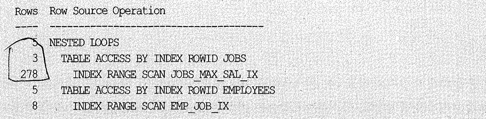
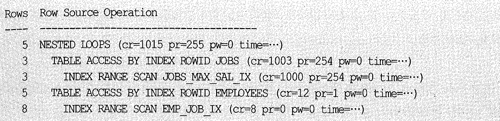

# 01. Nested Loops 조인


## 1) 기본 메커니즘

- Nested Loops조인은 아래와 같은 중첩 루프문과 동일한 원리이다.

##### C,JAVA

```
for(i=0; i<100; i++){    -- outer loop
  for(j=0; j<100; j++){  -- inner loop
    .....
  }
}
```

##### PL/SQL

```
for outer in 1..100 loop
  for inner in 1..100 loop
    dbms_output.put_line(outer || ':' || inner);
  end loop;
end loop;
```


- 아래의 PL/SQL과 SQL문은 내부적으로(Recursive하게) 쿼리를 반복 수행하지 않는점 이외에 동일한 처리를 한다.


##### PL/SQL

```
begin
  for outer in (select deptno, empno, rpad(ename, 10) ename from emp)
  loop    -- outer 루프
    for inner in (select dname from dept where deptno = outer.deptno)
    loop  -- inner 루프
      dbms_output.put_line(outer.empno||' : '||outer.ename||' : '||inner.dname);
    end loop;
  end loop;
end;
```


##### SQL

```
select	/*+ ordered use_nl(d) */ e.empno, e.ename, d.dname
from	emp e, dept d
where	d.deptno = e.deptno
```


## 2) 힌트를 이용해 NL조인을 제어하는 방법


#### 예제 1

```sql
select /*+ ordered use_nl(e) */ *
from dept d, emp e
where e.deptno = d.deptno
```

- ordered : from절에 써있는 순서대로 테이블을 조인하세요
- use_nl : NL방식으로 조인하세요.
- => 즉, dept테이블을 기준으로, emp테이블을 NL방식으로 조인하세요


**Outer테이블**

- 두개의 테이블을 조인할 때, 어떤게 Outer 테이블이고, 또 어떤게 Inner 테이블인거지?


##### NL조인

```sql
explain plan for
select /*+ ordered use_nl(e)*/*
from dept d, emp e
where d.deptno = e.deptno;

select * from table(dbms_xplan.display);

PLAN_TABLE_OUTPUT
--------------------------------------------------------------------------------
Plan hash value: 4192419542

---------------------------------------------------------------------------
| Id  | Operation          | Name | Rows  | Bytes | Cost (%CPU)| Time     |
---------------------------------------------------------------------------
|   0 | SELECT STATEMENT   |      |    14 |   798 |     9   (0)| 00:00:01 |
|   1 |  NESTED LOOPS      |      |    14 |   798 |     9   (0)| 00:00:01 |
|   2 |   TABLE ACCESS FULL| DEPT |     4 |    80 |     3   (0)| 00:00:01 | => Outer/Driving
|*  3 |   TABLE ACCESS FULL| EMP  |     4 |   148 |     2   (0)| 00:00:01 | => Inner/Driven
---------------------------------------------------------------------------
```


##### 소트머지 조인

```sql
explain plan for
select /*+ ordered full(d) use_merge(e)*/ *
from dept d, emp e
where d.deptno = e.deptno;

select * from table(dbms_xplan.display);

PLAN_TABLE_OUTPUT
--------------------------------------------------------------------------------
Plan hash value: 1407029907

----------------------------------------------------------------------------
| Id  | Operation           | Name | Rows  | Bytes | Cost (%CPU)| Time     |
----------------------------------------------------------------------------
|   0 | SELECT STATEMENT    |      |    14 |   798 |     8  (25)| 00:00:01 |
|   1 |  MERGE JOIN         |      |    14 |   798 |     8  (25)| 00:00:01 |
|   2 |   SORT JOIN         |      |     4 |    80 |     4  (25)| 00:00:01 |
|   3 |    TABLE ACCESS FULL| DEPT |     4 |    80 |     3   (0)| 00:00:01 | => Outer/First
|*  4 |   SORT JOIN         |      |    14 |   518 |     4  (25)| 00:00:01 |
|   5 |    TABLE ACCESS FULL| EMP  |    14 |   518 |     3   (0)| 00:00:01 | => Inner/Second
```


##### 해시 조인

```sql
explain plan for
select /*+ ordered use_hash(e)*/*
from dept d, emp e
where d.deptno = e.deptno;

select * from table(dbms_xplan.display);

PLAN_TABLE_OUTPUT
--------------------------------------------------------------------------------
Plan hash value: 615168685

---------------------------------------------------------------------------
| Id  | Operation          | Name | Rows  | Bytes | Cost (%CPU)| Time     |
---------------------------------------------------------------------------
|   0 | SELECT STATEMENT   |      |    14 |   798 |     7  (15)| 00:00:01 |
|*  1 |  HASH JOIN         |      |    14 |   798 |     7  (15)| 00:00:01 |
|   2 |   TABLE ACCESS FULL| DEPT |     4 |    80 |     3   (0)| 00:00:01 | => Outer/Build Input
|   3 |   TABLE ACCESS FULL| EMP  |    14 |   518 |     3   (0)| 00:00:01 | => Inner/Probe Input
---------------------------------------------------------------------------
```


|                   | NL 조인              | 소트머지 조인       | 해시 조인   |
| :---------------- | :------------------- | :------------------ | :---------- |
| 실행계획상 위쪽   | Outer(Driving)테이블 | Outer(First)테이블  | Build Input |
| 실행계획상 아래쪽 | Inner(Driven)테이블  | Inner(Second)테이블 | Probe Input |


#### 예제 2

```
select /*+ ordered use_nl(B) use_nl(C) use_hash(D) */ *
from A, B, C, D
where ...
```

- A->B->C->D 순으로 B와 조인할때, C와 조인할 때는 NL로, D와 조인할때는 Hash로..


#### 예제 3

- ordered대신 leading힌트를 이용하여 조인순서제어가 가능(leading을 사용하면 테이블 순서를 일일이 바꿔줄 필요없이 제어가능)

```
select /*+ leading(C, A, D, B) use_nl(A) use_nl(D) use_hash(B) */ *
from A, B, C, D
where ...
```

- =>C->A->D->B 순으로 A와 조인할때, D와 조인할때는 NL로 B와 조인할때는 Hash로..


#### 예제 4

```
select /*+ use_nl(A,B,C,D)*/ *
from A, B, C, D
where ...
```

- => A,B,C,D를 조인할 때 모두 NL로.. 단, 특별히 조인순서를 지정안했으므로, 조인순서는 옵티마이저 판단에 맡김


## 3) NL조인 수행과정 분석


##### SQL

```sql
select /*+ ordered use_nl(e) */
       e.empno, e.ename, d.dname, e.job, e.sal
from   dept d, emp e
where  e.deptno = d.deptno  -- 1
and    d.loc = 'SEOUL'      -- 2
and    d.gb = '2'           -- 3
and    e.sal >= 1500        -- 4
order by sal desc
```


##### INDEX

```
pk_dept : dept.deptno
dept_loc_idx : dept.loc
pk_emp : emp.empno
emp_deptno_idx : emp.deptno
emp_sal_idx : emp.sal 
```


##### 실행계획

```
-------------------------------------------------------------------------------------------------
| Id  | Operation                      | Name           | Rows  | Bytes | Cost (%CPU)| Time     |
-------------------------------------------------------------------------------------------------
|   0 | SELECT STATEMENT               |                |     1 |    45 |     4  (25)| 00:00:01 |
|   1 |  SORT ORDER BY                 |                |     1 |    45 |     4  (25)| 00:00:01 |
|*  2 |   TABLE ACCESS BY INDEX ROWID  | EMP            |     4 |   100 |     1   (0)| 00:00:01 |
|   3 |    NESTED LOOPS                |                |     1 |    45 |     3   (0)| 00:00:01 |
|*  4 |     TABLE ACCESS BY INDEX ROWID| DEPT           |     1 |    20 |     2   (0)| 00:00:01 |
|*  5 |      INDEX RANGE SCAN          | DEPT_LOC_IDX   |     1 |       |     1   (0)| 00:00:01 |
|*  6 |     INDEX RANGE SCAN           | EMP_DEPTNO_IDX |     5 |       |     0   (0)| 00:00:01 |
-------------------------------------------------------------------------------------------------
```

- 1) 사용되는 인덱스는 ? dept_loc_idx, emp_deptno_idx
- 2) 조건비교순서는? (2) \-> (3) \-> (1) \-> (4)
- (실행계획 해석은, 위에서 아래로, 안쪽에서 바깥으로 읽기)


- 각 단계를 완료하고 나서 다음단계로 넘어가는게 아니라 한 레코드씩 순차적으로 진행한다.
- 단, order by는 전체집합을 대상으로 정렬해야 하므로 작업을 모두 완료한 후 다음 오퍼레이션을 진행한다.


##### NL조인의 수행절차


- dept_loc_idx 인덱스를 스캔하는 양에 따라 전체 일량이 좌우된다.
- gb='2'조건에 의해 필터링 되는 비율이 높다면 dept_loc_idx인덱스에 gb컬럼을 추가하는 방안을 고려해볼것
- sal >= 1500 조건에 의해 필터링 되는 비율이 높다면 emp_deptno_idx인덱스에 sal 컬럼 추가하는 방안고려


##### OLTP시스템에서 조인을 튜닝할 때는 우선적으로 NL조인부터 고려해야 한다.

- 각 단계 일량에 대해 Random 액세스를 파악하고 부하 지점에 조인순서 등을 변경한다.
- 개선이 어려운경우에 다른 인덱스 사용을 고려한다. 
- 그래도 개선이 어렵다면 해시조인 혹은 소트머지조인을 고려한다.


## 4) NL조인의 특징

- Random 액세스 위주의 조인방식 그러므로, 인덱스 구성이 완벽해도 대량의 데이터 조인시 비효율적
- 조인을 한 레코드씩 순차적으로 진행 : 아무리 대용량 집합이더라도 매우 극적인 응답속도를 낼 수 있으며, 먼저 액세스되는 테이블의 처리 범위에 의해 전체 일량이 결정된다.
- 다른 조인방식보다 인덱스 구성 전략이 특히 중요하며, 소량의 데이터를 처리하거나 부분범위 처리가 가능한 **OLTP** 환경에 적합한 조인방식이다.


## 5) NL조인 튜닝실습


예제 쿼리와 인덱스가 주어져 있다.

~~~sql
select /*+ ordered use_nl(e) index(j) index(e) */
j.job_title, e.first_name, e.last_name, e.hire_date, e.salary, e.email, e.phone_number
from jobs j, employees e
where e.job_id = j.job_id -- 1
and j.max_salary >= 1500 -- 2
and j.job_type = 'A' -- 3
and e.hire_date >= to_date('19960101', 'yyyymmdd') -- 4
~~~

~~~sql
pk_jobs : job_id
jobs_max_sal_ix : jobs.max_salary
pk_employees : employee_id
emp_job_ix : job_id
emp_hiredate_ix : hire_date
~~~


아래 세 가지 문제에 대해서 튜닝을 해보자.



- 테이블을 액세스 한 후에 필터링 되는 비율이 높다면 인덱스에 테이블 필터 조건 컬럼을 추가하는것을 고려
- (job_max_sal_ix : max_salary + job_type)




- job_max_sal_ix인덱스로부터 3건을 리턴하기 위해 인덱스 블록을 1000개 읽음. 인덱스 컬럼 순서를 조정
- (job_max_sal_ix : job_type + max_salary)


- 1278번 조인시도했으나 최종성공한 결과집합은 5건뿐
- 조인순서 jobs \-> employees에서 employees \-> jobs로 변경고려
- 조인순서를 바꾸어도 소득이 없다면 소트머지조인과 해시조인을 검토

