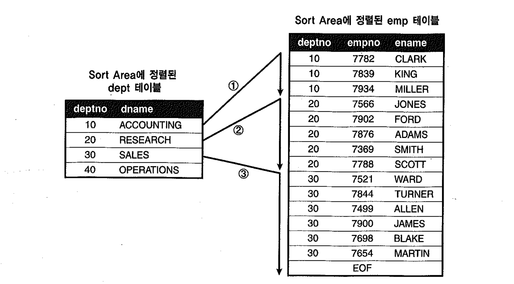
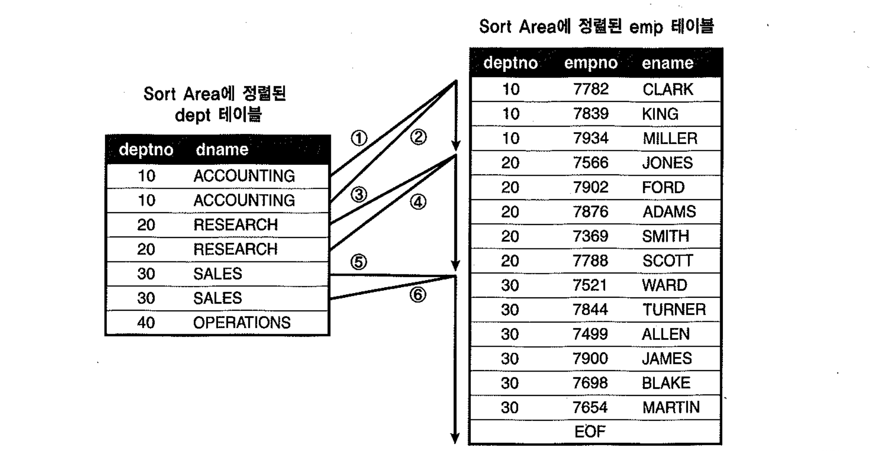

# 02. 소트머지조인


## 1) 기본 메커니즘

- NL조인을 효과적으로 수행하려면, 조인 컬럼에 인덱스가 필요하다. 만약 적절한 인덱스가 없다면, 옵티마이저는 `소트머지조인`이나 `해시조인`을 고려한다.


##### 처리절차

- 두 테이블을 각각 정렬한 다음에 두 집합을 머지(Merge)하면서 조인을 수행한다.
  - 소트단계 : 양쪽 집합을 조인 컬럼 기준으로 정렬한다.
  - 머지단계 : 정렬된 양쪽 집합을 서로 Merge한다.

- 소트머지 조인은 Outer루프와 Inner루프가 Sort Area에 미리 정렬해둔 데이터를 이용할 뿐, 실제 조인과정은 NL조인과 동일하다.
- 하지만, Sort Area가 PGA영역에 할당되므로 `래치획득과정이 없기 때문에, SGA를 경유하는 것보다 훨씬 빠르다`.

##### 예제

~~~sql
create table sorted_dept ( deptno primary key, dname  )
organization index
as 
select deptno, dname from dept order by deptno ;

create table sorted_emp( empno , ename , deptno
  , constraint sorted_emp_pk primary key(deptno, empno) 
)
organization index
as 
select empno, ename, deptno from emp order by deptno ;
;

begin
  for outer in (select deptno, empno, rpad(ename, 10) ename from sorted_emp)
  loop    -- outer loop
    for inner in (select dname from sorted_dept where deptno = outer.deptno)
    loop  -- inner loop
      dbms_output.put_line(outer.empno||' : '||outer.ename||' : '||inner.dname);
    end loop;
  end loop;
end;
/
~~~


##### Outer 테이블, Inner 테이블

- Sort Area에 미리 정렬해둔 데이터를 이용할 뿐, 실제조인과정은 NL조인과 동일하다고 하였다.
- NL조인에서 `Outer 테이블이 First테이블`, `Inner 테이블이, Second테이블`로 명명되며, 이를 혼용해서 쓰기도한다.

```sql
select /*+ ordered use_merge(e) */ d.deptno, d.dname, e.empno, e.ename
from dept d, emp e
where d.deptno = e.deptno
```

- 소트머지 조인은 `use_merge`힌트 사용

##### 처리과정

1. Outer(=First)테이블인 dept를 deptno기준으로 정렬한다.
2. Inner(=Second)테이블인 emp를 deptno기준으로 정렬한다.
3. Sort Area에 정렬된 dept테이블을 스캔하면서, 정렬된 emp테이블과 조인한다.





- emp테이블이 정렬되어 있으므로 조인에 실패하는 레코드를 만나는 순간 멈출 수 있다.
- 스캔하다가 멈춘 시작점을 기억했다가 거기서부터 시작하면 되므로, 정렬된 emp에서 스캔 시작점을 찾으려고 매번 탐색하지 않아도 된다.
  (outer 테이블이 inner테이블과 같이 정렬되어있기 때문에 가능함)





- N:M관계인 경우에서도 스캔도중 멈추는 것은 가능하나, 시작점을 찾는 일은 단순하지 않다.
- 시작점을 찾으려고 매번 이진탐색 수행하거나, 변수를 하나 더 선언해서 스캔했던 시작점을 기억하는 방법 이 두가지를 생각해 볼수 있음.
  - Outer테이블까지 정렬한다는 사실을 통해 후자의 방법이 더 설득력이 있다고 보여진다. (전자 방식은 굳이 outer 테이블을 정렬하지 않아도 되기 때문)


## 2) 소트머지 조인의 특징

- PGA영역에 저장된 데이터를 이용하기 때문에 빠르므로 소트부하만 감수하면 NL조인보다 유리하다.
- 인덱스유무에 영향을 받지 않는다. (이미 정렬했기 때문)
- 스캔위주의 액세스방식을 사용한다.
  (단, 양쪽 소스 집합에서 정렬 대상 레코드를 찾는 작업은 인덱스를 이용해 `Random엑세스 방식`으로 처리, 이 때 액세스량이 많다면, 소트머지 이점이 사라질수 있다.)

- 대부분 해시조인인 보다 느린 성능을 보이나, 아래와 같은 상황에서는 소트머지 조인이 유용하다.
  - First테이블에 소트연산을 대체할 인덱스가 있을 때
  - 조인할 First 집합이 이미 정렬되어 있을 때
  - 조인 조건식이 등치(=)조건이 아닐 때


## 다음절 정리 중..


#### 1) First 테이블에 소트 연산을 대체할 인덱스가 있을 때 

- 해시 조인과 마찬가지로, 한쪽 집합(Second 테이블)은 전체범위를 처리하고 다른 한쪽(First 테이블)을 일부만 읽고 멈추도록 할 수 있음
  
- First 테이블 조인 컬럼에 인덱스가 있을 때 가능

- OLTP성 업무에서 소량의 테이블과 대량의 테이블을 조인할 때, 소트 머지 조인을 유용하게 사용할 수 있음

- 소트 머지 조인에서 인덱스를 이용해 소트 연산을 대체할 수 있는 대상은 First 테이블에만 국한됨

- Second 테이블 조인 컬럼에 대한 인덱스를 이용함에도 Sort Join 오퍼레이션이 나타남.

- First 테이블은 이미 정렬된 인덱스를 사용할 것이므로 그대로 두고, 먼저 Second 집합 테이블을 읽어 정렬한 결과를 Sort Area에 담음

- 조인 연산을 진행할 때는 First 집합 테이블의 인덱스부터 읽기 시작함

- 소트 머지 조인도 부분적으로 부분범위처리가 가능함
  Second 테이블은 항상 정렬을 수행하므로 전체범위처리가 불가피하지만, First 테이블만큼은 중간에 읽다가 멈출 수 있음

- Second 테이블은 조인 컬럼에 인덱스가 있더라도 정렬을 수행함


#### 2) 조인할 First 집합이 이미 정렬돼 있을 때

- First 집합이 정렬돼 있을 때만 소트 연산이 생략됨, 
  Second 집합은 설사 정렬돼 있더라도 Sort Join 오퍼레이션을 수행함


#### 3) 조인 조건식이 등치(=) 조건이 아닐 때

- 해시 조인은 조인 조건식이 등치(=) 조건일 때만 사용할 수 있지만 
  소트 머지 조인은 등치 조건이 아닐 때도(between, <, <=, >, >=) 사용될 수 있음


