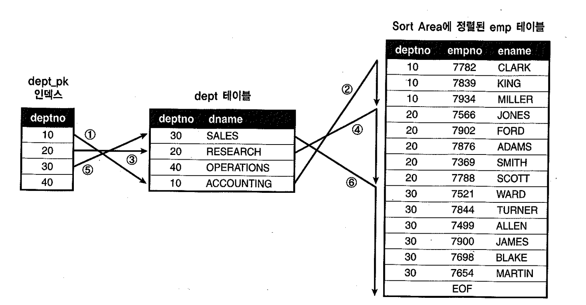
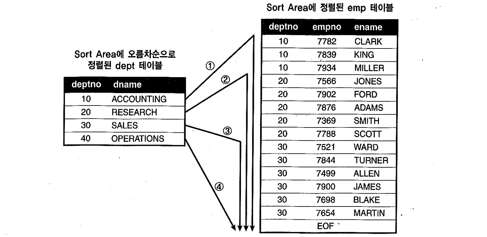
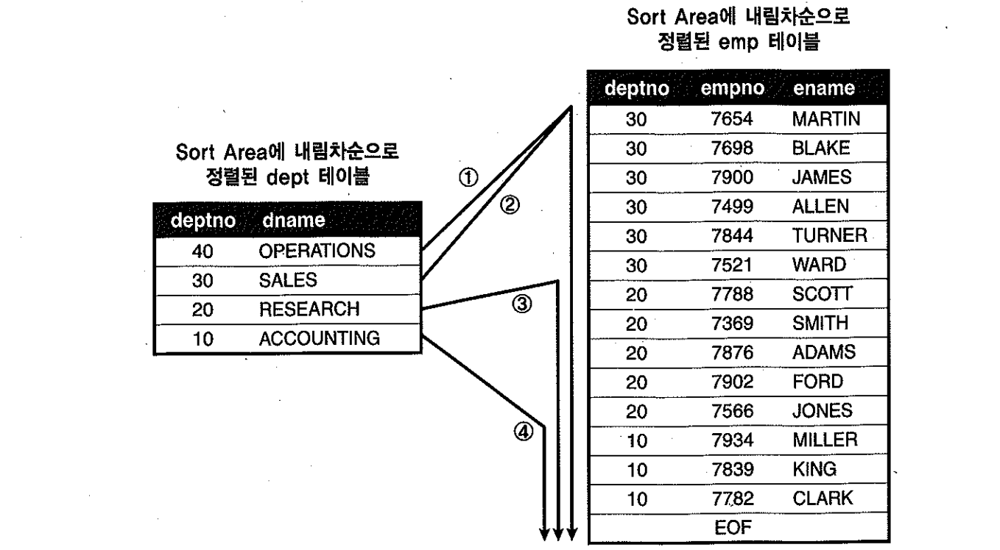

# 02. 소트머지조인


## 1) 기본 메커니즘

- NL조인을 효과적으로 수행하려면, 조인 컬럼에 인덱스가 필요하다. 만약 적절한 인덱스가 없다면, 옵티마이저는 `소트머지조인`이나 `해시조인`을 고려한다.


##### 처리절차

- 두 테이블을 각각 정렬한 다음에 두 집합을 머지(Merge)하면서 조인을 수행한다.
  - 소트단계 : 양쪽 집합을 조인 컬럼 기준으로 정렬한다.
  - 머지단계 : 정렬된 양쪽 집합을 서로 Merge한다.

- 소트머지 조인은 Outer루프와 Inner루프가 Sort Area에 미리 정렬해둔 데이터를 이용할 뿐, 실제 조인과정은 NL조인과 동일하다.
- 하지만, Sort Area가 PGA영역에 할당되므로 `래치획득과정이 없기 때문에, SGA를 경유하는 것보다 훨씬 빠르다`.

##### 예제

~~~sql
create table sorted_dept ( deptno primary key, dname  )
organization index
as 
select deptno, dname from dept order by deptno ;

create table sorted_emp( empno , ename , deptno
  , constraint sorted_emp_pk primary key(deptno, empno) 
)
organization index
as 
select empno, ename, deptno from emp order by deptno ;
;

begin
  for outer in (select deptno, empno, rpad(ename, 10) ename from sorted_emp)
  loop    -- outer loop
    for inner in (select dname from sorted_dept where deptno = outer.deptno)
    loop  -- inner loop
      dbms_output.put_line(outer.empno||' : '||outer.ename||' : '||inner.dname);
    end loop;
  end loop;
end;
/
~~~


##### Outer 테이블, Inner 테이블

- Sort Area에 미리 정렬해둔 데이터를 이용할 뿐, 실제조인과정은 NL조인과 동일하다고 하였다.
- NL조인에서 `Outer 테이블이 First테이블`, `Inner 테이블이, Second테이블`로 명명되며, 이를 혼용해서 쓰기도한다.

```sql
select /*+ ordered use_merge(e) */ d.deptno, d.dname, e.empno, e.ename
from dept d, emp e
where d.deptno = e.deptno
```

- 소트머지 조인은 `use_merge`힌트 사용

##### 처리과정

1. Outer(=First)테이블인 dept를 deptno기준으로 정렬한다.
2. Inner(=Second)테이블인 emp를 deptno기준으로 정렬한다.
3. Sort Area에 정렬된 dept테이블을 스캔하면서, 정렬된 emp테이블과 조인한다.


- emp테이블이 정렬되어 있으므로 조인에 실패하는 레코드를 만나는 순간 멈출 수 있다.
- 스캔하다가 멈춘 시작점을 기억했다가 거기서부터 시작하면 되므로, 정렬된 emp에서 스캔 시작점을 찾으려고 매번 탐색하지 않아도 된다.
  (outer 테이블이 inner테이블과 같이 정렬되어있기 때문에 가능함)


- N:M관계인 경우에서도 스캔도중 멈추는 것은 가능하나, 시작점을 찾는 일은 단순하지 않다.
- 시작점을 찾으려고 매번 이진탐색 수행하거나, 변수를 하나 더 선언해서 스캔했던 시작점을 기억하는 방법 이 두가지를 생각해 볼수 있음.
  - Outer테이블까지 정렬한다는 사실을 통해 후자의 방법이 더 설득력이 있다고 보여진다. (전자 방식은 굳이 outer 테이블을 정렬하지 않아도 되기 때문)


## 2) 소트머지 조인의 특징

- PGA영역에 저장된 데이터를 이용하기 때문에 빠르므로 소트부하만 감수하면 NL조인보다 유리하다.
- 인덱스유무에 영향을 받지 않는다. (이미 정렬했기 때문)
- 스캔위주의 액세스방식을 사용한다.
  (단, 양쪽 소스 집합에서 정렬 대상 레코드를 찾는 작업은 인덱스를 이용해 `Random엑세스 방식`으로 처리, 이 때 액세스량이 많다면, 소트머지 이점이 사라질수 있다.)

- 대부분 해시조인인 보다 느린 성능을 보이나, 아래와 같은 상황에서는 소트머지 조인이 유용하다.
  - First테이블에 소트연산을 대체할 인덱스가 있을 때
  - 조인할 First 집합이 이미 정렬되어 있을 때
  - 조인 조건식이 등치(=)조건이 아닐 때


## 3) First테이블에 소트 연산을 대체할 인덱스가 있을 때

```sql
create index dept_idx on dept(loc, deptno);

create index emp_idx on emp(job, deptno);

select /*+ ordered use_merge(e) */ *
from dept d, emp e
where d.deptno = e.deptno
and d.loc = 'CHICAGO'
and e.job = 'SALESMAN'
order by e.deptno


------------------------------------------------------------------------------------------
| Id  | Operation                     | Name     | Rows  | Bytes | Cost (%CPU)| Time     |
------------------------------------------------------------------------------------------
|   0 | SELECT STATEMENT              |          |     1 |    59 |     5  (20)| 00:00:01 |
|   1 |  MERGE JOIN                   |          |     1 |    59 |     5  (20)| 00:00:01 |
|   2 |   TABLE ACCESS BY INDEX ROWID | DEPT     |     1 |    22 |     2   (0)| 00:00:01 |
|*  3 |    INDEX RANGE SCAN           | DEPT_IDX |     1 |       |     1   (0)| 00:00:01 |
|*  4 |   SORT JOIN                   |          |     3 |   111 |     3  (34)| 00:00:01 |
|   5 |    TABLE ACCESS BY INDEX ROWID| EMP      |     3 |   111 |     2   (0)| 00:00:01 |
|*  6 |     INDEX RANGE SCAN          | EMP_IDX  |     3 |       |     1   (0)| 00:00:01 |
------------------------------------------------------------------------------------------
```

- dept테이블에 별도의 Sort Join오퍼레이션을 수행하지 않음
- 단 소트 머지 조인에서 인덱스를 이용해 소트연산을 대체할 수 있는 대상은 First테이블에 국한됨


##### 소트 머지 조인에서의 부분범위 처리 활용

```sql
select /*+ ordered use_merge(e) index(d dept_pk) */
       d.dname, e.empno, e.ename
from dept d, emp e
where e.deptno = d.deptno;
```





- 소트머지 조인도 부분적으로 부분범위처리가 가능


- 작은 dept테이블이 First테이블이 되도록 소트머지조인

```sql
select /*+ leading(d use_merge(e) full(d) full(e) */ *
from t_emp e, dept d
where d.deptno = e.deptno
```


- 큰 t_emp테이블이 First테이블이 되도록 소트머지조인

```sql
select /*+ ordered use_merge(d) full(d) index(e t_emp_idx) */ *
from t_emp e, dept d
where d.deptno = e.deptno
```


## 4) 조인할 First집합이 이미 정렬되어 있을 때

- 소트머지 조인할때, First쪽 집합이 조인컬럼을 기준으로 이미 group by, order by, distinct연산등을 수행하여 정렬된 상태인경우 생략
- Second테이블은 정렬되어 있을지라도 Sort Join오퍼레이션 수행

```sql
select /*+ ordered use_merge(d) */ d.deptno, d.dname, e.avg_sal
from (select deptno, avg(sal) avg_sal from emp group by deptno) e
     , dept d
where e.deptno = d.deptno

------------------------------------------------------------------------------------------------
| Id  | Operation                     | Name           | Rows  | Bytes | Cost (%CPU)| Time     |
------------------------------------------------------------------------------------------------
|   0 | SELECT STATEMENT              |                |    14 |   406 |     7  (29)| 00:00:01 |
|   1 |  HASH GROUP BY                |                |    14 |   406 |     7  (29)| 00:00:01 |
|   2 |   MERGE JOIN                  |                |    14 |   406 |     6  (17)| 00:00:01 |
|   3 |    TABLE ACCESS BY INDEX ROWID| EMP            |    14 |    98 |     2   (0)| 00:00:01 |
|   4 |     INDEX FULL SCAN           | EMP_DEPTNO_IDX |    14 |       |     1   (0)| 00:00:01 |
|*  5 |    SORT JOIN                  |                |     4 |    88 |     4  (25)| 00:00:01 |
|   6 |     TABLE ACCESS FULL         | DEPT           |     4 |    88 |     3   (0)| 00:00:01 |
------------------------------------------------------------------------------------------------
```

- Outer테이블을 group by하고도 Sort Join 오퍼레이션이 나타난 이유는 hash group by로 처리했기 때문


```sql
select /*+ ordered use_merge(d) */ d.deptno, d.dname, e.avg_sal
from (select deptno, avg(sal) avg_sal from emp group by deptno order by deptno) e
     , dept d
where e.deptno = d.deptno

-----------------------------------------------------------------------------
| Id  | Operation            | Name | Rows  | Bytes | Cost (%CPU)| Time     |
-----------------------------------------------------------------------------
|   0 | SELECT STATEMENT     |      |     3 |   117 |     8  (25)| 00:00:01 |
|   1 |  MERGE JOIN          |      |     3 |   117 |     8  (25)| 00:00:01 |
|   2 |   VIEW               |      |     3 |    78 |     4  (25)| 00:00:01 |
|   3 |    SORT GROUP BY     |      |     3 |    21 |     4  (25)| 00:00:01 |
|   4 |     TABLE ACCESS FULL| EMP  |    14 |    98 |     3   (0)| 00:00:01 |
|*  5 |   SORT JOIN          |      |     4 |    52 |     4  (25)| 00:00:01 |
|   6 |    TABLE ACCESS FULL | DEPT |     4 |    52 |     3   (0)| 00:00:01 |
-----------------------------------------------------------------------------
```

- 인라인 뷰에 order by절을 명시해 sort group by로 유도하여 Sort Join 오퍼레이션 생략


```sql
select /*+ ordered use_merge(e) */ d.deptno, d.dname, e.avg_sal
from dept d
     , (select deptno, avg(sal) avg_sal from emp group by deptno order by deptno) e
where e.deptno = d.deptno

----------------------------------------------------------------------------------------
| Id  | Operation                    | Name    | Rows  | Bytes | Cost (%CPU)| Time     |
----------------------------------------------------------------------------------------
|   0 | SELECT STATEMENT             |         |     3 |   117 |     7  (29)| 00:00:01 |
|   1 |  MERGE JOIN                  |         |     3 |   117 |     7  (29)| 00:00:01 |
|   2 |   TABLE ACCESS BY INDEX ROWID| DEPT    |     4 |    52 |     2   (0)| 00:00:01 |
|   3 |    INDEX FULL SCAN           | PK_DEPT |     4 |       |     1   (0)| 00:00:01 |
|*  4 |   SORT JOIN                  |         |     3 |    78 |     5  (40)| 00:00:01 |
|   5 |    VIEW                      |         |     3 |    78 |     4  (25)| 00:00:01 |
|   6 |     SORT GROUP BY            |         |     3 |    21 |     4  (25)| 00:00:01 |
|   7 |      TABLE ACCESS FULL       | EMP     |    14 |    98 |     3   (0)| 00:00:01 |
----------------------------------------------------------------------------------------
```


## 5) 조인 조건식이 등치(=) 조건이 아닐때

- 해시조인은 조인조건식이 등치조건일 때만 사용할수 있으나, 소트머지는 아니어도 사용할 수있다.

```sql
select /*+ ordered use_merge(e) */ d.deptno, d.dname, e.empno, e.ename
from dept d, emp e
where d.deptno <= e.deptno


----------------------------------------------------------------------------------------
| Id  | Operation                    | Name    | Rows  | Bytes | Cost (%CPU)| Time     |
----------------------------------------------------------------------------------------
|   0 | SELECT STATEMENT             |         |     3 |   117 |     7  (29)| 00:00:01 |
|   1 |  MERGE JOIN                  |         |     3 |   117 |     7  (29)| 00:00:01 |
|   2 |   TABLE ACCESS BY INDEX ROWID| DEPT    |     4 |    52 |     2   (0)| 00:00:01 |
|   3 |    INDEX FULL SCAN           | PK_DEPT |     4 |       |     1   (0)| 00:00:01 |
|*  4 |   SORT JOIN                  |         |     3 |    78 |     5  (40)| 00:00:01 |
|   5 |    VIEW                      |         |     3 |    78 |     4  (25)| 00:00:01 |
|   6 |     SORT GROUP BY            |         |     3 |    21 |     4  (25)| 00:00:01 |
|   7 |      TABLE ACCESS FULL       | EMP     |    14 |    98 |     3   (0)| 00:00:01 |
----------------------------------------------------------------------------------------
```




- dept테이블 deptno 기준으로 오름차순 정렬하도록 order by 절을 추가하여도 sort orer by 오퍼레이션이 나타나지 않음
- 단, 내림차순 정렬 또는 emp테이블 depno를 기준으로 정렬하도록 order by 절 주가하면 sort order by 오퍼레이션단계가 추가
- 부등호를 바꾸면 두집합을 내림차순으로 정렬함





- dept테이블 deptno 기준으로 내림차순 정렬하도록 order by 절을 추가하여도 sort orer by 오퍼레이션이 나타나지 않음
- 단, 오름차순 정렬 또는 emp테이블 depno를 기준으로 정렬하도록 order by 절 주가하면 sort order by 오퍼레이션단계가 추가

```sql
select /*+ ordered use_merge(e) */ d.deptno, d.dname, e.empno, e.ename
from dept d, emp e
where d.deptno >= e.deptno
order by d.deptno asc;

------------------------------------------------------------------------------------------
| Id  | Operation                      | Name    | Rows  | Bytes | Cost (%CPU)| Time     |
------------------------------------------------------------------------------------------
|   0 | SELECT STATEMENT               |         |     3 |    78 |     6  (17)| 00:00:01 |
|   1 |  SORT ORDER BY                 |         |     3 |    78 |     6  (17)| 00:00:01 |
|   2 |   MERGE JOIN                   |         |     3 |    78 |     6  (17)| 00:00:01 |
|   3 |    SORT JOIN                   |         |     4 |    52 |     2   (0)| 00:00:01 |
|   4 |     TABLE ACCESS BY INDEX ROWID| DEPT    |     4 |    52 |     2   (0)| 00:00:01 |
|   5 |      INDEX FULL SCAN           | PK_DEPT |     4 |       |     1   (0)| 00:00:01 |
|*  6 |    SORT JOIN                   |         |    14 |   182 |     4  (25)| 00:00:01 |
|   7 |     TABLE ACCESS FULL          | EMP     |    14 |   182 |     3   (0)| 00:00:01 |
------------------------------------------------------------------------------------------
```


