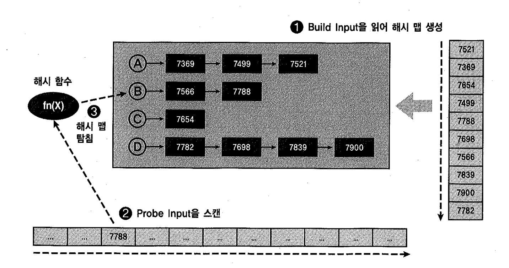
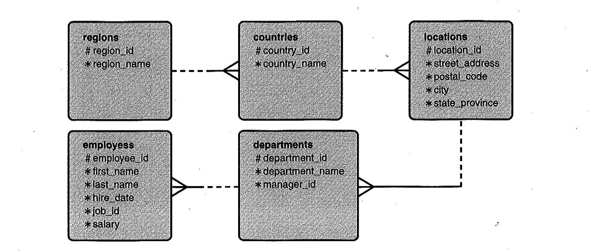

# 03. 해시조인


## 1) 기본 메커니즘

- 소트머지조인과 NL조인이 효과적이지 못한 상황에 대한 대안으로서 개발되었다.
- 조인대상이 되는 두 집합 중에





#### 작은 집합(Build Input)을 읽어 해시맵 생성

- => 해시테이블을 생성할 때 해시함수(fn(X))를 사용하고, 해시함수에서 리턴받은 버킷주소(A,B,C,D)로 찾아가 해시체인에 엔트리를 연결한다.


#### 큰 집합(Probe Input)을 스캔

- 해시테이블을 탐색할 때도 해시함수(fn(X))를 사용하며, 해시함수에서 리턴받은 버킷주소(A,B,C,D)로 찾아가 해시체인을 스캔하면서 데이터를 찾는다.


##### 장점

- NL조인처럼 조인시 발생하는 Random엑세스 부하가 없다. (테이블을 읽을때 인덱스를 사용한다면 있다.)
- 소트머지조인처럼 조인전에 양쪽 집합을 정렬해야 하는 부담이 없다.


##### 단점

- 해시테이블을 생성하는 비용이 수반
- 그러므로, Build Input이 작을 때 효과적이다.(PGA에 할당되는 Hash Area에 담길정도로 충분히 작아야 함)


- 해시키 값으로 사용되는 컬럼에 중복값이 거의 없을 경우 효과적이다.(추후 설명)
- Inner루프로 Hash Area에 생성해둔 해시테이블을 이용한다는 것 외에 NL조인과 유사하다.
- 해시테이블 만들 때는 전체범위처리가 불가피하나, **Prob Input을 스캔하는 단계는 부분범위 처리가능하다.**
- 해시조인은 해시테이블이 PGA영역에 할당되므로, NL조인보다 빠르다. 
  - NL조인은 Outer테이블에서 읽히는 레코드마다 Inner쪽 테이블 버퍼캐시 탐색을 위해 래치획득을 반복하나, 해시조인은 래치 획득과정없이 PGA에서 빠르게 데이터를 탐색할 수 있다.


## 2) 힌트를 이용한 조인순서 및 Build Input 조정

```sql
select /*+ use_hash(d e) */                 => 통계정보를 근거로, 옵티마이저가 Build Input을 선택하여 Hash Join 하라!
       d.deptno, d.dname, e.empno, e.ename
from dept d, emp e
where d.deptno = e.deptno

PLAN_TABLE_OUTPUT
----------------------------------------------------------------------------------------------------
Plan hash value: 615168685

---------------------------------------------------------------------------
| Id  | Operation          | Name | Rows  | Bytes | Cost (%CPU)| Time     |
---------------------------------------------------------------------------
|   0 | SELECT STATEMENT   |      |    14 |   364 |     7  (15)| 00:00:01 |
|*  1 |  HASH JOIN         |      |    14 |   364 |     7  (15)| 00:00:01 |
|   2 |   TABLE ACCESS FULL| DEPT |     4 |    52 |     3   (0)| 00:00:01 | => Build Input
|   3 |   TABLE ACCESS FULL| EMP  |    14 |   182 |     3   (0)| 00:00:01 | => Probe Input
---------------------------------------------------------------------------
```

- 실행계획상 위쪽이 Build Input, 아래쪽이 Probe Input을 의미한다.
  - 통계정보를 근거로, DEPT가 작은집합(Build Input), EMP가 큰집합(Prob Input)이라고, 옵티마이저가 판단함.


Build Input을 사용자가 직접 선택하고자 할 때는 `swap_join_inputs`힌트를 사용해도 되고, 달랑 2개 테이블을 해시조인할 때는 `ordered`나 `leading`을 사용해도 된다.

```sql
select /*+ use_hash(d e) swap_join_inputs(e) */
       d.deptno, d.dname, e.empno, e.ename
from   dept d, emp e
where  d.deptno = e.deptno;

select /*+ leading(e) use_hash(d) */
       d.deptno, d.dname, e.empno, e.ename
from   dept d, emp e
where  d.deptno = e.deptno;
```


## 3) 두가지 해시조인 알고리즘




#### 첫 번째 알고리즘

- ordered나 leading 힌트의 역할은 조인의 순서를 결정하기 위한 것이지, Build Input을 결정하기 위한 것은 아니다.
- 단, 여러집합을 조인할 때, 처음 조인되는 집합간(regions, countries)의 Build Input을 정하는데에는 영향을 미친다.

```sql
select /*+ leading(r, c, l, d, e)
           use_hash(c) use_hash(l) use_hash(d) use_hash(e) */
       e.first_name, e.last_name, d.department_name
     , l.street_address, l.city, c.country_name, r.region_name
from   hr.regions r
     , hr.countries c
     , hr.locations l
     , hr.departments d
     , hr.employees e
where  d.department_id = e.department_id
and    l.location_id = d.location_id
and    c.country_id = l.country_id
and    r.region_id = c.region_id;

----------------------------------------------------------------------------------------
 Id  | Operation             | Name            | Rows  | Bytes | Cost (%CPU)| Time     |
----------------------------------------------------------------------------------------
   0 | SELECT STATEMENT      |                 |   106 | 10706 |    15  (14)| 00:00:01 |
*  1 |  HASH JOIN            |                 |   106 | 10706 |    15  (14)| 00:00:01 |
*  2 |   HASH JOIN           |                 |    27 |  2241 |    12  (17)| 00:00:01 |
*  3 |    HASH JOIN          |                 |    23 |  1472 |     8  (13)| 00:00:01 |
*  4 |     HASH JOIN         |                 |    25 |   700 |     5  (20)| 00:00:01 |
   5 |      TABLE ACCESS FULL| REGIONS         |     4 |    56 |     3   (0)| 00:00:01 |
   6 |      INDEX FULL SCAN  | COUNTRY_C_ID_PK |    25 |   350 |     1   (0)| 00:00:01 |
   7 |     TABLE ACCESS FULL | LOCATIONS       |    23 |   828 |     3   (0)| 00:00:01 |
   8 |    TABLE ACCESS FULL  | DEPARTMENTS     |    27 |   513 |     3   (0)| 00:00:01 |
   9 |   TABLE ACCESS FULL   | EMPLOYEES       |   107 |  1926 |     3   (0)| 00:00:01 |
----------------------------------------------------------------------------------------
```

1. (Id=4) regions을 해시테이블로 빌드하고, countries를 읽어 해시테이블을 탐색하면서 조인수행
2. (Id=3) (regions와 countries)조인결과를 해시테이블로 빌드하고, locations를 읽어 해시테이블을 탐색하면서 조인수행
3. (Id=2) (regions와 countries와 locations)조인결과를 해시테이블로 빌드하고, departments를 읽어 해시테이블을 탐색하면서 조인수행
4. (Id=1) (regions와 countries와 locations와 departments)조인결과를 해시테이블로 빌드하고, employees를 읽어 해시테이블을 탐색하면서 조인수행
   - 즉, `첫번째 조인을 제외한 나머지에 대해서는 Build Input을 사용자가 직접 조정할 수 없다.`


#### 두 번째 알고리즘

- 여러집합을 해시조인하면서, 집합간의 Build Input을 사용자가 직접 조정하려면 `swap_join_inputs` 힌트를 사용하면 된다.

```sql
select /*+ leading(r, c, l, d, e)
           use_hash(c) use_hash(l) use_hash(d) use_hash(e)
           swap_join_inputs(l)
           swap_join_inputs(d)
           swap_join_inputs(e) */
       e.first_name, e.last_name, d.department_name
     , l.street_address, l.city, c.country_name, r.region_name
from   hr.regions r
     , hr.countries c
     , hr.locations l
     , hr.departments d
     , hr.employees e
where  d.department_id = e.department_id
and    l.location_id = d.location_id
and    c.country_id = l.country_id
and    r.region_id = c.region_id;

-----------------------------------------------------------------------------------------
| Id  | Operation             | Name            | Rows  | Bytes | Cost (%CPU)| Time     |
-----------------------------------------------------------------------------------------
|   0 | SELECT STATEMENT      |                 |   106 | 10706 |    15  (14)| 00:00:01 |
|*  1 |  HASH JOIN            |                 |   106 | 10706 |    15  (14)| 00:00:01 |
|   2 |   TABLE ACCESS FULL   | EMPLOYEES       |   107 |  1926 |     3   (0)| 00:00:01 |
|*  3 |   HASH JOIN           |                 |    27 |  2241 |    12  (17)| 00:00:01 |
|   4 |    TABLE ACCESS FULL  | DEPARTMENTS     |    27 |   513 |     3   (0)| 00:00:01 |
|*  5 |    HASH JOIN          |                 |    23 |  1472 |     8  (13)| 00:00:01 |
|   6 |     TABLE ACCESS FULL | LOCATIONS       |    23 |   828 |     3   (0)| 00:00:01 |
|*  7 |     HASH JOIN         |                 |    25 |   700 |     5  (20)| 00:00:01 |
|   8 |      TABLE ACCESS FULL| REGIONS         |     4 |    56 |     3   (0)| 00:00:01 |
|   9 |      INDEX FULL SCAN  | COUNTRY_C_ID_PK |    25 |   350 |     1   (0)| 00:00:01 |
-----------------------------------------------------------------------------------------
```

1. (해시테이블 생성)employees, departments, locations, regions 4개 테이블에 대한 해시테이블을 먼저 생성한다.
2. (Id=7) countries에서 한 건을 읽어 regions 해시테이블을 탐색한다.
3. (Id=5) 2에서 조인에 성공한 레코드는 locations 해시테이블을 탐색한다.
4. (Id=3) 3에서 조인에 성공한 레코드는 departments 해시테이블을 탐색한다.
5. (Id=1) 4에서 조인에 성공한 레코드는 employees 해시테이블을 탐색한다.
6. 2~5 과정을 countries테이블(인덱스)을 모두 스캔할 때까지 반복한다.
   - 가장 큰 `employees테이블을 해시테이블로 생성하였으므로, 실행계획이 비효율적이다`


departments를 기준으로 employees->locations->countries->regions 순으로 조인 하면서, employees를 Probe Input으로 삼고 나머지는 Build Input이 되도록 조정

```sql
select /*+ leading(d, e, l, c, r)
           use_hash(e) use_hash(l) use_hash(c) use_hash(r)
           swap_join_inputs(l)
           swap_join_inputs(c)
           swap_join_inputs(r) */
       e.first_name, e.last_name, d.department_name
     , l.street_address, l.city, c.country_name, r.region_name
from   hr.regions r
     , hr.countries c
     , hr.locations l
     , hr.departments d
     , hr.employees e
where  d.department_id = e.department_id
and    l.location_id = d.location_id
and    c.country_id = l.country_id
and    r.region_id = c.region_id;

----------------------------------------------------------------------------------------
| Id  | Operation             | Name            | Rows  | Bytes | Cost (%CPU)| Time     |
-----------------------------------------------------------------------------------------
|   0 | SELECT STATEMENT      |                 |   106 | 10706 |    15  (14)| 00:00:01 |
|*  1 |  HASH JOIN            |                 |   106 | 10706 |    15  (14)| 00:00:01 |
|   2 |   TABLE ACCESS FULL   | REGIONS         |     4 |    56 |     3   (0)| 00:00:01 |
|*  3 |   HASH JOIN           |                 |   106 |  9222 |    12  (17)| 00:00:01 |
|   4 |    INDEX FULL SCAN    | COUNTRY_C_ID_PK |    25 |   350 |     1   (0)| 00:00:01 |
|*  5 |    HASH JOIN          |                 |   106 |  7738 |    10  (10)| 00:00:01 |
|   6 |     TABLE ACCESS FULL | LOCATIONS       |    23 |   828 |     3   (0)| 00:00:01 |
|*  7 |     HASH JOIN         |                 |   106 |  3922 |     7  (15)| 00:00:01 |
|   8 |      TABLE ACCESS FULL| DEPARTMENTS     |    27 |   513 |     3   (0)| 00:00:01 |
|   9 |      TABLE ACCESS FULL| EMPLOYEES       |   107 |  1926 |     3   (0)| 00:00:01 |
-----------------------------------------------------------------------------------------
```

- employees를 스캔하면서 departments, locations, countries, regions에 대한 해시테이블을 차례로 탐색하면서 조인을 수행한다.
- 위와 같이 수행되면, 작은 테이블로 빠르게 해시 테이블을 생성하고, 큰 테이블 일부 레코드만 스캔하다가 조인을 멈출수 있으므로, NL조인의 큰 장점인 `부분범위처리를 해시조인에서도 갖게 할 수 있는 것이다`.