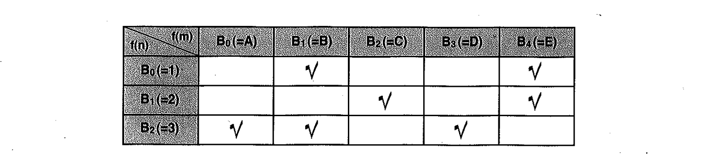
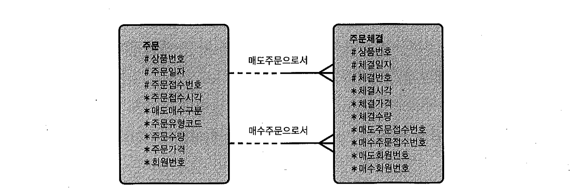

# 03. 해시조인


## 1) 기본 메커니즘

- 소트머지조인과 NL조인이 효과적이지 못한 상황에 대한 대안으로서 개발되었다.
- 조인대상이 되는 두 집합 중에


#### 작은 집합(Build Input)을 읽어 해시맵 생성

- => 해시테이블을 생성할 때 해시함수(fn(X))를 사용하고, 해시함수에서 리턴받은 버킷주소(A,B,C,D)로 찾아가 해시체인에 엔트리를 연결한다.


#### 큰 집합(Probe Input)을 스캔

- 해시테이블을 탐색할 때도 해시함수(fn(X))를 사용하며, 해시함수에서 리턴받은 버킷주소(A,B,C,D)로 찾아가 해시체인을 스캔하면서 데이터를 찾는다.


##### 장점

- NL조인처럼 조인시 발생하는 Random엑세스 부하가 없다. (테이블을 읽을때 인덱스를 사용한다면 있다.)
- 소트머지조인처럼 조인전에 양쪽 집합을 정렬해야 하는 부담이 없다.


##### 단점

- 해시테이블을 생성하는 비용이 수반
- 그러므로, Build Input이 작을 때 효과적이다.(PGA에 할당되는 Hash Area에 담길정도로 충분히 작아야 함)


- 해시키 값으로 사용되는 컬럼에 중복값이 거의 없을 경우 효과적이다.(추후 설명)
- Inner루프로 Hash Area에 생성해둔 해시테이블을 이용한다는 것 외에 NL조인과 유사하다.
- 해시테이블 만들 때는 전체범위처리가 불가피하나, **Prob Input을 스캔하는 단계는 부분범위 처리가능하다.**
- 해시조인은 해시테이블이 PGA영역에 할당되므로, NL조인보다 빠르다. 
  - NL조인은 Outer테이블에서 읽히는 레코드마다 Inner쪽 테이블 버퍼캐시 탐색을 위해 래치획득을 반복하나, 해시조인은 래치 획득과정없이 PGA에서 빠르게 데이터를 탐색할 수 있다.


## 2) 힌트를 이용한 조인순서 및 Build Input 조정

```sql
select /*+ use_hash(d e) */                 => 통계정보를 근거로, 옵티마이저가 Build Input을 선택하여 Hash Join 하라!
       d.deptno, d.dname, e.empno, e.ename
from dept d, emp e
where d.deptno = e.deptno

PLAN_TABLE_OUTPUT
----------------------------------------------------------------------------------------------------
Plan hash value: 615168685

---------------------------------------------------------------------------
| Id  | Operation          | Name | Rows  | Bytes | Cost (%CPU)| Time     |
---------------------------------------------------------------------------
|   0 | SELECT STATEMENT   |      |    14 |   364 |     7  (15)| 00:00:01 |
|*  1 |  HASH JOIN         |      |    14 |   364 |     7  (15)| 00:00:01 |
|   2 |   TABLE ACCESS FULL| DEPT |     4 |    52 |     3   (0)| 00:00:01 | => Build Input
|   3 |   TABLE ACCESS FULL| EMP  |    14 |   182 |     3   (0)| 00:00:01 | => Probe Input
---------------------------------------------------------------------------
```

- 실행계획상 위쪽이 Build Input, 아래쪽이 Probe Input을 의미한다.
  - 통계정보를 근거로, DEPT가 작은집합(Build Input), EMP가 큰집합(Prob Input)이라고, 옵티마이저가 판단함.


Build Input을 사용자가 직접 선택하고자 할 때는 `swap_join_inputs`힌트를 사용해도 되고, 달랑 2개 테이블을 해시조인할 때는 `ordered`나 `leading`을 사용해도 된다.

```sql
select /*+ use_hash(d e) swap_join_inputs(e) */
       d.deptno, d.dname, e.empno, e.ename
from   dept d, emp e
where  d.deptno = e.deptno;

select /*+ leading(e) use_hash(d) */
       d.deptno, d.dname, e.empno, e.ename
from   dept d, emp e
where  d.deptno = e.deptno;
```


## 3) 두가지 해시조인 알고리즘


#### 첫 번째 알고리즘

- ordered나 leading 힌트의 역할은 조인의 순서를 결정하기 위한 것이지, Build Input을 결정하기 위한 것은 아니다.
- 단, 여러집합을 조인할 때, 처음 조인되는 집합간(regions, countries)의 Build Input을 정하는데에는 영향을 미친다.

```sql
select /*+ leading(r, c, l, d, e)
           use_hash(c) use_hash(l) use_hash(d) use_hash(e) */
       e.first_name, e.last_name, d.department_name
     , l.street_address, l.city, c.country_name, r.region_name
from   hr.regions r
     , hr.countries c
     , hr.locations l
     , hr.departments d
     , hr.employees e
where  d.department_id = e.department_id
and    l.location_id = d.location_id
and    c.country_id = l.country_id
and    r.region_id = c.region_id;

----------------------------------------------------------------------------------------
 Id  | Operation             | Name            | Rows  | Bytes | Cost (%CPU)| Time     |
----------------------------------------------------------------------------------------
   0 | SELECT STATEMENT      |                 |   106 | 10706 |    15  (14)| 00:00:01 |
*  1 |  HASH JOIN            |                 |   106 | 10706 |    15  (14)| 00:00:01 |
*  2 |   HASH JOIN           |                 |    27 |  2241 |    12  (17)| 00:00:01 |
*  3 |    HASH JOIN          |                 |    23 |  1472 |     8  (13)| 00:00:01 |
*  4 |     HASH JOIN         |                 |    25 |   700 |     5  (20)| 00:00:01 |
   5 |      TABLE ACCESS FULL| REGIONS         |     4 |    56 |     3   (0)| 00:00:01 |
   6 |      INDEX FULL SCAN  | COUNTRY_C_ID_PK |    25 |   350 |     1   (0)| 00:00:01 |
   7 |     TABLE ACCESS FULL | LOCATIONS       |    23 |   828 |     3   (0)| 00:00:01 |
   8 |    TABLE ACCESS FULL  | DEPARTMENTS     |    27 |   513 |     3   (0)| 00:00:01 |
   9 |   TABLE ACCESS FULL   | EMPLOYEES       |   107 |  1926 |     3   (0)| 00:00:01 |
----------------------------------------------------------------------------------------
```

1. (Id=4) regions을 해시테이블로 빌드하고, countries를 읽어 해시테이블을 탐색하면서 조인수행
2. (Id=3) (regions와 countries)조인결과를 해시테이블로 빌드하고, locations를 읽어 해시테이블을 탐색하면서 조인수행
3. (Id=2) (regions와 countries와 locations)조인결과를 해시테이블로 빌드하고, departments를 읽어 해시테이블을 탐색하면서 조인수행
4. (Id=1) (regions와 countries와 locations와 departments)조인결과를 해시테이블로 빌드하고, employees를 읽어 해시테이블을 탐색하면서 조인수행
   - 즉, `첫번째 조인을 제외한 나머지에 대해서는 Build Input을 사용자가 직접 조정할 수 없다.`


#### 두 번째 알고리즘

- 여러집합을 해시조인하면서, 집합간의 Build Input을 사용자가 직접 조정하려면 `swap_join_inputs` 힌트를 사용하면 된다.

```sql
select /*+ leading(r, c, l, d, e)
           use_hash(c) use_hash(l) use_hash(d) use_hash(e)
           swap_join_inputs(l)
           swap_join_inputs(d)
           swap_join_inputs(e) */
       e.first_name, e.last_name, d.department_name
     , l.street_address, l.city, c.country_name, r.region_name
from   hr.regions r
     , hr.countries c
     , hr.locations l
     , hr.departments d
     , hr.employees e
where  d.department_id = e.department_id
and    l.location_id = d.location_id
and    c.country_id = l.country_id
and    r.region_id = c.region_id;

-----------------------------------------------------------------------------------------
| Id  | Operation             | Name            | Rows  | Bytes | Cost (%CPU)| Time     |
-----------------------------------------------------------------------------------------
|   0 | SELECT STATEMENT      |                 |   106 | 10706 |    15  (14)| 00:00:01 |
|*  1 |  HASH JOIN            |                 |   106 | 10706 |    15  (14)| 00:00:01 |
|   2 |   TABLE ACCESS FULL   | EMPLOYEES       |   107 |  1926 |     3   (0)| 00:00:01 |
|*  3 |   HASH JOIN           |                 |    27 |  2241 |    12  (17)| 00:00:01 |
|   4 |    TABLE ACCESS FULL  | DEPARTMENTS     |    27 |   513 |     3   (0)| 00:00:01 |
|*  5 |    HASH JOIN          |                 |    23 |  1472 |     8  (13)| 00:00:01 |
|   6 |     TABLE ACCESS FULL | LOCATIONS       |    23 |   828 |     3   (0)| 00:00:01 |
|*  7 |     HASH JOIN         |                 |    25 |   700 |     5  (20)| 00:00:01 |
|   8 |      TABLE ACCESS FULL| REGIONS         |     4 |    56 |     3   (0)| 00:00:01 |
|   9 |      INDEX FULL SCAN  | COUNTRY_C_ID_PK |    25 |   350 |     1   (0)| 00:00:01 |
-----------------------------------------------------------------------------------------
```

1. (해시테이블 생성)employees, departments, locations, regions 4개 테이블에 대한 해시테이블을 먼저 생성한다.
2. (Id=7) countries에서 한 건을 읽어 regions 해시테이블을 탐색한다.
3. (Id=5) 2에서 조인에 성공한 레코드는 locations 해시테이블을 탐색한다.
4. (Id=3) 3에서 조인에 성공한 레코드는 departments 해시테이블을 탐색한다.
5. (Id=1) 4에서 조인에 성공한 레코드는 employees 해시테이블을 탐색한다.
6. 2~5 과정을 countries테이블(인덱스)을 모두 스캔할 때까지 반복한다.
   - 가장 큰 `employees테이블을 해시테이블로 생성하였으므로, 실행계획이 비효율적이다`


departments를 기준으로 employees->locations->countries->regions 순으로 조인 하면서, employees를 Probe Input으로 삼고 나머지는 Build Input이 되도록 조정

```sql
select /*+ leading(d, e, l, c, r)
           use_hash(e) use_hash(l) use_hash(c) use_hash(r)
           swap_join_inputs(l)
           swap_join_inputs(c)
           swap_join_inputs(r) */
       e.first_name, e.last_name, d.department_name
     , l.street_address, l.city, c.country_name, r.region_name
from   hr.regions r
     , hr.countries c
     , hr.locations l
     , hr.departments d
     , hr.employees e
where  d.department_id = e.department_id
and    l.location_id = d.location_id
and    c.country_id = l.country_id
and    r.region_id = c.region_id;

----------------------------------------------------------------------------------------
| Id  | Operation             | Name            | Rows  | Bytes | Cost (%CPU)| Time     |
-----------------------------------------------------------------------------------------
|   0 | SELECT STATEMENT      |                 |   106 | 10706 |    15  (14)| 00:00:01 |
|*  1 |  HASH JOIN            |                 |   106 | 10706 |    15  (14)| 00:00:01 |
|   2 |   TABLE ACCESS FULL   | REGIONS         |     4 |    56 |     3   (0)| 00:00:01 |
|*  3 |   HASH JOIN           |                 |   106 |  9222 |    12  (17)| 00:00:01 |
|   4 |    INDEX FULL SCAN    | COUNTRY_C_ID_PK |    25 |   350 |     1   (0)| 00:00:01 |
|*  5 |    HASH JOIN          |                 |   106 |  7738 |    10  (10)| 00:00:01 |
|   6 |     TABLE ACCESS FULL | LOCATIONS       |    23 |   828 |     3   (0)| 00:00:01 |
|*  7 |     HASH JOIN         |                 |   106 |  3922 |     7  (15)| 00:00:01 |
|   8 |      TABLE ACCESS FULL| DEPARTMENTS     |    27 |   513 |     3   (0)| 00:00:01 |
|   9 |      TABLE ACCESS FULL| EMPLOYEES       |   107 |  1926 |     3   (0)| 00:00:01 |
-----------------------------------------------------------------------------------------
```

- employees를 스캔하면서 departments, locations, countries, regions에 대한 해시테이블을 차례로 탐색하면서 조인을 수행한다.
- 위와 같이 수행되면, 작은 테이블로 빠르게 해시 테이블을 생성하고, 큰 테이블 일부 레코드만 스캔하다가 조인을 멈출수 있으므로, NL조인의 큰 장점인 `부분범위처리를 해시조인에서도 갖게 할 수 있는 것이다`.


## 4) Build Input이 Hash Area를 초과할 때 처리방식

### Grace 해시조인

- In-Memory 해시조인이 불가능할때 오라클은 'Grace 해시조인'이라고 알려진 조인알고리즘을 사용하는데 두단계로 나누어 진행된다

#### 파티션단계

1. 조인할 양쪽 테이블에서 조인조건을 제외하고 조건절을 만족하는 집합을 추린다.
2. 양쪽 집합의 조인 컬럼에 해시함수를 적용한다.
3. 반환된 해시값에 따라 동적으로 파티셔닝한다. (독립적으로 처리할 수 있는 여러 개의 작은 서브집합으로 분할함으로써 파티션 짝을 생성하는 단계이다.)
4. 해당 파티션된 집합을 디스크상의 **Temp**공간에 저장한다.


#### 조인단계

1. 해시값에 따라 파티션된 집합을 같은 짝끼리 조인을 수행한다.
2. 파티션하기 전에 어느쪽이 작은 테이블이었는지 상관없이, 각 파티션 짝별로 작은쪽이 Build Input으로 선택되어 해시테이블을 생성된다.
3. 해시테이블이 생성되고나면 반대쪽 파티션로우를 하나씩 읽으면서 해시테이블을 탐색한다.
4. 모든 파티션 짝에 대한 처리가 완료될 때까지 반복한다.

- **파티션 단계에서 양쪽 집합을 모두 읽어 디스크 상의 Temp 공간에 일단 저장해야 하므로 In-Memory 해시 조인보다 성능이 크게 떨어지게 된다.**


### Hybrid 해시조인

- Grace 해시조인은 조인에 성공할 가능성이 없는 집합까지 일단 디스크에 쓰고, 나중에 디스크로부터 읽어야 하기 때문에 디스크 I/O부하가 상당히 심하다. 이를 보완하기 위한 방법중 하나가 `Hybrid 해시조인`이다.


#### 조인방법

1. 두 테이블 중 작은 쪽을 Build Input으로 선택하여 Hash Area에 해시 테이블을 생성한다.
   - 두개의 해시함수를 적용\! (첫 번째 해시 값으로는 레코드를 저장할 파티션(=버킷)을 결정, 두번째 해시 값은 실제 조인할때 사용하기 위해 레코드와 함께 저장해둔다.)
2. 해시 테이블을 생성하다가 Hash Area가 꽉 차면, 가장 큰 파티션(=버킷}을 디스크에 기록한다.
3. 해시 테이블을 완성하기 위해 Build Input을 계속 읽는 동안, 이미 디스크에 기록하기로 정해졌던 파티션에 해당하는 레코드는 디스크 파티션에 기록한다.
4. 다시 Hash Area가 다 차면 이번에도 가장 큰 파티션을 디스크에 기록한다.
5. 이렇게 첫 번째 테이블에 대한 파티셔닝 단계가 끝나면 파티션 크기가 작은순으로 메모리를 채운다.(가능한 많은 파티션을 Hash Area에 담음으로써 6번 단계의 성공률을 높이기 위해서)
6. 두 번째 테이블을 읽을 때에도 두 개의 해시 함수를 사용한다.
   1. (읽혀진 레코드의 첫 번째 해시 값에 해당하는 파티션(=버킷)이 현재 메모리에 있다면 그 파티션을 스캔하고，거기서 조인 레코드를 찾으면 곧바로 결과집합에 포함시킨다.)
   2. => 이때 첫 번째 해시 값으로 곧바로 파티션을 스캔하는 것은 아니고, 비트-벡터 필터링을 통과한 레코드만 파티션을 스캔하고，선택되지 않은 레코드는 그냥 버린다.
7. 비트-벡터 필터링을 통과했지만 메모리에서 매칭되는 파티션을 찾지 못하면 Build Input을 파티셔닝할 때와 같은 방식으로 해시 파티셔닝한다.
   - (즉, 첫 번째 해시 값으로 레코드가 저장될 파티션을 결정하고，{color:green}두 번째 해시 값과 함께 디스크로 저장{color}된다.)
8. 위의 과정을 거치면 양쪽 테이블 모두 같은 해시 함수로써 파티셔닝했기 때문에, 해시 값이 같은 레코드끼리는 파티션 짝(pair)이 된다.
   - (각 파티션 짝에 대해 하나씩 조인을 수행하는데, 짝별로 작은쪽을 Build Input으로 삼아 해시테이블을 생성한다. 이때, 레코드와 함께 저장해둔 두번째 해시값이 이용된다.)
9. 모든 파티션에 대해 위의 과정을 반복함으로써 해시 조인을 마친다.


### Recursive 해시조인(Nested-loops 해시조인)

- 디스크에 기록된 파티션 짝(pair)끼리 조인하기 위해, 작은 파티션을 메모리에 로드하는 과정에서 또 Hash Area를 초과하는 경우 추가적인 파티셔닝 단계를 거치게 되는데， 이를 `Recursive 해시 조인`이라고 한다.
- 'Multipass 해시 조인' 이라고도 한다.

-  디스크 쓰기가 발생했지만 Multipass 오퍼레이션을 거치지 않는 경우를 `Onepass 해시 조인`, In-Memory 해시 조인을 `Optimal 해시 조인` 이라고 한다.


#### 비트-벡터 필터링

- 오라클은 조인성공가능성이 없는 파티션 레코드는 디스크에 기록하지 않기위해, `비트-벡터 필터링(bit-vector filtering)기법`을 사용한다.
- 비트-벡터 필터링을 통해 디스크에 기록할 필요가 있는 값인지를 알 수 있다.
- Build Input을 읽어 해시 테이블을 생성할 때 두 개의 해시 함수를 사용하는데 특정 레코드가 저장될 해시 버킷이 결정되면, 두 해시 값에 상응하는 비트 벡터도 1로 설정한다.





- 해시테이블을 생성하면서 특정 레코드가 f\(m)=C, f\(n) =2를 결과를 얻었다면, C에 해당하는 버킷에 레코드를 저장하면서, 비트-벡터 2행 3열의 비트도 1로 설정
- 두번째 테이블에서 읽은 조인키 값에 f\(m), f\(n) 두 해시함수를 적용해 얻은 값이 C와 2라면, 2행 3열 비트가 1로 설정되어 있으므로,조인 성공가능성이 있으므로, 디스크에 기록
- (해시값이 우연히 같을 수도 있으므로, 실제로 조인되는 레코드가 존재한다는 것을 보장하는것은 아님. 가능성만\!\!\!)
- 두번째 테이블에서 읽은 조인키 값에 두 해시함수를 적용해 없은 값이 D와 2라면, 2행 4열 비트가 0이므로, 상응하는 파티션에 조인되는 레코드가 없는게 확실하므로 버린다.(체크안함)


## 5) Build Input 해시키값에 중복이 많을 때 발생하는 비효율




- 해시 알고리즘의 성능은 해시 충돌을 얼마나 최소화 하느냐에 달려있다.
- 오라클은 충분히 많은 개수의 버킷을 할당하여 버킷 하나당 하나의 키값만 갖게 하려고 노력하지만, 해시테이블에 저장할 키컬럼에 중복값이 많다면, 하나의 버킷에 많은 엔트리가 달려있게 된다.
- 해시버킷을 아무리 빨리 찾아도 버킷에 많은 엔트리가 달리면 버킷을 스캔하는 단계에서 많은 시간을 허비하므로, Build Input의 해시 키 컬럼에는 중복값이 거의 없어야 해시조인이 빠르게 수행될 수 있다.


### 특정상품의 하루 체결건을 조회하기

##### 주문접수번호가 해시키로 사용될 수 없어서 시간이 오래걸리는 SQL

```sql
select /*+ use hash(t o) index(t) index(o) */
        o.상품번호，o.주문접수번호，o.회원번호
      , o.매도매수구분，o.주문유형코드，
      , o.주문수량，o.주문가격
      ，t.체결가격, t.체결수량，(t.체결가격 * t.체결수량) 체결금액
from  주문체결 t, 주문 o
where t.상품번호     = :상품번호
and   t.체결일자     = :체결일자
and   o.상품번호     = t.상품번호  => 해시키
and   o.주문일자     = t.체결일자  => 해시키
and   o.주문접수번호 in (t.매도주문접수번호, t.매수주문접수번호)
```

- **해시키는 '='조인 컬럼만으로 결정되므로 상품번호+체결일자가 해시키이다.**
- **and o.주문접수번호 in (t.매도주문접수번호, t.매수주문접수번호)** => 주문접수번호가 해시키로 사용될 수 없어서 시간이 오래걸림(약 71초)


#### 개선쿼리 1

- **주문체결테이블을 매도주문접수건와 매수주문접수건으로 UNION ALL 함**
  (주문테이블의 주문접수번호와 조인하여, 해시키로 사용할수 있다.)

```
select /*+ use hash(t o) index(o) */
        o.상품번호，o.주문접수번호，o.회원번호，o.매도매수구분，o.주문유형코드
      'o.주문수량，o.주문가격，o.체결가격
      't.체결수량， (t.체결가격 * t.체결수량) 체결금액
from  (
        select /*+ index(t) */
               상품번호, 체결일자, 체결가격, 체결수량, 매도주문접수번호, 주문접수번호
        from   주문체결 t
        union all
        select /*+ index (t) */
               상품번호, 체결일자, 체결가격, 체결수량, 매수주문접수번호, 주문접수번호
        from   주문체결 t
       ) t
       , 주문 o
where  t.상품번호     = :상품번호
and    t.체결일자     = :체결일자
and    o.상품변호     = t.상품번호
and    o.주문일자     = t.체결일자
and    o.주문접수번호 = t.주문접수번호     =>해시 키 값으로 사용
```

- 주문접수번호가 해시 키 값으로 사용되도록 하여 시간을 약 0.165초로 줄임


#### 개선쿼리 2

- **복제테이블을** 이용해 주문체결 데이터를 복제하는 방법을 이용한다.

```sql
create table 복제테이블 as select rownum 번호 from dual connect by level <=100;

select  /*+ use_hash(t o) index(o) */
from    o.상품번호, o.주문접수번호, o.회원번호, o.매도매수구분, o.주문유형코드
        , o.주문수량, o.주문가격, t.체결가격, t.체결수량
        , (t.체결가격*t.체결수량) 체결금액
from   ( select /*+ index(t) index(c) */
                t.상품번호, t.체결일자, t.체결가격, t.체결수량
                   , decode(c.번호, 1, t.매도주문접수번호, 2, t.매수주문접수번호) 주문접수번호
           from   주문체결 t, 복제테이블 c
         where  c.번호 <=2
       ) t,
       주문 o
where  t.상품번호     =: 상품번호
and    t.체결일자     =: 체결일자
and    o.상품번호     =  t.상품번호
and    o.주문일자     =  t.체결일자
and    o.주문접수번호 = t.주문접수번호 => 해시키값으로 사용
```


## 6) 해시조인사용기준

#### 성능을 좌우하는 요소

- 한쪽테이블이 Hash Area에 담길 정도로 충분히 작아야 함
- Build Input 해시키 컬럼에 중복값이 거의 없어야 함


#### 언제 사용하면 효과적인가?

- 조인 컬럼에 적당한 인덱스가 없어 NL조인이 비효율적일 경우

- 조인 컬럼에 인덱스가 있더라도 NL조인 드라이빙 집합에서 Inner로 조인 액세스량이 많아 Random 액세스 부하가 심할 경우

- 소트머지조인을 하기에는 두 테이블의 소트부하가 심할 경우

- 수행빈도가 낮고 쿼리수행이 오래걸리는 대용량 테이블을 조인할 경우

  - 해시테이블은 단 하나의 쿼리를 위해 생성하고 조인이 끝나면 바로 소멸하는 자료구조이므로, 수행빈도가 높은 쿼리에서 사용하면 CPU와 메모리 사용률을 크게 증가시키고, 래치 경합이 발생하여 시스템 동시성을 떨어뜨린다.

  - **그러므로 수행빈도가 낮고, 쿼리의 수행시간이 오래 걸리는 대용량 테이블을 조인할때 주로 사용해야 한다.**


