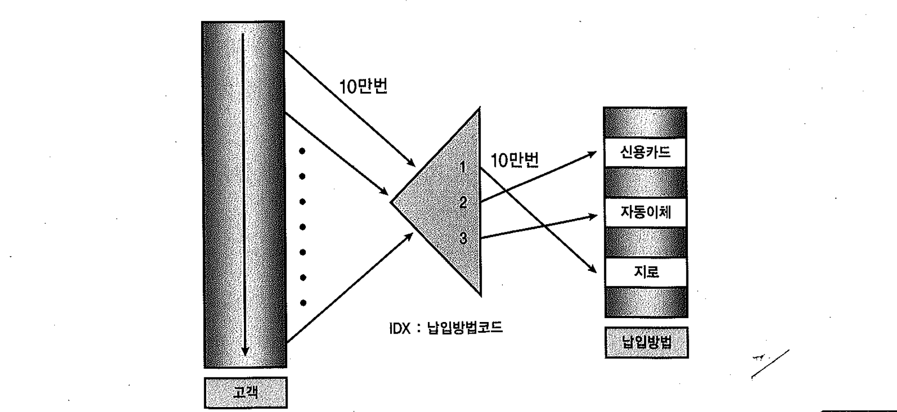
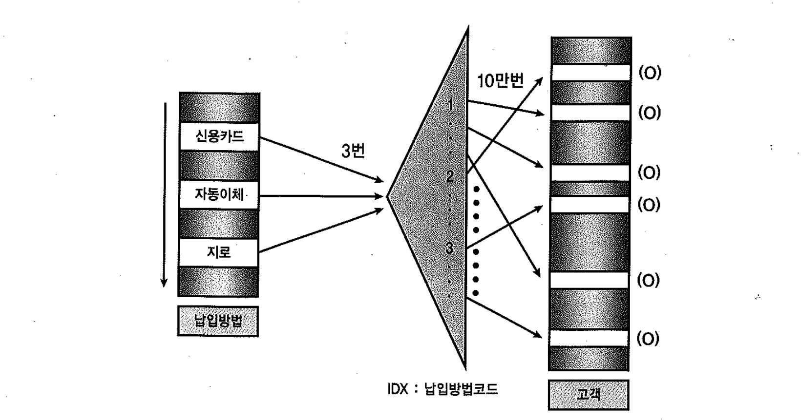
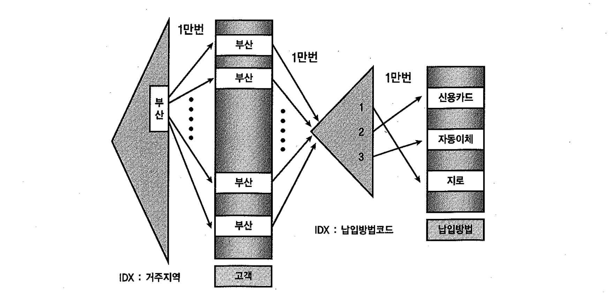
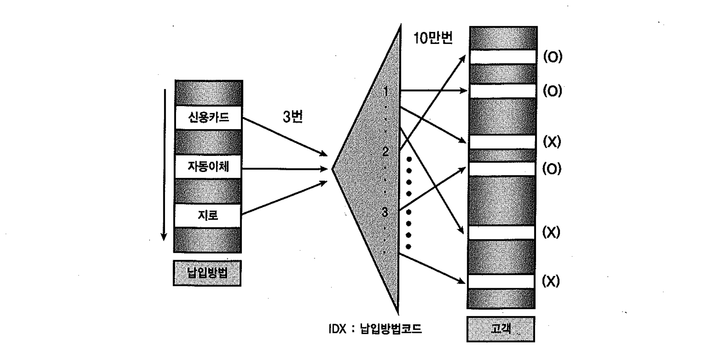
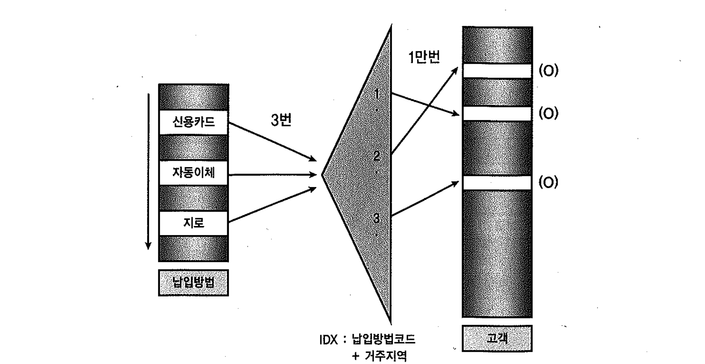

# 04. 조인순서의중요성


- 조인 순서에 따라 쿼리 수행 성능이 달라질 수 있다.
- 이 장에서는 NL조인에 있어서 어떤 테이블을 드라이빙하는것이 유리한지를 예제를 통해 확인한다.


#### 쿼리준비

##### 고객 테이블 생성

```sql
SELECT * FROM V$VERSION WHERE ROWNUM <= 1;

BANNER
--------------------------------------------------------------------------------
Oracle Database 11g Enterprise Edition Release 11.2.0.1.0 - 64bit Production


CREATE TABLE 고객
AS
SELECT LEVEL 고객번호
      , MOD(LEVEL, 3) + 1 납입방법코드
      , DEcode(MOD(LEVEL, 10)
     , 1, '서울', 2, '대전', 3, '대구', 4, '부산', 5, '찍고'
     , 6, '아하', 7, '경기', 8, '충청', 9, '전라', 0, '경상'
     ) 거주지역
  FROM dual
 CONNECT BY LEVEL <= 100000
;

ALTER TABLE 고객 ADD CONSTRAINT pk_고객 PRIMARY KEY(고객번호);

CREATE INDEX idx_1 ON 고객(거주지역);

CREATE INDEX idx_2 ON 고객(납입방법코드);

EXEC DBMS_STATS.GATHER_TABLE_STATS(USER, '고객', CASCADE => TRUE);
```


##### 납입방법 코드 테이블생성

```sql
CREATE TABLE 납입방법
AS
SELECT 1 납입방법코드, '신용카드' 납입방법 FROM dual
UNION ALL SELECT 2, '자동이체' FROM dual
UNION ALL SELECT 3, '지로'     FROM dual
;

ALTER TABLE 납입방법
ADD CONSTRAINT pk_납입방법 PRIMARY KEY(납입방법코드)

EXEC DBMS_STATS.GATHER_TABLE_STATS(USER, '납입방법', CASCADE => TRUE);
;
```


##### 전체 테이블 조인 ( 옵티마이저 )

```sql
SELECT  COUNT(*)--a.납입방법명, b.*
FROM 납입방법 a, 고객 b
WHERE b.납입방법코드 = a.납입방법코드
;

COUNT(*)--A.납입방법명,B.*
--------------------------
                    100000

@XPLAN

-----------------------------------------------------------------------------------------------------------------------
| Id  | Operation              | Name    | Starts | E-Rows | A-Rows |   A-Time   | Buffers |  OMem |  1Mem | Used-Mem |
-----------------------------------------------------------------------------------------------------------------------
|   0 | SELECT STATEMENT       |         |      1 |        |      1 |00:00:00.09 |     205 |       |    |             |
|   1 |  SORT AGGREGATE        |         |      1 |      1 |      1 |00:00:00.09 |     205 |       |    |             |
|*  2 |   HASH JOIN            |         |      1 |    100K|    100K|00:00:00.08 |     205 |  1517K|  1517K|  821K (0)|
|   3 |    INDEX FULL SCAN     | PK_납입 |      1 |      3 |      3 |00:00:00.01 |       1 |       |    |             |
|   4 |    INDEX FAST FULL SCAN| IDX_2   |      1 |    100K|    100K|00:00:00.02 |     204 |       |    |             |
-----------------------------------------------------------------------------------------------------------------------

Predicate Information (identified by operation id):
---------------------------------------------------

   2 - access("B"."납입방법코드"="A"."납입방법코드")
```


### 필터조건이 없을 때




- 고객테이블 드라이빙 - PK_납입 납입 10만번의 램덤엑세스 발생 후 납입방법테이블 램덤엑세스 10만번 ( 총 20 만번 )

```sql
SELECT /*+ LEADING(b) USE_NL(a) INDEX( A ) */
	a.납입방법, b.*
FROM 납입방법 a, 고객 b
WHERE b.납입방법코드 = a.납입방법코드
;

...

@XPLAN

-----------------------------------------------------------------------------------------------------------
| Id  | Operation                    | Name    | Starts | E-Rows | A-Rows |   A-Time   | Buffers | Reads  |
-----------------------------------------------------------------------------------------------------------
|   0 | SELECT STATEMENT             |         |      1 |        |    100K|00:00:00.57 |     113K|    251 |
|   1 |  NESTED LOOPS                |         |      1 |        |    100K|00:00:00.57 |     113K|    251 |
|   2 |   NESTED LOOPS               |         |      1 |    100K|    100K|00:00:00.38 |   13536 |    250 |
|   3 |    TABLE ACCESS FULL         | 고객    |      1 |    100K|    100K|00:00:00.20 |    6866 |    249 |
|*  4 |    INDEX UNIQUE SCAN         | PK_납입 |    100K|      1 |    100K|00:00:00.11 |    6670 |   1 |
|   5 |   TABLE ACCESS BY INDEX ROWID| 납입방법|    100K|      1 |    100K|00:00:00.13 |     100K|   1 |
-----------------------------------------------------------------------------------------------------------

Predicate Information (identified by operation id):
---------------------------------------------------

   4 - access("B"."납입방법코드"="A"."납입방법코드")
```


##### 납입방법 드라이빙



- 납입 테이블에서 고객 쪽 납입방법코드 인덱스로 조인을 시도할때 3번의 랜덤엑세스 발생후 고객 테이블 10만번 랜덤엑세스( 총 10만3번 )

```sql
SELECT /*+ LEADING(A) USE_NL(B) INDEX( B ) */   
    a.납입방법, b.*                      
FROM 납입방법 a, 고객 b                    
WHERE b.납입방법코드 = a.납입방법코드       
;                                              

...

@XPLAN

Plan hash value: 1253683656

---------------------------------------------------------------------------------------------------------
| Id  | Operation                    | Name  | Starts | E-Rows | A-Rows |   A-Time   | Buffers | Reads  |
---------------------------------------------------------------------------------------------------------
|   0 | SELECT STATEMENT             |       |      1 |        |    100K|00:00:00.35 |   14219 |    200 |
|   1 |  NESTED LOOPS                |       |      1 |        |    100K|00:00:00.35 |   14219 |    200 |
|   2 |   NESTED LOOPS               |       |      1 |    100K|    100K|00:00:00.20 |    6860 |    197 |
|   3 |    TABLE ACCESS FULL         | 납입방|      1 |      3 |      3 |00:00:00.01 |       5 |      0 |
|*  4 |    INDEX RANGE SCAN          | IDX_2 |      3 |  33333 |    100K|00:00:00.17 |    6855 |    197 |
|   5 |   TABLE ACCESS BY INDEX ROWID| 고객  |    100K|  33333 |    100K|00:00:00.08 |    7359 |      3 |
---------------------------------------------------------------------------------------------------------

Predicate Information (identified by operation id):
---------------------------------------------------

   4 - access("B"."납입방법코드"="A"."납입방법코드")
```


### 필터 조건이 있을 때




- 부산지역고객은 전체 중 10%에 해당하는 1만명이고 고객 테이블 거주지역 컬럼에 인덱스가 존재할때

##### 고객테이블 드라이빙 (3만번)

```sql
SELECT /*+ LEADING(b) USE_NL(a) INDEX( A ) INDEX( B ) */
   a.납입방법, b.*
FROM 납입방법 a, 고객 b
WHERE b.납입방법코드 = a.납입방법코드
AND b.거주지역 = '부산'

...

@XPLAN

------------------------------------------------------------------------------------------------------------
| Id  | Operation                     | Name    | Starts | E-Rows | A-Rows |   A-Time   | Buffers | Reads  |
------------------------------------------------------------------------------------------------------------
|   0 | SELECT STATEMENT              |         |      1 |        |  10000 |00:00:00.70 |   12263 |  24 |
|   1 |  NESTED LOOPS                 |         |      1 |        |  10000 |00:00:00.70 |   12263 |  24 |
|   2 |   NESTED LOOPS                |         |      1 |  10000 |  10000 |00:00:00.68 |    2263 |  24 |
|   3 |    TABLE ACCESS BY INDEX ROWID| 고객    |      1 |  10000 |  10000 |00:00:00.66 |    1593 |  24 |
|*  4 |     INDEX RANGE SCAN          | IDX_1   |      1 |  10000 |  10000 |00:00:00.66 |     689 |  24 |
|*  5 |    INDEX UNIQUE SCAN          | PK_납입 |  10000 |      1 |  10000 |00:00:00.01 |     670 |   0 |
|   6 |   TABLE ACCESS BY INDEX ROWID | 납입방법|  10000 |      1 |  10000 |00:00:00.01 |   10000 |   0 |
------------------------------------------------------------------------------------------------------------

Predicate Information (identified by operation id):
---------------------------------------------------

   4 - access("B"."거주지역"='부산')
   5 - access("B"."납입방법코드"="A"."납입방법코드")
```


##### 납입방법 드라이빙 (10만 3번)



```sql
SELECT /*+ LEADING(A) USE_NL(B) INDEX( B idx_2 ) */
     a.납입방법, b.*
FROM 납입방법 a, 고객 b
WHERE b.납입방법코드 = a.납입방법코드
AND b.거주지역 = '부산'
 ;     
 
 ...

@XPLAN

------------------------------------------------------------------------------------------------
| Id  | Operation                    | Name  | Starts | E-Rows | A-Rows |   A-Time   | Buffers |
------------------------------------------------------------------------------------------------
|   0 | SELECT STATEMENT             |       |      1 |        |  10000 |00:00:00.15 |    2276 |
|   1 |  NESTED LOOPS                |       |      1 |        |  10000 |00:00:00.15 |    2276 |
|   2 |   NESTED LOOPS               |       |      1 |  10000 |    100K|00:00:00.05 |     871 |
|   3 |    TABLE ACCESS FULL         | 납입방|      1 |      3 |      3 |00:00:00.01 |       5 |
|*  4 |    INDEX RANGE SCAN          | IDX_2 |      3 |  33333 |    100K|00:00:00.03 |     866 |
|*  5 |   TABLE ACCESS BY INDEX ROWID| 고객  |    100K|   3333 |  10000 |00:00:00.06 |    1405 |
------------------------------------------------------------------------------------------------

Predicate Information (identified by operation id):
---------------------------------------------------

   4 - access("B"."납입방법코드"="A"."납입방법코드")
   5 - filter("B"."거주지역"='부산')
```


##### 납입방법 드라이빙 - 거주지역 인덱스 컬럼에추가 ( 1만 3번 랜덤엑세스 발생 )



```sql
CREATE INDEX idx_3 ON 고객(거주지역, 납입방법코드);

인덱스가 생성되었습니다.

SELECT /*+ LEADING(A) USE_NL(B) INDEX( B idx_3 ) */
      a.납입방법, b.*
FROM 납입방법 a, 고객 b
WHERE b.납입방법코드 = a.납입방법코드
AND b.거주지역 = '부산'

 ...

@XPLAN


---------------------------------------------------------------------------------------------------------
| Id  | Operation                    | Name  | Starts | E-Rows | A-Rows |   A-Time   | Buffers | Reads  |
---------------------------------------------------------------------------------------------------------
|   0 | SELECT STATEMENT             |       |      1 |        |  10000 |00:00:00.03 |    2063 |     27 |
|   1 |  NESTED LOOPS                |       |      1 |        |  10000 |00:00:00.03 |    2063 |     27 |
|   2 |   NESTED LOOPS               |       |      1 |  10000 |  10000 |00:00:00.01 |     703 |     27 |
|   3 |    TABLE ACCESS FULL         | 납입방|      1 |      3 |      3 |00:00:00.01 |       5 |      0 |
|*  4 |    INDEX RANGE SCAN          | IDX_3 |      3 |   3333 |  10000 |00:00:00.01 |     698 |     27 |
|   5 |   TABLE ACCESS BY INDEX ROWID| 고객  |  10000 |   3333 |  10000 |00:00:00.01 |    1360 |      0 |
---------------------------------------------------------------------------------------------------------

Predicate Information (identified by operation id):
---------------------------------------------------

   4 - access("B"."거주지역"='부산' AND "B"."납입방법코드"="A"."납입방법코드")
```


### 소트머지 조인

- PGA상에 정렬된 집합을 통해 조인 액세스가 일어나기 때문에 랜덤 액세스 발생량 보다는 소트 부하에 의해 성능이 좌우 됨.
- 디스크 소트가 발생할 정도의 큰 테이브을 포함할 때는 큰 테이블을 드라이빙하는 것이 더 빠르지만, 메모리 소트 방식으로 조인할 때는 자근 쪽 테이블을 드라이빙하는 것이조금더 빠르다.


##### 고객테이블 드라이빙

```sql
SELECT /*+ LEADING(b) USE_MERGE(a) */
   a.납입방법, b.*
FROM 납입방법 a, 고객 b
WHERE b.납입방법코드 = a.납입방법코드
;

...

SQL> @XPLAN

-----------------------------------------------------------------------------------------------------------------
| Id  | Operation           | Name | Starts | E-Rows | A-Rows |   A-Time   | Buffers |  OMem |  1Mem | Used-Mem |
-----------------------------------------------------------------------------------------------------------------
|   0 | SELECT STATEMENT    |      |      1 |        |    100K|00:00:00.26 |     255 |       |       |          |
|   1 |  MERGE JOIN         |      |      1 |    100K|    100K|00:00:00.26 |     255 |       |       |          |
|   2 |   SORT JOIN         |      |      1 |    100K|    100K|00:00:00.10 |     252 |  3738K|   834K| 3322K (0)|
|   3 |    TABLE ACCESS FULL| 고객 |      1 |    100K|    100K|00:00:00.02 |     252 |       |       |          |
|*  4 |   SORT JOIN         |      |    100K|      3 |    100K|00:00:00.10 |       3 |  2048 |  2048 | 2048  (0)|
|   5 |    TABLE ACCESS FULL| 납입 |      1 |      3 |      3 |00:00:00.01 |       3 |       |       |          |
-----------------------------------------------------------------------------------------------------------------

Predicate Information (identified by operation id):
---------------------------------------------------

   4 - access("B"."납입방법코드"="A"."납입방법코드")
       filter("B"."납입방법코드"="A"."납입방법코드")

-- INDEX
SELECT /*+ LEADING(b) INDEX( B PK_고객 ) USE_MERGE(a) */
            a.납입방법, b.*
  FROM 납입방법 a, 고객 b
WHERE b.납입방법코드 = a.납입방법코드;

----------------------------------------------------------------------------------------------------------------------------
| Id  | Operation                     | Name  | Starts | E-Rows | A-Rows |   A-Time   | Buffers |  OMem |  1Mem | Used-Mem |
----------------------------------------------------------------------------------------------------------------------------
|   0 | SELECT STATEMENT              |       |      1 |        |    100K|00:00:00.31 |     460 |    |  |          |
|   1 |  MERGE JOIN                   |       |      1 |    100K|    100K|00:00:00.31 |     460 |    |  |          |
|   2 |   SORT JOIN                   |       |      1 |    100K|    100K|00:00:00.16 |     457 |  3738K|   834K| 3322K (0)|
|   3 |    TABLE ACCESS BY INDEX ROWID| 고객  |      1 |    100K|    100K|00:00:00.06 |     457 |    |  |          |
|   4 |     INDEX FULL SCAN           | PK_고 |      1 |    100K|    100K|00:00:00.02 |     209 |    |  |          |
|*  5 |   SORT JOIN                   |       |    100K|      3 |    100K|00:00:00.09 |       3 |  2048 |  2048 | 2048  (0)|
|   6 |    TABLE ACCESS FULL          | 납입방|      1 |      3 |      3 |00:00:00.01 |       3 |    |  |          |
----------------------------------------------------------------------------------------------------------------------------

Predicate Information (identified by operation id):
---------------------------------------------------

   5 - access("B"."납입방법코드"="A"."납입방법코드")
       filter("B"."납입방법코드"="A"."납입방법코드")
```


##### 납입방법 드라이빙

```sql
SELECT /*+ LEADING(A) USE_MERGE(B) */   
    a.납입방법, b.*                      
FROM 납입방법 a, 고객 b                    
WHERE b.납입방법코드 = a.납입방법코드       
;                                              

...

@XPLAN

-----------------------------------------------------------------------------------------------------------------
| Id  | Operation           | Name | Starts | E-Rows | A-Rows |   A-Time   | Buffers |  OMem |  1Mem | Used-Mem |
-----------------------------------------------------------------------------------------------------------------
|   0 | SELECT STATEMENT    |      |      1 |        |    100K|00:00:00.11 |     255 |       |       |          |
|   1 |  MERGE JOIN         |      |      1 |    100K|    100K|00:00:00.11 |     255 |       |       |          |
|   2 |   SORT JOIN         |      |      1 |      3 |      3 |00:00:00.01 |       3 |  2048 |  2048 | 2048  (0)|
|   3 |    TABLE ACCESS FULL| 납입 |      1 |      3 |      3 |00:00:00.01 |       3 |       |       |          |
|*  4 |   SORT JOIN         |      |      3 |    100K|    100K|00:00:00.09 |     252 |  3738K|   834K| 3322K (0)|
|   5 |    TABLE ACCESS FULL| 고객 |      1 |    100K|    100K|00:00:00.02 |     252 |       |       |          |
-----------------------------------------------------------------------------------------------------------------

Predicate Information (identified by operation id):
---------------------------------------------------

   4 - access("B"."납입방법코드"="A"."납입방법코드")
       filter("B"."납입방법코드"="A"."납입방법코드")

-- INDEX 
SELECT /*+ LEADING(A)  INDEX( A PK_납입방법 ) USE_MERGE(B) */       
            a.납입방법, b.*                  
      FROM 납입방법 a, 고객 b                
     WHERE b.납입방법코드 = a.납입방법코드
     
 --------------------------------------------------------------------------------------------------------------------------------------
| Id  | Operation                    | Name    | Starts | E-Rows | A-Rows |   A-Time   | Buffers | Reads  |  OMem |  1Mem | Used-Mem |
--------------------------------------------------------------------------------------------------------------------------------------
|   0 | SELECT STATEMENT             |         |      1 |        |    100K|00:00:00.13 |     258 |   1 |          |       |          |
|   1 |  MERGE JOIN                  |         |      1 |    100K|    100K|00:00:00.13 |     258 |   1 |          |       |          |
|   2 |   TABLE ACCESS BY INDEX ROWID| 납입방법|      1 |      3 |      3 |00:00:00.02 |       6 |   1 |          |       |          |
|   3 |    INDEX FULL SCAN           | PK_납입 |      1 |      3 |      3 |00:00:00.02 |       3 |   1 |          |       |          |
|*  4 |   SORT JOIN                  |         |      3 |    100K|    100K|00:00:00.08 |     252 |   0 |  3738K|   834K| 3322K (0)|
|   5 |    TABLE ACCESS FULL         | 고객    |      1 |    100K|    100K|00:00:00.02 |     252 |   0 |          |       |          |
--------------------------------------------------------------------------------------------------------------------------------------

Predicate Information (identified by operation id):
---------------------------------------------------

   4 - access("B"."납입방법코드"="A"."납입방법코드")
       filter("B"."납입방법코드"="A"."납입방법코드")
```


### 해시 조인

- Hash Area에 Build Input을 모두 채울 수 있느냐가 관건이므로 두말할 것도 없이 작은 쪽 테이블을 드라이빙하는 것이 유리하다.

```sql
SELECT /*+ LEADING(b) USE_HASH(a) */
         a.납입방법, b.*
FROM 납입방법 a, 고객 b
WHERE b.납입방법코드 = a.납입방법코드
;
@
...

@XPLAN

----------------------------------------------------------------------------------------------------------------
| Id  | Operation          | Name | Starts | E-Rows | A-Rows |   A-Time   | Buffers |  OMem |  1Mem | Used-Mem |
----------------------------------------------------------------------------------------------------------------
|   0 | SELECT STATEMENT   |      |      1 |        |    100K|00:00:00.10 |     257 |       |       |          |
|*  1 |  HASH JOIN         |      |      1 |    100K|    100K|00:00:00.10 |     257 |  4544K|  1485K| 8969K (0)|
|   2 |   TABLE ACCESS FULL| 고객 |      1 |    100K|    100K|00:00:00.02 |     252 |       |       |          |
|   3 |   TABLE ACCESS FULL| 납입 |      1 |      3 |      3 |00:00:00.01 |       5 |       |       |          |
----------------------------------------------------------------------------------------------------------------

Predicate Information (identified by operation id):
---------------------------------------------------

   1 - access("B"."납입방법코드"="A"."납입방법코드")

-- 카운트
SELECT /*+ LEADING(b) USE_HASH(a) */         
          -- a.납입방법, b.*
             COUNT(*)                   
     FROM 납입방법 a, 고객 b                 
    WHERE b.납입방법코드 = a.납입방법코드    
 ;     
 
 --------------------------------------------------------------------------------------------------------------------------------
| Id  | Operation              | Name    | Starts | E-Rows | A-Rows |   A-Time   | Buffers | Reads  |  OMem |  1Mem | Used-Mem |
--------------------------------------------------------------------------------------------------------------------------------
|   0 | SELECT STATEMENT       |         |      1 |        |      1 |00:00:00.27 |     205 |    198 |       |       |          |
|   1 |  SORT AGGREGATE        |         |      1 |      1 |      1 |00:00:00.27 |     205 |    198 |       |       |          |
|*  2 |   HASH JOIN            |         |      1 |    100K|    100K|00:00:00.26 |     205 |    198 |  3411K|  2022K| 7766K (0)|
|   3 |    INDEX FAST FULL SCAN| IDX_2   |      1 |    100K|    100K|00:00:00.19 |     204 |    198 |       |       |          |
|   4 |    INDEX FULL SCAN     | PK_납입 |      1 |      3 |      3 |00:00:00.01 |       1 |      0 |       |       |          |
--------------------------------------------------------------------------------------------------------------------------------

Predicate Information (identified by operation id):
---------------------------------------------------

   2 - access("B"."납입방법코드"="A"."납입방법코드")
```


##### 납입방법 드라이빙 ( INDEX : IDX_2( 납입방법코드 ) ON 고객 )

```sql
SELECT /*+ LEADING(A) USE_HASH(B) */   
     a.납입방법, b.*                      
FROM 납입방법 a, 고객 b                    
WHERE b.납입방법코드 = a.납입방법코드       
;                                              
@
...

@XPLAN

----------------------------------------------------------------------------------------------------------------
| Id  | Operation          | Name | Starts | E-Rows | A-Rows |   A-Time   | Buffers |  OMem |  1Mem | Used-Mem |
----------------------------------------------------------------------------------------------------------------
|   0 | SELECT STATEMENT   |      |      1 |        |    100K|00:00:00.11 |    6869 |       |       |          |
|*  1 |  HASH JOIN         |      |      1 |    100K|    100K|00:00:00.11 |    6869 |  1180K|  1180K|  608K (0)|
|   2 |   TABLE ACCESS FULL| 납입 |      1 |      3 |      3 |00:00:00.01 |       3 |       |       |          |
|   3 |   TABLE ACCESS FULL| 고객 |      1 |    100K|    100K|00:00:00.04 |    6866 |       |       |          |
----------------------------------------------------------------------------------------------------------------

Predicate Information (identified by operation id):
---------------------------------------------------

   1 - access("B"."납입방법코드"="A"."납입방법코드")

-- 카운트
 SELECT /*+ LEADING(A) USE_HASH(B) */      
            COUNT(*)                
     FROM 납입방법 a, 고객 b              
    WHERE b.납입방법코드 = a.납입방법코드 
 ;   
 
 -----------------------------------------------------------------------------------------------------------------------
| Id  | Operation              | Name    | Starts | E-Rows | A-Rows |   A-Time   | Buffers |  OMem |  1Mem | Used-Mem |
-----------------------------------------------------------------------------------------------------------------------
|   0 | SELECT STATEMENT       |         |      1 |        |      1 |00:00:00.09 |     205 |       |    |             |
|   1 |  SORT AGGREGATE        |         |      1 |      1 |      1 |00:00:00.09 |     205 |       |    |             |
|*  2 |   HASH JOIN            |         |      1 |    100K|    100K|00:00:00.08 |     205 |  1517K|  1517K|  870K (0)|
|   3 |    INDEX FULL SCAN     | PK_납입 |      1 |      3 |      3 |00:00:00.01 |       1 |       |    |             |
|   4 |    INDEX FAST FULL SCAN| IDX_2   |      1 |    100K|    100K|00:00:00.02 |     204 |       |    |             |
-----------------------------------------------------------------------------------------------------------------------

Predicate Information (identified by operation id):
---------------------------------------------------

   2 - access("B"."납입방법코드"="A"."납입방법코드")

-- INDEX FFS
SELECT /*+ LEADING(A)   USE_HASH(B)  */      
	B.납입방법코드
FROM 납입방법 a, 고객 b              
WHERE b.납입방법코드 = a.납입방법코드

----------------------------------------------------------------------------------------------------------------------
| Id  | Operation             | Name    | Starts | E-Rows | A-Rows |   A-Time   | Buffers |  OMem |  1Mem | Used-Mem |
----------------------------------------------------------------------------------------------------------------------
|   0 | SELECT STATEMENT      |         |      1 |        |    100K|00:00:00.10 |    6859 |       |    |             |
|*  1 |  HASH JOIN            |         |      1 |    100K|    100K|00:00:00.10 |    6859 |  1517K|  1517K|  890K (0)|
|   2 |   INDEX FULL SCAN     | PK_납입 |      1 |      3 |      3 |00:00:00.01 |       1 |       |    |             |
|   3 |   INDEX FAST FULL SCAN| IDX_2   |      1 |    100K|    100K|00:00:00.03 |    6858 |       |    |             |
----------------------------------------------------------------------------------------------------------------------

Predicate Information (identified by operation id):
---------------------------------------------------

   1 - access("B"."납입방법코드"="A"."납입방법코드")
```