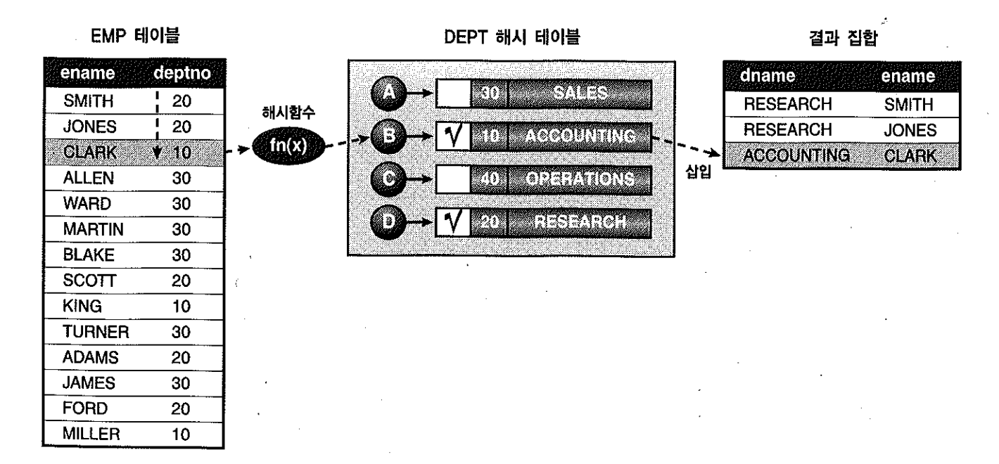
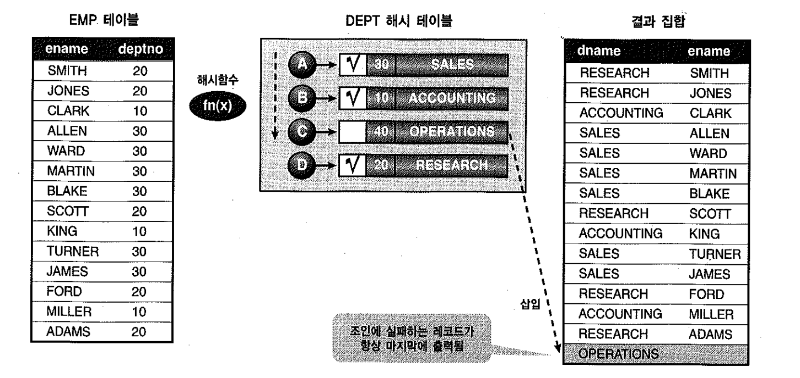

# 05. Outer조인

- NL조인는 그 특성상 Outer 조인할 때 방향이 한쪽으로 고정되며, Outer 기호(+)가 붙지 않은 테이블이 항상 드라이빙 테이블로 선택한다.
- leading 힌트를 사용해서 순서를 바꿔 보려 해도 소용이 없다.

```sql
SELECT /*+ USE_NL( D E )  LEADING( E ) */  *
FROM SCOTT.DEPT D, SCOTT.EMP E
WHERE E.DEPTNO(+) = D.DEPTNO;

 ...
15 개의 행이 선택되었습니다.

@XPLAN


-------------------------------------------------------------------------------------
| Id  | Operation          | Name | Starts | E-Rows | A-Rows |   A-Time   | Buffers |록
|   0 | SELECT STATEMENT   |      |      1 |        |     15 |00:00:00.01 |      37 |
|   1 |  NESTED LOOPS OUTER|      |      1 |     14 |     15 |00:00:00.01 |      37 |
|   2 |   TABLE ACCESS FULL| DEPT |      1 |      4 |      4 |00:00:00.01 |       8 |
|*  3 |   TABLE ACCESS FULL| EMP  |      4 |      4 |     14 |00:00:00.01 |      29 |
-------------------------------------------------------------------------------------

Predicate Information (identified by operation id):
---------------------------------------------------

   3 - filter("E"."DEPTNO"="D"."DEPTNO")
```


- 그림 2-27에서는 사원이 전형 없는 유령 부서가 등록될 수 있다.( null )
- 따라서 사원 유무와 상관업이 모든 부서가 출력되도록 하려면 사원 쪽 모든 조건절에 Outer 기호(+)를 반드시 붙여 줘야 한다.

```sql
DESC SCOTT.EMP;
 이름                                                                                                      널?      유형
 ----------------------------------------------------------------------------------------------------------------- -------- -----

 EMPNO                                                                                                     NOT NULL NUMBER(4)
 ENAME                                                                                                              VARCHAR2(10)
 JOB                                                                                                                VARCHAR2(9)
 MGR                                                                                                                NUMBER(4)
 HIREDATE                                                                                                           DATE
 SAL                                                                                                                NUMBER(7,2)
 COMM                                                                                                               NUMBER(7,2)
 DEPTNO                                                                                                             NUMBER(2)

SELECT * FROM SCOTT.EMP ORDER BY EMPNO ASC;

     EMPNO ENAME      JOB              MGR HIREDATE        SAL       COMM     DEPTNO
---------- ---------- --------- ---------- -------- ---------- ---------- ----------
      7369 SMITH      CLERK           7902 80/12/17        800                    20
      7499 ALLEN      SALESMAN        7698 81/02/20       1600        300         30
      7521 WARD       SALESMAN        7698 81/02/22       1250        500         30
      7566 JONES      MANAGER         7839 81/04/02       2975                    20
      7654 MARTIN     SALESMAN        7698 81/09/28       1250       1400         30
      7698 BLAKE      MANAGER         7839 81/05/01       2850                    30
      7782 CLARK      MANAGER         7839 81/06/09       2450                    10
      7788 SCOTT      ANALYST         7566 87/04/19       3000                    20
      7839 KING       PRESIDENT            81/11/17       5000                    10
      7844 TURNER     SALESMAN        7698 81/09/08       1500          0         30
      7876 ADAMS      CLERK           7788 87/05/23       1100                    20

     EMPNO ENAME      JOB              MGR HIREDATE        SAL       COMM     DEPTNO
---------- ---------- --------- ---------- -------- ---------- ---------- ----------
      7900 JAMES      CLERK           7698 81/12/03        950                    30
      7902 FORD       ANALYST         7566 81/12/03       3000                    20
      7934 MILLER     CLERK           7782 82/01/23       1300                    10


INSERT INTO SCOTT.EMP VALUES( '7935', 'MILLER', 'CLERK', '7782', '82/01/23', '1300', NULL, NULL );

1 개의 행이 만들어졌습니다.

COMMIT;

커밋이 완료되었습니다.

SELECT * FROM SCOTT.EMP ORDER BY EMPNO ASC;

     EMPNO ENAME      JOB              MGR HIREDATE        SAL       COMM     DEPTNO
---------- ---------- --------- ---------- -------- ---------- ---------- ----------
      7369 SMITH      CLERK           7902 80/12/17        800                    20
      7499 ALLEN      SALESMAN        7698 81/02/20       1600        300         30
      7521 WARD       SALESMAN        7698 81/02/22       1250        500         30
      7566 JONES      MANAGER         7839 81/04/02       2975                    20
      7654 MARTIN     SALESMAN        7698 81/09/28       1250       1400         30
      7698 BLAKE      MANAGER         7839 81/05/01       2850                    30
      7782 CLARK      MANAGER         7839 81/06/09       2450                    10
      7788 SCOTT      ANALYST         7566 87/04/19       3000                    20
      7839 KING       PRESIDENT            81/11/17       5000                    10
      7844 TURNER     SALESMAN        7698 81/09/08       1500          0         30
      7876 ADAMS      CLERK           7788 87/05/23       1100                    20

     EMPNO ENAME      JOB              MGR HIREDATE        SAL       COMM     DEPTNO
---------- ---------- --------- ---------- -------- ---------- ---------- ----------
      7900 JAMES      CLERK           7698 81/12/03        950                    30
      7902 FORD       ANALYST         7566 81/12/03       3000                    20
      7934 MILLER     CLERK           7782 82/01/23       1300                    10
      7935 MILLER     CLERK           7782 82/01/23       1300                         <== 이게 바로 유령부서임 ;;

15 개의 행이 선택되었습니다.

SELECT TABLE_NAME, CONSTRAINT_NAME, CONSTRAINT_TYPE  FROM DBA_CONSTRAINTS
WHERE OWNER = 'SCOTT';

TABLE_NAME                     CONSTRAINT_NAME                C
------------------------------ ------------------------------ -
EMP                            FK_DEPTNO                      R
DEPT                           PK_DEPT                        P
EMP                            PK_EMP                         P
```


- 사원이 없는 부서는 등록 될수 없다. ( 식별자 )

- 따라서 모든 부서가 출력되도록 하려겨고 굳이 Outer 조인할 필요가 없음에도 Outer 기호(+)를 붙인다면 성능이 나빠질 수 있다.


### ERD 표기를 따르는 SQL 개발의 중요성 결론

- 위 예제 모두 사원 쪽 부서번호가 필수컬럼이다.

- 소속 부서없이는 사원이 존재할 수 없다는 뜻이므로 테이블을 생성할 때 Not Null 제약을 두어야 한다.


## 2) Outer 소트 머지 조인

- 소트된 중갑 집합을 이용한다는 점만 다를 뿐 처리루틴이 NL조인과 같다.
- 따라서 Outer 소트 머지 조인도 처리 방향이 한쪽으로 고정되며, Outer 기호(+)가 붙지 않은 테이블이 항상 First 테이블로 선택된다.

```sql
SELECT /*+ USE_MERGE( D E )  LEADING( E ) */  *
FROM SCOTT.DEPT D, SCOTT.EMP E
WHERE E.DEPTNO(+) = D.DEPTNO;

...
15 개의 행이 선택되었습니다.

@XPLAN

-----------------------------------------------------------------------------------------------------------------------------
| Id  | Operation                    | Name    | Starts | E-Rows | A-Rows |   A-Time   | Buffers |  OMem |  1Mem | Used-Mem |
-----------------------------------------------------------------------------------------------------------------------------
|   0 | SELECT STATEMENT             |         |      1 |        |     15 |00:00:00.01 |      11 |    |  |          |
|   1 |  MERGE JOIN OUTER            |         |      1 |     14 |     15 |00:00:00.01 |      11 |    |  |          |
|   2 |   TABLE ACCESS BY INDEX ROWID| DEPT    |      1 |      4 |      4 |00:00:00.01 |       4 |    |  |          |
|   3 |    INDEX FULL SCAN           | PK_DEPT |      1 |      4 |      4 |00:00:00.01 |       2 |    |  |          |
|*  4 |   SORT JOIN                  |         |      4 |     14 |     14 |00:00:00.01 |       7 |  2048 |  2048 | 2048  (0)|
|   5 |    TABLE ACCESS FULL         | EMP     |      1 |     14 |     14 |00:00:00.01 |       7 |    |  |          |
-----------------------------------------------------------------------------------------------------------------------------

Predicate Information (identified by operation id):
---------------------------------------------------

   4 - access("E"."DEPTNO"="D"."DEPTNO")
```


## 3) Outer 해시 조인

- Outer 해시 조인도 9i까지는 단방향 액세스 패턴이었으나, 10g에서 성능상의 이유로 변경됨






1. Outer 집합인 dept 테이블을 해시 테이블로 빌드한다.
2. Inner 집합인 emp 테이블을 읽으면서 해시 테이블을 탐색한다
3. 조인에 성공한 레코드는 곧바로 결과집합에 삽입하고, 조인에 성공했음을 해시 엔트리에 표시해 둔다.
4. Probe 단계가 끝나면 Inner 조인과 동일한 결과집합이 만들어진 상태이다. 이제 조인에 실패 했던 레코드를 결과집합에 포함시켜야 하므로 해시 테이블을 스캔하면서 체크가 없는 dept 엔트리를 결과집합에 삽입한다.

```sql
SELECT /*+ USE_HASH( D E )  LEADING( E ) */  *
FROM TEST_DEPT D, TEST_EMP E
WHERE E.DEPTNO(+) = D.DEPTNO;

    DEPTNO DNAME          LOC                EMPNO ENAME      JOB              MGR HIREDATE        SAL       COMM     DEPTNO
---------- -------------- ------------- ---------- ---------- --------- ---------- -------- ---------- ---------- ----------
        20 RESEARCH       DALLAS              7369 SMITH      CLERK           7902 80/12/17        800            20
        30 SALES          CHICAGO             7499 ALLEN      SALESMAN        7698 81/02/20       1600        300         30
        30 SALES          CHICAGO             7521 WARD       SALESMAN        7698 81/02/22       1250        500         30
        20 RESEARCH       DALLAS              7566 JONES      MANAGER         7839 81/04/02       2975            20
        30 SALES          CHICAGO             7654 MARTIN     SALESMAN        7698 81/09/28       1250       1400         30
        30 SALES          CHICAGO             7698 BLAKE      MANAGER         7839 81/05/01       2850            30
        10 ACCOUNTING     NEW YORK            7782 CLARK      MANAGER         7839 81/06/09       2450            10
        20 RESEARCH       DALLAS              7788 SCOTT      ANALYST         7566 87/04/19       3000            20
        10 ACCOUNTING     NEW YORK            7839 KING       PRESIDENT            81/11/17       5000            10
        30 SALES          CHICAGO             7844 TURNER     SALESMAN        7698 81/09/08       1500      0     30
        20 RESEARCH       DALLAS              7876 ADAMS      CLERK           7788 87/05/23       1100            20
        30 SALES          CHICAGO             7900 JAMES      CLERK           7698 81/12/03        950            30
        20 RESEARCH       DALLAS              7902 FORD       ANALYST         7566 81/12/03       3000            20
        10 ACCOUNTING     NEW YORK            7934 MILLER     CLERK           7782 82/01/23       1300            10
        50 TEST           TEST_LOC
        40 OPERATIONS     BOSTON

16 개의 행이 선택되었습니다.


@XPLAN

---------------------------------------------------------------------------------------------------------------------
| Id  | Operation          | Name      | Starts | E-Rows | A-Rows |   A-Time   | Buffers |  OMem |  1Mem | Used-Mem |
---------------------------------------------------------------------------------------------------------------------
|   0 | SELECT STATEMENT   |           |      1 |        |     16 |00:00:00.01 |      11 |       |    |     |
|*  1 |  HASH JOIN OUTER   |           |      1 |     14 |     16 |00:00:00.01 |      11 |  1011K|  1011K|  743K (0)|
|   2 |   TABLE ACCESS FULL| TEST_DEPT |      1 |      5 |      5 |00:00:00.01 |       7 |       |    |     |
|   3 |   TABLE ACCESS FULL| TEST_EMP  |      1 |     14 |     14 |00:00:00.01 |       4 |       |    |     |
---------------------------------------------------------------------------------------------------------------------

Predicate Information (identified by operation id):
---------------------------------------------------

   1 - access("E"."DEPTNO"="D"."DEPTNO")


-- 역순
SELECT /*+ USE_HASH( D E )  LEADING( E ) */  *
FROM (SELECT IN_E.*, ROWNUM  FROM TEST_DEPT IN_E  ORDER BY DEPTNO DESC )  D
, TEST_EMP E
WHERE E.DEPTNO(+) = D.DEPTNO;

    DEPTNO DNAME          LOC               ROWNUM      EMPNO ENAME      JOB              MGR HIREDATE        SAL       COMM     DEPTNO
---------- -------------- ------------- ---------- ---------- ---------- --------- ---------- -------- ---------- ---------- ----------
        20 RESEARCH       DALLAS                 4       7369 SMITH      CLERK           7902 80/12/17        800                    20
        30 SALES          CHICAGO                3       7499 ALLEN      SALESMAN        7698 81/02/20       1600        300         30
        30 SALES          CHICAGO                3       7521 WARD       SALESMAN        7698 81/02/22       1250        500         30
        20 RESEARCH       DALLAS                 4       7566 JONES      MANAGER         7839 81/04/02       2975                    20
        30 SALES          CHICAGO                3       7654 MARTIN     SALESMAN        7698 81/09/28       1250       1400         30
        30 SALES          CHICAGO                3       7698 BLAKE      MANAGER         7839 81/05/01       2850                    30
        10 ACCOUNTING     NEW YORK               5       7782 CLARK      MANAGER         7839 81/06/09       2450                    10
        20 RESEARCH       DALLAS                 4       7788 SCOTT      ANALYST         7566 87/04/19       3000                    20
        10 ACCOUNTING     NEW YORK               5       7839 KING       PRESIDENT            81/11/17       5000                    10
        30 SALES          CHICAGO                3       7844 TURNER     SALESMAN        7698 81/09/08       1500          0         30
        20 RESEARCH       DALLAS                 4       7876 ADAMS      CLERK           7788 87/05/23       1100                    20
        30 SALES          CHICAGO                3       7900 JAMES      CLERK           7698 81/12/03        950                    30
        20 RESEARCH       DALLAS                 4       7902 FORD       ANALYST         7566 81/12/03       3000                    20
        10 ACCOUNTING     NEW YORK               5       7934 MILLER     CLERK           7782 82/01/23       1300                    10
        50 TEST           TEST_LOC               1
        40 OPERATIONS     BOSTON                 2

16 개의 행이 선택되었습니다.

@xplan

------------------------------------------------------------------------------------------------------------------------------------
| Id  | Operation                      | Name         | Starts | E-Rows | A-Rows |   A-Time   | Buffers |  OMem |  1Mem | Used-Mem |
------------------------------------------------------------------------------------------------------------------------------------
|   0 | SELECT STATEMENT               |              |      1 |        |     16 |00:00:00.01 |       7 |       |       |          |
|*  1 |  HASH JOIN OUTER               |              |      1 |     14 |     16 |00:00:00.01 |       7 |   972K|   972K|  751K (0)|
|   2 |   VIEW                         |              |      1 |      5 |      5 |00:00:00.01 |       3 |       |       |          |
|   3 |    COUNT                       |              |      1 |        |      5 |00:00:00.01 |       3 |       |       |          |
|   4 |     TABLE ACCESS BY INDEX ROWID| TEST_DEPT    |      1 |      5 |      5 |00:00:00.01 |       3 |       |       |          |
|   5 |      INDEX FULL SCAN DESCENDING| TEST_DEPT_PK |      1 |      5 |      5 |00:00:00.01 |       1 |       |       |          |
|   6 |   TABLE ACCESS FULL            | TEST_EMP     |      1 |     14 |     14 |00:00:00.01 |       4 |       |       |          |
------------------------------------------------------------------------------------------------------------------------------------

Predicate Information (identified by operation id):
---------------------------------------------------

   1 - access("E"."DEPTNO"="D"."DEPTNO")
```


### Right Outer 해시 조인

- Outer 조인할때 조인 순서가 고정되므로 자주 성능문제를 일으키곤 했다.
  - 주문테이블을 기준으로 고객테이블과 Outer 조인하는 경우에 대용량 주문 테이블을 해시 테이블로 빌드해야 하는 문제가 발생
- Hash Area가 부족해 디스크 쓰기와 읽기가 밸생할 뿐만 아니라 주문 건수가 많은 고객일수록 해시 버킷 당 엔트리 개수가 많아져 해시 테이블을 탐색하는 효율이 크게 저하된다.
- 위 문제를 해결하기 위해 Right Outer 해시 조인을 도입하였다. ( Outer NL 조인과 같은 알고리즘을 사용함)


### Right Outer 해시 조인 알고리즘

- 1. Inner 집합인 dept 테이블을 해시 테이블로 빌드한다
- 2. Outer 집합인 emp 테이블을 읽으면서 해시 테이블을 탐색한다.
- 3. Outer 조인이므로 조인 성공 여부에 상관없이 결과집합에 삽입한다.

```sql
SELECT /*+ USE_HASH( D E )  SWAP_JOIN_INPUTS( E ) */ *
FROM TEST_DEPT D, TEST_EMP E
WHERE E.DEPTNO(+) = D.DEPTNO;

    DEPTNO DNAME          LOC                EMPNO ENAME      JOB              MGR HIREDATE        SAL       COMM     DEPTNO
---------- -------------- ------------- ---------- ---------- --------- ---------- -------- ---------- ---------- ----------
        10 ACCOUNTING     NEW YORK            7934 MILLER     CLERK           7782 82/01/23       1300            10
        10 ACCOUNTING     NEW YORK            7839 KING       PRESIDENT            81/11/17       5000            10
        10 ACCOUNTING     NEW YORK            7782 CLARK      MANAGER         7839 81/06/09       2450            10
        20 RESEARCH       DALLAS              7902 FORD       ANALYST         7566 81/12/03       3000            20
        20 RESEARCH       DALLAS              7876 ADAMS      CLERK           7788 87/05/23       1100            20
        20 RESEARCH       DALLAS              7788 SCOTT      ANALYST         7566 87/04/19       3000            20
        20 RESEARCH       DALLAS              7566 JONES      MANAGER         7839 81/04/02       2975            20
        20 RESEARCH       DALLAS              7369 SMITH      CLERK           7902 80/12/17        800            20
        30 SALES          CHICAGO             7900 JAMES      CLERK           7698 81/12/03        950            30
        30 SALES          CHICAGO             7844 TURNER     SALESMAN        7698 81/09/08       1500      0     30
        30 SALES          CHICAGO             7698 BLAKE      MANAGER         7839 81/05/01       2850            30

    DEPTNO DNAME          LOC                EMPNO ENAME      JOB              MGR HIREDATE        SAL       COMM     DEPTNO
---------- -------------- ------------- ---------- ---------- --------- ---------- -------- ---------- ---------- ----------
        30 SALES          CHICAGO             7654 MARTIN     SALESMAN        7698 81/09/28       1250       1400         30
        30 SALES          CHICAGO             7521 WARD       SALESMAN        7698 81/02/22       1250        500         30
        30 SALES          CHICAGO             7499 ALLEN      SALESMAN        7698 81/02/20       1600        300         30
        40 OPERATIONS     BOSTON
        50 TEST           TEST_LOC

16 개의 행이 선택되었습니다.

@XPLAN

------------------------------------------------------------------------------------------------------------------------
| Id  | Operation             | Name      | Starts | E-Rows | A-Rows |   A-Time   | Buffers |  OMem |  1Mem | Used-Mem |
------------------------------------------------------------------------------------------------------------------------
|   0 | SELECT STATEMENT      |           |      1 |        |     16 |00:00:00.01 |      11 |       |       |          |
|*  1 |  HASH JOIN RIGHT OUTER|           |      1 |     14 |     16 |00:00:00.01 |      11 |   865K|   865K|  646K (0)|
|   2 |   TABLE ACCESS FULL   | TEST_EMP  |      1 |     14 |     14 |00:00:00.01 |       3 |       |       |          |
|   3 |   TABLE ACCESS FULL   | TEST_DEPT |      1 |      5 |      5 |00:00:00.01 |       8 |       |       |          |
------------------------------------------------------------------------------------------------------------------------

Predicate Information (identified by operation id):
---------------------------------------------------

   1 - access("E"."DEPTNO"="D"."DEPTNO")


-- 역순
SELECT /*+ USE_HASH( D E )  SWAP_JOIN_INPUTS( E )  */ *
FROM (SELECT IN_E.*, ROWNUM  FROM TEST_DEPT IN_E  ORDER BY DEPTNO DESC ) D
,TEST_EMP E
WHERE E.DEPTNO(+) = D.DEPTNO;

    DEPTNO DNAME          LOC               ROWNUM      EMPNO ENAME      JOB              MGR HIREDATE        SAL       COMM     DEPTNO
---------- -------------- ------------- ---------- ---------- ---------- --------- ---------- -------- ---------- ---------- ----------
        50 TEST           TEST_LOC               1
        40 OPERATIONS     BOSTON                 2
        30 SALES          CHICAGO                3       7900 JAMES      CLERK           7698 81/12/03        950                    30
        30 SALES          CHICAGO                3       7844 TURNER     SALESMAN        7698 81/09/08       1500          0         30
        30 SALES          CHICAGO                3       7698 BLAKE      MANAGER         7839 81/05/01       2850                    30
        30 SALES          CHICAGO                3       7654 MARTIN     SALESMAN        7698 81/09/28       1250       1400         30
        30 SALES          CHICAGO                3       7521 WARD       SALESMAN        7698 81/02/22       1250        500         30
        30 SALES          CHICAGO                3       7499 ALLEN      SALESMAN        7698 81/02/20       1600        300         30
        20 RESEARCH       DALLAS                 4       7902 FORD       ANALYST         7566 81/12/03       3000                    20
        20 RESEARCH       DALLAS                 4       7876 ADAMS      CLERK           7788 87/05/23       1100                    20
        20 RESEARCH       DALLAS                 4       7788 SCOTT      ANALYST         7566 87/04/19       3000                    20

    DEPTNO DNAME          LOC               ROWNUM      EMPNO ENAME      JOB              MGR HIREDATE        SAL       COMM     DEPTNO
---------- -------------- ------------- ---------- ---------- ---------- --------- ---------- -------- ---------- ---------- ----------
        20 RESEARCH       DALLAS                 4       7566 JONES      MANAGER         7839 81/04/02       2975                    20
        20 RESEARCH       DALLAS                 4       7369 SMITH      CLERK           7902 80/12/17        800                    20
        10 ACCOUNTING     NEW YORK               5       7934 MILLER     CLERK           7782 82/01/23       1300                    10
        10 ACCOUNTING     NEW YORK               5       7839 KING       PRESIDENT            81/11/17       5000                    10
        10 ACCOUNTING     NEW YORK               5       7782 CLARK      MANAGER         7839 81/06/09       2450                    10

16 개의 행이 선택되었습니다.

@XPLAN

Plan hash value: 663895112

---------------------------------------------------------------------------------------------------------------------------------------------
| Id  | Operation                      | Name         | Starts | E-Rows | A-Rows |   A-Time   | Buffers | Reads  |  OMem |  1Mem | Used-Mem |
---------------------------------------------------------------------------------------------------------------------------------------------
|   0 | SELECT STATEMENT               |              |      1 |        |     16 |00:00:00.01 |       7 |      1 |       |       |          |
|*  1 |  HASH JOIN RIGHT OUTER         |              |      1 |     14 |     16 |00:00:00.01 |       7 |      1 |   865K|   865K|  700K (0)|
|   2 |   TABLE ACCESS FULL            | TEST_EMP     |      1 |     14 |     14 |00:00:00.01 |       3 |      0 |       |       |          |
|   3 |   VIEW                         |              |      1 |      5 |      5 |00:00:00.01 |       4 |      1 |       |       |          |
|   4 |    COUNT                       |              |      1 |        |      5 |00:00:00.01 |       4 |      1 |       |       |          |
|   5 |     TABLE ACCESS BY INDEX ROWID| TEST_DEPT    |      1 |      5 |      5 |00:00:00.01 |       4 |      1 |       |       |          |
|   6 |      INDEX FULL SCAN DESCENDING| TEST_DEPT_PK |      1 |      5 |      5 |00:00:00.01 |       2 |      1 |       |       |          |
---------------------------------------------------------------------------------------------------------------------------------------------

Predicate Information (identified by operation id):
---------------------------------------------------

   1 - access("E"."DEPTNO"="D"."DEPTNO")
   
```


### Right Outer 해시 조인 탄생배경


- 고객 없는 주문 또는 상품 없는 주문은 존재 하지 않도록 설계되었다.
- 오라클은 이런 사실을 감안해 Outer 테이블을 해시 테이블로 빌드하는 알고리즘을 애초에 선택하였다.
- Inner 조인하고 나서 해시 테이블을 전체적으로 한 번 더 스캔하는 비효율을 감수하면서 까지..( 작은 쪽 집합을 해시 테이블로 빌드하는 게 유리하므로 )


- 고객 없는 주문 또는 상품 없는 주문은 존재 하지 않도록 설계되었지만 FK를 설정하지 않은 채 운영하다보니 잘못된 레코드가 생성됨.
- 어쩔수 없이 대용량 테이블인 주문 테이블을 빌드해야함.
- 오라클은 이런 성능 이슈를 해결하기 위하여 10부터 Inner쪽 집합을 해시 테이블로 빌드할 수 있는 알고리즘 추가함.


### 9i 이전 버전에서 Outer 해시 조인 튜닝

```sql
SELECT /*+ ORDERED INDEX_FFS( E ) FULL( D ) FULL( E2 ) USE_HASH( E D E2) PARALLEL_INDEX( E ) PARALLEL( D ) PARALLEL( E2 ) */  D.*, E2.*
FROM TEST_EMP E, TEST_DEPT D, TEST_EMP E2
WHERE E.DEPTNO = D.DEPTNO(+)
AND E.EMPNO = E2.EMPNO  ;

    DEPTNO DNAME          LOC                EMPNO ENAME      JOB              MGR HIREDATE        SAL       COMM     DEPTNO
---------- -------------- ------------- ---------- ---------- --------- ---------- -------- ---------- ---------- ----------
        20 RESEARCH       DALLAS              7876 ADAMS      CLERK           7788 87/05/23       1100            20
        20 RESEARCH       DALLAS              7788 SCOTT      ANALYST         7566 87/04/19       3000            20
        20 RESEARCH       DALLAS              7902 FORD       ANALYST         7566 81/12/03       3000            20
        10 ACCOUNTING     NEW YORK            7839 KING       PRESIDENT            81/11/17       5000            10
        10 ACCOUNTING     NEW YORK            7934 MILLER     CLERK           7782 82/01/23       1300            10
        30 SALES          CHICAGO             7499 ALLEN      SALESMAN        7698 81/02/20       1600        300         30
        30 SALES          CHICAGO             7844 TURNER     SALESMAN        7698 81/09/08       1500      0     30
        20 RESEARCH       DALLAS              7369 SMITH      CLERK           7902 80/12/17        800            20
        10 ACCOUNTING     NEW YORK            7782 CLARK      MANAGER         7839 81/06/09       2450            10
        30 SALES          CHICAGO             7900 JAMES      CLERK           7698 81/12/03        950            30
        30 SALES          CHICAGO             7521 WARD       SALESMAN        7698 81/02/22       1250        500         30

    DEPTNO DNAME          LOC                EMPNO ENAME      JOB              MGR HIREDATE        SAL       COMM     DEPTNO
---------- -------------- ------------- ---------- ---------- --------- ---------- -------- ---------- ---------- ----------
        30 SALES          CHICAGO             7698 BLAKE      MANAGER         7839 81/05/01       2850            30
        20 RESEARCH       DALLAS              7566 JONES      MANAGER         7839 81/04/02       2975            20
        30 SALES          CHICAGO             7654 MARTIN     SALESMAN        7698 81/09/28       1250       1400         30

14 개의 행이 선택되었습니다.

SQL> @XPLAN

----------------------------------------------------------------------------------------------------------------------------------
| Id  | Operation                     | Name        | Starts | E-Rows | A-Rows |   A-Time   | Buffers |  OMem |  1Mem | Used-Mem |
----------------------------------------------------------------------------------------------------------------------------------
|   0 | SELECT STATEMENT              |             |      1 |        |     14 |00:00:00.03 |       9 |       |       |          |
|   1 |  PX COORDINATOR               |             |      1 |        |     14 |00:00:00.03 |       9 |       |       |          |
|   2 |   PX SEND QC (RANDOM)         | :TQ10004    |      0 |     14 |      0 |00:00:00.01 |       0 |       |       |          |
|*  3 |    HASH JOIN BUFFERED         |             |      0 |     14 |      0 |00:00:00.01 |       0 |  1155K|  1155K|  813K (0)|
|   4 |     PX RECEIVE                |             |      0 |     14 |      0 |00:00:00.01 |       0 |       |       |          |
|   5 |      PX SEND HASH             | :TQ10002    |      0 |     14 |      0 |00:00:00.01 |       0 |       |       |          |
|*  6 |       HASH JOIN OUTER BUFFERED|             |      0 |     14 |      0 |00:00:00.01 |       0 |  1524K|  1524K|  566K (0)|
|   7 |        PX RECEIVE             |             |      0 |     14 |      0 |00:00:00.01 |       0 |       |       |          |
|   8 |         PX SEND HASH          | :TQ10000    |      0 |     14 |      0 |00:00:00.01 |       0 |       |       |          |
|   9 |          PX BLOCK ITERATOR    |             |      0 |     14 |      0 |00:00:00.01 |       0 |       |       |          |
|* 10 |           INDEX FAST FULL SCAN| TEST_EMP_PK |      0 |     14 |      0 |00:00:00.01 |       0 |       |       |          |
|  11 |        PX RECEIVE             |             |      0 |      5 |      0 |00:00:00.01 |       0 |       |       |          |
|  12 |         PX SEND HASH          | :TQ10001    |      0 |      5 |      0 |00:00:00.01 |       0 |       |       |          |
|  13 |          PX BLOCK ITERATOR    |             |      0 |      5 |      0 |00:00:00.01 |       0 |       |       |          |
|* 14 |           TABLE ACCESS FULL   | TEST_DEPT   |      0 |      5 |      0 |00:00:00.01 |       0 |       |       |          |
|  15 |     PX RECEIVE                |             |      0 |     14 |      0 |00:00:00.01 |       0 |       |       |          |
|  16 |      PX SEND HASH             | :TQ10003    |      0 |     14 |      0 |00:00:00.01 |       0 |       |       |          |
|  17 |       PX BLOCK ITERATOR       |             |      0 |     14 |      0 |00:00:00.01 |       0 |       |       |          |
|* 18 |        TABLE ACCESS FULL      | TEST_EMP    |      0 |     14 |      0 |00:00:00.01 |       0 |       |       |          |
----------------------------------------------------------------------------------------------------------------------------------

Predicate Information (identified by operation id):
---------------------------------------------------

   3 - access("E"."EMPNO"="E2"."EMPNO")
   6 - access("E"."DEPTNO"="D"."DEPTNO")
  10 - access(:Z>=:Z AND :Z<=:Z)
  14 - access(:Z>=:Z AND :Z<=:Z)
  18 - access(:Z>=:Z AND :Z<=:Z)
```

- Outer 집합인 E 테이블의 PK만 빠르게 읽어 인덱스 블록만 읽더라도 In-Memory 해시 조인은 불가능하겠지만 Build Input 크기를 줄임으로써 디스크 쓰기 및 읽기 작업을 최소화하려는 아이디어
- 디스크 쓰기와 읽기 작업을 줄여주는 효과는 있지만 해시 버킷 당 엔트리 개수가 많아서 생기는 문제는 필할수없다.
- 만약 주문 테이블이 주문일시 Range 파티션 테이블이라면, 일정한 주문일시 구간 내에서의 고객별 주문 건수는 많지 않을 것이기 때문에해시 버킷 당 엔트리 개수를 최소화 할 수 있다
- 그러면 고객 테이블을 반복적으로 읽는 비효율에도 불구하고 더 빠르게 수행될 것이다.


## 4) Full Outer 조인

```
EXEC DBMS_RANDOM.SEED( 150 ) ;

PL/SQL 처리가 정상적으로 완료되었습니다.

CREATE TABLE 입금  AS
SELECT ROWNUM 일련번호
           , ROUND(DBMS_RANDOM.VALUE(1, 20)) 고객ID
          , ROUND(DBMS_RANDOM.VALUE(1000, 1000000), -2) 입금액
FROM dual CONNECT BY LEVEL <= 10
;

테이블이 생성되었습니다.

CREATE TABLE 출금  AS
SELECT ROWNUM 일련번호
           , ROUND(DBMS_RANDOM.VALUE(1, 20)) 고객ID
          , ROUND(DBMS_RANDOM.VALUE(1000, 1000000), -2) 출금액
FROM dual CONNECT BY LEVEL <= 10;

테이블이 생성되었습니다.

EXEC DBMS_STATS.GATHER_TABLE_STATS(USER, '입금');

PL/SQL 처리가 정상적으로 완료되었습니다.

EXEC DBMS_STATS.GATHER_TABLE_STATS(USER, '출금');

PL/SQL 처리가 정상적으로 완료되었습니다.
```


### Left Outer 조인 + Union all + Anti 조인( Not Exists 필터 ) 이용

```
SELECT A.고객ID, A.입금액, B.출금액
FROM ( SELECT 고객ID, SUM( 입금액 ) 입금액 FROM 입금 GROUP BY 고객ID ) A
          , ( SELECT 고객ID, SUM( 출금액 ) 출금액 FROM 출금 GROUP BY 고객ID ) B
WHERE B.고객ID(+) = A.고객ID
UNION ALL
SELECT 고객ID, NULL, 출금액
FROM (SELECT 고객ID, SUM( 출금액 ) 출금액 FROM 출금 GROUP BY 고객ID) A
WHERE NOT EXISTS (SELECT 'X' FROM 입금 WHERE 고객ID = A.고객ID);

    고객ID     입금액     출금액
---------- ---------- ----------
        13      59400      83100
         4    1211700      76200
         3     259400     701000
        18     336900    1445600
        19     398300     781200
         8     957000
         1     224100
         2     231900
         6     707000
        11                 70300
        17                296700

    고객ID     입금액     출금액
---------- ---------- ----------
         9                382600

12 개의 행이 선택되었습니다.

@XPLAN

-------------------------------------------------------------------------------------------------------------------
| Id  | Operation             | Name | Starts | E-Rows | A-Rows |   A-Time   | Buffers |  OMem |  1Mem | Used-Mem |
-------------------------------------------------------------------------------------------------------------------
|   0 | SELECT STATEMENT      |      |      1 |        |     12 |00:00:00.01 |      12 |       |       |          |
|   1 |  UNION-ALL            |      |      1 |        |     12 |00:00:00.01 |      12 |       |       |          |
|*  2 |   HASH JOIN OUTER     |      |      1 |      9 |      9 |00:00:00.01 |       6 |  1269K|  1269K| 1144K (0)|
|   3 |    VIEW               |      |      1 |      9 |      9 |00:00:00.01 |       3 |       |       |          |
|   4 |     HASH GROUP BY     |      |      1 |      9 |      9 |00:00:00.01 |       3 |   948K|   948K| 2206K (0)|
|   5 |      TABLE ACCESS FULL| 입금 |      1 |     10 |     10 |00:00:00.01 |       3 |       |       |          |
|   6 |    VIEW               |      |      1 |      8 |      8 |00:00:00.01 |       3 |       |       |          |
|   7 |     HASH GROUP BY     |      |      1 |      8 |      8 |00:00:00.01 |       3 |   948K|   948K| 1705K (0)|
|   8 |      TABLE ACCESS FULL| 출금 |      1 |     10 |     10 |00:00:00.01 |       3 |       |       |          |
|   9 |   HASH GROUP BY       |      |      1 |      8 |      3 |00:00:00.01 |       6 |   948K|   948K|  709K (0)|
|* 10 |    HASH JOIN ANTI     |      |      1 |     10 |      3 |00:00:00.01 |       6 |  1269K|  1269K|  912K (0)|
|  11 |     TABLE ACCESS FULL | 출금 |      1 |     10 |     10 |00:00:00.01 |       3 |       |       |          |
|  12 |     TABLE ACCESS FULL | 입금 |      1 |     10 |     10 |00:00:00.01 |       3 |       |       |          |
-------------------------------------------------------------------------------------------------------------------

Predicate Information (identified by operation id):
---------------------------------------------------

   2 - access("B"."고객ID"="A"."고객ID")
  10 - access("고객ID"="고객ID")
```


### ANSI FULL Outer 조인( Native Hash Full Outer 조인 )

- 9i
- Left Outer 조인 + Union all + Anti 조인( Not Exists 필터 ) 이용 같은 실행계획 수립
- 10.2.0.4 : opt_param('_optimizer_native_full_outer_join', 'force')

```sql
SELECT nvl(A.고객ID, B.고객ID), A.입금액, B.출금액
FROM ( SELECT 고객ID, SUM( 입금액 ) 입금액 FROM 입금 GROUP BY 고객ID ) A
        FULL OUTER JOIN
        ( SELECT 고객ID, SUM( 출금액 ) 출금액 FROM 출금 GROUP BY 고객ID ) B
ON A.고객ID = B.고객ID;

NVL(A.고객ID,B.고객ID)     입금액     출금액
---------------------- ---------- ----------
                     1     224100
                     6     707000
                    13      59400      83100
                     2     231900
                     4    1211700      76200
                     8     957000
                     3     259400     701000
                    18     336900    1445600
                    19     398300     781200
                    11                 70300
                    17                296700
                     9                382600

12 개의 행이 선택되었습니다.

@XPLAN

-----------------------------------------------------------------------------------------------------------------------
| Id  | Operation             | Name     | Starts | E-Rows | A-Rows |   A-Time   | Buffers |  OMem |  1Mem | Used-Mem |
-----------------------------------------------------------------------------------------------------------------------
|   0 | SELECT STATEMENT      |          |      1 |        |     12 |00:00:00.01 |       6 |       |    |             |
|   1 |  VIEW                 | VW_FOJ_0 |      1 |      9 |     12 |00:00:00.01 |       6 |       |    |             |
|*  2 |   HASH JOIN FULL OUTER|          |      1 |      9 |     12 |00:00:00.01 |       6 |  1269K|  1269K|  885K (0)|
|   3 |    VIEW               |          |      1 |      8 |      8 |00:00:00.01 |       3 |       |    |             |
|   4 |     HASH GROUP BY     |          |      1 |      8 |      8 |00:00:00.01 |       3 |   948K|   948K| 1706K (0)|
|   5 |      TABLE ACCESS FULL| 출금     |      1 |     10 |     10 |00:00:00.01 |       3 |       |    |             |
|   6 |    VIEW               |          |      1 |      9 |      9 |00:00:00.01 |       3 |       |    |             |
|   7 |     HASH GROUP BY     |          |      1 |      9 |      9 |00:00:00.01 |       3 |   948K|   948K| 2210K (0)|
|   8 |      TABLE ACCESS FULL| 입금     |      1 |     10 |     10 |00:00:00.01 |       3 |       |    |             |
-----------------------------------------------------------------------------------------------------------------------

Predicate Information (identified by operation id):
---------------------------------------------------

   2 - access("A"."고객ID"="B"."고객ID")
```

1. 출금테이블을 해시 테이블로 빌드 한다.
2. 입금테이블로 해시 테이블을 탐색하면서 조인한다.
3. 조인 성공여부에 상관없이 결과 집합에 삽입하고, 조인에 성공한 출금 래코드에 체크 표시를 해 둔다.
4. Probe 단계가 끝나면 Right Outer 해시 조인한 것과 동일한 결과집합이 만들어진다. 이제 해시 테이블을 스캔하면서 체크 표시가 없는 출금레코드를 결과집합에 삽입함으로써 Full Outer 조인을 완성한다. 입금액이 마지막에 출력된 이유가 바로 이것이다.


### Union All을 이용한 Full Outer 조인

```sql
SELECT 고객ID, SUM( 입금액 ) 입금액, SUM( 출금액 ) 출금액
FROM (
           SELECT 고객ID, 입금액, TO_NUMBER(NULL) 출금액 FROM 입금
           UNION ALL
           SELECT 고객ID, TO_NUMBER(NULL) , 출금액 FROM 출금
          )
GROUP BY 고객ID;

    고객ID     입금액     출금액
---------- ---------- ----------
         1     224100
         6     707000
        13      59400      83100
        11                 70300
         2     231900
         4    1211700      76200
         8     957000
        17                296700
         3     259400     701000
        18     336900    1445600
        19     398300     781200
         9                382600

12 개의 행이 선택되었습니다.

@XPLAN


------------------------------------------------------------------------------------------------------------------
| Id  | Operation            | Name | Starts | E-Rows | A-Rows |   A-Time   | Buffers |  OMem |  1Mem | Used-Mem |
------------------------------------------------------------------------------------------------------------------
|   0 | SELECT STATEMENT     |      |      1 |        |     12 |00:00:00.01 |       6 |       |       |          |
|   1 |  HASH GROUP BY       |      |      1 |      9 |     12 |00:00:00.01 |       6 |   843K|   843K| 1213K (0)|
|   2 |   VIEW               |      |      1 |     20 |     20 |00:00:00.01 |       6 |       |       |          |
|   3 |    UNION-ALL         |      |      1 |        |     20 |00:00:00.01 |       6 |       |       |          |
|   4 |     TABLE ACCESS FULL| 입금 |      1 |     10 |     10 |00:00:00.01 |       3 |       |       |          |
|   5 |     TABLE ACCESS FULL| 출금 |      1 |     10 |     10 |00:00:00.01 |       3 |       |       |          |
------------------------------------------------------------------------------------------------------------------


19 개의 행이 선택되었습니다.
```


