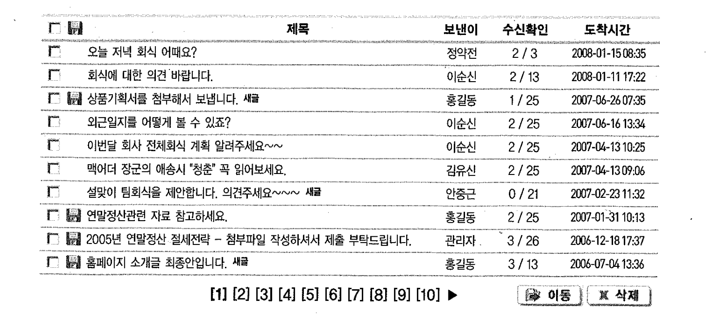
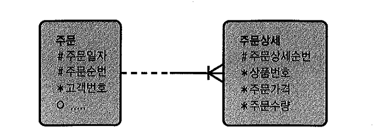

# 08. 고급조인테크닉


## 1) 누적 매출 구하기

```sql
create table month_sales
as
select deptno as "지점"
        , row_number() over (partition by deptno order by empno) as "판매월"
        , round(dbms_random.value(500, 1000)) as "매출"
    from emp
    order by deptno
;


select *
from month_sales
;

      지점     판매월       매출
---------- ---------- ----------
        10          1        895
        10          2        560
        10          3        551
        20          1        948
        20          2        992
        20          3        852
        20          4        950
        20          5        836
        30          1        871
        30          2        681
        30          3        993
        30          4        518
        30          5        551
        30          6        846
```


- 오라클 8i부터 제공되기 시작한 분석함수(Analytic Function)를 이용하면 아래와 같이 간단하게 각 지점별로 판매월과 함께 증가하는 누적매출(running total) 결과를 얻을 수 있다.

```sql
select "지점", "판매월", "매출"
      , sum("매출") over (partition by "지점" order by "판매월"
                           range between unbounded preceding and current row
                         ) as "누적매출"
from month_sales
;

      지점     판매월       매출   누적매출
---------- ---------- ---------- ----------
        10          1        895        895
        10          2        560       1455
        10          3        551       2006
        20          1        948        948
        20          2        992       1940
        20          3        852       2792
        20          4        950       3742
        20          5        836       4578
        30          1        871        871
        30          2        681       1552
        30          3        993       2545
        30          4        518       3063
        30          5        551       3614
        30          6        846       4460
```


- 아래는 부등호 조인을 통해 지점별 누적매출을 구하는 방법을 예시

```sql
select t1."지점", t1."판매월", min(t1."매출") as 매출, sum(t2."매출") as 누적매출
      from   month_sales t1, month_sales t2
      where  t2."지점" = t1."지점"
      and    t2."판매월" <= t1.판매월
      group by t1."지점", t1."판매월"
      order by t1."지점", t1."판매월"
;

      지점     판매월       매출   누적매출
---------- ---------- ---------- ----------
        10          1        895        895
        10          2        560       1455
        10          3        551       2006
        20          1        948        948
        20          2        992       1940
        20          3        852       2792
        20          4        950       3742
        20          5        836       4578
        30          1        871        871
        30          2        681       1552
        30          3        993       2545
        30          4        518       3063
        30          5        551       3614
        30          6        846       4460
```


## 2) 선분이력 끊기

- 선분이력 레코드를 가공해야 할 때가 있는데, 월말 기준으로 선분을 끊는 경우를 살펴보자.
- 본론으로 들어가기에 앞서, 두 선분이 겹치는 구간에 대한 시작일자 및 종료일자 선택 규칙에 대해 살펴보자.
- 시간을 나타내는 두 개의 선분이 서로 겹치는 모습을 표현하면, 아래의 그림처럼 네 가지 패턴이 있다.


- '월도'와 '선분이력' 테이블 생성

```sql
create table 월도(기준월, 시작일자, 종료일자)
as
select '200906', '20090601', '20090630' from dual union all
select '200907', '20090701', '20090731' from dual union all
select '200908', '20090801', '20090831' from dual union all
select '200909', '20090901', '20090930' from dual union all
select '200910', '20091001', '20091030' from dual
;

create table 선분이력 (상품번호, 시작일자, 종료일자, 데이터)
as
select 'a', '20090713', '20090808', 'a1' from dual union all
select 'a', '20090809', '20090820', 'a2' from dual union all
select 'a', '20090821', '20091007', 'a3' from dual
;

select a.기준월, b.시작일자, b.종료일자, b.상품번호, b.데이터
    from 월도 a, 선분이력 b
   where b.시작일자 <= a.종료일자
     and b.종료일자 >= a.시작일자
   order by  a.기준월, b.시작일자
;

기준월       시작일자         종료일자         상품번호  데이터
------------ ---------------- --------- --------- ----
200907       20090713         20090808       A     A1    ----- 5 -> 8
200908       20090713         20090808       A     A1    ----- 5 -> 9
200908       20090809         20090820       A     A2    ----- 6 -> 10
200908       20090821         20091007       A     A3    ----- 7 -> 11
200909       20090821         20091007       A     A3    ----- 7 -> 12
200910       20090821         20091007       A     A3    ----- 7 -> 13
```

- 5번 선분은 8,9 두 선분으로 복제되었고, 7번 선분은 11,12,13 세 선분으로 복제되었다.
- 7번 선분을 기준으로 설명하면, 시작일자가 자신의 종료일자보다 작은 월도(b.종료일자 >= a.시작일자)는 1,2,3,4번이 모두 해당되고, 종료일자가 자신의 시작일자보다 큰 월도(b.시작일자 <= a.종료일자)는 2,3,4번이다.
- 따라서 두 조건을 모두 만족하는 월도는 2,3,4번이므로 7번 선분은 세개로 복제가 이루어진다.
- 선분이력이 여러 개 생기더라도 기준월은 각각 다른 값을 가진다는 점에 주목하기 바란다.

- 여섯 개 선분의 시작일자와 종료일자를 구하는 것이 숙제인데, 이를 위해 8~13번 선분을 그림 2-24에 예시한 스타일로 분류하면 다음과 같다.

- 변환된 8번과 11번 선분은 스타일 a에 속한다.
- 변환된 9번과 13번 선분은 스타일 b에 속한다.
- 변환된 10번 선분은 스타일 c에 속한다.
- 변환된 12번 선분은 스타일 d에 속한다.

- a,b,c,d스타일별로 특징을 정리했던 표를 이용하면 조금 전 쿼리에서 얻은 여섯 개 선분의 시작일자와 종료일자를 쉽게 구할 수 있다.
- 아래 쿼리의 수행 결과를 보면, 그림 2-25 하단에 있는 '변환된 선분이력'과 똑같은 결과집합인 것을 알 수 있다.

```sql
SELECT 상품번호
        ,case when lst = 시작일자1 and gst = 종료일자2 then 시작일자2   -- 스타일a
              when lst = 시작일자2 and gst = 종료일자1 then 시작일자1   -- 스타일b
              when lst = 시작일자1 and gst = 종료일자1 then 시작일자2   -- 스타일c
              when lst = 시작일자2 and gst = 종료일자2 then 시작일자2   -- 스타일d
         end 시작일자
        ,case when lst = 시작일자1 and gst = 종료일자2 then 종료일자2   -- 스타일a
              when lst = 시작일자2 and gst = 종료일자1 then 종료일자1   -- 스타일b
              when lst = 시작일자1 and gst = 종료일자1 then 종료일자2   -- 스타일c
              when lst = 시작일자2 and gst = 종료일자2 then 종료일자2   -- 스타일d
         end 종료일자
        ,데이터
    FROM (
            SELECT b.상품번호,b.데이터,a.기준월
                   ,a.시작일자 시작일자1,b.시작일자 시작일자2
                   ,a.종료일자 종료일자1,b.종료일자 종료일자2
                   ,least(a.시작일자,a.종료일자,b.시작일자,b.종료일자) lst
                   ,greatest(a.시작일자,a.종료일자,b.시작일자,b.종료일자) gst
              FROM 월도 a, 선분이력 b
             WHERE b.시작일자 <= a.종료일자
               AND b.종료일자 >= a.시작일자
          )
;

상품번호   시작일자         종료일자         데이터
--------- ---------- -------------- ----------
    A        2009/07/13         2009/07/31         A1
    A        2009/08/01         2009/08/08         A1
    A        2009/08/09         2009/08/20         A2
    A        2009/08/21         2009/08/31         A3
    A        2009/09/01         2009/09/30         A3
    A        2009/10/01         2009/10/07         A3
```


## 3) 데이터 복제를 통한 소계 구하기

- 쿼리를 작성하다 보면 데이터 복제 기법을 활용해야 할 때가 많다. 데이터복제를 위해 일부러 카티션 곱(Cartesian Product)을 발생시켜 복제하기도 한다.
- 전통적으로 많이 쓰던 방식은 복제용 테이블(copy_t)을 미리 만들어두고 이를 활용하는 것이다.

```sql
create table copy_t (no number, no2 varchar2(2));

Table created.

insert into copy_t
select rownum, lpad(rownum,2,'0') from all_tables where rownum<=31;

31 rows created.

commit;

Commit complete.

alter table copy_t add constraint copy_t_pk primary key(no);

Table altered.

create unique index copy_t_no2_idx on copy_t(no2);

Index created.

-- 아래 쿼리를 실행하면 emp 테이블에 있는 14개의 레코드가 3개씩 총 42개로 복제된다.
select *
   from emp a, copy_t b
   where b.no<=3
;


     EMPNO ENAME      JOB              MGR HIREDATE            SAL       COMM     DEPTNO       NO NO
---------- ---------- --------- ---------- ------------ ---------- ---------- ---------- ---------- --
      7369 SMITH      CLERK           7902 17-DEC-80           800                    20        1 01
      7369 SMITH      CLERK           7902 17-DEC-80           800                    20        2 02
      7369 SMITH      CLERK           7902 17-DEC-80           800                    20        3 03
      7499 ALLEN      SALESMAN        7698 20-FEB-81          1600        300         30        1 01
      7499 ALLEN      SALESMAN        7698 20-FEB-81          1600        300         30        2 02
      7499 ALLEN      SALESMAN        7698 20-FEB-81          1600        300         30        3 03
      .
      .
      .

42 rows selected.


-- 오라클 9i부터는 dual테이블에 START WITH절 없이 CONNECT BY 구문을 사용하면 두 개의 집합이 자동으로 만들어진다.
select rownum  from dual  connect by level <= 2;

	ROWNUM
----------
         1
         2

-- 이 방법을 사용해 emp 테이블을 복제하는 방법은 아래와 같다.
select *
     from emp a,
     (select rownum  from dual  connect by level <= 2) b
     order by empno
;

     EMPNO ENAME      JOB              MGR HIREDATE            SAL       COMM     DEPTNO     ROWNUM
---------- ---------- --------- ---------- ------------ ---------- ---------- ---------- ----------
      7369 SMITH      CLERK           7902 17-DEC-80           800                    20        1
      7369 SMITH      CLERK           7902 17-DEC-80           800                    20        2
      7499 ALLEN      SALESMAN        7698 20-FEB-81          1600        300         30        2
      7499 ALLEN      SALESMAN        7698 20-FEB-81          1600        300         30        1
      7521 WARD       SALESMAN        7698 22-FEB-81          1250        500         30        1
      7521 WARD       SALESMAN        7698 22-FEB-81          1250        500         30        2
      .
      .
      .
28 rows selected.
```


- 데이터 복제 기법을 활용하면 아래와 같이 단일 SQL로도 부서별 소계를 구할 수 있다.

```sql
break on 부서번호
column 부서번호 format 9999
column 사원번호 format a10
select deptno 부서번호
       , decode(no, 1, to_char(empno), 2, '부서계') 사원번호
       , sum(sal) 급여합, round(avg(sal)) 급여평균
from   emp a, (select rownum no from dual connect by level <= 2)
group by deptno, no, decode(no, 1, to_char(empno), 2, '부서계')
order by 1, 2;


부서번호 사원번호       급여합   급여평균
-------- ---------- ---------- ----------
      10 7782             2450       2450
         7839             5000       5000
         7934             1300       1300
         부서계           8750       2917
      20 7369              800        800
         7566             2975       2975
         7788             3000       3000
         7876             1100       1100
         7902             3000       3000
         부서계          10875       2175
      30 7499             1600       1600
         7521             1250       1250
         7654             1250       1250
         7698             2850       2850
         7844             1500       1500
         7900              950        950
         부서계           9400       1567

17 rows selected.
```


- 이처럼 group by를 잘 구사하면 우리가 원하는 데이터 집합을 자유자재로 가공해 낼 수 있다.
- 아래는 세 개로 복제하고서 총계까지 구하는 사례다.

```sql
column 부서번호 format a10
select decode(no, 3, null, to_char(deptno)) 부서번호
      , decode(no, 1, to_char(empno), 2, '부서계', 3, '총계') 사원번호
      , sum(sal) 급여합, round(avg(sal)) 급여평균
 from   emp a, (select rownum no from dual connect by level <= 3)
 group by decode(no, 3, null, to_char(deptno))
       , no, decode(no, 1, to_char(empno), 2, '부서계', 3, '총계')
order by 1, 2;


부서번호   사원번호       급여합   급여평균
---------- ---------- ---------- ----------
10         7782             2450       2450
           7839             5000       5000
           7934             1300       1300
           부서계           8750       2917
20         7369              800        800
           7566             2975       2975
           7788             3000       3000
           7876             1100       1100
           7902             3000       3000
           부서계          10875       2175
30         7499             1600       1600
           7521             1250       1250
           7654             1250       1250
           7698             2850       2850
           7844             1500       1500
           7900              950        950
           부서계           9400       1567
           총계            29025       2073

18 rows selected.
```


- 표준 ROLLUP 구문을 사용하면 데이터 복제 기법을 쓰지 않고도 아래와 같이 간편하게 소계및 총계를 구할 수 있다.

```sql
break on 부서번호
column 부서번호 format 9999
column 사원번호 format a10
select deptno 부서번호
       , case when grouping(empno) = 1 and grouping(deptno) = 1 then '총계'
              when grouping(empno) = 1 then '부서계'
              else to_char(empno) end  사원번호
       , sum(sal) 급여합, round(avg(sal)) 급여평균
 from   emp
 group by rollup(deptno, empno)
 order by 1, 2;


부서번호 사원번호       급여합   급여평균
-------- ---------- ---------- ----------
      10 7782             2450       2450
         7839             5000       5000
         7934             1300       1300
         부서계           8750       2917
      20 7369              800        800
         7566             2975       2975
         7788             3000       3000
         7876             1100       1100
         7902             3000       3000
         부서계          10875       2175
      30 7499             1600       1600
         7521             1250       1250
         7654             1250       1250
         7698             2850       2850
         7844             1500       1500
         7900              950        950
         부서계           9400       1567
         총계            29025       2073

18 rows selected.
```


## 4) 상호배타적 관계의 조인

- 상호배타적 관계 : 어떤 엔터티가 두 개 이상의 다른 엔터티의 합집합과 관계를 갖는 것
- ERD에 아래처럼 아크(Arc) 관계로 표시


- 실제 데이터베이스로 구현할때, 상품권결제 테이블은 아래 두가지 방법으로 구축한다.


##### 1. 온라인권번호, 실권번호 두 컬럼을 따로 두고, 레코드별로 둘 중 하나의 컬럼에만 값을 입력한다. Outer 조인 이용

```sql
SELECT /*+ ordered use_nl(b) use_nl(c) use_nl(c) use_nl(d) */
       a.주문번호, a.결제일자, a.결제금액
        , NVL(b.온라인권번호, c.실권번호) 상품권번호
        , NVL(b.발행일시, d.발행일시) 발행일시
FROM 상품권결제 a, 온라인권 b, 실권 c, 실권발행 d
WHERE a.결제일자 BETWEEN :dt1 AND :dt2
AND b.온라인권번호(+) = a.온라인권번호
AND c.실권번호(+) = a.실권번호
AND d.발행번호(+) = c.발행번호;
```


#### 2. 상품권구분과 상품권번호 컬럼을 두고, 상품권구분이 1일때는 온라인권번호를 입력하고 2일 때는 실권번호를 입력한다. UNION ALL 이용

```sql
SELECT x.주문번호, x.결제일자, x.결제금액, y.온라인권번호 상품권번호, y.발행일시, ...
FROM 상품권결제 x, 온라인권 y
WHERE x.상품권구분 = '1'
AND x.결제일자 BETWEEN :dt1 AND :dt2
AND y.온라인권번호(+) = x.상품권번호
UNION ALL
SELECT x.주문번호, x.결제일자, x.결제금액, y.실권번호 상품권번호, z.발행일시, ...
FROM 상품권결제 x, 실권 y, 실권발행 z
WHERE  x.상품권구분 = '2'
AND x.결제일자 BETWEEN :dt1 AND :dt2
AND y.실권번호(+) = x.상품권번호
AND z.발행번호(+) = y.발행번호;
```

* 쿼리를 위아래 두번 수행하지만, 인덱스구성에 따라 처리 범위는 달라진다.
1. (상품권구분 + 결제일자) : 읽는 범위 중복 없음
2. (결제일자 + 상품권구분) : 인덱스 스캔범위에 중복 발생
3. (결제일자) : 상품권구분을 필터링하기 위한 테이블 Random 액세스까지 중복 발생


##### 3. 중복 액세스에 의한 비효율 제거

```sql
SELECT /*+ ordered use_nl(b) use_nl(c) use_nl(c) use_nl(d) */
       a.주문번호, a.결제일자, a.결제금액
        , NVL(b.온라인권번호, c.실권번호) 상품권번호
        , NVL(b.발행일시, d.발행일시) 발행일시
FROM 상품권결제 a, 온라인권 b, 실권 c, 실권발행 d
WHERE a.결제일자 BETWEEN :dt1 AND :dt2
AND b.온라인권번호(+) = DECODE(a.상품권구분, '1',  a.상품권번호)
AND c.실권번호(+) = DECODE(a.상품권구분, '2',  a.상품권번호)
AND d.발행번호(+) = c.발행번호;
```


## 5) 최종 출력 건에 대해서만 조인하기

- 화면 페이지 처리시 흔히 사용되는 방식이다.

```sql
SELECT *
	FROM (
		SELECT ROWNUM NO, 등록일자, 번호, 제목
					, 회원명, 게시판유형명, 질문유형명, COUNT(*) OVER() CNT
			FROM(
				SELECT A.등록일자, A.번호, A.제목, B.회원명, C.게시판유형명, D.질문유형명
				FROM 게시판 A, 회원 B, 게시판유형 C, 질문유형 D
				WHERE A.게시판유형 = :TYPE
				AND     B.회원번호 = A.작성자번호
				AND     C.게시판유형 = A.게시판유형
				AND     D.질문유형 = A.질문유형
				ORDER BY A.등록일자 DESC, A.질문유형, A.번호
				)
			WHERE ROWNUM <= 31
		)
	WHERE NO BETWEEN 21 AND 30
```


- 전체 게시판 데이터는 수백만 건이고, 특정 게시판 유형(게시판유형 = :TYPE)에 속하는 데이터는 평균 10만 건에 이른다.
- 게다가 회원, 게시판유형, 질문유형 3개 테이블과 조인까지 수행하므로 성능이 좋을리 없다.
- 인덱스 구성은 아래와 같아서 소트 오퍼레이션이 불가피하다.

- \>> 게시판_X01 : 게시판유형 + 등록일자 DESC + 번호

- 실행계획을 보면(교재참고 p.313), 10만 건을 읽어 나머지 세 테이블과의 조인을 모두 완료한 후에 소트 단계에서 stopkey가 작동(id=5)하고 있다.

```sql
Execution Plan
--------------------------------------------------------------------------------------------
0         SELECT STATEMENT Optimizer=ALL_ROWS
1     0     VIEW
2     1         WINDOW (BUFFER)
3     2             COUNT (STOPKEY)
4     3                 VIEW
5     4                     SORT (ORDER BY STOPKEY)
6     5                        NESTED LOOPS
7     6                           NESTED LOOPS
8     7                               NESTED LOOPS
9     8                                   TABLE ACCESS (BY LOCAL INDEX ROWID) OF '게시판' (TABLE)
10   9                                        INDEX (RANGE SCAN) OF '게시판_X01' (INDEX (UNIQUE))
11   10                                   TABLE ACCESS (BY INDEX ROWID) OF '회원' (TABLE)
12   11                                       INDEX (UNIQUE SCAN) OF '회원_PK' (INDEX (UNIQUE))
13   7                                TABLE ACCESS (BY INDEX ROWID) OF '게시판유형' (TABLE)
14   13                                  INDEX (UNIQUE SCAN) OF '게시판유형_PK' (INDEX (UNIQUE))
15   6                             TABLE ACCESS (BY INDEX ROWID) OF '질문유형' (TABLE)
16   15                               INDEX (UNIQUE SCAN) OF '질문유형_PK' (INDEX (UNIQUE))
```

- 튜닝을 위해 게시판_X01 인덱스에 질문유형 컬럼을 추가하자.
- 인덱스 컬럼 순서를 바꾸는 결정을 하기는 쉽지 않지만 뒤쪽에 추가하는 것은 그다지 어렵지 않다.

- \>> 게시판_X01 : 게시판유형 + 등록일자 DESC + 번호 + 질문유형

- 위처럼 인덱스를 구성했다면 게시판 테이블로부터 '게시판유형 = :TYPE' 조건에 해당하는 레코드를 찾는 작업은 인덱스 내에서 해결 가능하다.
- 아래처럼 인덱스만 읽도록 쿼리를 작성

```sql
SELECT ROWID RID
  FROM 게시판
  WHERE 게시판유형 = :TYPE
  ORDER BY 등록일자 DESC, 질문유형, 번호
```


- 읽은 레코드를 정렬하는 작업은 피할 수 없지만, 인덱스 블록만 읽으면 되기 때문에 이전보다 훨씬 빠르게 수행될 것이다.

- 다른 세 개 테이블과의 조인 컬럼, 그리고 select-list에서 참조되는 컬럼을 어떻게 읽어올 것인지가 문제인데, 이들 컬럼은 페이지 처리가 모두 완료되 최종 결과집합으로 확정된 10건에 대해서만 액세스하면 된다.
- 그럴 목적으로 인덱스를 스캔할 때 rowid 값을 같이 읽어온 것이다. 최종적으로 완성된 쿼리는 아래와 같다.

```sql
SELECT /*+ ORDERED USE_NL(A) USE_NL(B) USE_NL(C) USE_NL(D) ROWID(A) */
       A.등록일자, B.번호, A.제목, B.회원명, C.게시판유형명, D.질문유형명, X.CNT
  FROM (
            SELECT RID, ROWNUM NO, COUNT(*) OVER() CNT
                    FROM (
                              SELECT ROWID RID
                                  FROM 게시판
                                  WHERE 게시판유형 = :TYPE
                                  ORDER BY 등록일자 DESC, 질문유형, 번호
                                )
                    WHERE ROWNUM <= 31
                    ) X, 게시판 A, 회원 B, 게시판유형 C, 질문유형 D
  WHERE X.NO BETWEEN 21 AND 30
  AND A.ROWID = X.RID
  AND B.회원번호 = A.작성자번호
  AND C.게시판유형 = A.게시판유형
  AND D.질문유형 = A.질문유형

Execution Plan
---------------------------------------------------------------------
0       SELECT STATEMENT Optimizer=ALL_ROWS
1   0      NESTED LOOPS
2   1        NESTED LOOPS
3   2          NESTED LOOPS
4   3             NESTED LOOPS
5   4               VIEW
6   5                 COUNT (STOPKEY)
7   6                    VIEW
8   7                      SORT (ORDER BY STOPKEY)
9   8                         INDEX (RANGE SCAN) OF '게시판_X01' (INDEX (UNIQUE))
10   4              TABLE ACCESS (BY USER ROWID) OF '게시판' (TABLE)            -- BY USER ROWID
11   3            TABLE ACCESS (BY INDEX ROWID) OF '회원' (TABLE)
12   11              INDEX (UNIQUE SCAN) OF '회원_PK' (INDEX (UNIQUE))
13   2           TABLE ACCESS (BY INDEX ROWID) OF '게시판유형' (TABLE)
14   13              INDEX (UNIQUE SCAN) OF '게시판유형_PK' (INDEX (UNIQUE))
15   1         TABLE ACCESS (BY INDEX ROWID) OF '질문유형' (TABLE)
16   15          INDEX (UNIQUE SCAN) OF '질문유형_PK' (INDEX (UNIQUE))
```


- 게시판 테이블을 두 번 읽도록 쿼리를 작성했지만 인라인 뷰 내에서는 인덱스만 읽도록 했고, 두 번째 게시판 테이블(A)을 액세스할 때는 앞서 읽은 rowid 값으로 직접 액세스하기 때문에 인덱스를 경유해 한 번만 테이블을 액세스하는 것과 같은 일량이다.
- 실행계획에 'TABLE ACCESS BY INDEX ROWID'가 아니라 'TABLE ACCESS BY USER ROWID'로 표시된 것에 주목하자.

- 조인 컬럼이 null 허용일때는 결과가 달라질 수 있다.
- 회원, 게시판유형, 질문유형 테이블과의 조인 컬럼인 작성자번호, 게시판유형, 질문유형이 null 허용 컬럼이 존재하는지 확인해 봐야 한다.
- 업무적으로 null 값이 허용되지 않는데도 컬럼에 not null 제약을 설정하지 않는 경우가 매우 흔하기 때문이다.
- 그리고, 이들 컬럼이 null 값이라고 해서 게시판 출력 리스트에서 제외되는 것이 업무적으로 맞는지 확인해 볼 필요가 있다.
- 아마도 Outer 조인을 했어야 옳은데, 개발자가 간과한 경우일 수 있다.
- 위 쿼리에 아래처럼 Outer 기호( + )만 붙여주면 된다.

```sql
WHERE X.NO BETWEEN 21 AND 30
AND     A.ROWID = X.RID
AND     B.회원번호(+) = A.작성자번호
AND     C.게시판유형(+) = A.게시판유형
AND     D.질문유형(+) = A.질문유형
```


###### 반정규화는 성능을 위한 최후의 수단

- 정규화된 모델로는 제대로된 성능을 내기 어려울 때만 반정규화를 단행하는 것이 관계형 데이터베이스를 구현하는 정석이다.
- 그럼에도 성능이 좋지 않을 것을 예단하고 논리 데이터 모델링 단계에서 미리 반정규화를 실시하는 설계자나 개발팀을 자주 본다.





- 위 그림의 데이터 모델을 열어보면 아래그림처럼  발송메시지건수, 수신인수 같은 추출(derived)속성들이 설계되 있다.


- 그럼 수신확인자수와 수신대상자수를 세고 새글여부를 확인하는 스칼라 서브쿼리 때문에 성능 문제를 겪었을 것이고, 이를 해결하지 못하면 위의 그림과 같이 설계하기 하게되어 아래처럼 쿼리할 것이다.

```sql
SELECT ..
FROM (
   SELECT ..
   FROM (
      SELECT a.발신인ID, a,발송일시, a.제목, b.사용자이름 AS 보낸이
                  , ( SELECT COUNT(수신일시) FROM 메시지수신인 ..) 수신확인자수
                  , ( SELECT COUNT(*) FROM 메시지수신인 ..) 수신대상자수
                  , ( CASE WHEN EXISTS ( SELECT 'x' FROM 메시지수신인
                                                           WHERE 발신자ID = a.발신자ID
                                                           AND 발송일시 = a.발송일시
                                                           AND 수신자ID = :로그인사용자ID
                                                           AND 수신일시 IS NULL ) THEN 'Y' END ) 새글여부
          FROM 메시지 a, 사용자 b
          ORDER BY a.발송일시 DESC
            ) a
   WHERE rownum <= 10
)
WHERE no between 1 and 10;
```

- 위와 같은 추출 속성을 도입하면 메시지를 수신할 때마다 메시지 테이블의 수신인수를 갱신해주는 DML도 같이 작성해야 한다.
- 문제는 일상적이지 않은 업무로 데이터 정합성이 훼손될 수 있다는데 있다.
- 예를 들어 사용자가 탈퇴하면 메시지 수신인수도 일괄적으로 갱신해 주어야 하는데, 그런 처리를 실수로 빠뜨리기 쉽다.

- **반정규화를 실시했으면 업무 규칙 누락이 생기지 않도록 꼼꼼히 점검해야 한다.**

- 최종 출력되는 10건에 대해서만 수신정보와 새글 여부를 확인하는 방식으로 쿼리 변경하여 성능 문제 해결
- (스칼라 서브쿼리를 맨 바깥의 SELECT LIST에서 처리함)

```sql
SELECT a.발신인ID, a,발송일시, a.제목, b.사용자이름 AS 보낸이
        , ( SELECT COUNT(수신일시) || '/' || COUNT(*) FROM 메시지수신인 ..) 수신확인
        , ( CASE WHEN EXISTS ( .. ) THEN 'Y' END ) 새글여부
FROM (
           SELECT ROWNUM NO, ...
             FROM ( SELECT 발신인ID, a,발송일시, a.제목 FROM 메시지 ORDER BY a.발송일시 DESC )
             WHERE ROWNUM <= 30
          ) a, 사용자 b
WHERE NO BETWEEN 21 AND 30;
AND      .........
```


## 6) 징검다리 테이블 조인을 이용한 튜닝


#### from절에 조인되는 테이블 개수를 늘려 성능을 향상시키는 사례


- 위의 데이터 모델에서 고객의 할인혜택을 조회하는 쿼리

```sql
SELECT  /*+ ordered use_nl(s r)*/
        c.고객번호, s.서비스번호, s.서비스구분
        , s.서비스상태코드, s.서비스상태변경코드, r.할인시작일자, r.할인종료일자
from    고객 c, 서비스 s, 서비스요금할인 r
where   c.주민법인등록번호 = :ctz_biz_num
and     s.명의고객번호 = c.고객번호
and     r.서비스번호 =  s.서비스번호
and     r.서비스상품그룹 = '3001'
and     r.할인기간코드 = '15'
order   by r.할인종료일자 desc, s.서비스번호
```


- 인덱스 구성

```sql
고객_N1              : 주민법인등록번호
서비스_N2            : 명의고객번호 + 서비스번호
서비스요금할인_PK    : 서비스요금할인_PK + 서비스상품그룹
서비스요금할인_N1    : 서비스상품그룹 + 할인기간코드
```

- 위의 쿼리 수행시 : 서버 구간에서만 28초가 걸리고, 블록 I/O는 226,672나 발생.


- 아래 그림은 위 쿼리의 처리과정을 표현한 것이고, 각 오퍼레이션 단계에서의 출력 건수와 블록 I/O 발생량을 함께 표시하였다.


- 최종 건수는 183건에 불과 하지만, 고객 테이블을 먼저 드라이빙해 서비스 테이블과 NL 조인하는 과정에서 66,617개의 블록 I/O가 발생했고, 이어서 서비스요금할인 테이블과 NL 조인하는 과정에서 160,055개의 블록 I/O가 추가로 발생.
- 총 블록 I/O 개수는 226,672


##### 아래는 조인 순서를 바꿔 서비스요금할인 테이블이 먼저 드라이빙


- 그림과 같이 할인기간코드 = '15' AND 서비스상품그룹코드 = '3001' 조건에 부합하는 레코드는 36,557건
- 테이블 액세스 하는 단계에서 24,826개의 블록I/O 발생, 조인순서를 바꾸더라도 조인액세스량 줄이기는 어렵다.
- 해시조인유도시 91,443(= 66,617 + 24,826)개의 블록I/O 발생 짐작.
- I/O가 절반이상 줄기 때문에 조금은 빨라지겠지만, 속도는 만족스럽지 못함.
- 최종결과 건수는 얼마되지 않으면서, 필터 조건만으로 각 부분을 따로 읽으면 결과 건수가 아주 많을 때 튜닝하기가 가장 어려움.
- 이유는 NL 조인 과정에서 Random I/O 부하가 심하게 발생하기 때문이며, 어느 쪽으로 드라이빙하더라도 결과는 마찬가지.


##### 튜닝을 위해 서비스요금할인_N1 인덱스에 아래와 같이 '서비스번호' 컬럼을 추가해 보자

```
서비스요금할인_N1 : 서비스상품그룹 + 할인기간코드 + 서비스번호
```


- 서비스와 서비스요금할인을 한 번씩 더 조인하도록 쿼리를 아래처럼 변경

```sql
SELECT /*+ ordered use_hash(r_brdg) rowid(s) rowid(r) */    ------------------- 1
       c.고객번호, s.서비스번호, s.서비스구분
       , s.서비스상태코드, s.서비스상태변경코드, r.할인시작일자, r.할인종료일자
from   고객 c
       , 서비스 s_brdg, 서비스요금할인 r_brdg        ------------------------------ 2
       , 서비스 s, 서비스요금할인 r
where  c.주민법인등록번호 = :ctz_biz_num
and    s_brdg.명의고객번호 = c.고객번호
and    r_brdg.서비스번호 =  s_brdg.서비스번호
and    r_brdg.서비스상품그룹 = '3001'
and    r_brdg.할인기간코드 = '15'
and   s.rowid = s_brdg.rowid                    --------------------------------- 3
and   r.rowid = r_brdg.rowid                      -------------------------------- 4
order  by r.할인종료일자 desc, s.서비스번호
```


- 튜닝 전에 226,672개 블록을 읽으면서 27.8초 걸리던 쿼리가 857개 블록을 읽으면서 0.12초만에 수행.
- '서비스'와 '서비스요금할인' 테이블을 한 번씩 더 조인(from절 2번)함으로써 I/O가 줄면서 성공적으로 튜닝.
- 양쪽 테이블에서 인덱스만 읽은 결과끼리 먼저 조인하고 최종 결과집합 183건에 대해서만 테이블을 액세스하도록 한 것이 핵심 아이디어(서비스요금할인_N1 인덱스에 '서비스번호' 추가).


- 고객 테이블과 서비스_N2 인덱스를 조인할 때는 블록 I/O가 총 363번 발생.
- 서비스요금할인_N1 인덱스만 읽을 때도 블록 I/O는 128개(94개에서 128개로 늘어난 이유는 서비스번호 컬럼을 추가했기 때문)
- 인덱스에서 얻어진 집합끼리 조인할 때는 대량 데이터 조인이므로 해시 조인 방식을 사용(쿼리에서 1번)
- 인덱스에 없는 컬럼 값들을 읽으려고 테이블을 액세스할 때는 추가적인 인덱스 탐색 없이 인덱스에서 읽은 rowid 값을 가지고 직접 액세스(쿼리에서 3번과 4번, Table Access By User ROWID)


###### 인조 식별자 사용에 의한 조인 성능 이슈




- 위 그림은 '주문' 테이블 식별자인 '주문일자'와 '주문순번' 컬럼을 자식 테이블 '주문상세'의 식별자로 상속시킴(UID Bar)


- 아래는 특정주문일자에 발생한 특정상품 주문금액 집계 쿼리(주문일자평균 100,000건, 상품번호 1000건, 상품번호별 하루평균 600건의 데이터)
- 주문상세 쪽 인덱스를 상품번호 + 주문일자 또는 주문일자 + 상품번호순으로 구성. -- 자세한 설명은 4장 5절 '조건절 이행' 참조

```sql
select  sum(주문상세.가격 * 주문상세.주문수량) 주문금액
from    주문, 주문상세
where   주문.주문일자 = 주문상세.주문일자
and     주문.주문순번 = 주문상세.주문순번
and     주문.주문일자 = '20090315'
and     주문상세.상품번호 = 'AC001'
```


- 반면, 아래 그림처럼 '주문번호'라는 인조 식별자 컬럼을 따로 둔다면 주문상세 테이블에 '주문일자' 속성이 상속되지 않음으로 조인 과정에 큰 비효율 발생


```sql
select  sum(주문상세.가격 * 주문상세.주문수량) 주문금액
from    주문, 주문상세
where   주문.주문번호 = 주문상세.주문번호
and     주문.주문일자 = '20090315'
AND     주문상세.상품번호 = 'AC001'
```


- 인덱스 구성

```
주문_PK        : 주문번호
주문_X01       : 주문일자
주문상세_PK    : 주문번호 + 주문일자
주문상세_X01   : 상품번호
```


- 주문 테이블에서 읽은 100,000건에 대해 주문상세 쪽으로 100,000번의 조인 액세스가 일어남.
- 주문상세_PK 인덱스를 거쳐 주문상세 테이블을 100,000번 액세스하고서 상품번호 = 'AC001' 조건을 필터링 하고 나면 최종적으로 600건 정도만 남고 모두 버려짐.
- 주문상세_X01 또는 주문_X01 인덱스에 주문번호를 추가하고 이 인덱스를 이용하면 테이블 Random 액세스를 줄일 수 있지만 조인 시도 횟수는 줄지 않음.
- 해시 조인으로 유도하더라도 인덱스를 거쳐 각각 100,000건과 219,000건의 데이터를 읽는 과정에서 이미 상당량의 테이블 Random 액세스 발생할 것이고, 조인해야 할 일량이 많아 서버 리소스(CPU, 메모리)를 많이 사용하게 됨.

- 위 상황에서는 '주문일자' 컬럼을 주문상세 테이블로 반정규화하는 것이 가장 효과적인 해법일 것이다.


###### 인조 식별자를 둘 때 주의 사항

- 장점
  - 단일 컬럼으로 구성되므로 테이블 간 연결 구조가 단순해지고, 인덱스 저장공간이 최소화된다.
  - 다중 컬럼으로 조인할 때보다 조인 연산을 위한 CPU사용량이 조금 줄 수 있다.
- 단점
  - 조인 연산 횟수와 블록 I/O 증가로 시스템 리소스를 낭비한다.
  - 실질 식별자를 찾기 어려워 데이터 모델이 이해하기 어려워진다.
- TIP
  - 1. 논리적인 데이터 모델링 단계에서는 가급적 인조 식별자를 두지 않는 것이 좋다.
  - 2. 의미상 주어에 해당하는 속성들을 식별자로 사용했다가 물리 설계 단계에서 저장 효율과 액세스 효율 등을 고려해서 결정한다.


## 7) 점이력 조회

- 데이터 변경이 발생할 때마다 변경일자와 함께 새로운 이력 레코드를 쌓는 방식을 점이력이라고 함.


- 점이력 모델에서 이력을 조회할 때 흔히 아래와 같이 서브쿼리를 이용함
- 찾고자 하는 시점(서비스만료일) 보다 앞선 변경일자 중 가장 마지막 레코드를 찾는 것

```sql
select a.고객명, a.거주지역, a.주소, a.연락처, b.연체금액
from   고객 a, 고객별연체이력 b
where  a.가입회사 = 'C70'
and    b.고객번호 = a.고객번호
and    b.변경일자 = (select /*+ no_unnest */ max(변경일자)
                     from   고객별연체이력
                     where  고객번호 = a.고객번호
                     and    변경일자 <= a.서비스만료일);

-------------------------------------------------------------------------------------------------
| Id  | Operation                       | Name          | Rows  | Bytes | Cost (%CPU)| Time     |
-------------------------------------------------------------------------------------------------
|   0 | SELECT STATEMENT                |               |     1 |    60 |   332   (0)| 00:00:04 |
|   1 |  TABLE ACCESS BY INDEX ROWID    | 고객별연체이력|     2 |    34 |     3   (0)| 00:00:01 |
|   2 |   NESTED LOOPS                  |               |    16 |   960 |    32   (0)| 00:00:01 |
|   3 |    TABLE ACCESS BY INDEX ROWID  | 고객          |    10 |   430 |     2   (0)| 00:00:01 |
|*  4 |     INDEX RANGE SCAN            | 고객_IDX01    |    10 |       |     1   (0)| 00:00:01 |
|*  5 |    INDEX RANGE SCAN             | 고객별연체이력_IDX01     2 |       |     2   (0)| 00:00:01 |
|   6 |     SORT AGGREGATE              |               |     1 |    13 |            |          |
|   7 |      FIRST ROW                  |               |  5039 | 65507 |     3   (0)| 00:00:01 |
|*  8 |       INDEX RANGE SCAN (MIN/MAX)| 고객별연체이력_IDX01  5039 | 65507 |     3   (0)| 00:00:01 |
-------------------------------------------------------------------------------------------------
```


- 서브쿼리 내에서 서비스만료일보다 작은 레코드를 모두 스캔하지 않고 오라클이 인덱스를 거꾸로 스캔하면서 가장 큰 값 하나만을 찾는 방식
- 7번째 라인 First row, 8번째 라인 min/max, 오라클8 버전에서 구현

- 서브쿼리를 아래와 같이 바꿔줄 수 있지만 실제 수행해 보면 서브쿼리 내에서 액세스되는 인덱스 루트 블록에 대한 버퍼 Pinning효과가 사라져 블록 I/O가 더 많이 발생하고 고객별연체이력_idx 인덱스를 두 번 액세스하는 비효율은 피할 수 없다.

```sql
select a.고객명, a.거주지역, a.주소, a.연락처, b.연체금액
from   고객 a, 고객별연체이력 b
where  a.가입회사 = 'C70'
and    b.고객번호 = a.고객번호
and    b.변경일자 = (select /*+ index_desc(b 고객별연체이력_IDX01 */ 변경일자
                     from   고객별연체이력 b
                     where  b.고객번호 = a.고객번호
                     and    b.변경일자 <= a.서비스만료일
                     and    rownum <= 1);

-----------------------------------------------------------------------------------------------
| Id  | Operation                     | Name          | Rows  | Bytes | Cost (%CPU)| Time     |
-----------------------------------------------------------------------------------------------
|   0 | SELECT STATEMENT              |               |     1 |    60 |   332   (0)| 00:00:04 |
|   1 |  TABLE ACCESS BY INDEX ROWID  | 고객별연체이력|     2 |    34 |     3   (0)| 00:00:01 |
|   2 |   NESTED LOOPS                |               |    16 |   960 |    32   (0)| 00:00:01 |
|   3 |    TABLE ACCESS BY INDEX ROWID| 고객          |    10 |   430 |     2   (0)| 00:00:01 |
|*  4 |     INDEX RANGE SCAN          | 고객_IDX01    |    10 |       |     1   (0)| 00:00:01 |
|*  5 |    INDEX RANGE SCAN           | 고객별연체이력_IDX01|     2 |       |     2   (0)| 00:00:01 |
|*  6 |     COUNT STOPKEY             |               |       |       |            |          |
|*  7 |      INDEX RANGE SCAN         | 고객별연체이력_IDX01|     2 |    26 |     3   (0)| 00:00:01 |
-----------------------------------------------------------------------------------------------
```


#### Index_desc 힌트와 rownum <=1 조건 사용시, 주의사항

- 인덱스 구성이 변경되면 쿼리 결과가 **틀리게** 될 수 있음을 반드시 기억 해야함
- first row(min/max) 알고리즘이 작동할 때는 반드시 min/max 함수를 사용하는 것이 올바른 선택
- 낮은 성능 때문에 어쩔수 없이 Index(또는 index_desc) + rownum조건을 써야만 하는 경우는 프로그램 목록을 관리했다가 인덱스 구성 변경시 확인하는 프로세스를 반드시 거쳐야 한다.


- 참고로, min 또는 max 함수 내에서 컬럼을 가공하면 first row 알고리즘이 작동하지 않는다.

```sql
select a.고객명, a.거주지역, a.주소, a.연락처, b.연체금액
from   고객 a, 고객별연체이력 b
where  a.가입회사 = 'C70'
and    b.고객번호 = a.고객번호
and    b.변경일자 = (select /*+ no_unnest */  substr(max(변경일자 || 연체개월수), 9)
                     from   고객별연체이력
                     where  고객번호 = a.고객번호
                     and    변경일자 <= a.서비스만료일);

-------------------------------------------------------------------------------------------------
| Id  | Operation                       | Name          | Rows  | Bytes | Cost (%CPU)| Time     |
-------------------------------------------------------------------------------------------------
|   0 | SELECT STATEMENT                |               |     1 |    60 |  3836   (1)| 00:00:47 |
|   1 |  TABLE ACCESS BY INDEX ROWID    | 고객별연체이력|     2 |    34 |     3   (0)| 00:00:01 |
|   2 |   NESTED LOOPS                  |               |    16 |   960 |    32   (0)| 00:00:01 |
|   3 |    TABLE ACCESS BY INDEX ROWID  | 고객          |    10 |   430 |     2   (0)| 00:00:01 |
|*  4 |     INDEX RANGE SCAN            | 고객_IDX01    |    10 |       |     1   (0)| 00:00:01 |
|*  5 |    INDEX RANGE SCAN             | 고객별연체이력_IDX01|     2 |       |     2   (0)| 00:00:01 |
|   6 |     SORT AGGREGATE              |               |     1 |    16 |            |          |
|   7 |      TABLE ACCESS BY INDEX ROWID| 고객별연체이력|  5039 | 80624 |    38   (0)| 00:00:01 |
|*  8 |       INDEX RANGE SCAN          | 고객별연체이력_IDX01|   907 |       |     6   (0)| 00:00:01 |
-------------------------------------------------------------------------------------------------
```


- 스칼라 서브쿼리도 아래와 같이 max함수 사용하고 싶지만 first row 알고리즘이 작동하지 않아 부득이하게 index_desc힌트와 rownum 조건을 사용한 경우

```sql
select .....
     ,(selct substr(max(변경일자 || 연체금액), 9) from ...)
from 고객 a where .....
```


- 스칼라 서브쿼리로 변환하면 인덱스를 두번 액세스하지 않아도 되기 때문에 I/O를 그만큼 줄일 수 있음
- 여기서도 인덱스 루트 블록에 대한 버퍼 `Pinning 효과는 사라진다.(10번 액세스하면서 30개 블록 I/O발생, 인덱스 height = 3)`

```sql
select a.고객명, a.거주지역, a.주소, a.연락처
      ,(select /*+ index_desc(b 고객별연체이력_idx01) */ 연체금액
        from   고객별연체이력 b
        where  b.고객번호 = a.고객번호
        and    b.변경일자 <= a.서비스만료일
        and    rownum <= 1) 연체금액
from   고객 a
where  가입회사 = 'C70';

-----------------------------------------------------------------------------------------------
| Id  | Operation                     | Name          | Rows  | Bytes | Cost (%CPU)| Time     |
-----------------------------------------------------------------------------------------------
|   0 | SELECT STATEMENT              |               |    10 |   430 |     2   (0)| 00:00:01 |
|*  1 |  COUNT STOPKEY                |               |       |       |            |          |
|   2 |   TABLE ACCESS BY INDEX ROWID | 고객별연체이력|     2 |    34 |     4   (0)| 00:00:01 |
|*  3 |    INDEX RANGE SCAN DESCENDING| 고객별연체이력_IDX01|   907 |       |     3   (0)| 00:00:01 |
|   4 |  TABLE ACCESS BY INDEX ROWID  | 고객          |    10 |   430 |     2   (0)| 00:00:01 |
|*  5 |   INDEX RANGE SCAN            | 고객_IDX01    |    10 |       |     1   (0)| 00:00:01 |
-----------------------------------------------------------------------------------------------
```

- 고객별연체이력 테이블로부터 연체금액 하나만 읽기 때문에 스칼라 서브쿼리로 변경하기가 수월했다.
- 두개이상 컬럼을 읽어야 한다면 스칼라 서브쿼리 내에서 필요한 컬럼 문자열을 연결하고, 메인쿼리에서 substr함수로 잘라쓰는 방법을 사용해야 한다.

```sql
select 고객명, 거주지역, 주소, 연락처
     , to_number(substr(연체, 3)) 연체금액
     , to_number(substr(연체, 1, 2)) 연체개월수
from  (select a.고객명, a.거주지역, a.주소, a.연락처
            ,(select /*+ index_desc(b 고객별연체이력_idx01) */
                     lpad(연체개월수, 2) || 연체금액
              from   고객별연체이력
              where  고객번호 = a.고객번호
              and    변경일자 <= a.서비스만료일
              and    rownum <= 1) 연체
       from   고객 a
       where  가입회사 = 'C70'
);

-----------------------------------------------------------------------------------------
| Id  | Operation                    | Name     | Rows  | Bytes | Cost (%CPU)| Time     |
-----------------------------------------------------------------------------------------
|   0 | SELECT STATEMENT             |          |    10 |   700 |     2   (0)| 00:00:01 |
|   1 |  VIEW                        |          |    10 |   700 |     2   (0)| 00:00:01 |
|   2 |   TABLE ACCESS BY INDEX ROWID| 고객     |    10 |   430 |     2   (0)| 00:00:01 |
|*  3 |    INDEX RANGE SCAN          | 고객_IDX0|    10 |       |     1   (0)| 00:00:01 |
-----------------------------------------------------------------------------------------
```


- 이력 테이블에서 읽어야 할 컬럼 개수가 많다면 일일이 문자열로 연결하는 작업은 여간 번거롭지 않다.
- `스칼라 서브쿼리에서 rowid값만 취하고 고객별연체이력을 한번더 조인` 하는 방법을 생각해볼수 있다.

```sql
select /*+ ordered use_nl(b) rowid(b) */ a.*, b.연체금액, b.연체개월수
from  (select a.고객명, a.거주지역, a.주소, a.연락처
            ,(select /*+ index_desc(b 고객별연체이력_idx01) */ rowid rid
              from   고객별연체이력 b
              where  b.고객번호 = a.고객번호
              and    b.변경일자 <= a.서비스만료일
              and    rownum <= 1) rid
       from   고객 a
       where  가입회사 = 'C70') a, 고객별연체이력 b
where  b.rowid = a.rid;

------------------------------------------------------------------------------------------
| Id  | Operation                     | Name     | Rows  | Bytes | Cost (%CPU)| Time     |
------------------------------------------------------------------------------------------
|   0 | SELECT STATEMENT              |          |   100K|  7381K|    12   (0)| 00:00:01 |
|   1 |  NESTED LOOPS                 |          |   100K|  7381K|    12   (0)| 00:00:01 |
|   2 |   VIEW                        |          |    10 |   560 |     2   (0)| 00:00:01 |
|   3 |    TABLE ACCESS BY INDEX ROWID| 고객     |    10 |   430 |     2   (0)| 00:00:01 |
|*  4 |     INDEX RANGE SCAN          | 고객_IDX0|    10 |       |     1   (0)| 00:00:01 |
|   5 |   TABLE ACCESS BY USER ROWID  | 고객별연체별이력 | 10079 |   187K|     1   (0)| 00:00:01 | --
------------------------------------------------------------------------------------------
```


- 고객별연체이력 테이블과 조인을 두 번 했지만 실행계획상 으로는 조인을 한 번만 한 것과 일량이 같다.
- 스칼라 서브쿼리 수행부분이 'VIEW'에 감춰져 보이지 않지만, 인덱스 이외의 컬럼을 참조하지 않았으므로 인덱스만 읽었을것이다.
- 거기서 얻은 rowid값으로 바로 `테이블엑세스(Table Access by User ROWID)`하기 때문에
- 일반적인 NL조인과 같은 프로세스(Outer 인덱스 -> Outer 테이블 -> Inner인덱스 -> Inner테이블)로 진행된다.

- 스칼라 서브쿼리를 이용하지 않고 아래와 같이 SQL을 구사해도 같은 방식으로 처리.

```sql
select /*+ ordered use_nl(b) rowid(b) */
       a.고객명, a.거주지역, a.주소, a.연락처, b.연체금액, b.연체개월수
from   고객 a, 고객별연체이력 b
where  a.가입회사 = 'C70'
and    b.rowid = (select /*+ index(c 고객별연체이력_idx01) */ rowid
                  from   고객별연체이력 c
                  where  c.고객번호 = a.고객번호
                  and    c.변경일자 <= a.서비스만료일
                  and    rownum <= 1);


----------------------------------------------------------------------------------------------
| Id  | Operation                    | Name          | Rows  | Bytes | Cost (%CPU)| Time     |
----------------------------------------------------------------------------------------------
|   0 | SELECT STATEMENT             |               |   957 | 59334 |   312   (0)| 00:00:04 |
|   1 |  NESTED LOOPS                |               |  9574K|   566M|    12   (0)| 00:00:01 |
|   2 |   TABLE ACCESS BY INDEX ROWID| 고객          |    10 |   430 |     2   (0)| 00:00:01 |
|*  3 |    INDEX RANGE SCAN          | 고객_IDX01    |    10 |       |     1   (0)| 00:00:01 |
|   4 |   TABLE ACCESS BY USER ROWID | 고객별연체이력|  1007K|    18M|     1   (0)| 00:00:01 |
|*  5 |    COUNT STOPKEY             |               |       |       |            |          |
|*  6 |     INDEX RANGE SCAN         | 고객별연체이력|     2 |    38 |     3   (0)| 00:00:01 |
----------------------------------------------------------------------------------------------
```

- 고객(a)에서 읽은 고객번호로 서브쿼리 쪽 고객별연체이력(c)과 조인하고, 거기서 얻으 rowid값으로 고객별연체이력(b)을 곧바로 액세스한다. a와 b간에 따로 조인문을 기술하는 것은 불필요하다.

- 고객별연체이력을 두 번 사용했지만 실행계획 상으로는 한 번만 조인하면서 일반적인 NL조인과 같은 프로세스
- (Outer인덱스 -> Otuer 테이블 -> Inner인덱스 -> Inner테이블)로 진행되는 것에 주목하기 바란다.


#### 정해진 시점 기준으로 조회

- 앞에서는 가입회사 = 'C70'에 속하는 고객 수가 10명.
- 만약 가입회사별 고객수가 많아지면 `서브쿼리 수행횟수가 늘어나 Random I/O부하`도 심해질 것이다.
- 가입회사 조건절없이 모든 고객을 대상으로 이력을 조회한다면 ?
  - 고객 테이블로부터 읽히는 미지의 시점(서비스 만료일)을 기준으로 이력을 조회하는 경우이기 때문에 위와 같이 Random 액세스 위주의 서브쿼리를 쓸수 밖에 없다.

- 정해진 시점을 기준으로 조회하는 경우라면 서브쿼리를 쓰지 않음으로써 Random 액세스 부하를 줄일 방법들이 몇가지 생긴다.

```sql
select /*+ full(a) full(b) full(c) use_hash(a b c) no_merge(b) */
       a.고객명, a.거주지역, a.주소, a.연락처, c.연체금액, c.연체개월수
from   고객 a
     ,(select 고객번호, max(변경일자) 변경일자
       from   고객별연체이력
       where  변경일자 <= to_char(sysdate, 'yyyymmdd')
       group by 고객번호) b, 고객별연체이력 c
where  b.고객번호 = a.고객번호
and    c.고객번호 = b.고객번호
and    c.변경일자 = b.변경일자;

---------------------------------------------------------------------------------
| Id  | Operation             | Name    | Rows  | Bytes | Cost (%CPU)| Time     |
---------------------------------------------------------------------------------
|   0 | SELECT STATEMENT      |         |    10 |   680 |  1603   (4)| 00:00:20 |
|*  1 |  HASH JOIN            |         |    10 |   680 |  1603   (4)| 00:00:20 |
|*  2 |   HASH JOIN           |         |    10 |   490 |   809   (5)| 00:00:10 |
|   3 |    TABLE ACCESS FULL  | 고객    |    10 |   300 |     3   (0)| 00:00:01 |
|   4 |    VIEW               |         |    10 |   190 |   805   (4)| 00:00:10 |
|   5 |     HASH GROUP BY     |         |    10 |   130 |   805   (4)| 00:00:10 |
|*  6 |      TABLE ACCESS FULL| 고객별연|  9881 |   125K|   804   (4)| 00:00:10 |
|   7 |   TABLE ACCESS FULL   | 고객별연|  1007K|    18M|   788   (2)| 00:00:10 |
---------------------------------------------------------------------------------
```

- 가장 단순하게 작성된 위 쿼리는 고객별연체이력 테이블을 두번 Full Scan하는 비효율을 가지므로 아래와 같이 바꿀 수 있다.

```sql
select a.고객명, a.거주지역, a.주소, a.연락처
     , to_number(substr(연체, 11)) 연체금액
     , to_number(substr(연체, 9, 2)) 연체개월수
from   고객 a
     ,(select 고객번호, max(변경일자 || lpad(연체개월수, 2) || 연체금액 ) 연체
       from   고객별연체이력
       where  변경일자 <= to_char(sysdate, 'yyyymmdd')
       group by 고객번호) b
where  b.고객번호 = a.고객번호;

----------------------------------------------------------------------------------------------
| Id  | Operation                    | Name          | Rows  | Bytes | Cost (%CPU)| Time     |
----------------------------------------------------------------------------------------------
|   0 | SELECT STATEMENT             |               |   251 | 15311 |   395   (1)| 00:00:05 |
|   1 |  HASH GROUP BY               |               |   251 | 15311 |   395   (1)| 00:00:05 |
|   2 |   TABLE ACCESS BY INDEX ROWID| 고객별연체이력|   988 | 18772 |    39   (0)| 00:00:01 |
|   3 |    NESTED LOOPS              |               |  9881 |   588K|   393   (0)| 00:00:05 |
|   4 |     TABLE ACCESS FULL        | 고객          |    10 |   420 |     3   (0)| 00:00:01 |
|*  5 |     INDEX RANGE SCAN         | 고객별연체이력|   988 |       |     5   (0)| 00:00:01 |
----------------------------------------------------------------------------------------------
```

- 이력 테이블에서 읽어야 할 컬럼 개수가 많다면 위와 같이 일일이 문자열로 연결하는 작업은 여간 번거롭지 않음
- 그때는 아래와 같이 분석함수를 이용하는 것이 편하고, 수행 속도 면에서도 전혀 불리하지 않음

```sql
select a.고객명, a.거주지역, a.주소, a.연락처, b.연체금액, b.연체개월수
from   고객 a
     ,(select 고객번호, 연체금액, 연체개월수, 변경일자
            , row_number() over (partition by 고객번호 order by 변경일자 desc) no
       from   고객별연체이력
       where  변경일자 <= to_char(sysdate, 'yyyymmdd')) b
where  b.고객번호 = a.고객번호
and    b.no = 1;

---------------------------------------------------------------------------------------------
| Id  | Operation                 | Name    | Rows  | Bytes |TempSpc| Cost (%CPU)| Time     |
---------------------------------------------------------------------------------------------
|   0 | SELECT STATEMENT          |         |  9881 |   810K|       |   869   (4)| 00:00:11 |
|*  1 |  HASH JOIN                |         |  9881 |   810K|       |   869   (4)| 00:00:11 |
|   2 |   TABLE ACCESS FULL       | 고객    |    10 |   300 |       |     3   (0)| 00:00:01 |
|*  3 |   VIEW                    |         |  9881 |   521K|       |   865   (4)| 00:00:11 |
|*  4 |    WINDOW SORT PUSHED RANK|         |  9881 |   183K|   632K|   865   (4)| 00:00:11 |
|*  5 |     TABLE ACCESS FULL     | 고객별연|  9881 |   183K|       |   804   (4)| 00:00:10 |
---------------------------------------------------------------------------------------------
```


- 아래와 같이 max함수를 이용할 수도 있지만 방금처럼 row_number를 이용하는 것이 더 효과적인데, 자세한 원리는 5장 6절에서 설명예정

```sql
select a.고객명, a.거주지역, a.주소, a.연락처, b.연체금액, b.연체개월수
from   고객 a
     ,(select 고객번호, 연체금액, 연체개월수, 변경일자
            , max(변경일자) over (partition by 고객번호) max_dt
       from   고객별연체이력
       where  변경일자 <= to_char(sysdate, 'yyyymmdd')) b
where  b.고객번호 = a.고객번호
and    b.변경일자 = b.max_dt;

----------------------------------------------------------------------------------------
| Id  | Operation            | Name    | Rows  | Bytes |TempSpc| Cost (%CPU)| Time     |
----------------------------------------------------------------------------------------
|   0 | SELECT STATEMENT     |         |  9881 |   781K|       |   869   (4)| 00:00:11 |
|*  1 |  HASH JOIN           |         |  9881 |   781K|       |   869   (4)| 00:00:11 |
|   2 |   TABLE ACCESS FULL  | 고객    |    10 |   300 |       |     3   (0)| 00:00:01 |
|*  3 |   VIEW               |         |  9881 |   492K|       |   865   (4)| 00:00:11 |
|   4 |    WINDOW SORT       |         |  9881 |   183K|   632K|   865   (4)| 00:00:11 |
|*  5 |     TABLE ACCESS FULL| 고객별연|  9881 |   183K|       |   804   (4)| 00:00:10 |
----------------------------------------------------------------------------------------
```


## 8) 선분이력 조인

- 단일 선분이력을 조회하는 기본 패턴과 인덱스 스캔 효율을 높이는 방안에 대해서는 1장에서 자세히 설명하였다.

##### 과거/현재/미래의 임의 시점 조회


- 위  그림과 같이 고객등급과 전화번호 변경이력을 관리하는 두 선분이력 테이블이 있다고 하자.
- 고객과 이 두 선분이력 테이블을 조인해서 2004년 9월 1일 시점 데이터를 조회할 때는 아래와 같이 쿼리하면 된다.
- 물론 :dt 변수에는 '20040901'(시작일자, 종료일자가 문자열 컬럼일 때)을 입력한다.

```sql
select c.고객번호, c.고객명, c1.고객등급, c2.전화번호
from   고객 c, 고객등급변경이력 c1, 전화번호변경이력 c2
where c.고객번호 = 123
and    c1.고객번호 = c.고객번호
and    c2.고객번호 = c.고객번호
and   :dt between c1.시작일자 and c1.종료일자
and   :dt between c2.시작일자 and c2.종료일자
```


- 123번 고객의 등급과 전화번호 변경이력 레코드를 수평선상에 펼쳐 시계열적으로 표현했을 때 아래 그림과 같다면, 위 쿼리 결과로서 고객등급은 'B', 고객전화번호는 '987-6543'으로 조회될 것이다.


##### 현재 시점 조회

- 위 쿼리를 이용해 과거, 현재, 미래 어느 시점이든 조회할 수 있지만, 만약 미래 시점 데이터를 미리 입력하는 예약 기능이 없다면 "현재 시점(즉, 현재 유효한 시점)" 조회는 아래와 같이 '=' 조건으로 만들어 주는 것이 효과적이다.

```sql
select c.고객번호, c.고객명, c1.고객등급, c2.전화번호
from   고객 c, 고객등급변경이력 c1, 전화번호변경이력 c2
where c.고객번호 = 123
and    c1.고객번호 = c.고객번호
and    c2.고객번호 = c.고객번호
and    c1.종료일자 = '99991231'
and    c2.종료일자 = '99991231'
```


- 현재가 2005년 6월 7일인데 위 그림처럼 미래 시점인 6월 8일 데이터를 미리 입력해두는 기능이 있다면, 현재 시점을 조회할 때 아래와 같이 sysdate와 between을 사용해야만 한다.

```sql
select c.고객번호, c.고객명, c1.고객등급, c2.전화번호
from   고객 c, 고객등급변경이력 c1, 전화번호변경이력 c2
where c.고객번호 = 123
and    c1.고객번호 = c.고객번호
and    c2.고객번호 = c.고객번호
and    to_char(sysdate, 'yyyymmdd') between c1.시작일자 and c1.종료일자
and    to_char(sysdate, 'yyyymmdd') between c2.시작일자 and c2.종료일자
```


#### Between 조인

- 지금까지는 선분이력 조건이 상수였다.
- 즉, 조회 시점이 정해져 있었다.
- 아래 그림에서 만약 우측(일별종목거래 및 시세)과 같은 일별 거래 테이블로부터 읽히는 미지의 거래일자 시점으로 선분이력(종목이력)을 조회할 때는 어떻게 해야 할까?
- 이때는 between 조인을 이용하면 된다.


- 아래는 주식시장에서 과거 20년 동안 당일 최고가로 장을 마친(종가=최고가) 종목을 조회하는 쿼리다.
- 일별종목거래및시세 테이블로부터 시가, 종가, 거래 데이터를 읽고 그 당시 종목명과 상장주식수는 종목이력으로부터 가져오는데, 조인 연산자가 '=' 이 아니라 between이라는 점이 특징적이다.

```sql
select a.거래일자, a.종목코드, b.종목한글명, b.종목영문명, b.상장주식수
        , a.시가, a.종가, a.체결건수, a.체결수량, a.거래대금
from 일별종목거래및시세 a, 종목이력 b
where a.거래일자 between to_char(add_months(sysdate, -20*12), 'yyyymmdd')
								and to_char(sysdate-1, 'yyyymmdd')
and a.종가 = a.최고가
and b.종목코드 = a.종목코드
and a.거래일자 between b.시작일자 and b.종료일자
```

- 이런 식으로 조회하면 현재(=최종) 시점의 종목명을 가져오는 것이 아니라 아래 그림에서 보는 것처럼 거래가 일어난 바로 그 시점의 종목명을 읽게 된다.


- 거래 시점이 아니라 현재(=최종) 시점의 종목명과 상장주식수를 출력하려면 between 조인 대신 아래와 같이 상수 조건으로 입력해야 한다(아래 그림)

```
select a.거래일자, a.종목코드, b.종목한글명, b.종목영문명, b.상장주식수
        , a.시가, a.종가, a.체결건수, a.체결수량, a.거래대금
from 일별종목거래및시세 a, 종목이력 b
where a.거래일자 between to_char(add_months(sysdate, -20*12), 'yyyymmdd')
								and to_char(sysdate-1, 'yyyymmdd')
and a.종가 = a.최고가
and b.종목코드 = a.종목코드
and to_char(sysdate, 'yyyymmdd') between b.시작일자 and b.종료일자
```


- 위 쿼리는 종목 테이블을 종목이력과 통합해 하나로 설계했을 때 사용하는 방식이다.
- 종목과 종목이력을 따로 설계했을 때는 최종 시점을 위해 종목 테이블과 조인하면 된다.


